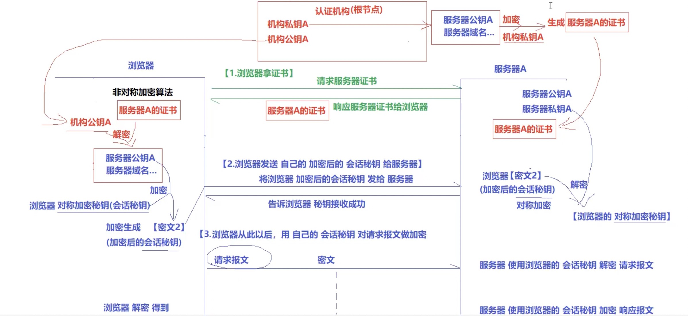

## 1. 网络传输的安全性

- http协议
    明文传输， 不安全， 黑客任意截取篡改。

- https 
    加密传输（四次握手）， 安全。

## 2. 对称加密与非对称加密

### 2.1 对称加密

- 特点：
    不区分秘钥公钥， **高效**且算法公开。效率主要取决于秘钥大小。

- 缺点：
    使用场景不够安全， 在窃取到秘钥后可破解密文。

### 2.2 非对称加密

    加密与解密不使用同一把秘钥，分为公钥与私钥。

1. 公钥加密， 公钥不可对加密文本解密， 只有私钥可对其解密。
2. 同理， 私钥加密， 私钥不可对加密文本进行解密， 只有公钥能对其解密。（一般很少用， 因为公钥已公开）。
3. 一般客户端服务器， 公钥私钥成双出现， 客户端掌握服务器端公钥同时掌握客户端私钥， 服务器端同理。

### 2.3 非对称加密 ———— 私钥签名

    私钥签名其目的是将明文公布给别人， 同时证明是自己发的，可以防止明文被篡改。

流程：

1. 使用私钥对明文的hash值进行加密，将hash 值与明文一起发送给接收方。
2. 接收方接受明文， 利用公钥解密hash值， 将解密后的hash值与接收到的明文进行比对， 确认明文是否经受过篡改。

## 3. https 协议原理

### 3.1 https 加密问题

- 采用单纯的对称加密是否可取？
    不可取， 客户端要将密文以及秘钥一起发送给服务器端， 秘钥可能被黑客截取，从而篡改秘钥以及密文。

- 单纯的采用服务器端非对称加密是否可取？
    不可取， 服务器端将公钥发送给客户端， 公钥可能会被客户端截取篡改。    

### 3.2  证书认证

    为了解决上述加密问题， https 引入证书认证机构。

**其要解决的核心问题时， 客户端在连接过程中如何得到准确的， 未经篡改的服务器公钥**。

认证流程：

1. 现有， 证书认证机构私钥， 认证机构公钥， 服务器私钥， 服务器公钥。
2. 服务器将服务器信息（服务器公钥， 服务器域名， 证书时间等信息）上传至证书认证机构， 证书认证机构利用机构私钥将其加密， 返还给服务器， 称其为**服务器证书**， 服务器将其保存。
3. 客户端拉取认证机构公钥。
4. 服务器与客户端链接过程中， 服务器将服务器证书发送给客户端， 客户端利用机构公钥将其解密， 得到服务器公钥。

### 3.3 https 协议加密流程（非对称加密+对称加密）

1. 客户端向服务器请求，得到服务器证书， 并利用机构公钥将服务器证书解密，**从而得到服务器公钥**，这一步确保服务器公钥未经篡改。

2. 客户端生成对称加密秘钥（会话秘钥）， **会话秘钥采用对称加密， 为何采用对称加密而不直接采用服务器的非对称加密？ 主要考虑的还是效率问题， 对称加密的效率远高于非对称加密**。 客户端将会话秘钥发送给服务器。

3. 服务器端解密， 得到会话秘钥， 通信双方使用会话秘钥（对称加密）进行通信。

## 4. SSL/TLS 协议

只描述协议基本流程，具体细节暂略， 其过程与数字证书认证过程类似，主要为：

1. 客户端向服务器端索要服务器证书并验证。
2. 双方协商会话秘钥。
3. 利用会话秘钥（对称加密）进行加密通信。