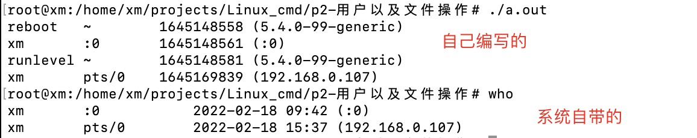

# 1.man 手册的使用

## 1.1 分卷
man 1 ls  系统命令
man 2 open 系统调用
man 3 printf 库函数

## 1.2 查找

通过 `man -k ` 查找，例如 `man -k utmp`

# 2.who 命令

## 2.1 命令详情

who命令可以找出当前登录用户。详情请见 man who。通过上述描述可知，已经登录的用户信息存放在 `/var/adm/utmp`中。

## 2.2 工作原理

who 命令通过读文件内容来实现需要获得的信息。

1. 从文件中读出数据结构
2. 将数据结构以合适的形式展现出来

## 2.3  如何从文件中读取数据结构？

- getc 与 fgets 
    从文件中读取字符串或者单一字符，**效率太低啦**


1. ` man -k file | grep read` 
    查找跟read有关的命令

2. read(2)

3. open(2)

## 2.4 open(),read(),close() 详解

1. open()

其实这个在manpage里面已经说的很清楚了，没有耐心的时候再耐心看看，这里挑两个出来讲。

```c
       int open(const char *pathname, int flags);
       int open(const char *pathname, int flags, mode_t mode);
```

- 返回值

调用失败： -1
调用成功： 正数，文件描述符`fd`

**特别注意，unix允许多个进程打开同一个文件，只是文件的描述符会不一样**

- 参数

`pathname`: 文件路径
`flags`: 打开方式，常见的有`O_RDONLY`,`O_WRONLY`,`O_RDWR`,`O_CREATE`
`mode`: 文件权限，只有在`O_CREATE`才能有这个参数，详细的看manpage

2. read()

` ssize_t read(int fd, void *buf, size_t count);`

- 参数
    文件描述符，缓冲区，缓冲区大小

- 返回值
    读取的个数，为0代表到末尾。


3. close()

没啥好说的， 0 代表关闭成功。


# 3. who命令编写

## 3.1 版本1

```c
#include <stdio.h>
#include<utmp.h>
#include<fcntl.h>
#include<unistd.h>
#include <stdlib.h>  // exit

# define SHOWHOST

void show_info(struct utmp * utbufp){
    printf("%-8.8s", utbufp->ut_name);	/* the logname	*/
    printf(" ");				/* a space	*/
    printf("%-8.8s", utbufp->ut_line);	/* the tty	*/
    printf(" ");				/* a space	*/
    printf("%10ld", utbufp->ut_time);	/* login time	*/
    printf(" ");				/* a space	*/
#ifdef	SHOWHOST
    printf("(%s)", utbufp->ut_host);	/* the host	*/
#endif
    printf("\n");				/* newline	*/
}

int main(){
    struct utmp current_record;
    int utmpfd;
    int reclen = sizeof(current_record);

    if( (utmpfd = open(UTMP_FILE,O_RDONLY)) == -1){
        perror(UTMP_FILE);
        exit(1);
    }

    while(read(utmpfd,&current_record,reclen) == reclen){
        show_info(&current_record);
    }
    close(utmpfd);
    return 0;
}

```


## 3.2 输出对比



存在两个问题：

- 消除空白的记录

- 正确的显示时间

ctime();


## 3.3 版本2 


```c
#include <stdio.h>
#include<utmp.h>
#include<fcntl.h>
#include<unistd.h>
#include <stdlib.h>  // exit
#include<time.h>

# define SHOWHOST

void show_info(struct utmp * utbufp){
    if  ( utbufp->ut_type != USER_PROCESS){
        return;  // 表示是登录用户 
    }
    printf("%-8.8s", utbufp->ut_name);	/* the logname	*/
    printf(" ");				/* a space	*/
    printf("%-8.8s", utbufp->ut_line);	/* the tty	*/
    printf(" ");				/* a space	*/
    // printf("%10ld", utbufp->ut_time);	/* login time	*/
    show_time(utbufp->ut_time);
    printf(" ");				/* a space	*/
#ifdef	SHOWHOST
    printf("(%s)", utbufp->ut_host);	/* the host	*/
#endif
    printf("\n");				/* newline	*/
}

void show_time(long timeval){
    char *cp;
    cp = ctime(&timeval);
    printf("%12.12s",cp+4);   // 从第4位开始 选择12位
}
```

# 4. cp命令的编写


## 4.1 creat() 函数 与 write() 函数

1. create()
函数原型：

```c
int creat(const char *pathname, mode_t mode);
```

这个没什么好说的，没有就创建，有就清零。mode_t 权限位等到后面再说。

2. write()

函数原型：
```c
ssize_t write(int fd, const void *buf, size_t count);
```

参数：
    buf 缓冲区
    count **写入的大小，跟缓冲区没什么关系**

返回值：
    实际写入值数量

## 4.2 cp()

```c
/** cp1.c
 *     version 1 of cp - uses read and write with tunable buffer size
 *
 *     usage: cp1 src dest
 */
#include        <stdio.h>
#include        <unistd.h>
#include        <fcntl.h>

#define BUFFERSIZE      4096
#define COPYMODE        0644

void oops(char *, char *);

main(int ac, char *av[])
{
        int     in_fd, out_fd, n_chars;
        char    buf[BUFFERSIZE];
						/* check args 	*/
        if ( ac != 3 ){
                fprintf( stderr, "usage: %s source destination\n", *av);
                exit(1);
        }
						/* open files	*/

        if ( (in_fd=open(av[1], O_RDONLY)) == -1 )
                oops("Cannot open ", av[1]);

        if ( (out_fd=creat( av[2], COPYMODE)) == -1 )
                oops( "Cannot creat", av[2]);
	
						/* copy files	*/

        while ( (n_chars = read(in_fd , buf, BUFFERSIZE)) > 0 )
                if ( write( out_fd, buf, n_chars ) != n_chars )
                        oops("Write error to ", av[2]);
	if ( n_chars == -1 )
			oops("Read error from ", av[1]);

						/* close files	*/

        if ( close(in_fd) == -1 || close(out_fd) == -1 )
                oops("Error closing files","");
}

void oops(char *s1, char *s2)
{
        fprintf(stderr,"Error: %s ", s1);
        perror(s2);
        exit(1);
}

```

## 4.3 cp命令的缓冲技术

跳过 下次再写

## 4.4 内核缓冲与用户态缓冲

内核会对磁盘上的数据做缓冲，当进程要求数据块不在内核缓冲区时，内核会**把相应的数据加入到请求数据队列表中，进程挂起，接着为其他的进程服务**

内核理论上会将要写的数据加入到内核缓冲区中，积累到一定的树龄再写入到磁盘。

# 5. 文件的修改

有一个问题，对文件来说，有读操作，也有写操作，如何修改文件呢？
**系统每打开一个文件，就会保存一个指向文件当前位置的指针，与fd相关联。 不管读写都会造成指针的位置移动**

## 5.1 改变文件的当前位置指针

lseek() 函数

`off_t lseek(int fd, off_t offset, int whence);`

