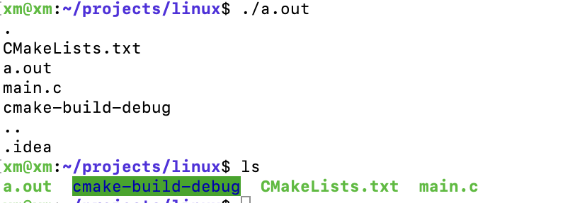
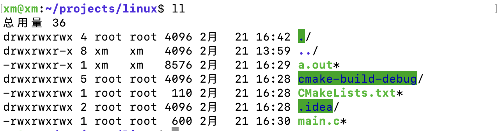
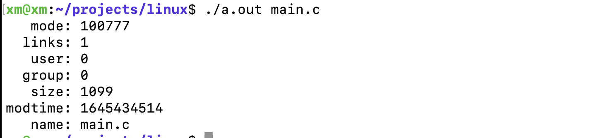
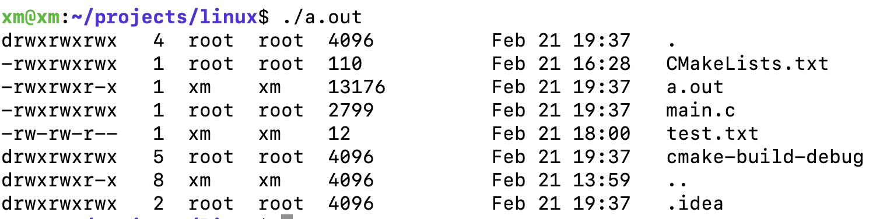

# 1.ls

## 1.1代码讲解

1. 打开文件获得一个文件指针
2. readdir()

```c
#include <stdio.h>
#include<dirent.h>
#include <sys/types.h>

void do_ls(char []);

int main(int ac,char *av[]){
    if (ac == 1)
        do_ls(".");
    else
        while ( -- ac){
            printf("%s:\n",*++av);
            do_ls(*av);
        }
    return 0;
}

void do_ls(char dirname[]){
DIR *dir_ptr;
    struct dirent *direntp;

    if (((dir_ptr = opendir(dirname))) == NULL){
        fprintf(stderr,"ls cannot open %s\n",dirname);
    } else{
        while ((direntp = readdir(dir_ptr)) != NULL){
            printf("%s\n",direntp->d_name);
        }
        closedir(dir_ptr);
    }
}
```

## 1.2 运行结果对比



## 1.3 问题改进

1. 排序
    用数组加sort
2. 分栏
    格式化输出
3. 隐藏文件
4. 选项 -l


# 2. 编写ls -l




1. 模式字段 
2. 连接数
    该文件被应用的次数
3. 文件的所有者
4. 文件所在的组别
5. 大小
    目录大小都为**4096**
6. 最后的修改实践
7. 文件名


## 2.1 使用stat()函数

```c
int main(int ac,char *av[]){
    struct stat info;
    stat("./a.out",&info);

    printf("模式：%s\n",info.st_mode);
    printf("链接数：%s\n",info.st_nlink);
    printf("用户id：%s\n",info.st_uid);

    return 0;
}
```

stat 数据结构中基本包含了上述的所有字段。





## 2.2 实现

上述实现已经非常接近了，最后需要更改几个地方。

1. mode 
    将数字权限转为`rwerwerwe`,9位分别是，文件所有者，同组用户，其他用户。
    r w e 权限分别对应： 4 2 1

    通过掩码技术获得对应位置权限，文件类型等。详见p77。


2. 根据用户uid 显示用户名


3. 时间处理 ， 同who，ctime()实现

 
```c
#include <stdio.h>  // 输入输出
#include	<dirent.h>  // DIR
#include	<sys/types.h>
#include	<sys/stat.h>
#include <string.h>
#include <time.h>

#include <pwd.h>   // pwd
#include <grp.h>


void do_ls(char[]);
void do_stat(char *);
void show_file_info(char *,struct stat*);
void mode_to_letters( int , char [] );
char *uid_to_name( uid_t );
char *gid_to_name( gid_t );


int main(int ac, char *av[]){
    ac = 1;
    if  (ac == 1){
        do_ls(".");
    } else{
        while ( -- ac){
            printf("%s:\n",*++av);
            do_ls(*av);
        }
    }
    return 0;
}

void do_ls(char dirname[]){
    DIR *dir_ptr;
    struct dirent *dirent;

    if((dir_ptr = opendir(dirname)) == NULL){
        fprintf(stderr,"ls:cannot open %s\n",dirname);
    } else{
        while ( (dirent = readdir(dir_ptr)) != NULL){
            do_stat(dirent->d_name);
        }
    }
}

void do_stat(char *filename){
    struct stat info;
    if (stat(filename,&info) == -1){
        perror(filename);
    } else{
        show_file_info(filename,&info);
    }
}

void show_file_info(char *filename,struct stat *info_p){

    char modestr[11];
    mode_to_letters(info_p->st_mode,modestr);

    /**
     * 这一段的字符串输出格式可以看看
     */
    printf("%s",modestr);  // mode
    printf("%4d  ",info_p->st_nlink) ; // 链接数
    printf("%-6s", uid_to_name(info_p->st_uid)) ; // u id
    printf("%-6s", gid_to_name( info_p->st_gid)) ; //  g id
    printf("%-12d  ",info_p->st_size) ; //  size
    printf("%.12s   ",4+ ctime( &info_p->st_mtim) ) ; //  time
    printf("%s\n",filename) ; //  file name
//    printf("\n");
}

void mode_to_letters(int mode,char str[]){
    strcpy(str,"----------");

    /**
     * is directory？
     */
    if(S_ISDIR(mode)) str[0] = 'd';
    if(S_ISDIR(mode)) str[0] = 'c';
    if(S_ISDIR(mode)) str[0] = 'b';

    if ( S_ISDIR(mode) )  str[0] = 'd';    /* directory?       */
    if ( S_ISCHR(mode) )  str[0] = 'c';    /* char devices     */
    if ( S_ISBLK(mode) )  str[0] = 'b';    /* block device     */

    if ( mode & S_IRUSR ) str[1] = 'r';    /* 3 bits for user  */
    if ( mode & S_IWUSR ) str[2] = 'w';
    if ( mode & S_IXUSR ) str[3] = 'x';

    if ( mode & S_IRGRP ) str[4] = 'r';    /* 3 bits for group */
    if ( mode & S_IWGRP ) str[5] = 'w';
    if ( mode & S_IXGRP ) str[6] = 'x';

    if ( mode & S_IROTH ) str[7] = 'r';    /* 3 bits for other */
    if ( mode & S_IWOTH ) str[8] = 'w';
    if ( mode & S_IXOTH ) str[9] = 'x';
}


char *uid_to_name(uid_t uid){
    struct	passwd *getpwuid(), *pw_ptr;
    pw_ptr = getpwuid(uid);
    return pw_ptr->pw_name;
}


char *gid_to_name(gid_t gid){
    struct group *getgrgid(),*grp_ptr;
    static char numstr[10];
    grp_ptr = getgrgid(gid);
    return grp_ptr->gr_name;
}

```

**效果图**




# 3. stat st_mode位详解

## 3.1 st_mode

`a.txt` : 33188
二进制转换: 100,0000,110,100,100
对应权限位： -rw-r--r-- 

0000: 作为文件类型
100： 文件特殊属性位 下文详解

## 3.2 set_user_id 位

先引出问题： 如何更改用户密码文件？
`passwd`命令位于`usr/bin/passwd` 中，其所有者属于root用户，只有root用户有权限执行改文件。**set_usr_id位告诉内核，运行该程序的时候，认为是文件的所有者在运行该程序**

1. 是否可以更改其他用户的密码？

不能，`passwd`命令，通过getuid()获得用户id，只能更改对应id的密码。

2. 其他的使用场景

比如，游戏把最好成绩给记录下来，记录程序的所有者是`DBS`，

## 3.3 set_group_id

同上，略

## 3.4 sticky 位

交换空间swap 内存换入换出用，现在已经不怎么用了。


# 4. Unix 文件类型


1. 文件分类

普通文件，设备文件，目录文件等。

**文件一旦创建，类型无法修改**


2. umask

umask(022) 是一个系统级变量。（8进制）

比如，在创建一个新文件，不希望同组和其他用户有对改文件的更改权限，即----w--w--权限关闭，可用八进制umask掩码（全局变量）


