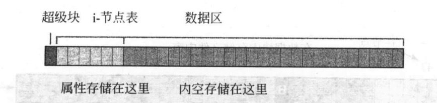
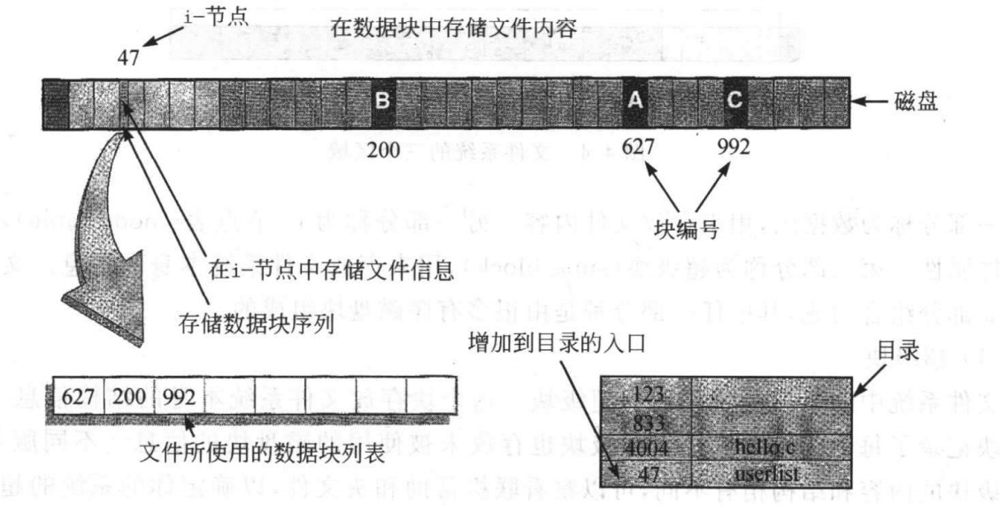

# 1. Unix 文件系统

## 1.1 概览



1. 超级块 

**存放文件系统本身的信息**，比如每个区域的大小，未被使用的磁盘块信息，等等。

2. i-节点表

每个文件都有一些属性，比如大小，文件的所有者，最近修改时间等。 这些性质都被存在一个i-节点的结构中。 **i-结构表**中每个i-节点都用位置来标识，标识为2的i-节点位于节点表中的第三个位置。

3. 数据区

略


## 1.2 创建一个文件的过程




步骤如下：

1. 存储文件属性

内核先找到一个空的i-节点，将文件信息存入其中

2. 存储数据

假如该文件需要3个存储磁盘块， 内核从自由块的列表中找出三个自由块，并将内核缓冲区中的数据复制到块中。

3. 记录分配情况

内核在i-节点的磁盘分布区记录了上述磁盘块序列号

4. 添加文件名到目录

内核将文件名与i-节点号存入目录文件中。

## 1.3 目录的工作过程

简单点说，就是文件名 与 i节点号，对应关系。

## 1.4 cat命令的工作原理

`cat userlist`

1. 在文件目录中找到文件名

在目录文件中，找到userlist文件名，记录包含对应的i-节点号。

2. 定位i-节点号并读取其内容

为了提高访问效率，内核可能将i-节点号放入缓存中。
i-节点号包含数据块编号。

3. 访问文件内容的数据块

知道文件内容放在哪些数据块上，以及他们的顺序。 不断调用read函数，将字节从磁盘复制到内核缓冲区中。

## 1.5 i-节点与大文件

事实1： 一个大文件需要很多个磁盘块
事实2： i-节点中存放有磁盘分配表（13个分配链表）

问题： **一个固定大小的i-节点如何存储较长的分配表**

方法：
    1.  1--10 号链表块中存储的是实际数据的位置
    2.  第11号链表指向一个**间接块**，间接块存放剩余的数据块地址。
    3. 间接块满了，12号放二级间接块
    4. 13 号放三级间接块


p 106

# 2. 理解目录系统

## 2.1 与目录相关的命令与系统调用

- mkdir

- rmdir

该目录本身必须是空的，除了"." 与 ".." 的入口。
在父目录中删除这个目录的链接，**如果这个目录本身没有被别的进程占用，它的i-节点与数据块将要被释放**

- rm 

函数原型为unlink（）

- ln
函数原型为link
int res = link(const char * oldname, const char * newname)

新旧名字不能相同

- mv
 改变文件和目录的名字或位子。
 本质上是link  与 unlink

- cd 
    改变当前目录，函数原型`chdir(const char *path)`

    **Unix上每个运行程序都有一个当前目录，集成中存放当前目录的i-节点变量。chdir改变进程的当前目录**


## 2.2 PWD 的实现

过程：

1. getInode() 获取当前工作空间的inode节点。用stat来做。

2.  nodetopath() ,将"." 节点与 “.." 节点比较。

3.  nodetoname();


```c
#include <stdio.h>
#include	<dirent.h>
#include	<sys/stat.h>
#include <stdlib.h>
#include <unistd.h>
#include <string.h>

ino_t  get_inode(char *);
void printPathTo(ino_t);
void    inum_to_name(ino_t , char *, int );


int main() {
    printPathTo(get_inode("."));
    putchar('\n');
    return 0;
}

void printPathTo(ino_t inode) {
    ino_t  myInode ;
    char itsName[BUFSIZ];

    if (get_inode("..") != inode){
        chdir("..");
        inum_to_name(inode,itsName,BUFSIZ);
        myInode = get_inode(".");
        printPathTo(myInode);
    }
    printf("/%s",itsName);
}


ino_t get_inode(char *fname){
    struct stat info;
    if (stat (fname ,& info) == -1){
        perror(fname);
        exit(1);
    }
    return info.st_ino;
}

void inum_to_name(ino_t inode, char *names, int BUFSIZE) {
        DIR *dir_ptr;
        struct  dirent *dirent;

        dir_ptr = opendir(".");
    if (dir_ptr == NULL){
        perror(".");
        exit(1);
    }

    while ( (dirent = readdir( dir_ptr)) != NULL){
        if ( dirent->d_ino == inode){
            strncpy(names,dirent->d_name,BUFSIZE);
            names[BUFSIZE - 1] = '\0';
            closedir(dir_ptr);
            return;
        }
    }
    perror("error looking");
    exit(1);
}
```