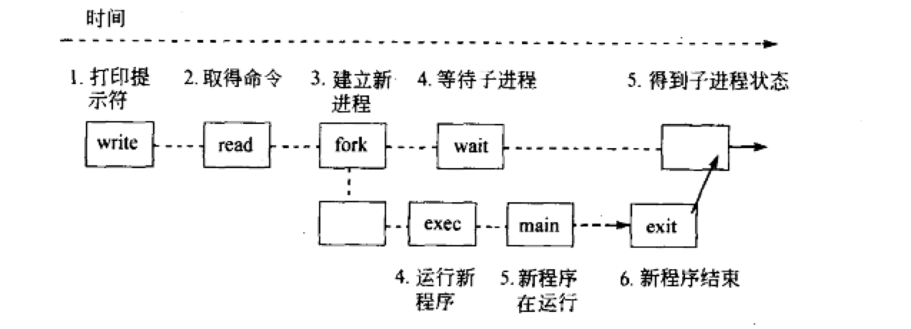

# 1. 进程命令 

## 1.1 命令详解

1.  ps

    当前终端进程

```c
  PID TTY          TIME CMD
 1977 pts/0    00:00:00 bash
 11858 pts/0    00:00:00 ps
```

2. ps -a

    所有进程，包含其他终端与其他用户运行的程序


3. ps -la

```c
F S   UID   PID  PPID  C PRI  NI ADDR SZ WCHAN  TTY          TIME CMD
4 S  1000  1095  1093  0  80   0 - 342745 ep_pol tty1    00:00:03 Xorg
0 S  1000  1167  1093  0  80   0 - 138634 poll_s tty1    00:00:00 gnome-session-b
0 S  1000  1351  1167  0  80   0 - 1017041 poll_s tty1   00:00:48 gnome-shell
0 S  1000  1427  1351  0  80   0 - 89093 poll_s tty1     00:00:00 ibus-daemon
0 S  1000  1431  1427  0  80   0 - 68908 poll_s tty1     00:00:00 ibus-dconf
0 S  1000  1433     1  0  80   0 - 84823 poll_s tty1     00:00:00 ibus-x11
0 S  1000  1528  1167  0  80   0 - 217312 poll_s tty1    00:00:00 gsd-power
0 S  1000  1530  1167  0  80   0 - 86031 poll_s tty1     00:00:00 gsd-print-notif
0 S  1000  1534  1167  0  80   0 - 104535 poll_s tty1    00:00:00 gsd-rfkill
0 S  1000  1535  1167  0  80   0 - 67632 poll_s tty1     00:00:00 gsd-screensaver
0 S  1000  1541  1167  0  80   0 - 111945 poll_s tty1    00:00:03 gsd-sharing
0 S  1000  1545  1167  0  80   0 - 93251 poll_s tty1     00:00:00 gsd-smartcard
0 S  1000  1546  1167  0  80   0 - 82477 poll_s tty1     00:00:00 gsd-sound
0 S  1000  1552  1167  0  80   0 - 122481 poll_s tty1    00:00:00 gsd-xsettings
0 S  1000  1559  1167  0  80   0 - 124927 poll_s tty1    00:00:00 gsd-wacom
0 S  1000  1562  1167  0  80   0 - 84737 poll_s tty1     00:00:00 gsd-clipboard
0 S  1000  1563  1167  0  80   0 - 68271 poll_s tty1     00:00:00 gsd-a11y-settin
0 S  1000  1564  1167  0  80   0 - 116168 poll_s tty1    00:00:00 gsd-datetime
0 S  1000  1568  1167  0  80   0 - 165818 poll_s tty1    00:00:03 gsd-color
0 S  1000  1571  1167  0  80   0 - 125430 poll_s tty1    00:00:00 gsd-keyboard
0 S  1000  1574  1167  0  80   0 - 89846 poll_s tty1     00:00:01 gsd-housekeepin
0 S  1000  1578  1167  0  80   0 - 68273 poll_s tty1     00:00:00 gsd-mouse
0 S  1000  1584  1167  0  80   0 - 269241 poll_s tty1    00:00:00 gsd-media-keys
0 S  1000  1620  1167  0  80   0 - 92014 poll_s tty1     00:00:00 indicator-messa
0 S  1000  1624  1167  0  80   0 - 67984 poll_s tty1     00:00:00 gsd-disk-utilit
0 S  1000  1635  1167  0  80   0 - 205580 poll_s tty1    00:00:00 nautilus-deskto
0 S  1000  1671     1  0  80   0 - 125892 poll_s tty1    00:00:00 gsd-printer
0 S  1000  1730  1427  0  80   0 - 77375 poll_s tty1     00:00:00 ibus-engine-lib
0 S  1000  1991  1167  0  80   0 - 343747 poll_s tty1    00:00:03 gnome-software
0 S  1000  1993  1167  0  80   0 - 153307 poll_s tty1    00:00:00 update-notifier
0 R  1000 11872  1977  0  80   0 -  7669 -      pts/0    00:00:00 ps
```

- S
    进程是否运行。 `R` 运行，`S`停止。

- UID
    用户id

- PID
    进程id

- PPID
    父进程id

- PRI/NI
    进程的优先级

- SZ
    进程大小，进程占内存大小

- WCHAN
    进程睡眠原因

4. ps -ax

    系统进程

## 1.2 shell功能

1. 运行程序
    ls，date等。

2. 管理输入输出
    `>` , `<` 输入输出重定向等。

3. shell编程，脚本
    略

## 1.3 shell 是如何运行程序的

1. 用户键入

2. shell建立一个新的程序来运行这个程序

3. shell 将程序从磁盘载入

4. 程序在它的进程中运行直到结束

所以，要建立一个自己的shell，需要下面三个步骤：

- 运行一个程序
- 建立一个进程
- 等待exit()

                                                


# 2. 实现一个自己的进程

## 2.1 一个程序如何运行另外一个程序

函数原型： ` int execvp(const char *file, char *const argv[]);`

Unix如何运行一个程序：

1. 将指定的程序复制到调用它的进程。

2. 将指定的字符串作为arfv[] 传给这个程序

3. 运行这个程序

简单的来说，如下：

1. 程序调用execvp
2. 内核从磁盘将程序载入
3. 内核将arglist赋值到进程
4. 内核调用main(argc,argv)

### 一个ls的demo：

```c
int main(){
    char *arglist[3];

    arglist[0] = "ls";
    arglist[1] = "-1";
    arglist[2] = 0;

    printf("*** about to exec ls -1\n");
    execvp("ls",arglist);
    printf("*** ls is done .bye\n");
}
```


### 问题

1. 第二条消息为什么没有打印？

    **内核将新程序载入到当前进程，替换当前进程的数据与代码**

2. execvp就像换脑

    execvp 载入由file指定的程序到当前进程中，然后试图运行他。 execvp 将以NULL 结尾的字符串列表传递给程序。execvp在环境变量PATH所指定的路径中查找file文件。

    如果执行成功，execvp没有返回值。**当前程序从进程中清除，新的程序在当前进程中运行**


## 2.2 shell(1)

```c


#define MAXARGS 20
#define ARGLEN 100

int main(){
    char *arglist[MAXARGS + 1];
    int numargs;
    char argbuf[ARGLEN];
    char * makestring();
    int execute();
    numargs = 0;

    while (numargs < MAXARGS){
        printf("Arg[%d]?",numargs);
        if (fgets(argbuf,ARGLEN,stdin) && argbuf !='\n')
            arglist[numargs++] = makestring(argbuf);
        else{
            if (numargs > 0){
                arglist[numargs] = NULL;
                execute(arglist);
                numargs = 0;
            }
        }
    }
    return 0;

}

int execute (char *arglist[]){
    execvp(arglist[0],arglist);
    perror("execvp failed");
    exit(1);
}

char *makestring(char *buf){
    char *cp;
    

    buf[strlen(buf)  - 1] = '\0';
    cp = malloc(strlen(buf) + 1);
    if (cp == NULL){
        fprintf(stderr,"no memory\n");
        exit(1);
    }
    strcpy(cp,buf);
    return cp;
}

```

**运行完后，该shell退出，并没有像我们设想中的，可以继续接受命令**


## 2.3 fork（）

fork的基本流程：

1. 分配新的内存块和内核数据结构
2. 复制原来的进程到新的进程
3. 向运行进程集添加新的进程 
4. 将控制返回给两个进程


fork demo1:

```c
int main(){
    int ret_from,mypid;

    mypid = getpid();
    printf("Before: mypid is %d\n",mypid);
    ret_from = fork();
    sleep(1);
    printf("After : my pid is %d , fork() said %d\n",getpid(),ret_from);
}


```


fork demo2:

```c
int main(){
    printf("my pid is %d\n",getpid());

    fork();
    fork();
    fork();

    printf("my pid is %d\n",getpid());

}
```


**fork 叉子函数**
综合来讲，fork() 函数，子进程返回0，父进程返回子进程的id。


## 2.4 wait()

首先想明白一个问题，shell 创建两个进程，由子进程执行命令，那么问题来了，主进程如何等待子进程的退出？

函数原型： `pid_t wait(int *wstatus);`

> wait 暂停调用它的进程直到子进程结束 。 子进程与父进程并行运行，父进程调用wait，内核将父进程挂起直到紫禁城结束。


1. 子进程结束会返回 `exit(n)`, 该值由 `status` 接受。
2. 返回值，on success, returns the process ID of the terminated child; on error, -1 is returned.


demo:

```c
int main(){
    int newpid;
    void child_code(),parent_code();

    printf("before: mypid is %d\n",getpid());

    if ((newpid = fork()) == -1){
        perror("fork error");
    } else if ( newpid == 0){
        child_code();
    } else{
        parent_code(newpid);
    }
}

void child_code(){
    printf(" this is children code runing ..., pid is %d\n",getpid());
    sleep(DELAY);
    exit(17);
}

void parent_code(int childpid){
    printf(" parent is runing\n");
    int wait_rv;
    int status = 1;   // 这里的status 还是有点问题
    wait_rv = wait(&status);
    printf("wait_rv is : %d\n",wait_rv);
    printf("status is %d\n",status);
}
```


1. 父进程阻塞一直等到子进程调用`exit()` 。 比如，父进程调用fork创建一个子进程来对一个文件进行排序，父进程必须等到子进程完成才能处理这个文件。 系统调用 `wait` 与 `exit`  来协调这些。

2. wait() 返回的是结束进程的PID，**wait返回的是调用exit的子进程的PID，** 一个父进程可以创建多个子进程。wait的返回值告诉父进程，哪个任务结束了。

### 进程的三种结束方式（成功，失败，死亡）

1. 成功
    exit(n); 略。

2. 失败
    内存耗尽，等。**Unix 在程序遇到问题退出时，需要调用exit()传递给他一个非零的值**，程序员通过该值判断。通过status判断。

3. 死亡（被kill 信号杀死，又没有相应的捕捉信号）
    一个没有被忽略又没有被捕捉的信号会杀死进程。 


### 一个wait status 的demo

```c
int main(){
    int newpid;
    void child_code(),parnet_code();

    printf("before:mypid is %d\n",getpid());
    if ((newpid = fork()) == -1)
        perror("fork");
    else if ( newpid == 0)
        child_code(DELAY);
    else
        parnet_code(newpid);
}


void child_code(int delay){
    printf("child %d here ,will sleep for %d seconds\n",getpid(),delay);
    sleep(delay);
    printf("child done ,about to exit\n");
    exit(17);
}

void parnet_code(int childpid){
    int wait_rv;
    int child_status;
    int hight_8,low_7,bit_7;

    wait_rv = wait(&child_status);
    printf("done waiting for %d,Wait returned: %d\n",childpid,wait_rv);
    hight_8 = child_status >> 8;
    low_7 = child_status & 0x7F;
    bit_7 = child_status & 0x80;

    printf("status is : %d\n",hight_8);
    printf("sig is :%d\n",low_7);
    printf("core is : %d\n",bit_7);
}
```

### 总结一下wait

1. 子进程的三种退出方式，成功，失败（内存不够），被其他进程的信号量杀死。

2. status 为16位二进制数，其中：前8个bit记录的是exit（n)中的n值，中间1bit记录产生错误的内核映像，最后7bit记录信号序号（进程被杀死的信号量）

- 成功
    由前8bit记录
- 失败
    由前8bit记录
- 被杀死
    由后7bit记录


# 3.实现一个真正的shell



```c
#define MAXARGS 20
#define ARGLEN  100
void execute(char*[]);
int main(){
    char *arglist[MAXARGS+1];
    int numargs;
    char argbuf[ARGLEN];
    char *makestring();

    numargs = 0;
    while ( numargs < MAXARGS){
        printf("Arg[%d]?",numargs);
        if ( fgets(argbuf,ARGLEN,stdin) &&  *argbuf != '\n')
            arglist[numargs++] = makestring(argbuf);
        else{
            if (numargs > 0){
                arglist[numargs] = NULL;
                execute(arglist);
                numargs = 0;
            }
        }
    }
    return 0;
}


void execute(char *arglist[]){
    int pid,exitstatus;

    pid = fork();

    switch(pid){
        case -1:
            perror("fork fail");
            exit(1);
        case 0:
            execvp(arglist[0],arglist);
            perror("execvp error");
            exit(1);
        default:
            while (wait(&exitstatus) != pid);
            printf("child exited with sattus %d,%d\n",exitstatus>>8,exitstatus&0377);
    }
}

char *makestring(char *buf){
    char *cp;
    buf[strlen(buf) -1] = '\0';
    cp = malloc(strlen(buf)+1);
    if (cp == NULL){
        fprintf(stderr,"no memory\n");
        exit(1);
    }
    strcpy(cp,buf);
    return cp;
}

```


**这个shell 程序还是有一个小bug，在父进程等待子进程运行的过程中，如果按下`ctr + c`,父进程与子进程会一起结束。因为这些进程都是终端进程的子进程，并没有捕捉`SIGINT`信号，会被一起杀死**


# 4. 关于进程编程的一点总结

1. c程序的call 与 return

    一个函数调用另外一个函数，然后return。

2. exec/exit

    一个c程序可以fork/exec 另外一个程序，并传给它一些参数。被调用的程序通过exit(n)来返回返回值。调用它的进程通过wait(&status)来获得返回值。