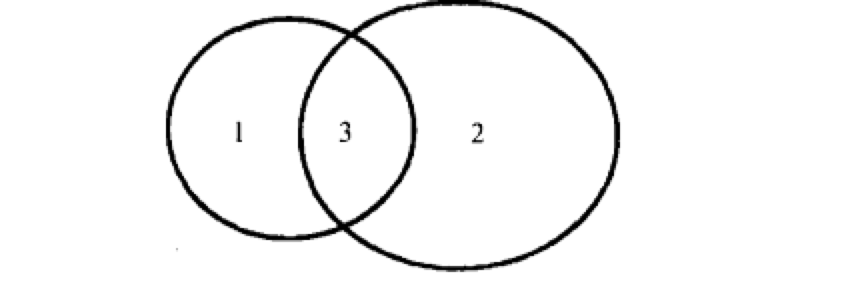
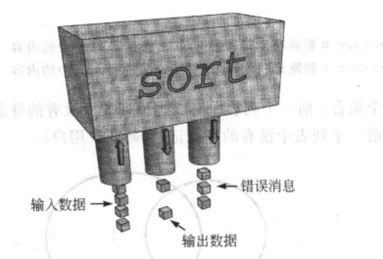

--
title: p10重写linux命令-I/O重定向与管道
author: xyx
date: 2022-3-11 20:33:00 +0800
categories: [C++, linux-os]
tags: 
math: true
---

# 1. shell 编程

```c
who | sort > prev     // 同时执行who 与 sort  将who的输出直接送到sort的输入
while true ;do
  sleep 30
  who | sort > curr
  echo "logged out :"
  comm -23 prev curr      //  删除第二列与第三列 仅留prev内容
  echo "logged in:"
  comm -13 prev curr
  mv curr prev
done
```

comm 详解：

`comm -23 prev curr      //  删除第二列与第三列 仅留prev内容`



# 2. I/O 与重定向的一些概念

所有的Unix I/O重定向都是基于标准数据流原理，下面展示`sort`的荣作原理：



- 标准输入： 需要处理的数据流
- 标准输出： 结果数据流
- 标准错误输出： 错误消息流

## 2.1 概念1： 3个标准文件描述符

- 0: stdin   文件描述符0  占0号位置的文件
- 1: stdout
- 2: stderr

所有的Unix**工具**都使用文件描述符0，1，2。 Unix 假设文件描述符0，1，2已经被打开，可以分别进行读写写操作。

### 默认的链接：tty

### 程序都输出到stdout

大多数程序都不接受输出文件名，**他们总是将结果写到文件描述符1中去，将错误消息写到文件描述符2. 如果希望进程的输出写到另外一个文件或者程序中去，就必须重定向相应的文件描述符**

### 重定向I\O的是shell 而不是程序

```c
int main(int ac,char* av[]){
    int i;
    printf("Number of args: %d,Args are :\n",ac);
    for(i = 0; i < ac; ++i){
        printf("args[%d] %s\n",i,av[i]);
    }
    fprintf(stderr,"This message is sen to stdree\n");
}
```

1. 全部输出到屏幕（默认）

    `./a.out`

2. 重定向1

    `./a.out ont two > xyz`

3. 重定向2
    `./a.out ont two > xyz 2>oops   // 将stderr消息重定向到opps文件中`

shell 并不将重定向标记和文件名传递给程序，**`2>file` 意思为重定向文件描述符2，将标准错误输出到给定的文件中**.

### 一些理解

```c
who > userlist    // 将stdout链接到一个文件
sort < date        // 将 stdin 链接到一个文件
who | sort          // 将stdout 链接到 stdin
```


## 2.2 概念2：最低可用文件描述符原则

第一个问题：文件描述符是什么？**文件描述符是一个数组的索引号，每个进程都打开了一组文件**，第零个文件是`stdin`
第二个问题： 进程新打开的文件，怎么排序？ 从小到大一次插入。 把最小可用位置留给它。

# 3. 重定向编程

## 3.1 stdin 定向到文件

如何将文件描述符0定义到一个文件

### 方法一 close then open

这个方法思路其实还是很简单的，close(0), open(new)占住0号位置，ok了。

```c
int main(int ac,char* av[]){
    int fd;
    char line[100];

    fgets(line,100,stdin);
    printf("%s",line);
    fgets(line,100,stdin);
    printf("%s",line);
    fgets(line,100,stdin);
    printf("%s",line);


    close(0);
    fd = open("/etc/passwd",O_RDONLY);
    if (fd != 0){
        fprintf(stderr,"Could not open data as fd \n");
        exit(1);
    }


    fgets(line,100,stdin);
    printf("%s",line);
    fgets(line,100,stdin);
    printf("%s",line);
    fgets(line,100,stdin);
    printf("%s",line);
}
```


### 方法二 open close dup close

四个步骤：

1. open(file)
    打开一个stdin 重定向文件，此时返回的文件描述符fd 可定不为0.

2. close(0)
    关闭0.

3. dup(fd)
    系统调用dup(fd) 将文件描述符fd做了一个复制。 **此时复制使用最低可用文件描述符号，0号为空**，因此获得0号文件描述符。 此时磁盘文件与文件描述符0链接在一起了。

4. close(fd)
    关闭原始链接，只留下文件描述符0。


```c
int main(int ac,char* av[]){
    int fd;
    char line[100];

    fgets(line,100,stdin);
    printf("%s",line);
    fgets(line,100,stdin);
    printf("%s",line);
    fgets(line,100,stdin);
    printf("%s",line);


    fd = open("/home/xm/projects/linux/data.txt",O_RDONLY);
    if (fd == -1){
        perror("open error");
    }

    int newFd;
    newFd =  dup2(fd,0);
    if (newFd != 0){
        perror(" dup2 error");
        exit(1);
    }

    fgets(line,100,stdin);
    printf("%s",line);
    fgets(line,100,stdin);
    printf("%s",line);
    fgets(line,100,stdin);
    printf("%s",line);


    fgets(line,100,stdin);
    printf("%s",line);
    fgets(line,100,stdin);
    printf("%s",line);
    fgets(line,100,stdin);
    printf("%s",line);
}
```


多看看manpage
> dup详解： The  dup() system call creates a copy of the file descriptor oldfd, using the lowest-numbered unused file descriptor
       for the new descriptor.


### 总结

其实标准输入stdin 重定向用的不是很多，如果程序要读入某一个文件，直接打开就可以啦。 以上程序只为了展示 0号文件描述符的作用。


## 3.2 为其他程序重定向

上面的一个例子是自己写的程序中定向stdin。 其他程序如何重定向呢？ 例如`who > userlist`.
**关键点在fork() 之后，exce() 之前。**，exce()将替换进程中的运行程序，但是不会改变进程属性与链接。

```c
int main(int ac,char* av[]){
    int pid;
    int fd;

    printf("About to run who into a file \n");
    pid = fork() ;
    
    if ( pid == -1){
        perror("fork");
        exit(1);
    }

    if (pid == 0){
        close(1);
        fd = creat("userlist",0644);
        execlp("who","who",NULL);
        perror("execlp error");
        exit(1);
    }


    if (pid != 0){
        wait(NULL);
        printf("Done runing who,result in userlist\n");
    }

}

```

## 3.3 定向到文件 小结

1. 标准输入 标注输出 错误输出 分别对应文件描述符 0，1，2
2. 内核总是使用最低可用文件描述符
3. 文件描述符集合通过exec调用传递

shell 支持一下两种形式命令：
    - `who > userlog`
    - `sort < data`


# 4. 管道编程

`pipe(int array[2])   // array[0] 为读描述符 ，array[1] 为写描述符`

```c
int apipe[2];
pipe(apipe[2]);
write to apipe[1];
read from apipe[0];
```

## 4.1 使用管道来共享进程 fork()

先放一个例子吧：

```c
#define CHIHLD_MESS "I want a cookie\n"
#define PAR_MESS "testing ..\n"
#define oops(m,x)
int main(int ac,char* av[]){
    int pipefd[2];
    int len;
    char buf[BUFSIZ];

    int read_len;

    if (pipe(pipefd) == -1)
        perror("cannot get a pipe");

    switch (fork()) {
        case -1:
            perror("cannot fork");
        case 0:
            len = strlen(CHIHLD_MESS);
            while (1){
                if (write(pipefd[1],CHIHLD_MESS,len) != len)
                    perror("write error");
                sleep(5);
            }
        default:
            len = strlen(PAR_MESS);
            if (write(pipefd[1],PAR_MESS,len) == -1)
                perror("write error");
            sleep(1);
            read_len = read(pipefd[0],buf,BUFSIZ);
            if (read_len <= 0)
                break;
            write(1,buf,read_len);
    }

}
```

当父进程创建一个管道后，该进程就有了管道两端的链接。**fork()后，子进程也得到了管道两端的链接**。怎么说呢，子进程与父进程这两个管道是互相独立的。下面的例子可以看出。

## 4.2 编写 `who > sort`


```c
int main(int ac,char *av[]){
    int thepipe[2],newfd,pid;

    if (ac != 3){
        fprintf(stderr,"paramers error");
        exit(1);
    }
    if (pipe(thepipe) == -1){
        perror("pipe error");
    }

    pid = fork();
    if (pid == -1)
        perror("fork error");

    // father process
    if (pid > 0){
        close(thepipe[1]);  // close write
        if (dup2(thepipe[0],0) == -1)
            perror("dup2 error");
        close(thepipe[0]);
        execlp(av[2],av[2]);
        perror("error ending");
    }
    close(thepipe[0]);
    if (dup2(thepipe[1],1) == -1){
        perror("son dup2 error");
    }

    close(thepipe[1]);
    execlp(av[1],av[1],NULL);
    perror("bad ending");
}
```

## 4.3 管道小结

### 读的问题

1. 管道读取阻塞
    当进程试图从管道中读取数据的时候，**进程被挂起直到数据被写入管道中**

2. 管道的读取结束标志
    当所有的写者都关闭了**管道的写数据端**时，试图从管道读数据时，返回0；

3. 多个读者的麻烦
    管道是一个队列。 当一个进程从管道中读取数据后，**数据已经不存在**了， 进程需要某种方法协调他们对管道的访问。

### 向管道中写数据

1. 写入数据阻塞直到管道上有空间去容纳新的数据
    管道的容量是有限的。

2. 无读者的情况下，写操作失败。


