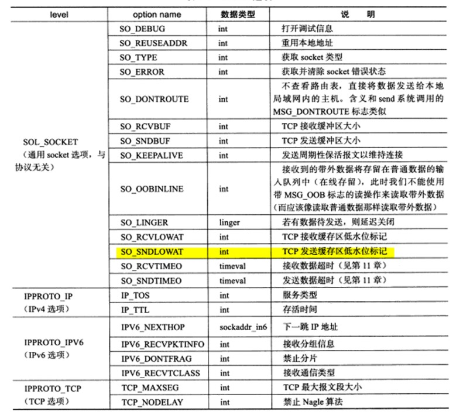

## 1. socket 地址API

### 1.1 主机字节序与网络字节序

> 主机字节序： 简单来说，就是由多个字节组成的一个整数，字节的排序方式是从左到右还是从右到左。

分类：

- 大端字节序
- 小端字节序（主机字节序）

**即使同一个主机上的两个进程通信，也要考虑字节序的问题**。

**解决方法**：发送端都转为大端字节序，接受端都知道接受的都是大端字节序。

**字节序的转换**：见`<netinet/in.h>`,from  host  byte order to network byte order.

### 1.2 socket 地址

- 通用socket地址结构

    ```c
    struct sockaddr {
	__uint8_t       sa_len;         /* total length */
	sa_family_t     sa_family;      /* [XSI] address family */
	char            sa_data[14];    /* [XSI] addr value (actually larger) */
    };
    ```

- 专用地址 ipv4地址, sockaddr_in

    ```c
    #include<netinet/in.h>
    struct sockaddr_in
  {
    __SOCKADDR_COMMON (sin_);
    in_port_t sin_port;   /* Port number.  */
    struct in_addr sin_addr;  /* Internet address.  */

    /* Pad to size of `struct sockaddr'.  */
    unsigned char sin_zero[sizeof (struct sockaddr) -
                __SOCKADDR_COMMON_SIZE -
                sizeof (in_port_t) -
                sizeof (struct in_addr)];
    };
    ```

- 专用地址 ipv6地址，sockaddr_in6

- 专用地址 UNIX 本地域sockaddr_un

注：**所有专用的socket地址在实际使用时都需要转换为socket地址类型sockaddr（强制转换即可）。**

**协议簇与地址簇的关系**。

|协议簇|地址簇|描述|
|-|-|-|
|PF_UNIX|AF_UNIX|本地|
|PF_INET|AF_INET|ipv4|
|PF_INET6|PF_INET|ipv6|


### 1.3 ip地址转换函数

1. `in_addr_t inet_addr(const char *strptr);`
    点分十进制ip转换为网络字节序

2. `int inet_aton(const char *cp,struct in_addr *inp);`
    点分十进制ip转换为网络字节序

3. `char *inet_ntoa(struct in_addr in);`
    点分十进制ip转换为网络字节序


### 1.4 专用socket地址

**所有的socket地址都要转换为`sockaddr`地址使用**。

## 2. 完成一个小的服务器

### 2.1 完整代码

```c
static bool stop = false;
static void handle_term(int sig){
    stop = true;
}

int main(int argc,char*argv[]){
    signal(SIGTERM,handle_term);
    if (argc <= 3){
        printf("--");
        return 1;
    }

    const char* ip = argv[1];  // ip
    int port = atoi(argv[2]);  // 字符串变为整形  端口
    int backlog = atoi(argv[3]); // 最大连接数

    int sock = socket(PF_INET,SOCK_STREAM,0);
    assert( sock >= 0);

    // 创建一个ipv4 地址
    struct sockaddr_in address;
    bzero(&address,sizeof(address));    // The  bzero() function erases the data in the n bytes of the memory starting at the location pointed to by s
    address.sin_family = AF_INET;           // TCP/IPv4协议族
    inet_pton(AF_INET,ip,&address.sin_addr);
    address.sin_port = htons(port); // The htons() function converts the unsigned short integer hostshort from host byte order to network byte order.

    int ret = bind(sock,(struct sockaddr*)&address, sizeof(address));
    assert(ret != -1);

    ret = listen(sock,backlog);
    assert(ret != -1);


    // 循环等待链接，直到有SIGTERM 信号将他中断
    while (!stop){
        sleep(1);
    }

    close(sock);
    return 0;

```

### 2.2 创建socket

```c
    int sock = socket(PF_INET,SOCK_STREAM,0);
```

1. 函数原型

    `int socket(int domain, int type, int protocol);`

2. 一点备注

    `SOCK_STREAM` -> TCP协议
    `SOCK_DGRAM` -> UDP协议
    `domin` 一般取0，其他的见manpage

### 2.3 监听socket 等待连接

这个自己可以试一下~


### 2.4 接受链接

```cpp

int main(int argc, char *argv[]){
    if (argc < 2)
        return 1;

    const char* ip = argv[1];
    int port = atoi(argv[2]);

    struct sockaddr_in address; // ipv4
    bzero(&address,sizeof(address));
    address.sin_family = AF_INET;
    inet_pton(AF_INET,ip,&address.sin_addr); // 绑定ip
    address.sin_port = htons(port); // 绑定port

    int sock = socket(PF_INET,SOCK_STREAM,0);
    assert(sock > 0);

    int ret = bind(sock,(struct sockaddr*)&address,sizeof(address));
    assert(ret!= -1);

    ret = listen(sock,5);
    assert(ret != -1);

    sleep(20);
    struct sockaddr_in client;
    socklen_t client_addrlength = sizeof(client);
    int connfd = accept(sock,(struct sockaddr*)&client,&client_addrlength);

    if (connfd < 0){
        printf("connect error");
    } else{
        // 链接成功
        char remote[INET_ADDRSTRLEN ];
        printf( "connected with ip: %s and port: %d\n",
                inet_ntop( AF_INET, &client.sin_addr, remote, INET_ADDRSTRLEN ), ntohs( client.sin_port ) );
        close( connfd );
    }
    close(sock);
    return 0;
}
```


### 2.5 客户端与服务端通信 例子 TCP

**客户端**

```c
int main(int argc, char *argv[]){
    if (argc <= 2)
        return 1;
    const char* ip = argv[1];
    int port = atoi(argv[2]);

    struct sockaddr_in server_address;
    bzero(&server_address, sizeof(server_address));
    server_address.sin_family = AF_INET;
    inet_pton(AF_INET,ip,&server_address.sin_addr);
    server_address.sin_port = htons(port);

    int socketfd = socket(PF_INET,SOCK_STREAM,0);
    assert(socketfd > 0);

    if (connect(socketfd,(struct  sockaddr*)&server_address, sizeof(server_address)) < 0){
        printf("connection failed\n");
    } else{
        const char *s1 = "abc";
        const char *s2 = "123";

        send(socketfd,s1, strlen(s1),0);
        send(socketfd,s2, strlen(s2),0);
    }
    close(socketfd);
    return 0;
}
```

**服务端**

```c
#define BUF_SIZE 1024


int main(int argc,char* argv[]){
    if (argc <=2 ){
        return 1;
    }

    const char* ip = argv[1];
    int port = atoi(argv[2]);

    struct sockaddr_in address;
    bzero(&address,sizeof(address));
    address.sin_family = AF_INET;
    inet_pton(AF_INET,ip,&address.sin_addr);
    address.sin_port = htons(port);

    int sock = socket(PF_INET,SOCK_STREAM,0);
    assert(sock >= 0);

    int ret = bind(sock,(struct sockaddr*)&address, sizeof(address));
    assert(ret != -1);

    ret = listen(sock,5);
    assert(ret != -1);

    struct sockaddr_in client;
    socklen_t client_addrlength = sizeof(client);
    int connfd = accept(sock,(struct sockaddr*)&client,&client_addrlength);
    if (connfd < 0){
        printf("error");
    } else{
        char buffer[BUF_SIZE];
        memset(buffer,'\0',BUF_SIZE);
        ret = recv(connfd,buffer,BUF_SIZE - 1,0);
        printf("got data : %s\n",buffer);
        close(connfd);
    }
    close(sock);
    return 0;
}
```

## 3. 数据读写


### 3.1 TCP数据读写

1. 读 

    `ssize_t recv(int sockfd,void *buf,size_t len, int flags);`

2. 写 

    `ssize_t send(int sockfd,const void *buf,size_t len,int flags);`

### 3.2 UDP数据读写

1. 读 

    `recvfrom`

2. 写 
    `sendto`

### 3.3 通用数据读写

1. 读 

    `revcmsg`
    
2. 写 
    `sendmsg`

## 4. 判断是否为外带数据

在实际应用中，我们通常无法预期外带数据合适到来。Linux内核检测到TCP紧急标志时，通过两种方式通知应用程序：

- IO复用产生的异常
- SIGURG信号

但是，即使应用程序得到了外带数据的通知，还要知道外带数据的位置。通过sockatmark函数。
`int sockamark();`


## 5. 获取地址信息函数

```c
    // 获取本端
     int getsockname(int sockfd, struct sockaddr *addr, socklen_t *addrlen);
    // 获取远端
    int getpeername(int sockfd, struct sockaddr *addr, socklen_t *addrlen);
```

## 6. socket 选项

```c
int getsockopt(int sockfd, int level, int optname,
                void *optval, socklen_t *optlen);
int setsockopt(int sockfd, int level, int optname,
                const void *optval, socklen_t optlen);
```



## 6. 网络信息API

下面两条命令是等价的：

```c
telnet 217.0.0.1 80
telnet localhost www
```

### 6.1 根据主机名称或地址获得主机的完整信息

1. gethostbyname,

2. gethostbyaddr

### 6.2 根据名称或端口获得服务信息

1. getservbyname

2. getservbyport

### 6.3 Demo

```c
int main(int argc,char *argv[]){
    assert(argc == 2);
    char *host = argv[1];

    // 1. 获取主机地址信息
    struct hostent *hostinfo = gethostbyname(host);
    assert(hostinfo);

    // 2. 获取daytime服务信息
    struct servent *servinfo = getservbyname("daytimne","tcp");
    printf("daytime port is %d\n",ntohs(servinfo->s_port));

    struct sockaddr_in address;
    address.sin_family = AF_INET;
    address.sin_port = servinfo->s_port;
    address.sin_addr = *(struct in_addr*)*hostinfo->h_addr_list;
    int sockfd = socket(AF_INET,SOCK_STREAM,0);
    int result = connect(sockfd,(struct sockaddr*)&address,sizeof(address));
    char buffer[128];
    result = read(sockfd,buffer,sizeof(buffer));
    printf("the day time is %s",buffer);
    close(sockfd);
    return 0;
}
```

### 6.4 getaddrinfo 与 getnameinfo

略

