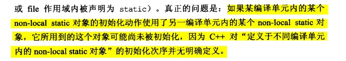

## 03 尽可能使用const

### 1. 顶层与底层指针

> 书中的说法可能会好理解一点，出现在`*`号左边，表示被指物是常量。const 出现在`*`号的右边，表示指针是常量。出现在两边表示指针与被指物都是常量。

```cpp
void f1(const Widget *pw);  // 这两种写法等价
void f1(Widget const *pw);
```

### 2. 迭代器的const指针

```c
vector<int> vec(10,1);

const vector<int>::iterator iter = vec.begin();  // 类似于 T * const 指针
//        --iter;  // 错误 为const 指针 不能改变
*iter = 10; // 正确

vector<int>::const_iterator ite2 = vec.begin();  // 类似于 const T * 指针
-- ite2;  // 正确
```

**const 可对返回值， 各参数， 函数自身（如果是成员函数）产生关联）**。下面依次说明。
### 3. const成员函数（重点）

**如果两个成员函数只是常量性不同，则可以被重载**。

```c
    class TextBlock{
    public:
        const char& operator[](size_t position) const{
            return text[position];
        }
        char& operator[](size_t position){
            return text[position];
        }
    private:
    public:
        TextBlock(const string &text) : text(text) {}
    private:
        string text;
    };

    void test01(){
        TextBlock tb("Hello");
        const TextBlock ctb("Hello word");

        cout << tb[0];  // right
        tb[0] = 'c' ; // right

        cout << ctb[0];  // right
//        ctb[0] = 'x';  // flase
    };
```

1. `const char& method() const{}` 与 `char& method(){}`

    这两者函数是可以重载的，有点奇怪其实。 `const Demo d1` 调用 const成员函数，非const实例调用非const成员函数，这样一想好像也很说得通。

2. `non-const opertor[]`返回的是 `reference to char`, 而不是`char`
    所以`tb[0] = 'x'` 可以通过。

3. **如果返回类型为内置类型，那么改动函数返回值从来就不合法**,例如返回值是 `char` 而不是 `&char`

#### const成员函数的两个阵营

- bitwise const
    不改变一个成员的任何一个bit， 即编译器只需要检测赋值动作即可。

- logical constness
    如下代码所示

```c
    class CTextBoloc{
    public:
        // 不太懂这里为什么不加const，加了const就无法改变。在上一个版本中不加const 编译器会直接报错。
        // 个人猜测，该成员函数不会改变成员，也就是指针pText的值，所以加不加都没报错。
        char& operator[](size_t position) const{
            return pText[position];
        }
    private:
        char *pText;
    public:
        CTextBoloc(char *pText) : pText(pText) {}
    };

    void test02(){
        const CTextBoloc cctb("hello");
        char *pc = &cctb[0];
        *pc = 'J';
    }
```

解释一下：
    **一个更改了指针所指物的成员函数，虽然不能算是const，但是如果只有指针（而非所其所指物）隶属于对象，那么称次函数为bitwise const不会引发编译器异议。**

#### 在const 成员函数内，成员函数也可被更改

**mutable**关键字

```c
    class CTextBoloc2{
    private:
        char* pText;
        mutable size_t textLength;
        mutable bool lengthIsValid;
    public:
        CTextBoloc2() {}
        size_t length() const{
            lengthIsValid = true;
        }
    };
```

### 4. const 修饰函数参数 返回值 成员函数

1. 修饰参数

    ```cpp
    // 1. const 修饰参数
    // 总结一下： const 可以接受非const 参数 。 而非const 只能接受非const  所以要多用const
    void test01(const int i, const int j) {  // 修饰形参  如果不加指针或者引用 没必要加const 因为本来就不在一个空间内

    }
    void test02(const int &i, const int &j) {  // 修饰引用

    }
    ```

2. 修饰返回值（重点）

    ```cpp
    // 2. const 修饰返回值 只能在**引用** 的时候使用   其唯一的作用就是返回值不能作为左值使用
    const vector<int>& test03(vector<int> &res) {
        return res;
    }

    vecotr<int> v = test03(v2);  // 这个是正确的 有没有const 对这个不影响
    test03(v2)[1] = 15; // 这个是错误的  const 返回值不能作为左值使用
    ```

    记住这句话：返回值作为引用其唯一的作用就是使函数返回值不能作为左值使用。

3. 修饰成员函数

    略

### 5. const 修饰返回值（重点）

还是把这个再写清楚一点 const 修饰返回值只有在返回值为引用或者指针的时候有用，下面分别说明一下这两种情况，还是感觉到有点奇怪。

1. 修饰引用

    ```cpp
    const vector<int>& test03(vector<int> &res) {
        return res;
    }

    vector<int> res = test03(v); // res接受引用无效
    // const vector<int> &res = test03(v);
    res.back() = 14;   // 正确  res跟返回值是不是const 引用 好像没啥关系  其改变不影响v的改变
    test03(v).back();  //错误 
    ```

2. 修饰指针

    ```cpp
    const vector<int> * test04(vector<int> *p) {
        return p;
    }
    const vector<int>  * res = t.test04(&v);  // 正确  res的改变影响v的改变
    vector<int>  * res = t.test04(&v);  // 错误
    ```

3. 针对既不是引用， 又不是指针的返回值

    ```cpp
    class D1{
    public:
        const string m1() {
            return "hello";
        }
    };

    主要看下面这两种：
    // 1. 编译通过
    string s = d.m1();
    s = "yyy";

    // 2. 编译失败
    d.m1() = "yyy";   // 这个好像没啥意义 但是不加const 就编译可通过
    ``` 

## 04 确定对象使用前已被初始化

### 1. 永远在使用对象之前将它初始化

### 2. 对于类

1. 确保每一个构造函数豆浆对象的每一个成员初始化

2. 不要混淆**赋值** 与 **初始化**


    ```c
    // 赋值构造函数
    ABEntry::ABEntry(string &name, string &theAddress, list<PhoneNUmber> &phone) {
        // 这些都是赋值 而非初始化
        theName = name;
        theAddress = theAddress;
        thePhones = phone;
        numTimesConsulted = 0;
    }
    // 初始化构造函数
    ABEntry::ABEntry(const string &theName, const string &theAddress, const list<PhoneNUmber> &thePhones,
                    int numTimesConsulted) : theName(theName), theAddress(theAddress), thePhones(thePhones),
                                            numTimesConsulted(numTimesConsulted) {}
    ```

3. 赋值与初始化

    - 初始化的效率更高
    - 对于内置对象，初始化与赋值的成本相同

4. 有多个构造函数

    可以合理的在初值列中遗漏那些**赋值表现像初始化一样好**的成员变量

5. 成员初始化次序
    与变量次序相同


### 3. 不同编译单元内定义值non-local static 对象的初始化次序

- non-local static 对象： 不在函数内的static 对象
- local static 对象： 在函数内的对象



解决方案： 利用单例模式的思想。