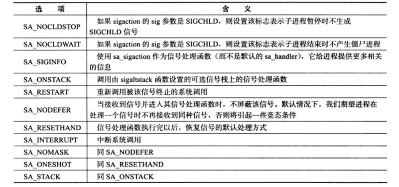
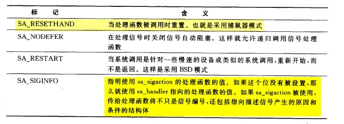

## 0. 信号概述

### 1. 发送信号

 api

    `int kill(pid_t pid, int sig);`

### 2. 处理信号

### 3. 信号分类

### 4. 中断系统调用

## 1. signal 

- 函数原型
    ` sighandler_t signal(int signum, sighandler_t handler);`

- sighandler_t 参数
    
    - SIG_IGN 忽略
    - SIG_DFL 默认
    - f  函数

- 返回值
    成功时返回函数指针

## 2. sigaction

### 函数原型

```c
int sigaction(int signum, const struct sigaction *act,
                     struct sigaction *oldact);
    // act 为新的处理方式  oldact 为返回旧的处理方式
```

```c
struct sigaction {
    void     (*sa_handler)(int);   // 处理函数
    void     (*sa_sigaction)(int, siginfo_t *, void *);  
    sigset_t   sa_mask;     // 信号掩码
    int        sa_flags;    // 行为方式
    void     (*sa_restorer)(void);
};
```

sa_flags含义：


1. sa_handler or sa_sigaction ?
    如果老的处理方式（SIG_IGN,SIG_DFL,F)已经都用了，设置sa_handler 就够了。如果还要后的被信号编号以及产生的原因，那么就要选用sa_sigaction。

2. 如何告诉内核使用新的处理方式
    设置sa_flags 的SA_SIGINFO位

3. sa_flags
    这个在手册上可以查到，下面列出一些简要的控制函数
    

4. sa_mask 设置哪些信号要被阻塞

### 阻塞信号集

**两种方案，1. 在信号处理者一级阻塞信号。 2. 一个进程的阻塞信号**，

####  1.在处理一个信号时候阻塞另外一个信号 sa_mask
    
    在处理信号的时候，才阻塞别的信号

#### 2.一个进程的阻塞信号，一个进程任何时候都有一些信号被阻塞

    该进程一直阻塞这些信号

通过sigprocmask修改被阻塞的信号集。

函数原型： `int sigprocmask(int how, const sigset_t *set, sigset_t *oldset);`
how: 

- SIG_BLOCK（设为阻塞）

- SIG_UNBLOCK（设为非阻塞）

- SIG_SEEMASK(直接将进程信号掩码设置为set)

#### 3. 用sigsetops构造信号集

1. `sigemptyset(sigset_t *setp);`   // 清除列表中的所有信号

2. `sigfillset(sigset_t *setp);`  // 添加所有信号到setp列表

3. `sigaddset(sigset_t *setp,int signum)`  // 添加signum到setp

4. `sigdelset(sigset_t *setp,int signum)` // 删除所标识的signum信号

## 3. 信号集

Linux 用数据结构`sigset_t`来表示一组信号,其数据结构如下(本质上就是一个数组）：

```c
typedef struct{
    unsigned long int _val[_SIGSET_NWORDS];
}_sigset_t;
```

### 处理函数

1. `sigemptyset(sigset_t *setp);`   // 清除列表中的所有信号

2. `sigfillset(sigset_t *setp);`  // 添加所有信号到setp列表

3. `sigaddset(sigset_t *setp,int signum)`  // 添加signum到setp

4. `sigdelset(sigset_t *setp,int signum)` // 删除所标识的signum信号

5. `int sigismember(const sigset_t *_set,int _signo)`  // 测试 ——signo是否在信号集中

### 被挂起的信号

设置进程信号掩码后，被屏蔽的信号不能被进程接收，如果给进程发送一个被屏蔽的信号，操作系统将其设置为**一个被挂起的信号**.

获得被挂起的信号集： `int sigpending(sigset *set);`.

## 4. 统一事件源

    信号处理函数和程序的主循环是两条不同的执行路线，很明显，信号处理要尽可能快的完成。**确保信号不会被屏蔽的太久**。

一种典型的解决方案： 把信号的主要处理逻辑放在主循环中，当信号处理函数被触发的时候，它只是简单的通知主循环程序接收到信号，并吧信号传递到主循环，主循环根据接收到的信号执行相应的逻辑代码。

### demo

```c

#define MAX_EVENT_NUMBER 1024
static int pipefd[2];

int setnonblocking(int fd){
    int old_option = fcntl(fd,F_GETFL);
    int new_option = old_option | O_NONBLOCK;
    fcntl(fd,F_SETFL,new_option);
    return old_option;
}

void addfd(int epollfd,int fd){
    epoll_event event;
    event.data.fd = fd;
    event.events = EPOLLIN | EPOLLET;
    epoll_ctl(epollfd,EPOLL_CTL_ADD,fd,&event);
    setnonblocking(fd);
}

/*
 * 信号处理函数
 */
void sig_handler(int sig){
    int save_errno = errno;
    int msg = sig;
    send(pipefd[1],(char*)&msg,1,0);
}

void addsig(int sig){
    struct sigaction sa;
    memset(&sa,'\0',sizeof(sa));
    sa.sa_handler = sig_handler;
    sa.sa_flags |= SA_RESTART;

    // 在处理信号中时  阻塞所有 所有的信号
    sigfillset(&sa.sa_mask);
    assert(sigaction(sig,&sa,NULL) != -1);

}


int main(int argc,char *argv[]){
    if (argc <= 2){
        perror("argc error");
        return 1;
    }

    const char* ip = argv[1];
    int port = atoi(argv[2]);

    int ret = 0;
    struct sockaddr_in address;
    bzero(&address,sizeof(address));
    address.sin_family = AF_INET;
    address.sin_port = htons(port);
    inet_pton(AF_INET,ip,&address.sin_addr);

    int listenfd = socket(PF_INET,SOCK_STREAM,0);
    assert(listenfd >= 0);

    ret = bind(listenfd,(struct sockaddr*) &address,sizeof(address));
    if (ret == -1){
        perror("bind error");
        return 1;
    }

    ret = listen(listenfd,5);
    assert(ret != -1);

    epoll_event events[MAX_EVENT_NUMBER];
    int epollfd = epoll_create(5);
    assert(epollfd != -1);
    addfd(epollfd,listenfd);

    /*
     * 创建管道，将pipefd[0]设置为可读事件
     */
    ret = socketpair(PF_UNIX,SOCK_STREAM,0,pipefd);
    assert(ret != -1);
    setnonblocking(pipefd[1]);
    addfd(epollfd,pipefd[0]);

    addsig(SIGHUP);
    addsig(SIGCHLD);  // 子进程退出时，将向父进程发出信号
    addsig(SIGTERM);
    addsig(SIGINT);
    bool stop_server = false;

    while (!stop_server){
        int number = epoll_wait(epollfd,events,MAX_EVENT_NUMBER,-1);
        if (number < 0)
            break;
        for (int i = 0; i < number; ++i) {
            int sockfd = events[i].data.fd;
            if (sockfd == listenfd){
                struct sockaddr_in client_address;
                socklen_t  client_len = sizeof(client_address);
                int connfd = accept(listenfd,(struct sockaddr*) &client_address,&client_len);
                addfd(epollfd,connfd);
            }

            /*
             * 如果发现就绪的文件描述符是pipefd[0],则处理信号
             */
            else if ((sockfd == pipefd[0]) && (events[i].events & EPOLLIN)){
                int sig;
                char signals[1024];
                ret = recv(pipefd[0],signals,sizeof(signals),0);
                if (ret == -1)
                    continue;
                else{
                    /*
                     * 因为每个信号值占一个字节 所以按字节来逐个接收信号
                     */
                    for (int j = 0; j < ret; ++j) {
                        switch (signals[i]) {
                            case SIGCHLD:
                            case SIGHUP:
                            case SIGTERM:
                            case SIGINT:{
                                stop_server = true;
                            }
                        }
                    }
                }
            } else{

            }


        }
    }

    printf("close fds\n");
    close(listenfd);
    close(pipefd[1]);
    close(pipefd[0]);
    return 0;
}
```

## 5. 网络编程相关信号

### 1. SIGHUP信号

当进程的控制终端被挂起时，SIGHUP信号将被触发。

### 2. SIGPEPE信号

网关闭的管道或socket链接中写数据将引发SIGPIPE信号。

### 3.SIGURG信号

外带数据信号