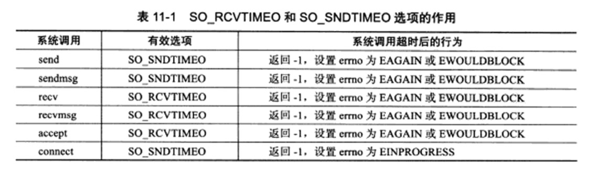

一共三种方式：
- socket 选项 详情在第五章
- SIGALRM 信号
- IO复用系统调用超时参数

## 1. socket 选项

### 解析



具体的可以看第五章


### demo

```c
int timeout_connect(const char *ip,int port ,int time){
    int ret = 0;
    struct sockaddr_in address;
    bzero(&address, sizeof(address));

    address.sin_family = AF_INET;
    address.sin_port = port;
    inet_pton(AF_INET,ip,&address.sin_addr);

    int sockfd = socket(AF_INET,SOCK_STREAM,0);
    assert(sockfd >= 0);

    struct timeval timeout;
    timeout.tv_sec = time;
    timeout.tv_usec = 0;
    socklen_t len = sizeof(timeout);
    // 超时后 发出EINPROGRESS信号
    ret = setsockopt(sockfd,SOL_SOCKET,SO_SNDTIMEO,&timeout,len);
    assert(ret != -1);

    ret = connect(sockfd,(struct sockaddr*)&address, sizeof(address));
    if (ret == -1){
        if (errno == EINPROGRESS){
            printf("connect timeout ...");
            return -1;
        }
        printf("error occur when connecting to server\n");
        return -1;
    }
}

int main(int argc,char* argv[]){
    if (argc <= 2){
        perror("argc error");
    }

    const char* ip = argv[1];
    int port  = atoi(argv[2]);

    int sockefd = timeout_connect(ip,port,10);
}
```


## 2.SIGALRM

主要思想：
    一个升序链表，定时器每5s发送一个SIGALRM信号，断开那些到时的链接请求。

### 升序链表

```c
//
// Created by 肖应雄 on 2022/4/19.
//

#ifndef P8_LST_TIMER_H
#define P8_LST_TIMER_H
#ifndef LST_TIMER
#define LST_TIMER

#include <time.h>

#define BUFFER_SIZE 64
class util_timer;


// 用户的数据结构
struct client_data
{
    sockaddr_in address;
    int sockfd;
    char buf[ BUFFER_SIZE ];
    util_timer* timer;
};

// 定时器类
class util_timer
{
public:
    util_timer() : prev( NULL ), next( NULL ){}

public:
    time_t expire;
    void (*cb_func)( client_data* );   // 任务超时时间 这里用绝对时间
    client_data* user_data; // 任务的回调函数
    util_timer* prev;  // 指向前一个
    util_timer* next;  // 指向后一个
};

// 定时器双向列表 升序 双向列表  有头结点跟尾节点
class sort_timer_lst
{
public:
    // 默认构造函数
    sort_timer_lst() : head( NULL ), tail( NULL ) {}
    // 链表销毁时候，删除所、所有的定时器
    ~sort_timer_lst()
    {
        util_timer* tmp = head;
        while( tmp )
        {
            head = tmp->next;
            delete tmp;
            tmp = head;
        }
    }
    // 新增定时器
    void add_timer( util_timer* timer )
    {
        if( !timer )
        {
            return;
        }
        if( !head )
        {
            head = tail = timer;
            return;
        }

        /*
        如果当前节点小于所有定时器时间 则插入头结点
        否则 调用重载函数add_timer
        */
        if( timer->expire < head->expire )
        {
            timer->next = head;
            head->prev = timer;
            head = timer;
            return;
        }
        add_timer( timer, head );
    }

    /*
    当某个定时器任务发生变化时，调整对应的定时器在链表中的位置  这个函数只考虑这个
    定时器超时时间延长的情况，即该定时器需要往链表尾部移动
    */
    void adjust_timer( util_timer* timer )
    {
        if( !timer )
        {
            return;
        }
        util_timer* tmp = timer->next;
        // 如果在尾部 或者仍然小于下一个定时器的值 就不用调整
        if( !tmp || ( timer->expire < tmp->expire ) )
        {
            return;
        }
        // 若果是头结点 就取出 重新插入表中
        if( timer == head )
        {
            head = head->next;
            head->prev = NULL;
            timer->next = NULL;
            add_timer( timer, head );
        }
            //如果不是头结点 也不是尾节点  取出 重新插入表中
        else
        {
            timer->prev->next = timer->next;
            timer->next->prev = timer->prev;
            add_timer( timer, timer->next );
        }
    }
    // 删除一个节点 这里略掉
    void del_timer( util_timer* timer )
    {
        if( !timer )
        {
            return;
        }
        if( ( timer == head ) && ( timer == tail ) )
        {
            delete timer;
            head = NULL;
            tail = NULL;
            return;
        }
        if( timer == head )
        {
            head = head->next;
            head->prev = NULL;
            delete timer;
            return;
        }
        if( timer == tail )
        {
            tail = tail->prev;
            tail->next = NULL;
            delete timer;
            return;
        }
        timer->prev->next = timer->next;
        timer->next->prev = timer->prev;
        delete timer;
    }

    /*
    SIGALRM 函数每次被触发，就在信号处理中执行一次tick函数
    */
    void tick()
    {
        if( !head )
        {
            return;
        }
        printf( "timer tick\n" );
        time_t cur = time( NULL );
        util_timer* tmp = head;
        while( tmp )
        {
            if( cur < tmp->expire )
            {
                break;
            }
            tmp->cb_func( tmp->user_data );
            head = tmp->next;
            if( head )
            {
                head->prev = NULL;
            }
            delete tmp;
            tmp = head;
        }
    }

private:
    /*
    一个函数重载 把节点加入到合适的地方
    */
    void add_timer( util_timer* timer, util_timer* lst_head )
    {
        util_timer* prev = lst_head;
        util_timer* tmp = prev->next;
        while( tmp )
        {
            if( timer->expire < tmp->expire )
            {
                prev->next = timer;
                timer->next = tmp;
                tmp->prev = timer;
                timer->prev = prev;
                break;
            }
            prev = tmp;
            tmp = tmp->next;
        }
        if( !tmp )
        {
            prev->next = timer;
            timer->prev = prev;
            timer->next = NULL;
            tail = timer;
        }

    }

private:
    util_timer* head;
    util_timer* tail;
};

#endif

#endif //P8_LST_TIMER_H
```


### demo 关闭非活动连接

```c
#include <sys/types.h>
#include <sys/socket.h>
#include <netinet/in.h>
#include <arpa/inet.h>
#include <assert.h>
#include <stdio.h>
#include <signal.h>
#include <unistd.h>
#include <errno.h>
#include <string.h>
#include <fcntl.h>
#include <stdlib.h>
#include <sys/epoll.h>
#include <pthread.h>
#include "lst_timer.h"

#define FD_LIMIT 65535
#define MAX_EVENT_NUMBER 1024
#define TIMESLOT 5

static int pipefd[2];
static sort_timer_lst timer_lst;
static int epollfd = 0;

int setnonblocking(int fd){
    int old_option = fcntl(fd,F_GETFL);
    int new_option = old_option | O_NONBLOCK;
    fcntl(fd,F_SETFL,new_option);
    return old_option;
}

void addfd(int epollfd,int fd){
    epoll_event event;
    event.data.fd = fd;
    event.events = EPOLLIN|EPOLLET;
    epoll_ctl(epollfd,EPOLL_CTL_ADD,fd,&event);
    setnonblocking(fd);

}

void sig_handler(int sig){
    int svae_error = errno;
    int msg = sig;
    send(pipefd[1],(char *)&msg,1,0);
    errno = svae_error;
}

void addsig(int sig){
    struct sigaction sa;
    memset(&sa,'\0',sizeof(sa));
    sa.sa_handler = sig_handler;
    sa.sa_flags |= SA_RESTART;
    sigfillset(&sa.sa_mask);
    assert(sigaction(sig,&sa,NULL) != -1);
}

/*
 * 定时器的回调函数 它删除非链接的socket上的注册事件 并关闭之
 */
void cb_func(client_data *user_data){
    epoll_ctl(epollfd,EPOLL_CTL_DEL,user_data->sockfd,0);
    close(user_data->sockfd);
    printf("close fd \n");
}

void timer_handler(){
    // 定时处理任务
    timer_lst.tick();
    // 重新定时 不断的触发sigalrm信号
    alarm(TIMESLOT);
}

int mian(int argc,char *argv[]){
    if (argc <= 2){
        perror("argc error");
    }

    const char *ip = argv[1];
    int port = atoi(argv[2]);

    int ret = 0;
    struct sockaddr_in address;
    address.sin_family = AF_INET;
    address.sin_port = port;
    inet_pton(AF_INET,ip,&address.sin_addr);

    int listenfd = socket(PF_INET,SOCK_STREAM,0);
    assert(listenfd >= 0);

    ret = bind(listenfd,(struct sockaddr*)&address, sizeof(address));
    assert(ret != -1);

    ret = listen(listenfd,5);
    assert(ret != -1);

    epoll_event events[MAX_EVENT_NUMBER];
    int epollfd = epoll_create(5);
    assert(epollfd != -1 );
    addfd(epollfd,listenfd);

    ret = socketpair(PF_INET,SOCK_STREAM,0,pipefd);
    assert(ret != -1);

    setnonblocking(pipefd[1]);
    addfd(epollfd,pipefd[0]);

    /*
     * 设置信号处理函数
     */
    addsig(SIGALRM);
    addsig(SIGTERM);
    bool stop_server = false;
    /*
     *
// 用户的数据结构
struct client_data
{
    sockaddr_in address;
    int sockfd;
    char buf[ BUFFER_SIZE ];
    util_timer* timer;
};
     */
    client_data *users = new client_data[FD_LIMIT];
    bool timeout = false;
    alarm(TIMESLOT);  // 5  每间隔五秒 发送一个定时器信号

    while (!stop_server){
        int number = epoll_wait(epollfd,events,MAX_EVENT_NUMBER,-1);
        if ((number < 0) && (errno != EINTR)){
            printf("epoll failure \n");
            break;
        }

        for (int i = 0; i < number; ++i) {
            int sockfd = events[i].data.fd;
            /*
             * 有新链接的客户端
             */
            if (sockfd == listenfd){

            struct  sockaddr_in client_address;
            socklen_t client_addrelength = sizeof(client_address);
            int connfd = accept(listenfd,(struct sockaddr*) &client_address,&client_addrelength);
            addfd(epollfd,connfd);
            users[connfd].address = client_address;
            users[connfd].sockfd = connfd;

            /*
             * 创建定时器
             */
            /*
             *     time_t expire;
    void (*cb_func)( client_data* );   // 任务超时时间 这里用绝对时间
    client_data* user_data; // 任务的回调函数
    util_timer* prev;  // 指向前一个
    util_timer* next;  // 指向后一个
             */

            util_timer *timer = new util_timer;
            timer->user_data = &users[connfd];
            timer->cb_func = cb_func;
            time_t cur = time(NULL);
            timer->expire = cur + 3 * TIMESLOT;
            users[connfd].timer = timer;
            timer_lst.add_timer(timer);
            }
            /*
             * 处理信号
             */
            else if ( (sockfd == pipefd[0]) && (events[i].events & EPOLLIN)){
                int sig;
                char signals[1024];
                ret = recv(pipefd[0],signals,sizeof(signals),0);
                if (ret == -1){
                    continue;
                } else if ( ret == 0){
                    continue;
                } else{
                    for (int j = 0; j < ret; ++j) {
                        switch (signals[j]) {
                            case SIGALRM:
                            {
                                timeout = true;
                                break;
                            }
                            case SIGTERM:{
                                stop_server = true;
                            }
                        }
                    }
                }
            }
            /*
             * 处理客户端链接上接受到的数据
             */
            else if ( events[i].events & EPOLLIN){
                memset(users[sockfd].buf,'\0',BUFFER_SIZE);
                ret = recv(sockfd,users[sockfd].buf,BUFFER_SIZE-1,0);
                util_timer *timer = users[sockfd].timer;
                if (ret < 0){
                    // 如果发生错误 则关闭链接 并移除对应的定时器
                    if ( errno != EAGAIN){
                        cb_func(&users[sockfd]);
                        if (timer){
                            timer_lst.del_timer(timer);
                        }
                    }
                } else if (ret == 0){
                    // 如果对方关闭链接 我们也关闭链接
                    cb_func(&users[sockfd]);
                    if (timeout){
                        timer_lst.del_timer(timer);
                    }
                } else{
                    // 如果某个客户端链接上有数据可读 我们需要调整对应的定时器 以延迟该链接的关闭时间
                    if (timer){
                        time_t cur = time(NULL);
                        timer->expire = cur + 3 + TIMESLOT;
                        timer_lst.adjust_timer(timer);
                    }
                }
            } else{
                // do others
            }
        }

        // 最后处理定时事件 因为IO时间具有更高的优先级  当然 这样这样也将导致定时任务不能精确的按照预期时间准确的执行
        if (timeout){
            timer_handler();
            timeout = false;
        }
    }

    close(listenfd);
    close(pipefd[1]);
    close(pipefd[0]);
    delete []users;
    return 0;

}
```

## 3. IO复用系统调用的超时参数

### demo

```c
#include <ctime>

#define TIMEOUT 5000
int timeout = TIMEOUT;
time_t start = time(NULL);
time_t end = time(NULL);


int main()
{
    while (1){
        start = time(NULL);
        int number = epoll_wait(epollfd,events,MAX_EVENT_NUMBER,timeout);

        // 如果epoll_wait成功返回0  说明超时时间到 此时可以处理定时任务 并重置定时时间
        if  (number == 0){
            timeout = TIMEOUT;
            continue;
        }

        // 如果epoll_wait的返回值大于0 则本次epoll_wait调用的持续时间是（end-start)*1000 ms  我们需要重新设置下次的超时时间
        timeout -= (end - start) * 1000; 
        if  (timeout <= 0){
            timeout = TIMEOUT;
        }
    }
}
```

## 4. 时间轮与时间堆 

略

