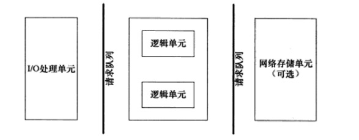

## 1. 服务器基本框架



- IO处理单元
    一个专门的接入服务器，他实现**负载均衡**，从所有的逻辑服务器中选取负荷最小的一台来为新客户服务。

- 逻辑单元
    一个逻辑单元通常是一个进程或者线程，它分析并处理客户数据。

- 网络存储单元
    数据库或者缓存（非必须）

## 2. IO模型

**同步IO想应用程序通知的是IO就绪事件，异步IO向应用程序通的是完成事件**，以食堂打饭为例。

- 阻塞IO 与 非阻塞 IO
    - 阻塞IO
    你去食堂打饭，饭还没好，你就在那里一直等。饭好了，**你等着阿姨把饭给你打好。**
    - 非阻塞IO
    你去打饭，饭还没好，你走了。再过十分钟，你又去问，还没好，你又走了。一直循环，直到你一次去问，阿姨告诉你饭好了。**你等着阿姨把饭给你打好**

- 同步IO 与 异步IO
    **阻塞IO，IO复用，信号驱动IO都是同步IO模型**
    异步IO：你让阿姨把饭打好，放在饭盒里，送到你面前。**所有的过程你都不需要等待**。

## 3. 两种高效的事件处理模式

[这个讲解还是挺好的](https://www.zhihu.com/question/26943938)

### 1. Reactor(同步IO)
    
    非阻塞同步网络模式，感知的是就绪可读写事件。

### 2. Proactor（异步IO）
    
    异步网络模式，感知的是已完成的读写事件。

因此，Reactor 可以理解为「来了事件操作系统通知应用进程，让应用进程来处理」，而 Proactor 可以理解为「来了事件操作系统来处理，处理完再通知应用进程」。这里的「事件」就是有新连接、有数据可读、有数据可写的这些 I/O 事件这里的「处理」包含从驱动读取到内核以及从内核读取到用户空间。


## 4. 有限状态机

    主要针对逻辑单元内部处理。其应用如下:有点应用层协议头部包含数据类型字段，每中类型可以映射为逻辑单元的一种执行状态，服务器可以根据它来编写相应的逻辑处理。

1. 独立状态的有限状态机

每个状态都是独立的。

```c
STATE_MACHINE(Package _pack){
    PackageType _type = _pack.GetType();
    sticth(_type){
        case type_A:
            process_package_A(_pack);
            break;
        case type_B:
            process_package_B(_pack);
            break;
    }
}
```

2. 带状态转移的有限状态机

状态间的转移是需要状态机内部驱动的。

```c
STATE_MACHINE(Package _pack){
    State cur_State = type_A;
    while(cur_State != type_C){
        PackageType _pack = getNewPackage();

    sticth(cur_State){
        case type_A:
            process_package_A(_pack);
            cur_State = type_B;
            break;
        case type_B:
            process_package_B(_pack);
            cur_State = type_C;
            break;
        }
    }
}
```

## 5. 状态机 与 http

这个还有有点不好理解 ， 下次写http服务器的时候再回头扒一下。

## 6. 提高服务器性能的几点建议

- 池技术

- 数据复制

- 上下文切换


