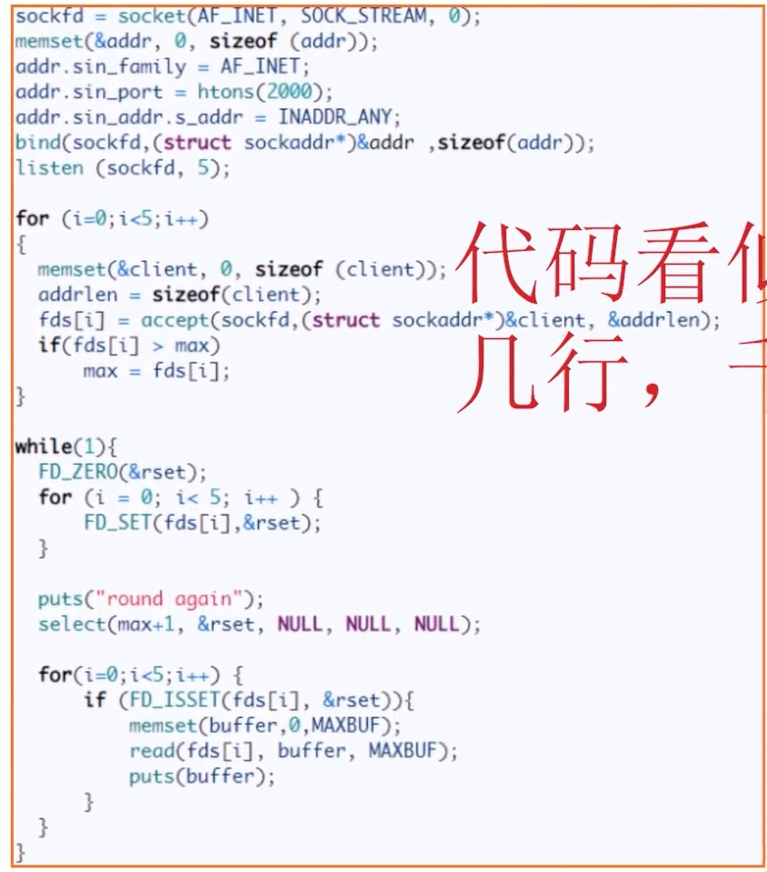
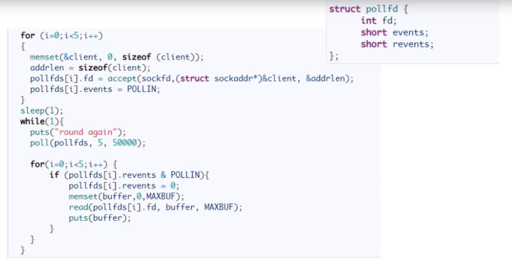
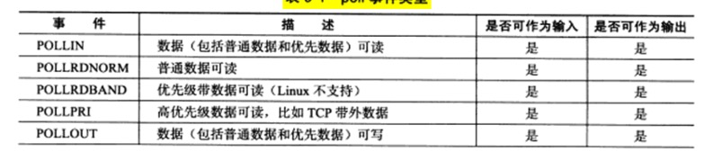
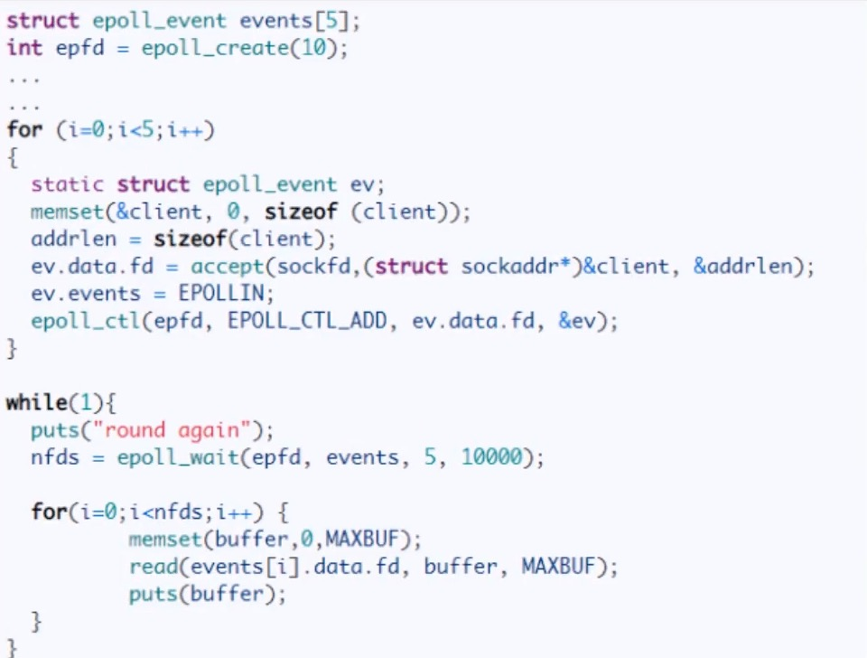

[讲解视频]("https://www.bilibili.com/video/BV1qJ411w7du?from=search&seid=13418752795891419149&spm_id_from=333.337.0.0")

## 1. select系统调用 

上世纪八十年代就出现了该API，现在仍有很多系统再用该API。

select系统调用的用途是，在指定时间内，监听用户感兴趣的文件描述符上的可读，可写和异常事件。

其核心思想是：**在指定时间内轮训一定数量的文件描述符，以测试其中是否有就绪者**。

### 1. select API

- 函数原型

    ```c
    int select(int nfds, fd_set *readfds, fd_set *writefds,
    fd_set *exceptfds, struct timeval *timeout);
    ```

- fd_set 是利用位图来做的
    1024bit位。

- nfds
    监听的文件描述符的总数。

- readfds writefds exceptfds
    可读，可写，异常事件对应的文件描述符集合。
    **传入传出参数，传入的是需要监听的事件集合，传出的是发生事件的集合**


- fd_set 结构
    fd_set仅包含一个整形数组，每位标记一个文件描述符。

- timeout
    设置超时时间

- 返回值
    返回值是发生事件的数量

### 2. 常见API

```c
FD_ZERO()  // 清除fdset的所有位
FD_SET()  // 设置fd
FD_CLR()   // 清除fd
int FD_ISSET()  // 测试fdset是否包含fd

```
 


### 3. 几点说明

1. 为什么不用多线程要用IO复用？
    多线程引起上下文切换，太慢了。

2. 为什么select会快？
    select 将 fds 文件描述位图直接整个的丢进内核态。 监听哪个文件描述符被置位，就做相应的操作。

3. 有什么缺点？
    - 1024 的位图（bitmap）
    - fds 位图不可复用，每次循环都要重新置位。
    - 还是要从内核态切换到用户态
    - 遍历 O(n)开销


### 4.demo

```c

int main(int argc,char *argv[]){
    if (argc <= 2){
        printf("argc error");
        return 1;
    }

    const char *ip = argv[1];
    int port = atoi(argv[2]);

    int  ret = 0;
    struct sockaddr_in address;
    bzero(&address,sizeof(address));
    address.sin_family = AF_INET;
    inet_pton(AF_INET,ip,&address.sin_addr);
    address.sin_port = htons(port);

    int listenfd = socket(PF_INET,SOCK_STREAM,0);
    assert(listenfd >= 0);
    ret = bind(listenfd,(struct sockaddr*)&address, sizeof(address));
    assert(ret != -1);
    ret = listen(listenfd,5);
    assert(ret != -1);

    struct sockaddr_in client_address;
    socklen_t client_addrlength = sizeof(client_address);
    int connfd = accept(listenfd,(struct sockaddr*) &client_address,&client_addrlength);
    if (connfd < 0){
        printf("accetp error ");
        close(listenfd);
    }

    char buf[1024];
    fd_set read_fds;
    fd_set exception_fds;
    FD_ZERO(&read_fds);
    FD_ZERO(&exception_fds);

    while (1){
        memset(buf,'\0',sizeof(buf));
        FD_SET(connfd,&read_fds);
        FD_SET(connfd,&exception_fds);
        ret = select(connfd + 1, &read_fds,NULL,&exception_fds,NULL);
        if (ret < 0){
            printf("select error");
            break;
        }

        // 对于可读事件
        if (FD_ISSET(connfd,&read_fds)){
            ret = recv(connfd,buf,sizeof(buf) - 1,0);
            if (ret <= 0){
                break;
            }
            printf("get bytes");
        } else if(FD_ISSET(connfd,&exception_fds)){
            ret = recv(connfd,buf,sizeof(buf) - 1,MSG_OOB);
            if (ret <= 0){
                break;
            }
            printf("get bytes");
        }
        close(connfd);
        close(listenfd);
        return 0;
    }

}

```

## 2. poll系统调用

### 简述

```c
int poll(struct pollfd *fds, nfds_t nfds, int timeout);  // nfds_t 为大小  fds 为数组

struct pollfd{
    int fd;   // 文件描述符
    short events;   // 事件描述符，读事件或者写事件或者两者都有。
    short revents;   // 由内核修改 告诉应用程序fd上发生了那些事
}
```



### 优缺点

可以解决select 前两个问题。但是，以下两个问题还是没有解决：

- 还是要从内核态切换到用户态
- 遍历 O(n)开销

### 事件类型



## 3. epoll

### 思想

- 用户态与内核态共享一个fdset
- 重排序fdset，有一个计数器count。 即，前count个fd都是需要操作的。

### API

```c
int epoll_create(int size);  // 返回文件描述符

int epoll_ctl(int epfd,int op,int fd,struct epoll_event *event);

struct epoll_event{
    _uint32_t events;      // epoll 事件  与poll基本相同
    epoll_data_t data;    // 用户数据
}

struct epoll_data_t{
    int fd;  // 事件
}

int epoll_wait(int epfd,struct epoll_event* events,int maxevents,int timeout);   

/*
maxevents 最多监听事件
events 数组 所有就绪事件的数据   传出参数  
*/
```

### 解决问题

- 不用用户态与内核态的切换
- 不用全部O(n) 的遍历



### LT 模式与 ET模式

LT(电平触发）： **默认模式**，可以不立即处理，下次时，epoll_wait还是会再次向应用程序告知此事。
ET（边沿触发）： 应用程序必须立即处理该事件，写一次epoll_wait 不会再向应用程序告知此事。

**ET模式很大程度上降低了同一个epoll事件被触发的次数，因此效率比LT要高**。

### EPOLLONESHOT事件

我们在处理该socket的时候，socket 又有数据可读（EPOLLIN 再次被触发），此时另外一个线程被唤醒来读取这些数据，这不是我么你想看到的。

所以，我们在处理某个socket 时候，为其注册EPOLLONESHOT事件，其他线程不能操作该socket。但是线程处理完成后，就必须要调用`epoll_ctl(epollfd,EPOLL_CTL_ADD,fd,&event);`重置。具体的可以见代码，代码说的比较清楚。


## 5. 非阻塞connect

见代码

## 6.聊天室程序

### 客户端

```c
//
// Created by xm on 2022/4/14.
//

#define _GNU_SOURCE 1
#include <sys/types.h>
#include <sys/socket.h>
#include <netinet/in.h>
#include <arpa/inet.h>
#include <assert.h>
#include <stdio.h>
#include <unistd.h>
#include <string.h>
#include <stdlib.h>
#include <poll.h>
#include <fcntl.h>

#define BUFFER_SIZE 64

int main(int argc,char* argv[]){
    if (argc <= 2){
        printf("argc numbers error");
        return 1;
    }
    const char *ip = argv[1];
    int port = atoi(argv[2]);

    struct sockaddr_in server_address;
    bzero(&server_address,sizeof(server_address));
    server_address.sin_family = AF_INET;
    inet_pton(AF_INET,ip,&server_address.sin_addr);
    server_address.sin_port = htons(port);

    int sockfd = socket(PF_INET,SOCK_STREAM,0);
    assert(sockfd >= 0);

    if  (connect(sockfd,(struct sockaddr*)&server_address,sizeof(server_address)) < 0){
        printf("connect error\n");
        close(sockfd);
        return 1;
    }

    pollfd fds[2];
    fds[0].fd = 0;
    fds[0].events = POLLIN;
    fds[0].revents = 0;
    fds[1].fd = sockfd;
    fds[1].events = POLLIN | POLLRDHUP;
    fds[1].revents = 0;

    char read_buf[BUFFER_SIZE];
    int pipefd[2];
    int ret = pipe(pipefd);
    assert(ret != -1);

    while (1){
        ret = poll(fds,2,-1);
        if (ret < 0){
            printf("poll failure\n");
            break;
        }

        if (fds[1].revents & POLLRDHUP){
            printf("server close the connections\n");
        } else if (fds[1].revents & POLLIN){
            memset(read_buf,'\0',BUFFER_SIZE);
            recv(fds[1].fd,read_buf,BUFFER_SIZE,0);
            printf("%s\n",read_buf);
        }
        if (fds[0].revents & POLLIN){
            ret = splice(0,NULL,pipefd[1],NULL,32768,SPLICE_F_MORE | SPLICE_F_MOVE);
            ret = splice(pipefd[0],NULL,sockfd,NULL,32768,SPLICE_F_MORE | SPLICE_F_MOVE);
        }

    }
    close(sockfd);
    return 0;


}

```

### 服务器端

```c
//
// Created by xm on 2022/4/14.
//

#define _GNU_SOURCE 1
#include <sys/types.h>
#include <sys/socket.h>
#include <netinet/in.h>
#include <arpa/inet.h>
#include <assert.h>
#include <stdio.h>
#include <unistd.h>
#include <errno.h>
#include <string.h>
#include <fcntl.h>
#include <stdlib.h>
#include <poll.h>

#define USER_LIMIT 5
#define BUFFER_SIZE 64
#define FD_LIMIT 65535

struct client_data{
    sockaddr_in address;
    char *write_buf;
    char buf[BUFFER_SIZE];
};

int setnonblocking(int fd){
    int old_option = fcntl(fd,F_GETFL);
    int nwe_option = old_option | O_NONBLOCK;
    fcntl(fd,F_SETFL,nwe_option);
    return old_option;
}

int main(int argc ,char *argv[]){
    if (argc <= 2){
        printf("argc numbers error");
        return 1;
    }

    const char *ip  = argv[1];
    int port = atoi(argv[2]);

    int ret = 0;
    struct sockaddr_in address;
    bzero(&address,sizeof(address));
    address.sin_family = AF_INET;
    address.sin_port = port;
    inet_pton(AF_INET,ip,&address.sin_addr);

    int listenfd = socket(PF_INET,SOCK_STREAM,0);
    assert(listenfd >= 0);

    ret = bind(listenfd,(struct sockaddr*) &address,sizeof(address));
    assert(ret != -1);

    ret = listen(listenfd,5);
    assert(ret != -1);

    client_data  *users = new client_data[FD_LIMIT];
    pollfd fds[USER_LIMIT + 1];
    int user_counter = 0;
    for (int i = 1; i <= USER_LIMIT; ++i) {
        fds[i].fd = -1;
        fds[i].events = 0;
    }
    fds[0].fd = listenfd;
    fds[0].events = POLLIN | POLLERR;
    fds[0].revents = 0;

    while (1){
        ret = poll(fds,user_counter + 1,-1);
        if (ret < 0){
            printf("poll error");
            break;
        }
        for (int i = 0; i < user_counter; ++i) {
            if ((fds[i].fd == listenfd) && (fds[i].revents & POLLIN) ){
                struct sockaddr_in client_address;
                socklen_t client_addrlength = sizeof(client_address);
                int connfd = accept(listenfd,(struct sockaddr*) &client_address,&client_addrlength);
                if (connfd < 0){
                    printf("connfd error ");
                    continue;
                }
                if (user_counter >= USER_LIMIT){
                    continue;
                }

                user_counter ++;
                users[connfd].address = client_address;
                setnonblocking(connfd);
                fds[user_counter].fd = connfd;
                fds[user_counter].events = POLLIN | POLLRDHUP | POLLERR;
                fds[user_counter].revents = 0;
                printf("comes a new user");
            } else if (fds[i].revents & POLLERR){
                printf("got error");
                continue;
            } else if (fds[i].revents & POLLRDHUP){
                users[fds[i].fd] = users[fds[user_counter].fd];
                close(fds[i].fd);
                fds[i] = fds[user_counter];
                i--;
                user_counter --;
                printf("a client left\n");
            } else if ( fds[i].revents & POLLIN){
                int connfd = fds[i].fd;
                memset(users[connfd].buf,'\0',BUFFER_SIZE);
                ret = recv(connfd,users[connfd].buf,BUFFER_SIZE - 1,0);
                printf("get %d bytes of client data *s from %d\n",ret,users[connfd].buf,connfd);
                if (ret < 0){
                    perror("read error");
                } else if (ret == 0){

                } else{
                    for (int j = 0; j <= user_counter ; ++j) {
                        if (fds[j].fd == connfd){
                            continue;
                        }
                        fds[j].events |= ~POLLIN;
                        fds[j].events |= POLLOUT;
                        users[fds[j].fd].write_buf = users[connfd].buf;
                    }
                }
            } else if (fds[i].revents & POLLOUT){
                int connfd = fds[i].fd;
                if (!users[connfd].write_buf){
                    continue;
                }
                ret = send(connfd,users[connfd].write_buf, strlen(users[connfd].write_buf),0);
                users[connfd].write_buf = NULL;
                fds[i].events |= ~POLLOUT;
                fds[i].events |= POLLIN;
            }
        }
    }
    delete []users;
    close(listenfd);
    return 0;
}
```

## 7. 同时处理TCP UDP

一个socket 只能与一个socket 地址绑定，服务器如果要同时监听多个端口，就必须创建多个socket，并将他们分别绑定到各个端口。**即使是同一个端口，如果服务器要同时处理该端口上的TCP与UDP请求，也要创建两个不同的socket**。