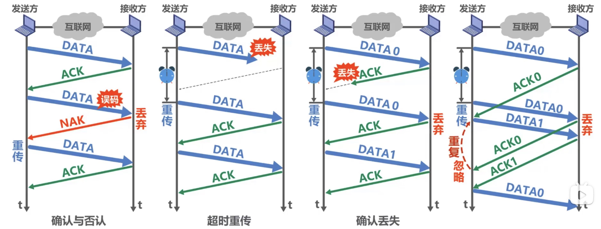

## 1. 概述

### 1.1 三个重要问题

- 封装成帧
    添加帧头与帧尾

- 差错检测

- 可靠传输
    误码是不可避免的。但是，如果发送发发送什么，接受方就可以接收到什么，我们就成为可靠传输。    

### 1.2 点对点传输与广播信道

- 广播式
    无线局域网目前还是广播式
- 点对点
    目前采用较多，由路由器转发

## 2. 封装成帧

- 帧头与帧尾
    各包含1字节帧标志，主要作用的帧定界。（不一定有帧定界符）

- 透明传输
    插入转义字符
    
## 3 差错检测

上图中FCS 字段为检测字段

- 检错编码

- 纠错编码

## 4 可靠传输

数据链路层向上层提供的服务类型：

- 不可靠传输服务： 仅仅丢弃掉有误码的帧，其他的什么也不做

- 可靠传输服务： 想办法实现，发送方发送什么，接收端就接收到什么

（在无线服务中，数据链路层必须要向上提供可靠传输服务）

**可靠传输服务并不局限于数据链路层，其他各层均可选择是否实现**。下面说明三种可靠传输协议：

### 4.1 停止等待协议SW

主要思想：

- 发送一个 接受一个 确认一个

- 引入超时重传

- 发送方 与 确认方 都需要1bitACK 或 NCK编码 （避免重复）

缺点： 信道利用率非常低

### 4.2 后退N帧协议GBN

主要思想：

- 一个大小为n的发送窗口

- 一个大小为1的接收窗口

- ACKn 的意义： n号以前的数据都已经收到，现需要n号数据

- 对于接收端，不一定要接受到一个，就回一个ACK。可以累计确认。 丢弃帧回发ACKn。

### 4.3 选择重传协议

主要思想：

- 一个大小为n的发送窗口与一个大小为n的接收窗口

## 5 PPP点对点协议

PPP协议向上不提供可靠传输服务
***ppp协议不需要封装mac地址，点对点协议不需要mac地址**

## 6 介质访问控制

- 点对点链路

- 广播式链路
    常用于总线型网络，无线网络等。

### 6.1 静态划分信道

- 频分复用FDM
    不同的用户信号调制到不同的评率载波上

- 时分复用TDM
    分时段，每个用户占用一段时间序

- 波分复用WDM
    光纤中不同光的频率

- 码分复用CDM

### 6.2 动态控制

- 多址接入
    竞争使用
- 载波监听
    先检测一下
- 碰撞检测
 
## 7 ARP协议

### 7.1 MAC地址

略

### 7.2 IP地址

数据链路层封装mac地址
网络层封装ip地址
ip地址一直不改变。mac地址一直在改变。

### 7.3 ARP协议

通过ip地址找到mac地址

## 8 集线器与交换机

1. 总线型网络
    所有pc都相连与同一根网线

2. 星形网络
    略

**集线器连接的各个设备，本质上还是一个总线型网络，还是会有碰撞**。

