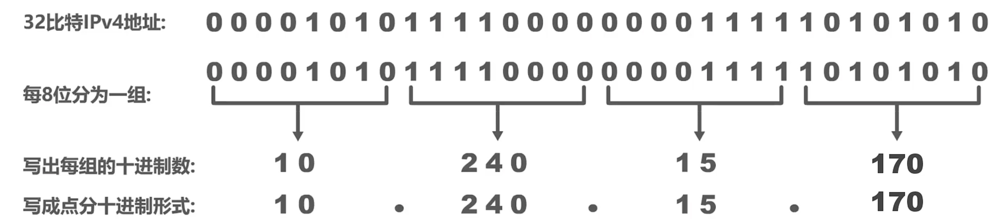
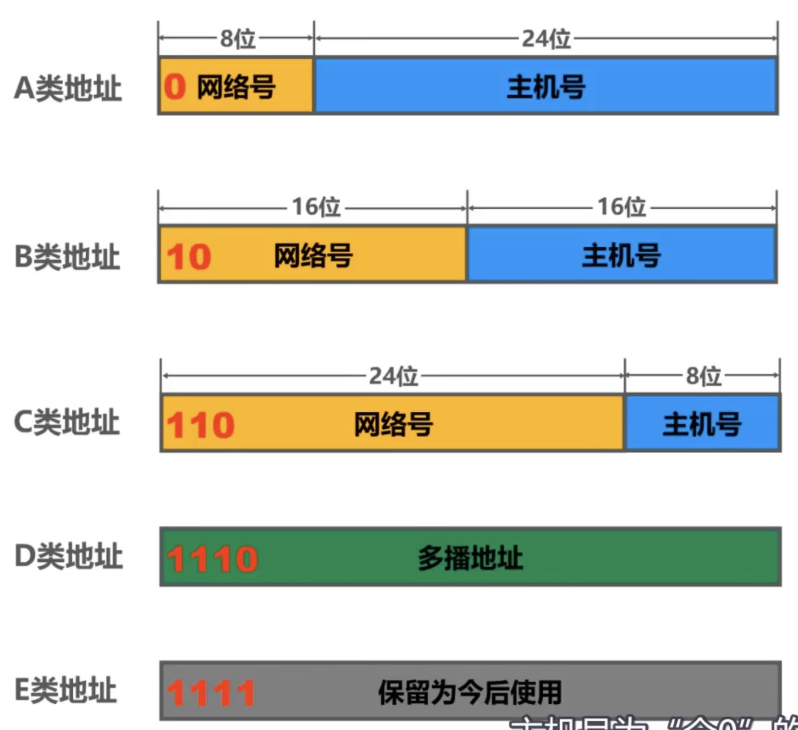
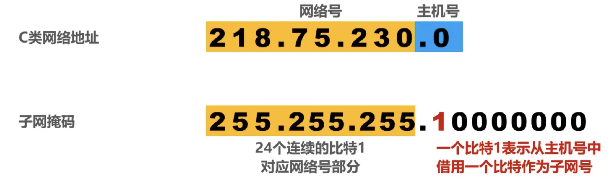
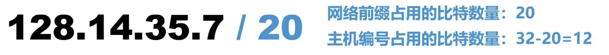
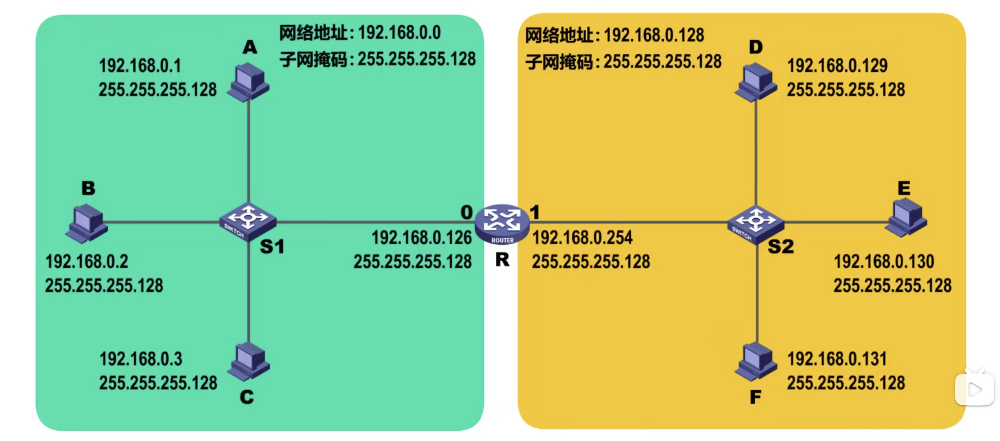
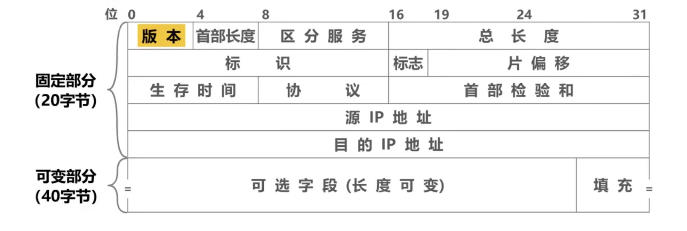
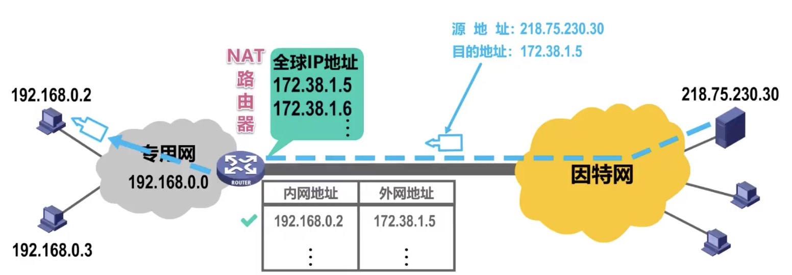

## 1. 网络层提供的两种服务

1. 面向链接的虚电路服务

2. 无连接的数据包服务
    可靠通信应当由用户主机来保证。（ip协议采用无连接的数据包）

## 2. Ipv4

### 2.1 分类编址

- 主机号全零
    网络地址

- 主机号全1
    广播地址

### 2.2 划分子网的IPv4

引出子网掩码概念，划分子网

1. 划分子网的数量 ：  2个 

2. 每个子网可分配的ip地址数量： 126个

### 2.3 无分类的Ipv4地址

主要思想： 在Ipv4地址后面加上”/",在斜线后面写上网络前缀所占的比特数量。

## 3 IP数据报的发送和转发过程

主要包含下述两个部分：

- 主机发送IP数据报

- 路由器转发IP数据报

1. 同一个网络中直接交付，不同网络间间接交付。如何判断是否是同一个网络？

    将源地址与子网掩码相与，将目的地址与子网掩码相与。判断是否属于同一个网络。**同一个网络直接交付，不同网络间接交付**。

## 4 IP v4数据包的首部格式

## 5 VPN 与 NAT

NAT能使大量使用内部专用地址的专用网络用户共享少量外部全球地址来访问因特网.上的主机和资源。即使用NAT路由器。

