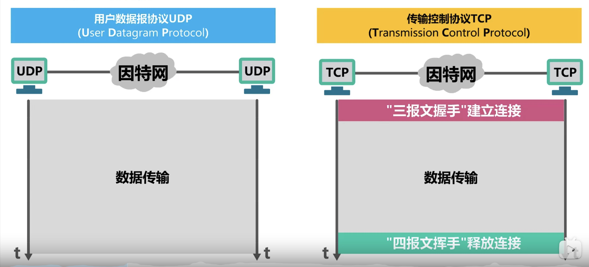
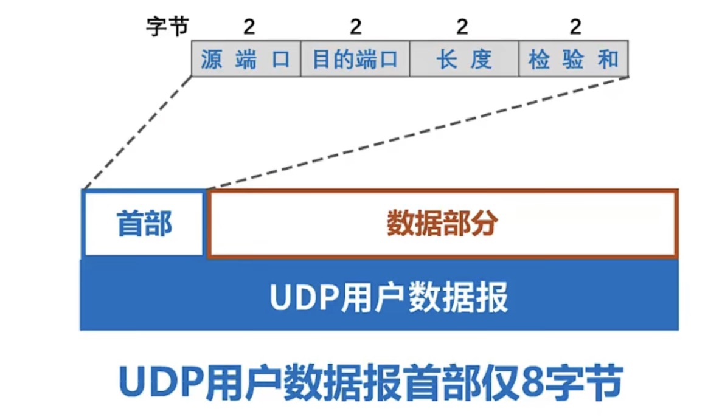
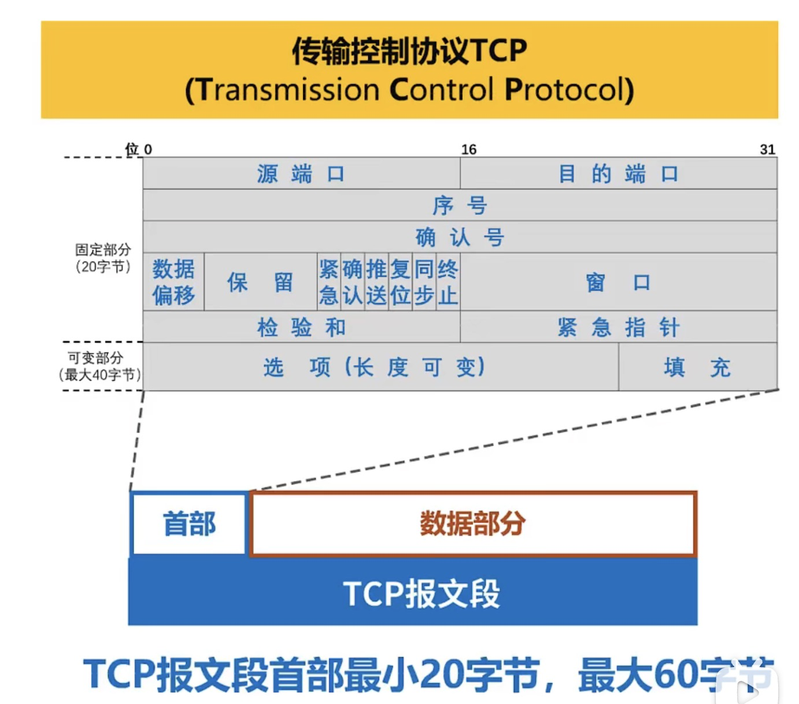

## 1. 运输层概述

实现主机间应用进程间的通信。

## 2. UDP  与 TCP

A### 2.1 UDP 用户数据报协议

1. 支持 单播 多播 广播 （支持一对一，一对多）

2. 面向连接的可靠传输服务

### 2.2 TCP 传输控制协议

1. 仅支持单播

2. 无连接不可靠

3. 流量控制

    **让发送方不要发送的太快，要让接收方来得及接受**，利用滑动窗口机制实现。

4. 拥塞控制
    若出现拥塞而不进行控制，整个网络的吞吐量将随输入负荷的增大而降下。

5. 超时重传的时间选择

### 2.3 TCP 的建立（三次握手）

建立链接需要解决的三个问题：

- 使TCP双方能够感知到对方的存在

- 使得TCP双方能够协商一些参数（如最大窗口值等）

- 使得TCP双方能够对运输实体资源进行分配（如缓存大小）

### 2.4 TCP 的释放（四次握手）

