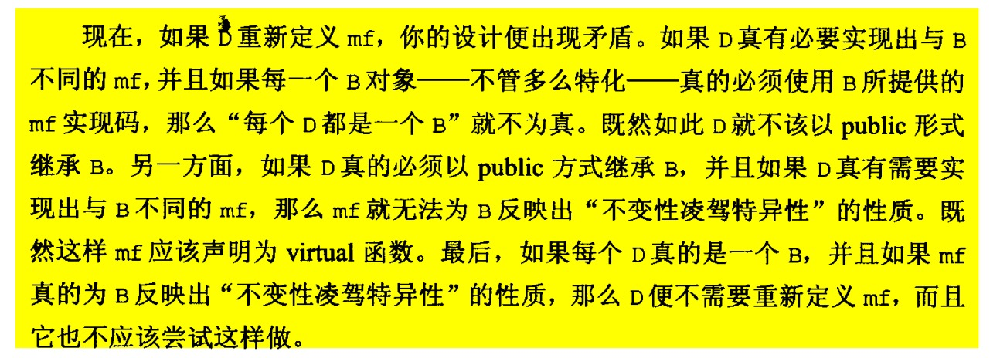

## 33. 避免遮盖继承而来的名称

### 1. 先导知识

```cpp
int x = 15;

int main() {
    double x = 1.5;
    int y = x;
    cout << y << endl;
}
```

main 函数范围内的 `x`命名会覆盖掉 globle 的全局 `x`。 无论其类型。

### 2.  再来看一个示例

首先说明一点，对于Base 的虚函数， Derived 在继承的时候可写 virtual 也不可写 virtual。 因为其注定就是虚函数。

```cpp
class Base {
private:
    int x;
public:
    virtual void mf1() = 0;
    virtual void mf2();
    void mf3();
}

class Derived : public Base {
public:
    virtual void mf1();
    void mf4() {
        mf2();
    }
}
```

mf4 会首先查找Derved作用域，找不到就向上层查找。

### 3. 示例依旧

```cpp
class Base {
private:
    int x;
public:
    virtual void mf1() = 0;
    virtual void mf1(int);
    virtual void mf2();
    void mf3();
    void mf3(double );
};

class Derived : public Base {
public:
    virtual void mf1();
    void mf3();
    void mf4();
};
```

结果：

```cpp
Derived d;
int x;

d.mf1();
d.mf1(x);  // 错误
d.mf2();
d.mf3();
d.dm3(x); // 错误
```

其核心思想跟上述代码类似： **针对一个名字，如果本作用域没有，就向上层查找。如果本作用域有，那就不能针对该名字发生函数重载，即使上层函数有该函数名的重载**。

### 4. 如何解决实例3的问题？

```cpp
class Derived : public Base {
public:
    using Base::mf1;
    using Base::mf3;
    virtual void mf1();
    void mf3();
    void mf4();
};

Derived d;
int x;

d.mf1();
d.mf1(x);  
d.mf2();
d.mf3();
d.dm3(x); 
```

这意味着什么呢？ Base类有多函数重载，基类只覆盖了一个，你又希望其他的没有覆盖的重载函数可以顺利的在Derived中使用。那么，请使用 `using Base:mf1`. using 声明会令所有同名函数在基类中可见。

### 5. 父类多重载函数，我只想继承其中的一个呢？

```cpp
class Base {
public:
    virtual void mf1() = 0;
    virtual void mf1(int);
}

class Derived: private Base {
public:
    virtual void mf1() {
        Base::mf1();
    }
}
```

### 6. 多态问题（补充）

个人实验了一下，多态问题不受上述影响。

### 7. 结论

1. 子类名称会掩盖父类名称（多态好像不会）
2. 可以使用using 声明 或者 转交函数。


## 34. 区分接口继承和实现继承

作为一个类的设计者，你有时候会希望derived classes：

1. 只继承成员函数的接口（也就是声明）
2. 同时继承接口与实现，但是又希望能够复写（override)
3. 同时继承接口与实现，并且不允许复写任何东西。

### 1. 一个Demo

```cpp
class Shape {
public:
    virtual void draw() const = 0;   // 纯虚函数
    virtual void error(const string &msg);  // 虚函数
    int objectID() const;       // 普通成员函数
};

class Rectangle: public Shape{};
class Ellipse: public Shape{};
```

1. 对于纯虚函数
    - 声明一个纯虚函数的目的是为了让derived classes 只继承函数接口。其意义是”你必须给我提供一个该函数的实现，但是我不干涉你怎么实现它“

    - 纯虚函数也是可以有函数实现的，可通过函数名调用。

        ```cpp
        void Shape::draw() const {
        ...
        }
        ```

2. 对于普通虚函数

    你必须提供一个该虚函数，但是如果你不想为此专门重写，可以使用我们提供的默认缺省版本的虚函数。

3. 对于普通成员函数
    略

### 2. 使用缺省虚函数的几个问题

```cpp
class Airplane {
public:
    virtual void fly() {
        cout << "default fly" << endl;
    }
};

class ModelA : public Airplane{};
class ModelB : public Airplane{};
```

如果B飞机需要专门的飞行控制程序，然而程序设计者忘记给B设计，其会使用缺省的fly函数。显然这样的设计不是好的设计。

1. 方法1

    ```cpp
    class Airplane {
    public:
        virtual void fly() = 0;

    protected:
        void defaultFly(){
            cout << "defaultFly" << endl;
        }
    };

    class ModelA : public Airplane{
    public:
        void fly() override {
            defaultFly();
        }
    };  
    ```

    将fly 设置为纯虚函数，并提供默认的飞行程序给你选用。

2. 方法2

    ```c
    class Airplane {
    public:
        virtual void fly() = 0;
    };

    void Airplane::fly() {
        cout << "fly default" << endl;
    }

    class ModelA : public Airplane{
    public:
        void fly() override {
            Airplane::fly();
        }
    };
    ```
    这个代码很清楚了。这种设计方法应该多看看。

## p35. 考虑virtual函数以外的其他选择

以一个传统的类为例：

```cpp
class GameCharacter {
public:
    virtual int haelthValue () const ;  // 返回游戏角色的ip值
};
```

### 1. 改进1 Non-virtual interface 手法实现

```cpp
class GameCharacter {
public:
    int healthValue () const {
        
        // 之前可以做一些事情
        
        int retVal = doHealthValue();
        
        
        // 之后可以做一些事情
    }

private:
    virtual int doHealthValue() const{
        
    }
};
```

其子类可以复写该virtual函数。 该手法的优点是可以在操作时**保证之前**，**之后**可以做一些事情。该事情一定会发生。例如我们可以进行日志记录，锁的分配等。

### 2. 改进2等

略

## 36. 绝对不重新定义继承而来的no-virtual函数

```cpp

class B {
public:
    voit mft1();    // no-virtual 函数
}

class D : public B {
public:
    void mft1(); // 覆盖
}

D d;
B *pb = &d;
D *pd = &d;

pb-> mft1();  // 调用B.mft1
pd-> mft1();  // 调用D.mft1
```

解释如下：



## 37. 绝不重新定义继承而来的缺省的参数

**virtual 函数是动态绑定的， 而缺省参数值确实静态绑定的**。具体意思见代码：

```cpp
class Shape {
public:
    virtual void draw(string str = "Red") const = 0;
};

class Rectangle : public Shape {
public:
    virtual void draw(string str = "Green") const override {   // 很糟糕，不要重新定义缺省值
        cout << "Rectangle:" << str << endl;
    }
};

class Circle : public Shape {
public:
    void draw(string str) const override {   // 没有重新定义缺省值
        cout << "Circle:" << str << endl;
    }
};

int main() {
    Rectangle rectangle;
    Circle circle;

    rectangle.draw();   // Rectangle:Green

    Shape *p = &rectangle;
    p->draw();  //Rectangle:Red
}
```

确实是很奇怪的东西，那么，就有了如下规则：绝不要重新定义一个继承而来的缺省参数值，因为缺省参数值都是静态绑定的，而virtual，是动态绑定的。

## 38. 通过复合摸索出 has-a（有一个) 或 根据某物实现出（is-implemented-in-terms-of)

复合有两种情况：
    - 有一个
    - 根据某物实现出

下面以代码为例：

- has-a 模型

    ```cpp
    class Address { ... }

    class Person {
    public:
        Address address;  // has-a
        string name;    // has-a
    }
    ```

- is-implemented-in-terms-of 模型

    用一个list来构造出set。

    ```cpp
    template<class T>
    class Set {
    public:
        bool member(const T& item) const;
    private:
        list<T> rep;
    }

## 39. 明智而谨慎的使用private 继承

先说结论：

- pulic 继承是 `is-a` 关系

- private 继承是 `implemented-in-terms-of`（根据某物实现）关系。

```cpp
class Person{...};
class Student : private Person{...};

void eat(const Person &p);

Person p; Student s;

eat(p);   // 调用成功
eat(s);   // 调用失败 
```

通过上面的代码只想说明一个问题，在private 继承中， 编译器不会自动的将一个derived class 对象转化为一个base class 对象。 这就是我们调用失败的根本原因。 private 继承的规则是： **derived class 中都会变成private 属性， 即使他们在base calss 中原本是protected 或者 public 属性**。


### 与条款38的区别

private 继承意味着根据某物实现， 这与复合的意义是一样的。 那我们该如何在两者间进行取舍？ 很简单：尽可能使用复合， 必要时采用private 继承。

一个demo: 假设 Widget 类需要执行周期性任务，于是希望继承 Timer 的实现。 因为 Widget 不是一个 Timer，所以选择了 private 继承


#### private 继承

假设 Widget 类需要执行周期性任务，于是希望继承 Timer 的实现。 因为 Widget 不是一个 Timer，所以选择了 private 继承：

```cpp
class Timer {
public:
explicit Timer(int tickFrequency);
virtual void onTick() const; // 每滴答一次，该函数就被自动调用一次
};
class Widget: private Timer {
private:
virtual void onTick() const; // 查看 Widget 的数据...等等
};
```

#### 复合

```cpp
class Widget {
private:
    class WidgetTimer: public Timer {
    public:
        virtual void onTick() const;
    };
WidgetTimer timer;
};
```

### 总结
总的来说，在需要表现“is-implemented-in-terms-of”关系时。如果一个类需要访问基类的 protected 成员，或需要重新定义其一个或多个 virtual 函数，那么使用 private 继承。否则，在考虑过所有其它方案后，仍然认为 private 继承是最佳办法，才使用它。

## 40. 明智而谨慎的使用多继承

### 问题1
 
使用多继承时，一个问题是不同基类可能具有相同名称，产生歧义（即使一个名字可访问，另一个不可访问）。但可以指定其父类进行访问，如下：

```cpp
s.D1::i;
```

### 问题2

一般有两种方式使用多继承：

1. 一般的多重继承

    如果某个基类到派生类之间存在多条路径，那么派生类会包含重复的基类成员。

2. 虚继承

    如果某个基类到派生类之间存在多条路径，派生类只包含一份基类成员，但是这会带来额外开销。
    **virtual 继承会增加大小，速度，初始化，复杂度等成本。 如果virtual base classes 不带任何数据，将会是最具使用价值的情况。**

