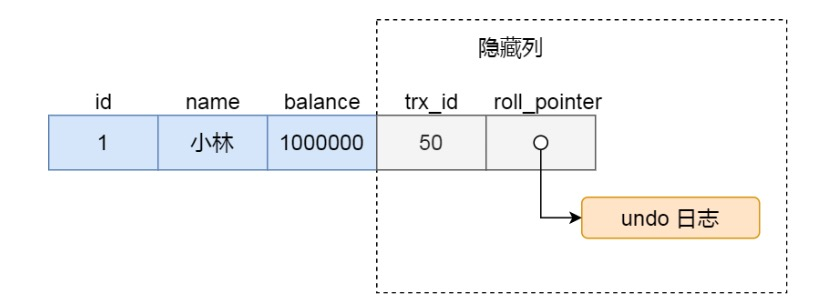

## 1. 四大特性

1. 原子性
    要么都成功 要么都失败

2. 一致性
    是指事务操作前和操作后，数据满足完整性约束，数据库保持一致性状态。比如，用户 A 和用户 B 在银行分别有 800 元和 600 元，总共 1400 元，用户 A 给用户 B 转账 200 元，分为两个步骤，从 A 的账户扣除 200 元和对 B 的账户增加 200 元。一致性就是要求上述步骤操作后，最后的结果是用户 A 还有 600 元，用户 B 有 800 元，总共 1400 元，而不会出现用户 A 扣除了 200 元，但用户 B 未增加的情况（该情况，用户 A 和 B 均为 600 元，总共 1200 元）。

3. 隔离性
    并发事务， 

4. 持久性
    对数据的更改是永久的

## 2. 事务的隔离级别

1. 事务的并发执行可能会遇到的三种情况
    - 脏读： 读到其他事务未提交的数据
    - 不可重复读： 前后读取的数据不一致
    - 幻读：前后读取的记录数量不一致

    

2. SQL 的四种隔离级别
    - **读未提交（read uncommitted）**，指一个事务还没提交时，它做的变更就能被其他事务看到；
    - **读提交（read committed）**，指一个事务提交之后，它做的变更才能被其他事务看到；
    - **可重复读（repeatable read）**，指一个事务执行过程中看到的数据，一直跟这个事务启动时看到的数据是一致的，MySQL InnoDB 引擎的默认隔离级别；
    - **串行化（serializable ）**；会对记录加上读写锁，在多个事务对这条记录进行读写操作时，如果发生了读写冲突的时候，后访问的事务必须等前一个事务执行完成，才能继续执行；

    

3. 不同的隔离级别， 事务并发的现象不同

    

4. 一点备注
    InnoDB 引擎的默认隔离级别虽然是「可重复读」，但是它通过next-key lock 锁（行锁和间隙锁的组合）来锁住记录之间的“间隙”和记录本身，防止其他事务在这个记录之间插入新的记录，这样就避免了幻读现象。

## 3. 四种隔离级别的实现

1. 对于「读未提交」隔离级别的事务来说，因为可以读到未提交事务修改的数据，所以直接读取最新的数据就好了；

2. 对于「读提交」和「可重复读」隔离级别的事务来说，它们是通过 Read View 来实现的，它们的区别在于创建 Read View 的时机不同，大家可以把 Read View 理解成一个数据快照，就像相机拍照那样，定格某一时刻的风景。「读提交」隔离级别是在「每个语句执行前」都会重新生成一个 Read View，而「可重复读」隔离级别是「启动事务时」生成一个 Read View，然后整个事务期间都在用这个 Read View。

3. 对于「串行化」隔离级别的事务来说，通过加读写锁的方式来避免并行访问；

## 4. Read View 在 MVCC 中如何实现

### Read View 中的字段

- creator_trx_id ：指的是创建该 Read View 的事务的事务 id。

- m_ids ：指的是在创建 Read View 时，当前数据库中「活跃事务」的事务 id 列表，注意是一个列表，“活跃事务”指的就是，启动了但还没提交的事务。

- min_trx_id ：指的是在创建 Read View 时，当前数据库中「活跃事务」中事务 id 最小的事务，也就是 m_ids 的最小值。

- max_trx_id ：这个并不是 m_ids 的最大值，而是创建 Read View 时当前数据库中应该给下一个事务的 id 值，也就是全局事务中最大的事务 id 值 + 1；

### 聚簇索引中的两个字段

- trx_id，当一个事务对某条聚簇索引记录进行改动时，就会把该事务的事务 id 记录在 trx_id 隐藏列里；

- roll_pointer，每次对某条聚簇索引记录进行改动时，都会把旧版本的记录写入到 undo 日志中，然后这个隐藏列是个指针，指向每一个旧版本记录，于是就可以通过它找到修改前的记录。

### trx_id 的划分

1. 如果记录的 trx_id 值小于 Read View 中的 min_trx_id 值，表示这个版本的记录是在创建 Read View 前已经提交的事务生成的，所以该版本的记录对当前事务可见。

2. 如果记录的 trx_id 值大于等于 Read View 中的 max_trx_id 值，表示这个版本的记录是在创建 Read View 后才启动的事务生成的，所以该版本的记录对当前事务不可见

3. 如果记录的 trx_id 值在 Read View 的 min_trx_id 和 max_trx_id 之间，需要判断 trx_id 是否在 m_ids 列表中：

    - 如果记录的 trx_id 在 m_ids 列表中，表示生成该版本记录的活跃事务依然活跃着（还没提交事务），所以该版本的记录对当前事务不可见。
    - 如果记录的 trx_id 不在 m_ids列表中，表示生成该版本记录的活跃事务已经被提交，所以该版本的记录对当前事务可见。

## 5. 可重复读是如何工作的

**可重复读隔离级别是启动事务时生成一个 Read View，然后整个事务期间都在用这个 Read View。**。

## 6. 读提交是如何工作的

**读提交隔离级别是在每次读取数据时，都会生成一个新的 Read View。**

## 7. 重点 MySQL数据库 第一类与第二类丢失更新

### 1. 第一类丢失更新（回滚丢失）

A事务撤销时，把已经提交的B事务的更新数据覆盖了。这种错误可能造成很严重的问题，通过下面的账户取款转账就可以看出来。

  A事务在撤销时，“不小心”将B事务已经转入账户的金额给抹去了。

  **SQL92没有定义这种现象，标准定义的所有隔离界别都不允许第一类丢失更新发生。**

### 2. 第二类丢失更新（覆盖丢失， 两次更新问题）

A事务覆盖B事务已经提交的数据，造成B事务所做操作丢失。

1. 问题背景
    账单结算完成时需要更新对应账户余额。如果多笔账单同时结算完成，此时会同时更新账户余额。更新的步骤为，先查询账户当前余额，然后累加上本次账单金额，然后更新。例如，账单1和账单2同时查到当前账户余额为10元，其中账单1金伟为5元，于是先将余额更新为10+5=15元并提交事务，账单2金额为8元，并将余额更新为10+8=18元也提交事务。最后账户余额为18元。

    **检查事务隔离级别为可重复读。数据库为mysql。**

2. 问题原因

    mysql数据库，通过设置事务隔离级别为可重复读（REPEATABLE_READ）无法避免发生“第二类丢失更新”问题。

3. 第二类丢失更新
    它和不可重复读本质上是同一类并发问题，通常将它看成不可重复读的特例。当两个或多个事务查询相同的记录，然后各自基于查询的结果更新记录时会造成第二类丢失更新问题。每个事务不知道其它事务的存在，最后一个事务对记录所做的更改将覆盖其它事务之前对该记录所做的更改。

### 3. 第二类丢失更新的解决方案

#### 名词解释 悲观锁与乐观锁

- 悲观锁： 总是假设最坏的情况，每次去拿数据的时候都认为别人会修改，所以每次在拿数据的时候都会上锁，这样别人想拿这个数据就会阻塞直到它拿到锁（共享资源每次只给一个线程使用，其它线程阻塞，用完后再把资源转让给其它线程）。
    
- 乐观锁：总是假设最好的情况，每次去拿数据的时候都认为别人不会修改，所以不会上锁，但是在更新的时候会判断一下在此期间别人有没有去更新这个数据，可以使用版本号机制和CAS算法实现。乐观锁适用于多读的应用类型，这样可以提高吞吐量，

#### 解决方案

1. 悲观锁
    - 传统悲观锁：以上面的例子来说明，在弹出修改工资的页面初始化时（这种情况下一般会去从数据库查询出来），在这个初始化查询中使用select ...for update nowait， 通过添加for update nowait语句，将这条记录锁住，避免其他用户更新，从而保证后续的更新是在正确的状态下更新的。然后在保持这个链接的状态下，在做更新提交。当然这个有个前提就是要保持链接，就是要对链接要占用较长时间，这个在现在web系统高并发高频率下显然是不现实的。
    - 现在的悲观锁（推荐）：在修改工资这个页面做提交时先查询下，当然这个查询必须也要加锁（select ...for update nowait），有人会说，在这里做个查询确认记录是否有改变不就行了吗，是的，是要做个确认，只是你不加for update就不能保证你在查询到更新提交这段时间里这条记录没有被其他会话更新过，所以这种方式也需要在查询时锁定记录，保证在这条记录没有变化的基础上再做更新，若有变化则提示告知用户。

2. 乐观锁
    - 传统方法：就是在sql更新时使用旧的状态值做条件，SQL大致如下 Update table set col1 = newcol1value, col2 = newcol2value…. where col1 = oldcol1value and col2 = oldcol2value….，在上面的例子中我们就可以把当前工资作为条件进行更新，如果这条记录已经被其他会话更新过，则本次更新了0行，这里我们应用系统一般会做个提示告知用户重新查询更新。这个取哪些旧值作为条件更新视具体系统实际情况而定。（这种方式有可能发生阻塞，如果应用其他地方使用悲观锁法长时间锁定了这条记录，则本次会话就需要等待，所以使用这种方式时最好统一使用乐观锁法。）
    - 现在的方法，使用版本列： 其实这种方式是一个特殊化的前镜像法，就是不需要使用多个旧值做条件，只需要在表上加一个版本列，这一列可以是NUMBER或 DATE/TIMESTAMP列，加这列的作用就是用来记录这条数据的版本（在表设计时一般我们都会给每个表增加一些NUMBER型和DATE型的冗余字段，以便扩展使用，这些冗余字段完全可以作为版本列用），在应用程序中我们每次操作对版本列做维护即可。在更新时我们把上次版本作为条件进行更新。

## 8. 参考资料

[p1](https://blog.csdn.net/paopaopotter/article/details/79259686)

[p2](https://www.cnblogs.com/maimode/p/15842977.html)
