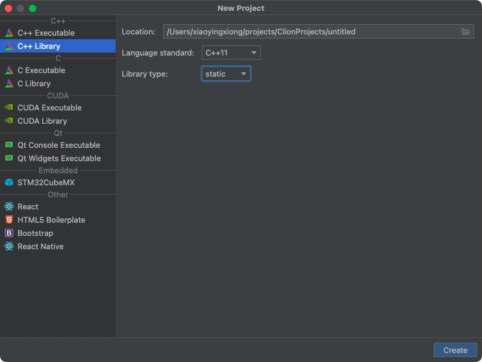

## 1. 静态库

### 编译静态库

1. 创建库工程 static 为静态库  shared为动态库
    

2. 编译静态库
    Build -> Build project 
    编译成功后`cmake-build-debug`下回出现 `xxx.a`的库文件

3. 封装
    一般的习惯，将头文件放到include 中， 将生成文件放至libs中

    

4. ok 静态库编译完成。

### 引入静态库

1. 将库文件引入到项目中

    

2. 修改CmakeLists

    ```txt
    cmake_minimum_required(VERSION 3.21)
    project(LibTest2)

    set(CMAKE_CXX_STANDARD 11)

    # 指定lib目录
    link_directories(${PROJECT_SOURCE_DIR}/hello/libs)
    # 指定头文件搜索路径
    include_directories(${PROJECT_SOURCE_DIR}/hello/include)

    add_executable(LibTest2 main.cpp)
    # 链接
    target_link_libraries(${PROJECT_NAME} libLIbTest.a)
    ```

3. 函数中引入头文件 即可正常调用

    ```
    #include "hello/include/library.h"
    ```

### 打包发行

    这个先留一个坑


## 2. 动态库

### 不同平台下的动态库名不同

- .ddl   win

- .so    linux

- .dylib   macos


### 编译过程

1. 创建shared 工程

2. 编译生成 .dylib 文件

3. 同静态库 将 .dylib 文件放入文件夹中并引入

4. 修改cmakelist

```cpp
cmake_minimum_required(VERSION 3.21)
project(LibTest2)

set(CMAKE_CXX_STANDARD 11)

# 指定lib目录
link_directories(${PROJECT_SOURCE_DIR}/hello/libs)
# 指定头文件搜索路径
include_directories(${PROJECT_SOURCE_DIR}/hello/include)

add_executable(LibTest2 main.cpp)
# 链接
target_link_libraries(${PROJECT_NAME} libSharedLIbaryTest.dylib)
```

## 3. 静态链接与动态链接

1. 静态链接是在编译链接时直接将需要的执⾏代码拷⻉到调⽤处；
2. 优点在于程序在发布时不需要依赖库，可以独⽴执⾏，缺点在于程序的体积会相对较⼤，⽽且如果静态库更新之后，所有可执⾏⽂件需要重新链接；
3. 动态链接是在编译时不直接拷⻉执⾏代码，⽽是通过记录⼀系列符号和参数，在程序运⾏或加载时将这些信息传递给操作系统，操作系统负责将需要的动态库加载到内存中，然后程序在运⾏到指定代码时，在共享执⾏内存中寻找已经加载的动态库可执⾏代码，实现运⾏时链接；
4. 优点在于多个程序可以共享同⼀个动态库，节省资源；
5. 缺点在于由于运⾏时加载，可能影响程序的前期执⾏性能。