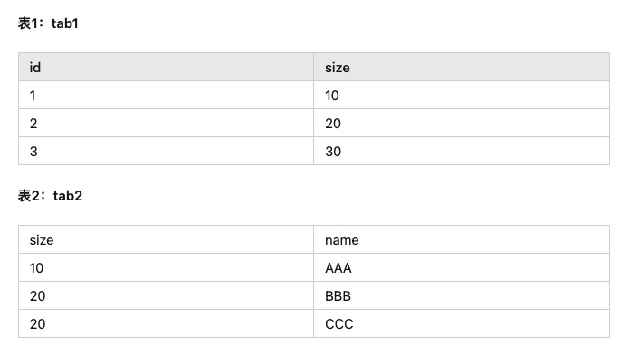
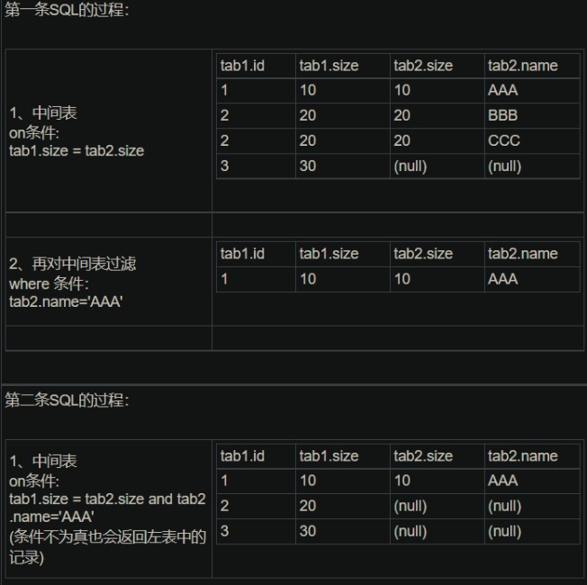
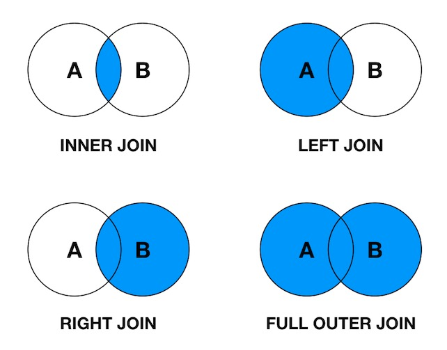

## 1. Join 中 on 与 where 的区别？

- sql1
    `select * from tab1 left join tab2 on (tab1.size = tab2.size) where tab2.name='AAA'`

- sql2
    `select * from tab1 left join tab2 on (tab1.size = tab2.size and tab2.name='AAA')`

- 结果
    

### 解释如下：

1. on 条件是在生成临时表时使用的条件，它不管 on 中的条件是否为真，都会返回左边表中的记录。

2. where 条件是在临时表生成好后，再对临时表进行过滤的条件。这时已经没有 left join 的含义（必须返回左边表的记录）了，条件不为真的就全部过滤掉。

## Join

一图胜千言

