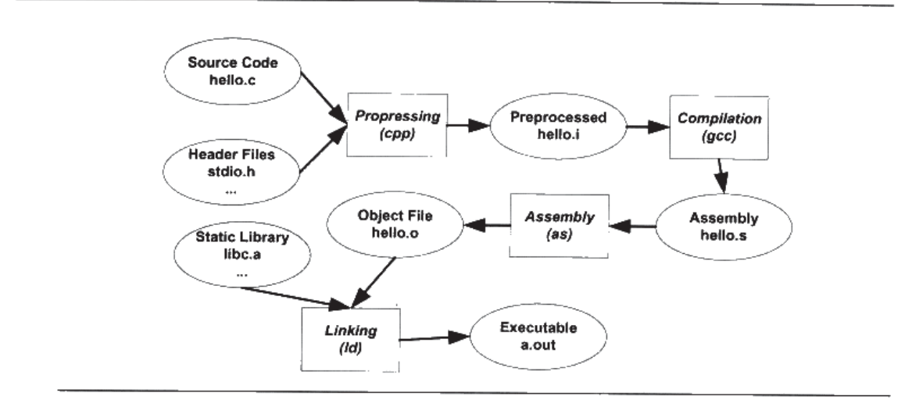

## 2.1 被隐藏的过程

C语言经典“hello word”，在linux下的编译过程：

```c
#include <stdio.h>
  
int main() {
        printf("hello word");
        return 0;
}
```

我们常使用的编译如下：

```c
gcc hello.c
./a.out
```



实时上， 上述过程可以分解为4个步骤，分别为**预处理（Prepressing)**、**编译（Compilation)**、**汇编（Assembly)**和**链接（Linking)**,如上图所示。

### 2.1.1 预编译

命令：
```c
gcc -E hello.c hello.i
// 或者
cpp hello.c > hello.i
```

预编译过程处理规则如下：

- 删除#defin， 展开所有宏
- 处理所有有条件的预编译指令， #if， #ifdef， #elif， #else， #endif
- 处理#include预编译指令，**该规则为递归进行，被包含的文件可能还包含其他的文件**。
- 删除所有注释
- 添加行号和文件标志用于调试
- 保留所有的#pragma编译器指令

关于宏展开：**当我们无法判断宏定义是否正确的或者头文件包含是否正常的时候，可以查看预编译后的文件来确定。**

### 2.1.2 编译

编译过程就是把预处理完成后的文件进行一系列的此法分析、语法分析、语义分析后产生相应的汇编代码文件。命令如下：

```c
gcc -S hello.i -o hello.s
```

现版本把预处理和编译合并为一个步骤。

### 2.1.3 汇编

汇编器把汇编代码转换为机器可执行的机器码，命令如下：

```c
as hello.s -o hello.o
// 或者
gcc -c hello.s -o hello.o
// 或者使用gcc将c源码可直接转换为.o目标文件
gcc -c hello.c -o hello.o
```

**经过汇编后产生的.o文件为目标文件**。

### 2.1.4 链接

需要将很多文件链接到.o文件中，才能产生 .out 可执行文件， 具体链接过程就是本书的核心，后续展开。

## 2.2 编译器做了什么？

> 编译器就是将高级语言翻译成机器语言的一个工具。

---

本章不展开描述编译器是如何利用词法分析、语法分析、语义分析等将源代码生成汇编代码，仅利用下面这段代码展开说明几个比较重点的问题。

```c
array[index] = (index + 4) * (2 + 6);
```

1. 编译器能分析的语义是静态语义（编译器可以确定的语义）， 反之对应的动态语义（只有在运行的时候才能确认的语义）。
    浮点数赋值给指针  ->  静态语义  编译时期报错
    将0作为除数      ->  动态语义  运行时期报错

2. 中间语言生成
    上述代码会在中间代码生成阶段将（2+6）直接优化为8. 中间代码的存在使得编译器可分为前端和后端。**编译器前端负责生成产生机器无关的代码，编译器后端负责将中间代码转换为目标机器代码。** 所以，针对跨平台编译器，可以针对不同的平台使用同一个前端和不同平台的机器的数个后端。

3. 上述可以解释为什么java“一处编译，处处运行”？
    可以，留坑。

4. 源代码终于被编译成汇编代码，还留有一个问题，index和array的地址如何确定？
    如果index和array在同一个文件内， index 和 array 还可以被编译器分配空间确定地址。 那如果实在别的模块呢？**所以现代的编译器将源文件代码编译成一个未链接的目标文件，然后由连接器将这些目标链接成为可执行文件**, 这也是本书的标题————链接。

## 2.3 链接器

> 链接的主要作用是把各个模块之间的引用部分处理好，使得各个模块之间能够正确的衔接。

一个问题，我们在一个模块中的main.c中调用另外一个模块foo.c中的函数foo();main在调用时必须知道foo()地址，由于每个模块之间都是单独编译的，所以编译器在编译main的时候不知道foo函数的地址，所以暂时吧调用foo的指令目标地址搁置，**等待最后链接的时候由连接器去将这些指令的目标地址修改**。

关于全局变量和链接的demo
```c
//main.c
#include <stdio.h>
#include "foo.h"

// extern int indexs;

int main() {
    printf("indexs is : %d\n", indexs);
    foo();
    printf("indexs is : %d\n", indexs);
}

// foo.h
#include <stdio.h>

int indexs = 1234;

void foo() {
    printf("*************\n");
    indexs = 12345;
}
```

输出：

```c
indexs is : 1234
*************
indexs is : 12345
```