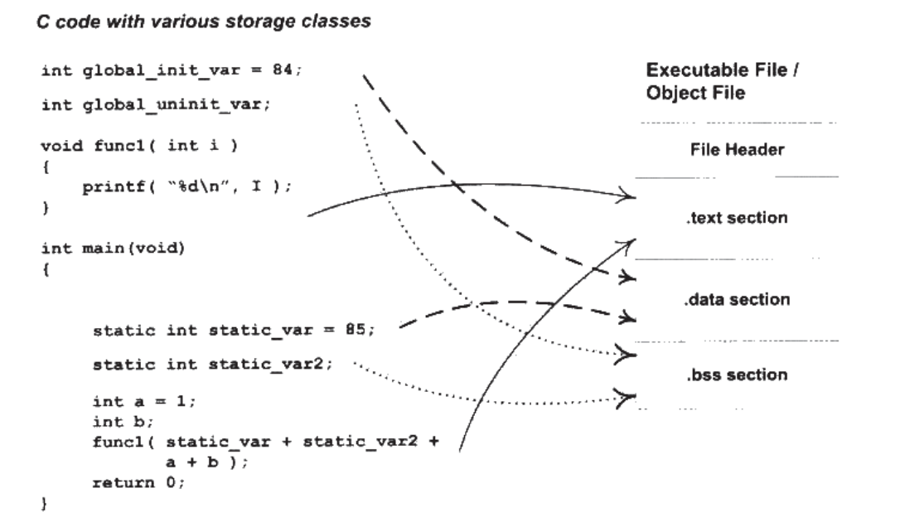
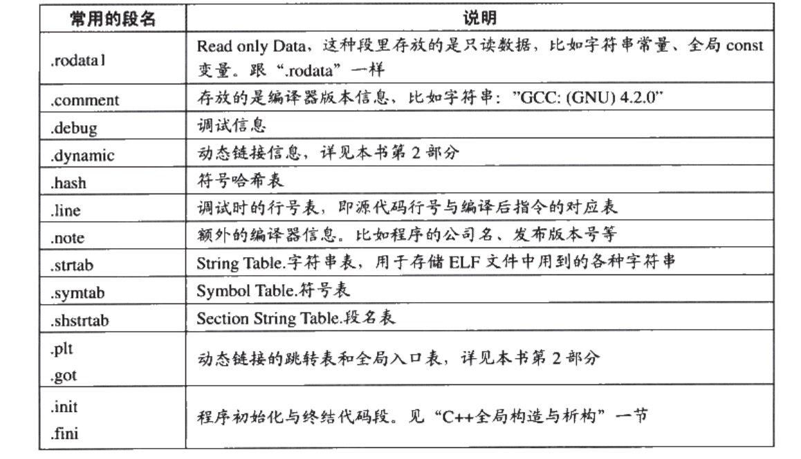
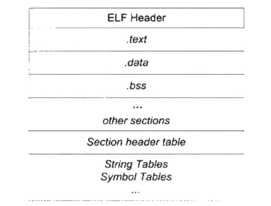
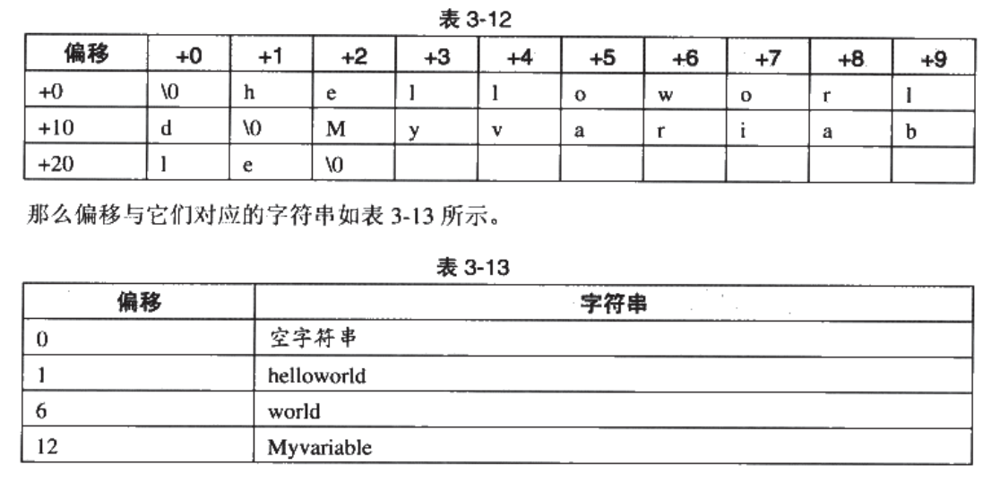

## 3.1 目标文件格式

- 目标文件
    经过编译器编译后产生的文件叫做目标文件。

- 可执行文件
    链接后的目标文件。

现在pc平台流行的可执行文件格式主要为windows 的 PD 和 Linux 下的ELF文件。

## 3.2 ELF文件格式



1. 文件头（File Header)
    描述文件属性（可执行， 静态链接，动态链接，入口地址）， 目标硬件和目标操作系统信息，以及一个段表（**描述文件中各个段在文件中偏移位置以及段属性**）。

2. 代码段（.text section)
    编译完成的机器码。

3. .data section    
    已经初始完成的全局变量和局部静态变量。

4.  .bss section
    未初始化的全局变量和局部静态变量。

未初始完成的全局变量和局部静态变量的值为0， 放在.data数据段中要占用内存，并且可执行文件要记录未初始化的全局变量和局部静态变量的大小总和， 放入.bss段中。 **.bss段中只是预留了位置，并没有内容，在文件中不占用空间**。

### 所以，为什么要分为代码段和数据段？

- 可以设置成为代码段只读， 数据段读写， 防止程序指令被有意或者无意篡改。

- 现代cpu一般被设计成为数据缓存和指令缓存分离。

- 最重要的原因， **当系统中运行了很多该程序的副本时，内存中只用保存一份程序的指令部分，其他只读数据也一样，但是副本进程的数据区是不一样的**。

## 3.3 细节挖掘

```c
// SimpleSection.c 文件示例

int printf(const char* format, ...);
  
int global_init_var = 84;
int global_uint_var;

void func1(int i) {
    printf("%d\n", i);
}

int main(void) {
    static int static_var = 85;
    static int static_var2;
    int a = 1;
    int b;

    func1(static_var + static_var2 + a + b);

    return a;
}
```

1. 编译
`gcc -c SimpleSection.c    //-c表示只编译不连接`

2. 使用工具查看目标文件内部结构

    `objdump -h SimpleSection.o // -h 为现实每节的主要信息  可通过objdump查看参数`

    ```c
    SimpleSection.o:     file format elf64-x86-64

    Sections:
    Idx Name          Size      VMA               LMA               File off  Algn
    0 .text         00000057  0000000000000000  0000000000000000  00000040  2**0
                    CONTENTS, ALLOC, LOAD, RELOC, READONLY, CODE
    1 .data         00000008  0000000000000000  0000000000000000  00000098  2**2
                    CONTENTS, ALLOC, LOAD, DATA
    2 .bss          00000004  0000000000000000  0000000000000000  000000a0  2**2
                    ALLOC
    3 .rodata       00000004  0000000000000000  0000000000000000  000000a0  2**0
                    CONTENTS, ALLOC, LOAD, READONLY, DATA
    4 .comment      0000002a  0000000000000000  0000000000000000  000000a4  2**0
                    CONTENTS, READONLY
    5 .note.GNU-stack 00000000  0000000000000000  0000000000000000  000000ce  2**0
                    CONTENTS, READONLY
    6 .eh_frame     00000058  0000000000000000  0000000000000000  000000d0  2**3
                    CONTENTS, ALLOC, LOAD, RELOC, READONLY, DATA
    ```
    
- Idx (Index): 节的序号，从 0 开始。
- Name: 节的名称，如 .text, .data, .bss 等。
- Size: 节的大小（以字节为单位）。
- VMA (Virtual Memory Address): 节加载到内存时的虚拟地址。
- LMA (Load Memory Address): 节实际加载到物理内存的地址（通常与 VMA 相同）。
- File off: 节在文件中的偏移位置。
- Algn (Alignment): 节的对齐要求（2 的幂次）。

---

- CONTENTS: 节包含实际内容。
- ALLOC: 节会分配到内存中。
- LOAD: 节会被加载到内存。
- READONLY: 节是只读的。
- CODE: 节包含可执行代码。
- DATA: 节包含数据。
- RELOC: 节包含重定位信息。

3. ` size SimpleSection.o   // 查看各个段长度`

    ```c
    text    data     bss     dec     hex filename
    179       8       4     191      bf SimpleSection.o
    ```

4. 可能会出现的其他段

    

### 3.3.1 代码段(.text)

`objdump -s -d SimpleSection.o  // -s 16进制输出  -d 反汇编`

```shell
xm@xm:~/xx/complier$ objdump -s -d SimpleSection.o 

SimpleSection.o:     file format elf64-x86-64

Contents of section .text:
 0000 f30f1efa 554889e5 4883ec10 897dfc8b  ....UH..H....}..
 0010 45fc89c6 488d3d00 000000b8 00000000  E...H.=.........
 0020 e8000000 0090c9c3 f30f1efa 554889e5  ............UH..
 0030 4883ec10 c745f801 0000008b 15000000  H....E..........
 0040 008b0500 00000001 c28b45f8 01c28b45  ..........E....E
 0050 fc01d089 c7e80000 00008b45 f8c9c3    ...........E... 
Contents of section .data:
 0000 54000000 55000000                    T...U...        
Contents of section .rodata:
 0000 25640a00                             %d..            
Contents of section .comment:
 0000 00474343 3a202855 62756e74 7520392e  .GCC: (Ubuntu 9.
 0010 342e302d 31756275 6e747531 7e32302e  4.0-1ubuntu1~20.
 0020 30342e32 2920392e 342e3000           04.2) 9.4.0.    
Contents of section .note.gnu.property:
 0000 04000000 10000000 05000000 474e5500  ............GNU.
 0010 020000c0 04000000 03000000 00000000  ................
Contents of section .eh_frame:
 0000 14000000 00000000 017a5200 01781001  .........zR..x..
 0010 1b0c0708 90010000 1c000000 1c000000  ................
 0020 00000000 28000000 00450e10 8602430d  ....(....E....C.
 0030 065f0c07 08000000 1c000000 3c000000  ._..........<...
 0040 00000000 37000000 00450e10 8602430d  ....7....E....C.
 0050 066e0c07 08000000                    .n......        

Disassembly of section .text:

0000000000000000 <func1>:
   0:   f3 0f 1e fa             endbr64 
   4:   55                      push   %rbp
   5:   48 89 e5                mov    %rsp,%rbp
   8:   48 83 ec 10             sub    $0x10,%rsp
   c:   89 7d fc                mov    %edi,-0x4(%rbp)
   f:   8b 45 fc                mov    -0x4(%rbp),%eax
  12:   89 c6                   mov    %eax,%esi
  14:   48 8d 3d 00 00 00 00    lea    0x0(%rip),%rdi        # 1b <func1+0x1b>
  1b:   b8 00 00 00 00          mov    $0x0,%eax
  20:   e8 00 00 00 00          callq  25 <func1+0x25>
  25:   90                      nop
  26:   c9                      leaveq 
  27:   c3                      retq   

0000000000000028 <main>:
  28:   f3 0f 1e fa             endbr64 
  2c:   55                      push   %rbp
  2d:   48 89 e5                mov    %rsp,%rbp
  30:   48 83 ec 10             sub    $0x10,%rsp
  34:   c7 45 f8 01 00 00 00    movl   $0x1,-0x8(%rbp)
  3b:   8b 15 00 00 00 00       mov    0x0(%rip),%edx        # 41 <main+0x19>
  41:   8b 05 00 00 00 00       mov    0x0(%rip),%eax        # 47 <main+0x1f>
  47:   01 c2                   add    %eax,%edx
  49:   8b 45 f8                mov    -0x8(%rbp),%eax
  4c:   01 c2                   add    %eax,%edx
  4e:   8b 45 fc                mov    -0x4(%rbp),%eax
  51:   01 d0                   add    %edx,%eax
  53:   89 c7                   mov    %eax,%edi
  55:   e8 00 00 00 00          callq  5a <main+0x32>
  5a:   8b 45 f8                mov    -0x8(%rbp),%eax
  5d:   c9                      leaveq 
  5e:   c3                      retq 
```

### 3.3.2 数据段(.data)和只读数据段(.rodata)

1. 数据段(.data)
    保存的是已经初始化了的全局变量和局部静态变量。global_init_var和static_var变量，所以数据段位8字节。

2. 只读数据段(.rodata)
    存放只读变量，如SimpleSection.c中的 `"%d\n"`,是一个字符串常量，为4字节。
    设置只读数据段的好处：**1.语义上支持C++const关键字。2. 操作系统将.rodata数据段设为只读，保证程序安全性**。

3. 另外，极个别编译器会将字符串常量放在.data数据段，这里不做展开。

4. 那么，普通的局部变量在哪个数据段？
    栈中。

5. 局部静态变量的声明周期是多久？
    贯穿于整个程序生命周期。

### 3.3.3 .BSS段

1. .BSS段存放的是为初始化的全局变量和局部静态变量。 上述代码中的global_uint_var和static_var2。

2. C 中，全局变量和局部静态变量详解
    
    - static变量被放在程序的全局存储区中，这样在下一次调用的时候还可以保持原来的赋值。这一点是它与堆栈变量和堆变量的区别。
    - 变量用static告知编译器，自己仅在变量的作用范围内可见。这一点是它与全局变量的区别。
    - 若全局变量仅在单个C文件中访问，则可以将这个变量修改为静态全局变量，以降低模块间的耦合度；
    - 若全局变量仅由单个函数访问，则可以将这个变量改为该函数的静态局部变量，以降低模块间的耦合度；
    - 设计和使用访问动态全局变量、静态全局变量、静态局部变量的函数时，需要考虑重入问题；

| **变量类型**      | **作用域**                   | **生命周期**           | **存储位置**        | **特点**                              |
|-------------------|-----------------------------|------------------------|---------------------|---------------------------------------|
| **全局变量**      | 整个程序                   | 程序运行期间          | `.data` / `.bss`   | 默认初始化为 `0`，可跨文件使用       |
| **静态全局变量**  | 定义所在文件内             | 程序运行期间          | `.data` / `.bss`   | 文件内可见，避免命名冲突             |
| **静态局部变量**  | 定义所在函数内             | 程序运行期间          | `.data` / `.bss`   | 函数多次调用间保持值，不重新初始化   |
| **普通局部变量**  | 定义所在函数内             | 函数调用期间          | 栈（Stack）         | 每次调用重新分配，未初始化值不确定   |
| **寄存器变量**    | 定义所在函数内             | 函数调用期间          | CPU寄存器或栈      | 访问速度快，无法获取地址             |
| **外部变量**      | 整个程序（需 `extern` 声明）| 程序运行期间          | `.data` / `.bss`   | 跨文件使用，需在一个文件定义         |
| **常量变量**      | 根据定义决定（全局或局部） | 根据作用域决定        | `.rodata` 或栈     | 只读，不能修改                        |


3. .BSS段有4字节，而global_uint_var和 static_var2 为8字节，实际上只有static_var2被放入了.BSS段中（**那为什么.BSS段又没有COMMENT属性？**）， 这与编译器有关，有些编译器会将全局的未初始化的全局变量和局部静态变量放入.bss段中，有些则不存放，只是预留一个**为定义的全局变量符号**，后续将会详细讨论。

## 3.4 ELF 文件结构


ELF结构

前文中已介绍过的东西不再重复， 这里主要介绍：

- Sectiong header table （段表）
    描述ELF文件中所有段的信息，段名、段长度、文件中的偏移、读写权限等其他属性。

- String Table （字符串表）
    略

- Symbol Table （符号表）
    略

### 3.4.1 头文件具体结构 (ELF Header)

1. 查看命令
    `readelf -h SimpleSection.o`

2. 结构详情

    ```c
    ELF Header:
    Magic:   7f 45 4c 46 02 01 01 00 00 00 00 00 00 00 00 00 
    Class:                             ELF64
    Data:                              2's complement, little endian
    Version:                           1 (current)
    OS/ABI:                            UNIX - System V
    ABI Version:                       0
    Type:                              REL (Relocatable file)
    Machine:                           Advanced Micro Devices X86-64
    Version:                           0x1
    Entry point address:               0x0
    Start of program headers:          0 (bytes into file)
    Start of section headers:          1104 (bytes into file)
    Flags:                             0x0
    Size of this header:               64 (bytes)
    Size of program headers:           0 (bytes)
    Number of program headers:         0
    Size of section headers:           64 (bytes)
    Number of section headers:         13
    Section header string table index: 12
    ```

3. 字段含义


| **字段名称**                | **值**                                 | **含义**                                                                 |
|-----------------------------|---------------------------------------|--------------------------------------------------------------------------|
| **Magic**                  | 7f 45 4c 46 02 01 01 00...           | ELF 文件标识，`7f 45 4c 46` 对应 `.ELF`，后续字节描述架构和格式版本。       |
| **Class**                  | ELF64                                 | 文件架构类型，`ELF64` 表示 64 位文件格式。                               |
| **Data**                   | 2's complement, little endian         | 数据编码方式，小端序（Little Endian）。                                  |
| **Version**                | 1 (current)                          | ELF 文件版本号，当前版本为 `1`。                                         |
| **OS/ABI**                 | UNIX - System V                      | 目标操作系统或 ABI，为 UNIX System V。                                   |
| **ABI Version**            | 0                                    | ABI 版本号，表示未特定版本。                                             |
| **Type**                   | REL (Relocatable file)               | ELF 文件类型，`REL` 表示重定位文件（不可执行）。                         |
| **Machine**                | Advanced Micro Devices X86-64        | 目标硬件架构，为 x86-64（AMD64）。                                       |
| **Version**                | 0x1                                  | ELF 文件版本信息，与 ELF Header 的版本相符。                             |
| **Entry point address**    | 0x0                                  | 程序入口地址，对于重定位文件为 `0`。                                     |
| **Start of program headers** | 0 (bytes into file)                 | 程序头表起始位置，重定位文件不包含程序头表。                              |
| **Start of section headers** | 1104 (bytes into file)              | 节头表起始位置，为文件偏移 `1104` 字节处。                               |
| **Flags**                  | 0x0                                  | 与处理器相关的标志，这里未设置。                                         |
| **Size of this header**    | 64 (bytes)                           | ELF 文件头大小，为 `64` 字节（64 位文件）。                              |
| **Size of program headers** | 0 (bytes)                           | 每个程序头大小，重定位文件无程序头表。                                   |
| **Number of program headers** | 0                                  | 程序头表的数量，重定位文件无程序头表。                                   |
| **Size of section headers** | 64 (bytes)                          | 每个节头大小，为 `64` 字节。                                             |
| **Number of section headers** | 13                                | 节头表的数量，共有 `13` 个节。                                           |
| **Section header string table index** | 12                       | 字符串表索引，用于解析节头名称。                                         |


4. Magic(魔法数详解)
    魔法数解析ELF文件版本的信息，这里不做展开。

### 3.4.2 段表 (Section head table)

1. 查看命令

    ```
    objdump -h SimpleSection.o   // 只能查看主要段
    readelf -S SimpleSection.o   // 查看所有段。
    ```

2. 结构详情

    ```c
    Section Headers:
    [Nr] Name              Type             Address           Offset
        Size              EntSize          Flags  Link  Info  Align
    [ 0]                   NULL             0000000000000000  00000000
        0000000000000000  0000000000000000           0     0     0
    [ 1] .text             PROGBITS         0000000000000000  00000040
        0000000000000057  0000000000000000  AX       0     0     1
    [ 2] .rela.text        RELA             0000000000000000  00000340
        0000000000000078  0000000000000018   I      10     1     8
    [ 3] .data             PROGBITS         0000000000000000  00000098
        0000000000000008  0000000000000000  WA       0     0     4
    [ 4] .bss              NOBITS           0000000000000000  000000a0
        0000000000000004  0000000000000000  WA       0     0     4
    [ 5] .rodata           PROGBITS         0000000000000000  000000a0
        0000000000000004  0000000000000000   A       0     0     1
    [ 6] .comment          PROGBITS         0000000000000000  000000a4
        000000000000002a  0000000000000001  MS       0     0     1
    [ 7] .note.GNU-stack   PROGBITS         0000000000000000  000000ce
        0000000000000000  0000000000000000           0     0     1
    [ 8] .eh_frame         PROGBITS         0000000000000000  000000d0
        0000000000000058  0000000000000000   A       0     0     8
    [ 9] .rela.eh_frame    RELA             0000000000000000  000003b8
        0000000000000030  0000000000000018   I      10     8     8
    [10] .symtab           SYMTAB           0000000000000000  00000128
        0000000000000198  0000000000000018          11    11     8
    [11] .strtab           STRTAB           0000000000000000  000002c0
        000000000000007a  0000000000000000           0     0     1
    [12] .shstrtab         STRTAB           0000000000000000  000003e8
        0000000000000061  0000000000000000           0     0     1
    ```

### 3.4.3 重定位表(.rela.text)

SimpleSection.o 中有一个叫做"rel.text"段， 他是一个重定位表（它是段，叫重定位段其实更合适？）， 对于每个重要的数据段或者代码段，都会有一个相应的重定位表。至于原因，**“text"段中至少有一个绝对地址引用，那就是”printf“函数调用。**

### 3.4.4 字符串表

ELF文件中用到了很多字符串（段名，变量名等），长度不一，不好统一的用数据结构表达，所以，一般把字符串集中起来放在一个表，用偏移表示。



- .symtab（字符串表）
    保存普通字符串，符号名等。

- .shstrtab（段表字符串表）
    保存段表名字符串.

## 3.5 符号表（Symbol Table， 亦或者符号段？)

我们将函数和变量统称为符号，函数名和变量名称为符号名， 对应的值叫做符号值。 对于变量和函数来说，符号值就是他们的地址。

分类为：

- 全局符号，可悲其他目标文件引用。（func1、main、golbal_init_var）
- 在本目标文件中引用的全局符号，缺没有定义在本目标文件中。（printf)
- 段名，
- 局部符号，编译单元内部可见。
- 行号信息。

```c
nm SimpleSection.o // 查看符号结果

0000000000000000 T func1
0000000000000000 D global_init_var
                 U _GLOBAL_OFFSET_TABLE_
0000000000000004 C global_uint_var
0000000000000024 T main
                 U printf
0000000000000004 d static_var.1802
0000000000000000 b static_var2.1803
```


| 地址                    | 符号类型 | 符号名称                 | 说明                                                                 |
|-------------------------|----------|--------------------------|----------------------------------------------------------------------|
| `0000000000000000`       | T        | `func1`                  | **已定义的函数**，函数 `func1`，位于代码段（`.text`）中。            |
| `0000000000000000`       | D        | `global_init_var`         | **已初始化的全局变量**，变量 `global_init_var`，位于数据段（`.data`）。|
| 无                      | U        | `_GLOBAL_OFFSET_TABLE_`   | **未定义的符号**，通常由链接器生成，用于动态链接，表示全局偏移表。 |
| `0000000000000004`       | C        | `global_uint_var`         | **公共符号**，未初始化的全局变量，通常位于 `.bss` 段。               |
| `0000000000000028`       | T        | `main`                    | **已定义的函数**，程序的入口函数 `main`，位于代码段（`.text`）。       |
| 无                      | U        | `printf`                 | **未定义的符号**，外部函数 `printf`，来自外部库（如 `libc`）。         |
| `0000000000000004`       | d        | `static_var.1920`         | **已初始化的局部静态变量**，位于数据段（`.data`）。                   |
| `0000000000000000`       | b        | `static_var2.1921`        | **未初始化的局部静态变量**，位于 `.bss` 段。                         |


- **T**：已定义的函数，位于 `.text` 段（代码段）。
- **D**：已初始化的全局变量，位于 `.data` 段（数据段）。
- **U**：未定义的符号，通常是外部符号，需在链接阶段解析。
- **C**：公共符号，未初始化的全局变量，通常位于 `.bss` 段。
- **d**：已初始化的局部静态变量，位于 `.data` 段。
- **b**：未初始化的局部静态变量，位于 `.bss` 段。


### 3.5.1 ELF符号表结构

ELF符号表中往往是文件中的一个段，段名一般叫做”.symtab".**它是一个Elf32_Sym结构的数组**，具体如下：

```c
typedef strcut {
    Elfd32_Word st_name;
    Elfd32_Addr st_value;
    Elf32_Word st_size;
    unsigned char st_info;
    unsigned char st_other;
    Elf32_Half st_shndx;
} Elf32_Symn;
```

- st_name
    符号名，该符号在字符串表中的下标。

- st_value
    如果是函数或者变量名，则为地址。特殊情况参考后期（深入静态链接）。

- st_size 
    大小。

- st_info （符号类型和绑定信息）
    32位， 前4位表示符号类型（数组，变量，或者为可执行函数），后28位表示符号绑定信息（全局符号，或局部符号，或弱引用）。

- st_other
    暂时没用这个字段。

- st_shndx（符号所在的段）
    符号定义在本目标文件？ 或者符号定义在引用文件中？ 暂略。

符号表可视化命令，`readelf -s SimpleSection.o `,

```c
   Num:    Value          Size Type    Bind   Vis      Ndx Name
     0: 0000000000000000     0 NOTYPE  LOCAL  DEFAULT  UND 
     1: 0000000000000000     0 FILE    LOCAL  DEFAULT  ABS SimpleSection.c
     2: 0000000000000000     0 SECTION LOCAL  DEFAULT    1 
     3: 0000000000000000     0 SECTION LOCAL  DEFAULT    3 
     4: 0000000000000000     0 SECTION LOCAL  DEFAULT    4 
     5: 0000000000000000     0 SECTION LOCAL  DEFAULT    5 
     6: 0000000000000004     4 OBJECT  LOCAL  DEFAULT    3 static_var.1802
     7: 0000000000000000     4 OBJECT  LOCAL  DEFAULT    4 static_var2.1803
     8: 0000000000000000     0 SECTION LOCAL  DEFAULT    7 
     9: 0000000000000000     0 SECTION LOCAL  DEFAULT    8 
    10: 0000000000000000     0 SECTION LOCAL  DEFAULT    6 
    11: 0000000000000000     4 OBJECT  GLOBAL DEFAULT    3 global_init_var
    12: 0000000000000004     4 OBJECT  GLOBAL DEFAULT  COM global_uint_var
    13: 0000000000000000    36 FUNC    GLOBAL DEFAULT    1 func1
    14: 0000000000000000     0 NOTYPE  GLOBAL DEFAULT  UND _GLOBAL_OFFSET_TABLE_
    15: 0000000000000000     0 NOTYPE  GLOBAL DEFAULT  UND printf
    16: 0000000000000024    51 FUNC    GLOBAL DEFAULT    1 main
```

1. func1 和 main 都在段1，.text代码段中。
2. printf被引用，但是没有定义，所以被记为UND。
3. global_init_var 是已经初始化的全局变量，被定义在.bss段。
4. global_uint_var 参考COMMON块。
5. static_var.1802 和 static_var2.1803，仅单元内部可见。 至于为什么会改名， 下节**符号修饰**中描述。

### 3.5.2 特殊符号

使用ld链接器来链接生产可执行文件时，它会自定义很多特殊符号。

### 3.5.3 c++符号修饰与函数签名

1. 为什么要引入符号修饰和函数签名？
    在70年代以前，在编译器产生目标文件时，符号名与相应的变量名是一样的。 A 语言定义了 foo函数名， B语言的foo函数就会相应冲突。

2. 符号修饰和函数签名。
    符号修饰： 将变量编译前后增加规则，例如 `int func(int) 编译后 _Z$funci`.
    函数签名： 与上述类似， 具体命名转换规则这里不展开描述。

3. 几个重点。
    - **变量类型没有符号修饰，double或者int都没有**。
    - **名称修饰可用于静态变量。**
    - **不同的编译器采用不同的名字修饰方法，所以不同的编译器产生的目标文件无法相互链接。**

## 4. 推荐几篇博客

1. 有关强弱符号
    [强、弱符号，强、弱引用]("https://zhuanlan.zhihu.com/p/363018967");

2.  .h 和 .c 文件解析
    [文件解析]("https://www.cnblogs.com/laojie4321/archive/2012/03/30/2425015.html")

3. 为什么需要extern c
    [为什么需要extern c]("https://zhuanlan.zhihu.com/p/114669161")

4. 聊聊elf
    https://chuquan.me/2018/05/21/elf-introduce/

5. elf 详解
    https://juejin.cn/post/7248599585752285221