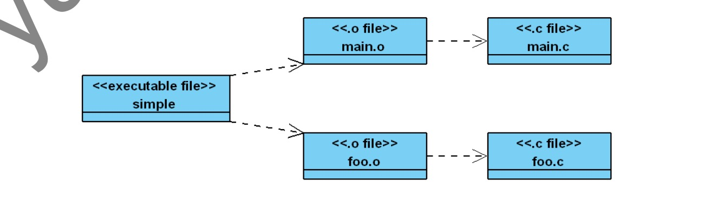

# 1. 规则

## 1.1基本规则

```makefile
all:
    echo "Hello World"
```

输出：

```makefile
make
echo "hello word";
hello word

make all
echo "hello word";
hello word

make test
make: *** No rule to make target 'test'.  Stop.

```

---

改动一下呢？

```makefile
all:
	echo "hello word";
test:
	echo "Just for test";
```

输出：
```makefile
make
echo "hello word";
hello word

make test
echo "Just for test";
Just for test
```

---

取消命令回显：

```makefile
all:
	@echo "hello word";
test:
	@echo "Just for test";
```

输出
```makefile
make
hello word
```

## 1.2 依赖关系

- 比较简单的依赖关系

```makefile
all:test
	@echo "hello word";
test:
	@echo "Just for test";

// 输出
Just for test
hello word
```

all 目标依赖 test 目标，这一依赖目标在 Makefile 中又被称之为先决条件。出现这种目标依赖关系时，make工具会按从左到右的先后顺序先构建规则中所依赖的每一个目标。如果希望构建 all 目标不，那么make 会在构建它之前得先构建 test 目标，这就是为什么我们称之为先决条件的原因

- 多目标问题

```makefile
all test:
	@echo "hello word"

// 输出
make
hello word
make test
hello word
```

还有就是一个规则中目标可以有多个，当存在多个目标，且这一规则是 Makefile 中的第一个规则时，如果我们运行 make 命令不带任何目标，那么规则中的第一个目标将被视为是缺省目标。

## 1.3 原理

demo例子如下：

```c
// main.c
extern void foo();

int main() {
    foo();
}

//foo.c
#include <stdio.h>

void foo() {
    printf("This is foo");
}
```

依赖图如下：


Makefile如下：

```makefile
all: main.o foo.o
	gcc -o simple main.o foo.o

main.o: main.c
	gcc -o main.o -c main.c

foo.o: foo.c
	gcc -o foo.o -c foo.c

clean:
	rm simple main.o foo.o
```

结果如下：
```c
make   // 一次make
gcc -o main.o -c main.c
gcc -o foo.o -c foo.c
gcc -o simple main.o foo.o
make  // 二次make
gcc -o simple main.o foo.o
```

1. 为什么二次make 不需要重新编译 main 和 foo？
    如果先决条件中相关的文件的时间戳大于目标的时间戳，即先决条件中的文件比目标更新，则知道有变化，那么需要运行规则当中的命令重新构建目标。

2. 为什么二次编译还需要重新编译simple？
    因为 Makefile 中的第一条规则中的目标是 all，而 all 文件在我们的编译过程中并不生成，即 make 在第二次编译时找不到，所以又重新编译了一遍。

改进如下：
```makefile
simple: main.o foo.o
	gcc -o simple main.o foo.o

main.o: main.c
	gcc -o main.o -c main.c

foo.o: foo.c
	gcc -o foo.o -c foo.c

clean:
	rm simple main.o foo.o

// 结果如下：
make: 'simple' is up to date
```


**如果只改变foo.c内容，再次make 编译， 则会发现make只编译修改后的内容，结果如下：**

```makefile
make
gcc -o foo.o -c foo.c
gcc -o simple main.o foo.o
```

## 1.4 假目标问题

```c
touch clean
make clean
make: 'clean' is up to date.
```

现在假设在程序所在的目录下面有一个 clean 文件，这个文件也可以通过 touch 命令来创建。创建以后，运行 make clean 命令，你会发现 make 总是提示 clean 文件是最新的，而不是按我们所期望的那样进行文件删除操作，且在当前目录找到了这个文件，加上 clean 目标没有任何先决条件，**所以，当我们要求 make 为我们构建 clean 目标时，它就会认为 clean 是最新的。**

解决方法如下：

```makefile
.PHONY:clean

simple: main.o foo.o
	gcc -o simple main.o foo.o

main.o: main.c
	gcc -o main.o -c main.c

foo.o: foo.c
	gcc -o foo.o -c foo.c

clean:
	rm simple main.o foo.o
```

采用.PHONY 关键字声明一个目标后，make 并不会将其当作一个文件来处理，而只是当作一个概念上的目标。对于假目标，我们可以想像的是由于并不与文件关联，所以每一次 make 这个假目标时，其所在的规则中的命令都会被执行。

## 1.5 变量

### 1.5.1 基本变量

```makefile
.PHONY: clean

CC = gcc
RM = rm 

EXE = simple
OBJS = main.o foo.o

$(EXE): $(OBJS)
	$(CC) -o $(EXE) $(OBJS)

main.o: main.c
	$(CC) -o main.o -c main.c

foo.o: foo.c
	$(CC) -o foo.o -c foo.c

clean:
	$(RM) $(EXE) $(OBJS)
```

### 1.5.2 自动变量

- `$@` 用于表示一个规则中的目标。当我们的一个规则中有多个目标时，`$@`所指的是其中任何造成命令被运行的目标。

- `$^`则表示的是规则中的所有先择条件。

- `$<`表示的是规则中的第一个先决条件。

注意点： **在 Makefile 中`‘$’`具有特殊的意思，因此，如果想采用 echo 输出`‘$’`，则必需用两个连着的`‘$’`。还有就是，`$@`对 于 Shell 也有特殊的意思，我们需要在`“$$@”`之前再加一个脱字符‘\’。**

demo:
```makefile
.PHONY: all

all: first second third
	@echo "\$$@ \ $@"
	@echo "\$$^ = $^"
	@echo "$$< = $<"

first second third:
```

结果：
```c
$@ \ all
$^ = first second third
$< = first
```

### 1.5.3 变量类型与赋值

- 普通赋值（=, 递归赋值）

```makefile
.PHONY: clean

x = foo
y = $(x)b
x = later

all: 
	@echo "x=$(y)"

// 输出
x=laterb
```

- 简单扩展变量（：=， 值赋值一次）

```makefile
.PHONY: clean

x = foo
y := $(x)b
x = later

all: 
	@echo "x=$(y)"

// 输出
x=foob
```

- 判断等（？=， 若存在，不赋值， 若不存在， 赋值）

```makefile
.PHONY: clean

x = foo
x ?= yep
y ?= yep

all: 
	@echo "x=$(x), y = $(y)"

// 输出
x=foo, y = yep
```

- 加等于(+=, 加等于)

```makefile
.PHONY: clean

x = foo
y = yep 
y += x

all: 
	@echo "y = $(y)"

// 输出
y = yep  x
```

### 1.5.4 变量值的来源

- 上下文获得， 如前文所说`$@`等。
- make 命令带上参数， 覆盖掉原文件中的参数
- 来源于shell环境

```makefile
.PHONY: clean

y = yep

all: 
	@echo "y = $(y)"

// 执行命令
make y=jay
// 运行结果
make y=jay
```

### 1.5.5 高级变量引用

替换后缀操作

```makefile
.PHONY: clean

foo = a.c b.c c.c
bar = $(foo:c=o)

all :
	@echo "bar = $(bar)"


// 输出
bar = a.o b.o c.o
```

### 1.5.6 override 指令

我们并不希望用户将我们在 Makefile 中定义的某个变量覆盖掉，那就得用 override 指令了
与1.5.4中第二点相反，带上override， 则make命令中带有的指令不生效。

```makefile
.PHONY: clean

override y = yep

all: 
	@echo "y = $(y)"

// 输入
make y=s
// 输出
y = yep
```

## 1.6 模式

```makefile
.PHONY: clean

CC = gcc
RM = rm 

EXE = simple
OBJS = main.o foo.o

$(EXE): $(OBJS)
	$(CC) -o $(EXE) $(OBJS)

%.o: %.c           //通配符
	$(CC) -o $@ -c $^

clean:
	$(RM) $(EXE) $(OBJS)
```

## 1.7 函数

### 1.7.1 addprefix 函数

addprefix 函数是用来在给字符串中的每个子串前加上一个前缀

```makefile
.PHONY: all

without_dir = foo.c bar.c main.c
with_dir := $(addprefix objs/, $(without_dir))

all:
	@echo $(with_dir);
```

输出：

```makefile
objs/foo.c objs/bar.c objs/main.c
```

### 1.7.2 filter函数

filter 函数用于从一个字符串中，根据模式得到满足模式的字符串

```makefile
.PHONY: all

sources = foo.c bar.c baz.s ugh.h
sources := $(filter %.c %.s , $(sources))

all:
	@echo "$(sources)"

// 输出
foo.c bar.c baz.s
```

### 1.7.3 filter-out 函数

filter-out 函数用于从一个字符串中根据模式滤除一部分字符串

```makefile
.PHONY: all

sources = main1.o main2.o ss.o main.o
sources := $(filter-out main%.o , $(sources))

all:
	@echo "$(sources)"

// 输出
ss.o
```

### 1.7.4 patsubst函数

patsubst 函数是用来进行字符串替换

```makefile
.PHONY: all

sources = main1.o main2.o ss.c main.c
sources := $(patsubst %.c, %.o, $(sources))

all:
	@echo "$(sources)"

// 输出
main1.o main2.o  ss.o  main.o
```

### 1.7.5 strip函数

strip 函数用于去除变量中的多余的空格

```makefile
.PHONY: all

sources = main1.o                main2.o ss.c main.c
ss := $(strip $(sources))

all:
	@echo "$(ss)"
	@echo "$(sources)"

// 输出
main1.o main2.o ss.c main.c
main1.o                main2.o ss.c main.c
```

### 1.7.6  wildcard 函数

获得当前目录下的文件名称

```makefile
.PHONY: all

sources = $(wildcard *.c)

all:
	@echo $(sources)

// 输出
foo.c main.c
```