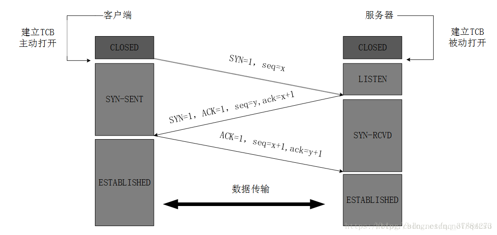
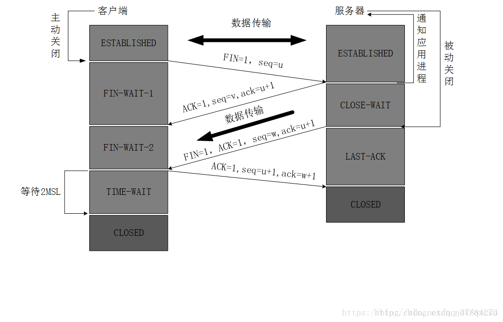

## 1. 概览

### socket 伪码

```c
// 服务端
socket_fd = socket(AF_INET, SOCK_STREAM, 0)

bind(socket_fd, IP, PORT)
listen(socket_fd, BACKLOG)
while (true) {
    client_fd = accept(socket_fd)
        while (true) {
        data = recv(client_fd)
        if (data == EOF) {
            close(client_fd)
            break
        }
        response = handle_data(data)
        send(client_fd, response)
    }
}
close(socket_fd)
```

```c
// 客户端
socket_fd = socket(AF_INET, SOCK_STREAM, 0)

connect(socket_fd, SERVER_IP, SERVER_PORT)

while (true) {
    data = read_from_user()          // 从用户输入
    send(socket_fd, data)            // 发送给服务端
    response = recv(socket_fd)       // 接收服务端响应
    print(response)
        if (data == "quit") {
        break
    }
}
close(socket_fd)
```

### 建链 & 断链 状态机




## 2. SS 命令

ss（socket statistics）用来显示当前系统中所有 socket（套接字） 的状态和详细信息。

支持 TCP、UDP、UNIX、RAW、SCTP 等类型。

ss 是查看内核中所有 socket 对象的工具；
TCP、UDP 都是 socket 的不同类型，它们在内核中共用同一个管理体系；
所以 ss 既能看 TCP，也能看 UDP——因为它们都在那张“socket 总表”里。

```c
-t	仅显示 TCP 连接（最常用）
-u	仅显示 UDP 连接
-l	仅显示正在监听的 socket（LISTEN 状态）
-n	不解析主机名和端口名，显示数字（加快速度）
-a	显示所有（包括监听和非监听）
-p	显示使用该 socket 的进程信息（需要 root）
-s	显示统计信息（每种协议的汇总）
-4 / -6	限制显示 IPv4 / IPv6 连接
-i	显示内部 TCP 信息（如拥塞控制算法、retrans 次数等）
-o	显示定时器信息（如 on(TIMEWAIT, 30sec)）
```

## 3. 脚本问题模拟

```python
#!/usr/bin/env python3
# server_loop.py
import socket, argparse, os, signal, sys

parser = argparse.ArgumentParser()
parser.add_argument('--host', default='127.0.0.1')
parser.add_argument('--port', type=int, default=5000)
args = parser.parse_args()

HOST, PORT = args.host, args.port

print(f"PID:{os.getpid()} server listening on {HOST}:{PORT}")

# graceful exit on Ctrl-C
def _sigint(n, f):
    print("\nServer exiting.")
    sys.exit(0)
signal.signal(signal.SIGINT, _sigint)

with socket.socket(socket.AF_INET, socket.SOCK_STREAM) as serv:
    serv.setsockopt(socket.SOL_SOCKET, socket.SO_REUSEADDR, 1)
    serv.bind((HOST, PORT))
    serv.listen(5)
    while True:
        conn, addr = serv.accept()
        print(f"Accepted connection from {addr}")
        try:
            # use file-like wrapper to read lines conveniently
            rf = conn.makefile('rb')
            wf = conn.makefile('wb')
            while True:
                line = rf.readline()
                if not line:  # client closed
                    print(f"Client {addr} closed connection")
                    break
                text = line.decode(errors='replace').rstrip('\n')
                print(f"Recv from {addr}: {text}")
                # simple echo-like response; you can change the response logic here
                resp = f"Server reply: {text}\n"
                wf.write(resp.encode())
                wf.flush()
        except Exception as e:
            print(f"Connection {addr} error: {e}")
        finally:
            try:
                rf.close()
                wf.close()
            except:
                pass
            conn.close()
            print(f"Connection {addr} closed, waiting next connection...")
```

```python
#!/usr/bin/env python3
# client_loop.py
import socket, argparse, os, sys, signal

parser = argparse.ArgumentParser()
parser.add_argument('--server', default='127.0.0.1')
parser.add_argument('--sport', type=int, default=5000, help='server port')
parser.add_argument('--cport', type=int, default=0, help='client/source port (0=auto)')
args = parser.parse_args()

SERVER_HOST = args.server
SERVER_PORT = args.sport
CLIENT_PORT = args.cport

print(f"PID:{os.getpid()} client connecting {SERVER_HOST}:{SERVER_PORT} from local port {CLIENT_PORT or 'auto'}")

def _sigint(n, f):
    print("\nClient exiting.")
    sys.exit(0)
signal.signal(signal.SIGINT, _sigint)

with socket.socket(socket.AF_INET, socket.SOCK_STREAM) as s:
    s.setsockopt(socket.SOL_SOCKET, socket.SO_REUSEADDR, 1)
    if CLIENT_PORT:
        s.bind(('0.0.0.0', CLIENT_PORT))   # 指定源端口
    try:
        s.connect((SERVER_HOST, SERVER_PORT))
    except Exception as e:
        print("Connect failed:", e)
        sys.exit(1)

    # file-like wrappers for convenient line I/O
    rf = s.makefile('rb')
    wf = s.makefile('wb')

    print("Connected. Type lines to send. Ctrl-C to quit.")
    try:
        while True:
            try:
                line = input()   # user types line (no trailing newline required)
            except EOFError:    # user pressed Ctrl-D
                print("EOF from stdin, closing.")
                break
            # send with newline
            wf.write((line + '\n').encode())
            wf.flush()
            # read server response line
            resp = rf.readline()
            if not resp:
                print("Server closed connection.")
                break
            print(resp.decode(errors='replace').rstrip('\n'))
    finally:
        try:
            rf.close(); wf.close()
        except:
            pass
        s.close()
```

## 4. 测试阶段一：服务端起进程（握手建连）

```shell
xm@hcss-ecs-4208:~/projects$ ss -tlnp
State    Recv-Q    Send-Q        Local Address:Port        Peer Address:Port  
LISTEN   0         5                 127.0.0.1:5000             0.0.0.0:*        users:(("python3",pid=3234,fd=3))   
```

⚙️ 在不同状态下的具体含义

| 状态 | Recv-Q | Send-Q |
|------|--------|--------|
| **LISTEN** | 已建立但未被 `accept()` 的连接数 | backlog（监听队列上限） |
| **ESTABLISHED** | 等待应用层读取的字节数 | 等待对方确认的已发送字节数 |
| **CLOSE-WAIT / FIN-WAIT 等** | 同上 | 同上 |

| 字段 | 名称 | 含义 |
|------|------|------|
| **Recv-Q** | 接收队列 | 已接收但尚未被应用程序读取的字节数（对于 `LISTEN` 状态，是等待 `accept()` 的连接个数） |
| **Send-Q** | 发送队列 | 已发送但尚未被对方确认的字节数（对于 `LISTEN` 状态，是 `backlog` 大小，即最多可排队等待 `accept()` 的连接数） |


### 💡 服务端监听状态下的连接队列详解

当服务端执行：
``` python
s.listen(backlog)
```

这会在内核中创建两个队列：

| 队列 | 内核名 | 作用 |
|------|---------|------|
| **半连接队列** | `SYN queue` | 存放收到 `SYN` 但尚未完成三次握手的连接（状态是 `SYN_RECV`） |
| **全连接队列** | `accept queue` | 存放已完成三次握手、等待 `accept()` 的连接（状态是 `ESTABLISHED`） |

---

### 🔹 `ss` 命令中的 `Recv-Q` 与 `Send-Q` 含义（LISTEN 状态）

当你执行：
```python
ss -lt
```

输出例如：
```shell
xm@hcss-ecs-4208:~/projects$ ss -tlnp
State    Recv-Q    Send-Q        Local Address:Port        Peer Address:Port  
LISTEN   0         5                 127.0.0.1:5000             0.0.0.0:*        users:(("python3",pid=3234,fd=3))   
```


| 字段 | 实际含义 |
|------|-----------|
| **Recv-Q = 0** | 当前 **全连接队列**（已握手完成但未被应用层 `accept()`）中的连接数量 |
| **Send-Q = 5** | `listen(backlog)` 调用中设置的最大队列容量（即允许多少个握手完成、还没被 `accept()` 的连接排队） |

---

### ✅ 举个示例

``` python
s.listen(5)
```

含义：
- 最多可以同时有 **5 个握手已完成但尚未被 accept() 的连接**；
- 如果有第 6 个连接到来，它将被丢弃或 TCP 拒绝（视系统实现而定）。

| 时刻 | 事件 | Recv-Q | Send-Q |
|------|------|--------|--------|
| 启动服务端，调用 `listen(5)` | 服务端进入 LISTEN 状态 | 0 | 5 |
| 客户端1 发起连接，握手完成 | 已建立 1 个连接，但还未 `accept()` | 1 | 5 |
| 客户端2~5 继续连上 | 队列排满 | 5 | 5 |
| 客户端6 再来 | 超过 backlog 上限，连接被拒绝 | 5 | 5 |
| 服务端调用一次 `accept()` | 拿出一个连接处理 | 4 | 5 |

---

### 🧠 对照总结

| 概念 | 含义 |
|------|------|
| **已建立但未被 accept 的连接数** | 当前全连接队列中等待应用层处理的连接数量（`Recv-Q`） |
| **backlog（监听队列上限）** | 全连接队列允许的最大长度（`Send-Q`） |

---

### 🧩 顺口记忆法

> - **Recv-Q**：我已经收到但还没处理的连接数  
> - **Send-Q**：我能同时撑住的最大等待连接数（上限）

---

### 哪个 API 开始内核建立监听连接

```shell
socket()        -> 创建 socket 对象，状态 CLOSED
bind()          -> 绑定本地地址和端口
listen(backlog) -> 告诉内核进入 LISTEN 状态，设置半连接队列和全连接队列
accept()        -> 从全连接队列取出已完成三次握手的连接
```

### 自测实现

测试方法：
服务端暂停在 `serv.listen(5)`,  对5000端口发起6次请求

```shell
xm@hcss-ecs-4208:~$ ss -tlnp|grep 5000
LISTEN   6         5                 127.0.0.1:5000             0.0.0.0:*        users:(("python3",pid=4359,fd=3))  
```

结论：
linux2.6 后的内核不会莫名其妙丢弃全连接队列内容， 即使超过限值

## 5. 插播： Netfilter & Iptables

### Netfilter 概览


#### 框架收发包链路

#####  1️⃣ 入站包（Incoming Packet）

包从 Internet → 本机：

1. **网卡接收**：包从网卡进入内核 RX 队列。  
2. **mangle PREROUTING**：第一个 hook，通常用于修改包（如 TOS、TTL）。  
3. **nat PREROUTING**：做目标 NAT（DNAT）等。  
4. **Routing Decision**：判断包是发给本机还是需要转发。  
   - 发给本机 → **走 INPUT 链**  
   - 转发到其他接口 → **走 FORWARD 链**  
5. **mangle INPUT**：对包做额外修改（例如标记）。  
6. **filter INPUT**：包过滤规则（iptables INPUT 链）生效。  
7. **local process**：包最终交给本地应用处理。  

**✅ 入站包路径总结：**  

```shell
Internet → PREROUTING (mangle → nat) → Routing → INPUT (mangle → filter) → local process
```

##### 2️⃣ 转发包（Forward Packet）

包从 Internet → LAN 或 LAN → Internet（目的地不是本机 IP）：

1. **Routing Decision**：判断包需要转发。  
2. **mangle FORWARD**：包转发前可做修改。  
3. **filter FORWARD**：包过滤（iptables FORWARD 链）。  
4. **mangle POSTROUTING**：出接口发送前可做修改。  
5. **nat POSTROUTING**：做源 NAT（SNAT）。  
6. **发送到 LAN**：包离开内核，发到目标网段。  

**✅ 转发包路径总结：**  

```shell
PREROUTING → Routing → FORWARD (mangle → filter) → POSTROUTING (mangle → nat) → LAN
```

##### 3️⃣ 出站包（Local Generated Packet）

本地应用自己发出的包：

1. **local process**：应用生成数据。  
2. **mangle OUTPUT**：可对包做标记/修改。  
3. **nat OUTPUT**：本地生成包的 NAT 处理（很少用）。  
4. **filter OUTPUT**：包过滤（iptables OUTPUT 链）。  
5. **mangle POSTROUTING**：修改出站包。  
6. **nat POSTROUTING**：源 NAT（SNAT）处理。  
7. **网卡发送**：包发到 LAN 或 Internet。  

**✅ 出站包路径总结：**  

```shell
local process → OUTPUT (mangle → nat → filter) → POSTROUTING (mangle → nat) → LAN/Internet
```

#### 各种链解析


##### 2️⃣ Routing Decision（路由决策）

- **作用**：决定包是发给本机，还是要转发出去  
- **图中对应**：黄色的 “Routing Decision”  
- **判断逻辑**：
  - 本机包 → 走 INPUT 链  
  - 转发包 → 走 FORWARD 链  

---

##### 3️⃣ INPUT 链

- **位置**：包发给本机  
- **作用**：做包过滤、修改（mangle/filter 表）  
- **图中对应**：右上角的 `mangle INPUT → filter INPUT → local process`  
- **场景**：本机只允许某些端口访问，比如允许 80/443，不允许其他端口  

---

##### 4️⃣ FORWARD 链

- **位置**：包不是发给本机，而是路由转发  
- **作用**：做过滤、修改（mangle/filter 表）  
- **图中对应**：中间的 `mangle FORWARD → filter FORWARD → POSTROUTING`  
- **场景**：服务器当路由器转发内网流量时，可控制哪些包能转发  

---

##### 5️⃣ OUTPUT 链

- **位置**：本机发出的包  
- **作用**：做包过滤、修改（mangle/filter/nat 表）  
- **图中对应**：右下角的 `mangle OUTPUT → nat OUTPUT → filter OUTPUT → POSTROUTING`  
- **场景**：本机访问外网或内网的包可以被过滤或改写  

---

##### 6️⃣ POSTROUTING 链

- **位置**：包即将离开网卡  
- **作用**：做 NAT、修改包  
- **图中对应**：最左下角 `mangle POSTROUTING → nat POSTROUTING → 发往 LAN`  
- **场景**：SNAT，把内网 IP 改成出口 IP  

### Iptables 概览

iptables 是 Linux 内核 Netfilter 框架的用户态工具，它的主要意义是 管理和控制各个链上的规则。

**你可以在各个链（PREROUTING、INPUT、FORWARD、OUTPUT、POSTROUTING）上添加规则。**


## 5. 测试阶段二： 客户端丢syn包 & 服务端丢ack 包 （握手建连）

### 模拟客户端丢syn 包

```shell
// 1. server监听5000端口
xm@hcss-ecs-4208:~/projects$ ss -tlnp |grep 5000
LISTEN   0         5                 127.0.0.1:5000             0.0.0.0:*        users:(("python3",pid=8184,fd=3))   

// 2. iptables 主动丢弃syn包
xm@hcss-ecs-4208:~$ sudo iptables -I OUTPUT 1 -o lo -p tcp --dport 5000 --tcp-flags SYN SYN -j DROP

// 3. 客户端发起请求
xm@hcss-ecs-4208:~$ nc 127.0.0.1 5000

// 4. 客户端syn包被丢 
xm@hcss-ecs-4208:~/projects$ ss -tanp | grep 5000
LISTEN     0        5               127.0.0.1:5000              0.0.0.0:*        users:(("python3",pid=8184,fd=3))                                              
SYN-SENT   0        1               127.0.0.1:42640           127.0.0.1:5000     users:(("nc",pid=8246,fd=3))              
```

**解释如下**：
1. LISTEN：服务端确实在监听，Recv-Q=0 表示全连接队列当前为空（没有已完成三次握手等待 accept()）。

2. SYN-SENT：客户端端口 42640 在向 5000 发起连接并处于 SYN-SENT（等待 SYN+ACK / 在重传）——这说明客户端已发出 SYN，但尚未收到服务端的 SYN+ACK（或客户端的 SYN 被丢了，或 SYN+ACK 被丢了/未被内核看到）。

3. 这与“客户端丢 SYN（OUTPUT 丢包）”场景一致：客户端持续处于 SYN-SENT，服务端未进入 ESTABLISHED，也未把连接放入 full-accept 队列（Recv-Q）。

### 模拟服务端丢ack包

略 ， 与上类似

## 6. 测试阶段三： 模拟应用层丢报文（握手建连）

### 概览

| 序号 | 阶段 | 核心问题 | 排查方法 |
|------|------|-----------|-----------|
| 1 | 客户端是否成功发出请求 | Python `http.client.request()` 是否把请求放入 TCP 内核发送缓冲 | 打日志 send() 返回值 + `ss -tni | grep <client_port>` |
| 2 | 服务端是否成功接收请求 | nginx TCP 栈是否收到了报文（Recv-Q） | `ss -tni | grep 5000` + `strace -p <nginx_worker_pid> -e read` |
| 3 | 服务端是否成功响应请求 | nginx worker 是否把响应写入 TCP 内核发送缓冲 | `strace -p <nginx_worker_pid> -e write` + `ss -tni | grep 5000` |
| 4 | 客户端是否成功接收响应 | 客户端 TCP 栈是否收到了响应并交给应用层 | `ss -tni | grep <client_port>` + recv() 返回值或日志 |


### 1. 模拟客户端是否成功发出请求

#### 两个角度来说明问题

1️⃣ **send API 调用成功**

- **关注点**：Python `http.client.request()` 或底层 `socket.send()` 调用是否成功
- **判断标准**：
  - `send()` 返回值 > 0 → 数据已写入 **内核发送缓冲区**
  - `send()` 阻塞或报错 → 应用层发送失败，报文未进入内核
- ✅ **说明**：此步只确认客户端应用层已提交报文给内核，不保证对端已收到。

2️⃣ **发送队列（Send-Q）状态**

- **关注点**：客户端 TCP 内核发送队列是否有残留数据
- **判断标准**：
  - `ss -tni | grep <client_port>`
    - Send-Q = 0 → 内核发送缓冲已清空，报文已成功发送到网络/对端 TCP 栈
    - Send-Q > 0 → 内核缓冲区仍有报文未被确认，可能是对端未 ACK 或网络拥塞
- ✅ **说明**：此步确认内核是否成功发送报文并被对端 TCP 接收。

#### 模拟

略

### 2. 服务端是否成功接收请求

作为快速判断和排查，只看服务端的 Recv-Q 就够了：

Recv-Q > 0 → 报文已经到达 TCP 栈，但还没被应用读取

Recv-Q = 0 → 报文已经被应用层读取（或还没到达，但正常情况下有客户端发送就会到达）

### 3. 服务端是否成功发送请求

#### 1. socket send() 返回无异常

- 表示应用层把数据成功写入到内核的发送缓冲区；

- 内核负责后续通过协议栈（TCP/IP）发送；

- 如果发送缓冲区满了（对端未读/网络拥塞），send() 可能阻塞或返回 EAGAIN（非阻塞模式下）。

📌 举例：
```c
ret = send(sock, data, len, 0)
if ret == len:
    print("应用层成功写入发送缓冲区")
```

    这时数据可能还没发到网卡上，只是交给了内核。

#### 2. 内核发送队列（send-q）是否为空

可以通过 ss -nt 或 netstat -nt 查看：

```shell
State  Recv-Q Send-Q Local Address:Port Peer Address:Port
ESTAB  0      0      10.0.0.1:80      10.0.0.2:51234
```

- Send-Q：内核中等待发送的数据字节数。

- 若 Send-Q=0 → 所有数据都已发送完毕（内核发出并对方 ACK）。

- 若 Send-Q>0 → 内核仍有数据未发送（可能网络阻塞或对端未 ACK）。


## 7. 测试阶段四： 模拟断联异常概览 （挥手断联）

    几种常见的异常方式

### 🧩 一、Aborted —— 应用层或系统**主动放弃连接**

> “我不想玩了，还没到正常关闭阶段，我自己终止了。”

| 项目 | 说明 |
|------|------|
| **触发时机** | 连接尚未正常完成（可能仍在请求或响应中） |
| **触发方** | 一般是测试仪表主动 `abort()` 或 DUT（如防火墙）主动丢弃会话 |
| **TCP 表现** | 可能没有 FIN/RST，仪表直接丢弃连接上下文 |
| **常见场景** | - 客户端超时未等到响应 → 超时中止连接<br>- 测试提前结束（强制停止）<br>- 防火墙策略中途删除连接项 |
| **抓包现象** | 没有完整的四次挥手，有时连 RST 都没有（直接“无声退出”） |

🧠 **理解方式**：相当于“用户主动取消操作”。

---

### 🧩 二、Closed with error —— 握手或挥手阶段**异常**

> “我想正常结束，但在 FIN/ACK 阶段出错了。”

| 项目 | 说明 |
|------|------|
| **触发时机** | 已进入关闭阶段（已发送 FIN），但收不到对方的正确响应 |
| **TCP 表现** | FIN → （无 ACK） → 超时重传后放弃 |
| **常见场景** | - 对端未响应 FIN<br>- 对端 TCP 栈阻塞（Recv-Q 满）<br>- 对端断电或进程崩溃，未能完成挥手 |
| **抓包现象** | 客户端发出 FIN 后，对端无响应或仅回 ACK 无 FIN，最终客户端超时关闭连接 |
| **表现结果** | 测试仪表报告 “Closed with error” |

🧠 **理解方式**：像你说“再见”后，对方没理你，最后你自己走了。

---

### 🧩 三、Closed with reset —— 连接被**强制终止（RST）**

> “对方直接掀桌子，不讲武德。”

| 项目 | 说明 |
|------|------|
| **触发时机** | 任意阶段（握手、传输或关闭过程中） |
| **触发方** | 任意一方（客户端或服务端） |
| **TCP 表现** | 报文中出现 RST 标志位，连接立即终止 |
| **常见场景** | - 服务端端口未监听 → SYN → RST<br>- 防火墙或 NAT 表项过期后 RST<br>- 进程崩溃导致内核发送 RST<br>- 应用调用 `setsockopt(SO_LINGER,0)` 后关闭 |
| **抓包现象** | TCP 流中出现 RST 报文，连接被立刻中断 |
| **表现结果** | 测试仪表统计为 “Closed with reset” |

🧠 **理解方式**：你还在说话，对方直接摔电话挂断。
