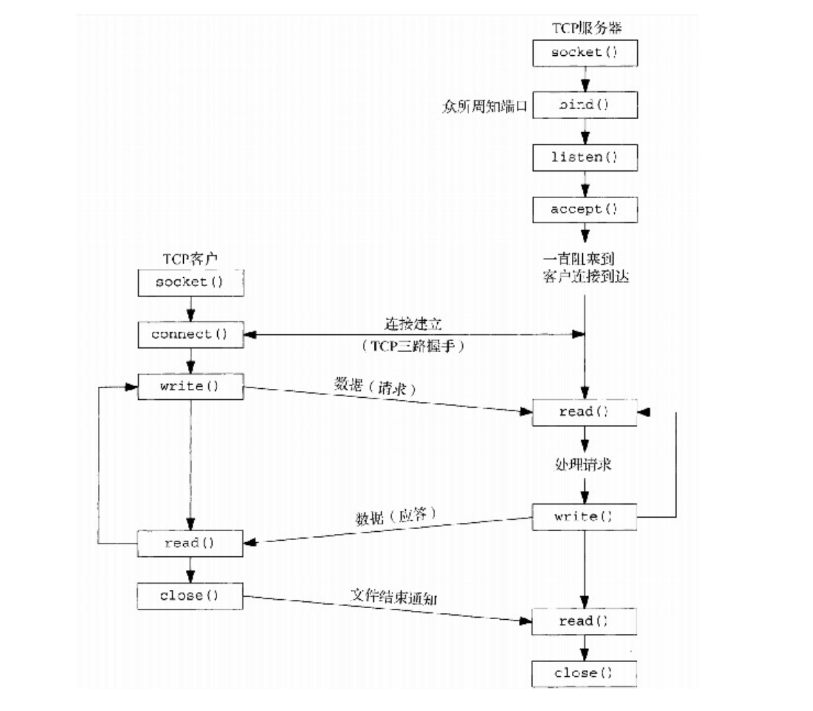

## 4.1 概述



## 4.2 socket

```c
int socket(int domain, int type, int protocol);
```

| 参数 | 类型 | 含义 | 常用值 / 说明 |
|------|------|------|----------------|
| domain | int | 指定通信域（协议族） | - `AF_INET`：IPv4<br>- `AF_INET6`：IPv6<br>- `AF_UNIX` / `AF_LOCAL`：本地进程间通信<br>- 其他：`AF_PACKET`（原始以太网帧） |
| type | int | 套接字类型，决定数据传输方式 | - `SOCK_STREAM`：面向连接，TCP<br>- `SOCK_DGRAM`：无连接，UDP<br>- `SOCK_RAW`：原始套接字，可自定义协议<br>- `SOCK_SEQPACKET`：面向连接，按顺序发送固定大小数据包 |
| protocol | int | 协议编号（可选，通常为 0） | - 0：内核自动选择与 `domain` + `type` 匹配的协议<br>- TCP 协议号：`IPPROTO_TCP`<br>- UDP 协议号：`IPPROTO_UDP`<br>- RAW 套接字可指定其他协议号 |

#### socket() 重点 & 注意事项

1. **socket() 仅创建套接字，不建立连接**  
   - 它只是内核为套接字分配结构和缓冲区，并返回文件描述符  
   - TCP 客户端：还需 `connect()`  
   - TCP 服务器：需 `bind()` + `listen()` + `accept()`  

2. **domain / type / protocol 参数组合要正确**  
   - `domain` 决定协议族：`AF_INET`、`AF_INET6`、`AF_UNIX` 等  
   - `type` 决定数据传输方式：`SOCK_STREAM`、`SOCK_DGRAM`、`SOCK_RAW`  
   - `protocol` 一般设为 0，特殊情况才手动指定  

3. **返回值与错误处理**  
   - 成功：非负文件描述符  
   - 失败：-1，并设置 `errno`  
   - 常见错误：`EMFILE` / `ENFILE`（文件描述符不足）、`EINVAL`（非法参数）、`EACCES`（权限不足）  

4. **套接字 = 特殊文件描述符**  
   - 可用于 `read()` / `write()` / `close()`  
   - TCP 半关闭、EOF、`shutdown()` 与普通文件不同  （这个后续专门花章节整体描述， nup 中没有对eof & 半关闭等内容描述）
   - 注意区分：`close()` 释放套接字 vs `shutdown()` 半关闭通信方向

## 4.3 connect

```c
#include <sys/types.h>
#include <sys/socket.h>

extern int connect(int sockfd, const struct sockaddr *addr, socklen_t addrlen);
```

##### 1. 客户在调用函数connect 前不必非得调用bind 函数，因为如果需要的话，内核会确定源IP地址，并选择一个临时端口作为源端口。
##### 2. 如果是TCP套接字，**调用connect 函数将激发TCP的三路握手过程**，而且仅在连接建立成功或出错时才返回，其中出错返回可能有以下几种情况。
- **connect() 阻塞行为**  
  - 默认阻塞套接字：只有在连接建立成功或出错时才返回  
  - 非阻塞套接字：可能立即返回 -1，errno = EINPROGRESS，后续需通过 `select()` 或 `poll()` 检测完成
  - 如果网络不可达或对方不回应，阻塞套接字的 connect() 可能阻塞很长时间

- **连接出错的常见情况**  
  | 错误 | 含义 |
  |------|------|
  | `ECONNREFUSED` | 目标端口没有服务监听 |
  | `ETIMEDOUT` | 连接超时（服务器无响应） |
  | `EHOSTUNREACH` | 目标主机不可达 |
  | `ENETUNREACH` | 网络不可达 |
  | `EADDRINUSE` | 本地端口已被占用（仅在客户端 bind 指定端口时可能出现） |

```c
if (connect(sockfd, (struct sockaddr*)&srv, sizeof(srv)) < 0) {
    printf("errno = %d\n", errno); // 打印错误码
    close(sockfd);
    return -1;
}

// 1. 目标端口未监听
connect failed: Connection refused
errno = 111  # 对应 ECONNREFUSED

// 2. 网络不可达
connect failed: Network is unreachable
errno = 101  # 对应 ENETUNREACH

// 3. 连接超时
connect failed: Operation timed out
errno = 110  # 对应 ETIMEDOUT
```
##### 3. 非阻塞套接字

    流程简述  后续 epoll 中展开说明

```c
socket() -> 设置 O_NONBLOCK -> connect()

如果 connect() 返回 -1 且 errno == EINPROGRESS:
    // 三次握手正在后台进行
    使用 select()/poll()/epoll 监听套接字可写事件
    套接字可写 -> 握手完成或连接失败
    使用 getsockopt(..., SO_ERROR, ...) 获取连接状态
```

##### 4. connect 函数导致当前套接字从CLOSED状态（该套接字自从由socket 函数创建以来一直所处的状态）转移到SYN_SENT状态，若成功则再转移到ESTABLISHED状态。若connect 失败则该套接字不再可用，必须关闭，我们不能对这样的套接字再次调用connect 函数。在每次connect 失败后，都必须close 当前的套接字描述符并重新调用socket 。

## 4.4 bind 函数

    把一个本地协议地址（IP + 端口）绑定到一个套接字上。

```c
int bind(int sockfd, const struct sockaddr *addr, socklen_t addrlen);
```


### 1. 服务端绑定 IP 的三种模式

#### 1.1 绑定指定 IP
```c
sin.sin_addr.s_addr = inet_addr("192.168.1.10");
```
- **仅接受发往该 IP 的连接**  
- **常用于多网卡机器，限制监听范围**

---

#### 1.2 绑定 INADDR_ANY（0.0.0.0）
```c
sin.sin_addr.s_addr = htonl(INADDR_ANY);
```
- **同时监听本机所有网卡的该端口**
- **最常用服务器写法**

---

#### 1.3 不调用 bind（客户端常用）
- 内核在 connect()/sendto() 时自动选择本地 IP + 临时端口  
- **适合客户端，不适合服务端**

---

### 2. bind 常见失败错误

| 错误码 | 含义 | 常见原因 |
|--------|-------|-------------|
| **EADDRINUSE** | 地址已被占用 | 端口被占用；端口处于 TIME_WAIT |
| **EADDRNOTAVAIL** | IP 不存在 | 绑定未配置/已禁用的本地 IP |
| **EACCES** | 权限不足 | 绑定 1–1023 端口需要 root |
| **EINVAL** | 地址无效 | socket 已 bind；addrlen 不对 |
| **EBADF** | 非法 fd | fd 未打开或不是 socket |

---

### 3. TIME_WAIT 导致 bind 失败（核心）

#### 3.1 TIME_WAIT 触发时机
- **主动关闭**连接的一方进入 TIME_WAIT  
- 可能是服务端，也可能是客户端

---

#### 3.2 TIME_WAIT 对 bind 的影响
旧连接仍占用四元组：

```
{本地 IP, 本地端口, 对端 IP, 对端端口}
```

当新 socket 试图 bind 同端口 → 可能报：

```
EADDRINUSE
```

---

#### 3.3 解决方式（Linux）

##### 开启端口复用
```c
int opt = 1;
setsockopt(fd, SOL_SOCKET, SO_REUSEADDR, &opt, sizeof(opt));
```
- 允许在 TIME_WAIT 上重用端口  
- **服务器必须使用**

##### 3.3.2 多进程监听同端口（不常用）
```c
setsockopt(fd, SOL_SOCKET, SO_REUSEPORT, &opt, sizeof(opt));
```

### 4. 套接字选项（简要， 后续详解）

| 套接字选项          | 内核状态位      | 内核含义 |
|-------------------|---------------|-----------|
| SO_REUSEADDR       | addrreuse     | 允许套接字绑定到 TIME_WAIT 状态的端口；常用于服务端重启时快速复用端口 |
| SO_REUSEPORT       | portreuse     | 允许同一个端口被多个进程 / 套接字同时绑定；内核会负载均衡分发 TCP 连接 |
| 无选项（默认）     | occupied / bind_in_use | 普通端口绑定，其他进程 bind 同端口会失败（EADDRINUSE） |


## 4.5 listen 函数

    listen 并不启动任何线程，也不创建连接，只是设置内核状态。

### 1. listen 函数概述

```c
int listen(int sockfd, int backlog);
```

- sockfd：已创建并 bind 过的套接字。
- backlog：指定已完成队列的最大长度（部分系统也影响未完成队列长度）。

功能：

- 将套接字从 CLOSED / BIND 状态转入 LISTEN 状态。
- 内核在该套接字上维护两个队列，用于管理客户端连接。

### 2. 未完成连接队列（Incomplete / SYN Queue）

也称半连接队列。

- 存放 TCP 三次握手未完成的连接，即客户端发送了 SYN，服务器还未完成三次握手。
- 队列长度可受内核参数限制（如 Linux 的 /proc/sys/net/ipv4/tcp_max_syn_backlog）。
- 如果队列满了：
  - 新到来的 SYN 会被丢弃或重传。
  - 客户端可能收到 SYN-ACK 超时，导致重试或连接失败。
- 队列满是 SYN 洪泛攻击的容易目标（SYN Flood）。

### 3. 已完成连接队列（Completed / Accept Queue）

也称全连接队列。

- 存放三次握手完成的连接，等待应用程序通过 accept() 获取。
- 队列长度由 listen(sockfd, backlog) 的 backlog 参数控制。
- 队列满时，三次握手完成的连接仍可成功，但不能立即被 accept，客户端连接可能被延迟。
- accept() 从此队列中取出连接，应用程序处理。
- accept 后，已完成队列减一。

### 4. 注意事项

- Linux 2.6 及以后，backlog 参数的意义已经不如以前重要，内核可能会自动调整队列长度。
- 了解内核 SYN 队列和完成队列的区别，有助于调优高并发服务器。

## 4.6 accept 函数

    accept 函数由TCP服务器调用，用于从已完成连接队列队头返回下一个已完成连接 (established)。如果已完成连接队列为空，那么进程被投入睡眠（假定套接字为默认的阻塞方式）。

如果accept 成功，那么其返回值是由内核自动生成的一个全新描述符，代表与所返回客户的TCP连接。在讨论accept 函数时，我们称它的第一个参数为监听套接字 （listening socket）描述符（由socket 创建，随后用作bind 和listen 的第一个参数的描述符），称它的返回值为已连接套接字 （connected socket）描述符。区分这两个套接字非常重要。一个服务器通常仅仅创建一个监听套接字，它在该服务器的生命期内一直存在。内核为每个由服务器进程接受的客户连接创建一个已连接套接字（也就是说对于它的TCP三路握手过程已经完成）。当服务器完成对某个给定客户的服务时，相应的已连接套接字就被关闭。

```c
//sockfd：监听套接字。
//addr：用于返回 客户端地址信息（IP + 端口）。
//addrlen：传入时告诉内核 addr 缓冲区大小，返回时设置为 实际写入的地址长度。

int accept(int sockfd, struct sockaddr *addr, socklen_t *addrlen);
```

#### addrlen 为： 值-结果 变量

    用户传入的是 缓冲区大小，告诉内核：“这个 addr 我给你留了这么多空间，你写入时不要超过它。”

```c
struct sockaddr_storage cliaddr;
socklen_t len = sizeof(cliaddr);  // 大于任何可能的 sockaddr_in 或 sockaddr_in6
accept(listenfd, (struct sockaddr*)&cliaddr, &len);
```

- 这里的 sizeof(cliaddr) 比 IPv4/IPv6 实际地址结构都大，保证内核写入不会越界。
- 传入一定大于传出

#### 阻塞与非阻塞

- 阻塞套接字：
    - 队列为空时，accept() 阻塞直到有连接到来

- 非阻塞套接字：
    - 队列为空时立即返回 EAGAIN 或 EWOULDBLOCK

- 对高并发服务器非常关键，要结合 select/poll/epoll 使用

## 4.7 fork 和exec 函数

(1) 一个进程创建一个自身的副本，这样每个副本都可以在另一个副本执行其他任务的同时处理各自的某个操作。这是网络服务器的典型用法。我们将在本书后面看到许多这样的例子。

(2) 一个进程想要执行另一个程序。既然创建新进程的唯一办法是调用fork ，该进程于是首先调用fork 创建一个自身的副本，然后其中一个副本（通常为子进程）调用exec （接下去介绍）把自身替换成新的程序。这是诸如shell之类程序的典型用法。

### fork

1. **文件描述符继承**  
   - 子进程继承父进程打开的 socket 文件描述符  
   - 在服务器中很重要：可以直接操作监听或已连接套接字
2. **写时复制（COW）**  
   - 内核延迟实际内存拷贝，降低开销
3. **fork 在服务器中的应用**  
   - 并发处理客户端连接  
   - 避免父进程阻塞监听 socket


### exec

```c
int execl(const char *path, const char *arg0, ..., (char *)0);
int execv(const char *path, char *const argv[]);
int execle(const char *path, const char *arg0, ..., (char *)0, char *const envp[]);
int execve(const char *path, char *const argv[], char *const envp[]);
```

功能：
- 替换当前进程映像（代码、数据、堆、栈被新程序覆盖）
- PID 保持不变
- 文件描述符默认继承
- 成功执行后不会返回，失败返回 -1

重点概念：
1. **替换映像**：原进程内容完全被新程序替换
2. **PID 不变**：子进程调用 exec 后 PID 与 fork 时相同
3. **文件描述符继承**：默认继承，可用 `FD_CLOEXEC` 控制
4. **常见用途**：
   - 子进程执行新程序（如 CGI）
   - 与 fork 结合形成 UNIX 并发/多任务模型核心


## 4.8 并发服务器

现代高性能服务器：几乎不会用“每连接 fork 一个子进程”，更常用 线程池 / 进程池 / 事件驱动。
仅作为教学示例，帮助理解并发基础、父子进程关系、文件描述符继承和阻塞模型。

```c
# 1. 初始化
listenfd = socket(...)
bind(listenfd, server_address)
listen(listenfd, LISTENQ)

# 2. 进入主循环，接受客户端连接
while True:
    connfd, cliaddr = accept(listenfd)
    
    # 3. 创建子进程处理客户端
    pid = fork()
    if pid == 0:
        # 子进程
        close(listenfd)           # 子进程不需要监听套接字
        str_echo(connfd)          # 处理客户端请求
        close(connfd)
        exit(0)
    else:
        # 父进程
        close(connfd)             # 父进程不需要已连接套接字
        # 可选：waitpid(-1, &status, WNOHANG) 清理僵尸进程
```

我们在2.6节说过，对一个TCP套接字调用close 会导致发送一个FIN，随后是正常的TCP连接终止序列。为什么图4-13中父进程对connfd 调用close 没有终止它与客户的连接呢？为了便于理解，我们必须知道每个文件或套接字都有一个引用计数。引用计数在文件表项中维护（APUE第58～59页），它是当前打开着的引用该文件或套接字的描述符的个数。图4-13中，socket 返回后与listenfd 关联的文件表项的引用计数值为1。accept 返回后与connfd 关联的文件表项的引用计数值也为1。然而fork 返回后，这两个描述符就在父进程与子进程间共享（也就是被复制），因此与这两个套接字相关联的文件表项各自的访问计数值均为2。这么一来，当父进程关闭connfd 时，它只是把相应的引用计数值从2减为1。该套接字真正的清理和资源释放要等到其引用计数值到达0时才发生。这会在稍后子进程也关闭connfd 时发生。

## 4.9 close 函数

```c
#include <unistd.h>
int close(int sockfd

);
　　　　　　　　　　　　　　　　　　　　　　　　　　　　返回：若成功则为0，若出错则为-1
```

### 1 close() 的默认行为
- 对 TCP 套接字调用 `close()` 时：
  1. 套接字被标记为已关闭
  2. 调用立即返回到调用进程
  3. 套接字描述符不能再使用（不能作为 `read` 或 `write` 参数）
- TCP 层会尝试发送 **已排队等待发送的数据**
- 发送完毕后，开始 **正常 TCP 连接终止序列**（四次挥手）
- 注意：
  - 默认行为不保证对端应用程序已收到所有数据
  - 可通过 `SO_LINGER` 选项改变该行为（7.5 节）

---

### 2 描述符引用计数（Reference Count）
- **fork-per-connection 并发服务器中**：
  - 父子进程共享同一个已连接套接字（`accept` 返回的 `connfd`）
  - `fork` 后，文件表项引用计数增加
  - 父进程调用 `close(connfd)`：
    - 仅把引用计数减 1
    - **不会触发 TCP FIN**
  - 子进程关闭套接字：
    - 引用计数减为 0，触发 TCP 正常终止序列
- 这是所期望的行为：
  - 父进程关闭连接而不干扰子进程通信

---

### 3 如果确实想发送 FIN
- 可使用 `shutdown()` 函数（6.6 节）：
  - 可以单向关闭连接（发送 FIN 或停止接收）
  - 用于更精细控制 TCP 连接终止时机

---

### 4 如果父进程不关闭已连接套接字
- 问题：
  1. 父进程会耗尽可用文件描述符（每个进程可打开的 fd 数量有限）
  2. 子进程关闭 connfd 后，引用计数仍为 1（父进程持有）
     - TCP 连接不会终止
     - 客户端连接一直保持打开状态
- 结论：
  - 并发服务器中父进程 **必须关闭不需要的已连接套接字**，以确保：
    - TCP 连接能正常关闭
    - 系统资源不会耗尽

---

### 5 总结
- **close()**：
  - 影响描述符引用计数
  - 只有引用计数为 0 时才触发 TCP FIN
- **fork-per-connection 并发服务器**：
  - 父进程关闭 connfd，子进程使用不受影响
  - 必须关闭父进程的 connfd 否则会导致资源泄露和连接永远打开
- **shutdown()** 可用于精确控制连接终止和 FIN 发送

## 4.10 getsockname 和getpeername 函数

    唯一的关键点可能就是 addrlen 是 值-参数 传递

```c
int getsockname(int sockfd, struct sockaddr *addr, socklen_t *addrlen);
int getpeername(int sockfd, struct sockaddr *addr, socklen_t *addrlen);
```


