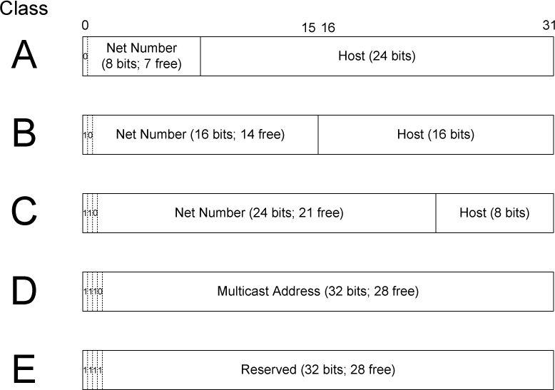
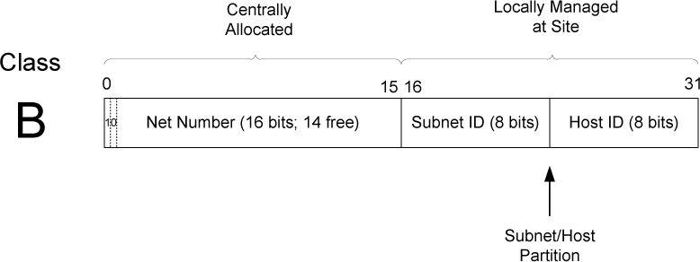
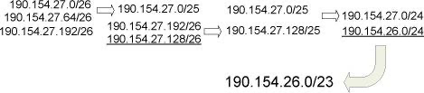

# 2.2. Expressing IP Addresses

1. **IPv6 blocks may omit leading zeros, and one run of zero blocks may be compressed with `::`.**  
   Example: `2001:0db8::2`, `::1`

2. **IPv4-mapped IPv6 addresses embed IPv4 using `::ffff:a.b.c.d`.**  
   Example: `::ffff:10.0.0.1`

3. **IPv4-compatible IPv6 addresses encode the low 32 bits in dotted-quad form (no special semantics).**  
   Example: `::1.2.240.1`

4. **IPv4-compatible addresses were only for early IPv6 transition and are now deprecated (RFC 4291).**  
   Example: `::0102:f001` (same as `::1.2.240.1`)

5. **Leading zeros in each 16-bit block must be suppressed.**  
   Example: `2001:0db8::0022` → `2001:db8::22`

6. **Use `::` for the longest run of consecutive zero blocks (only once); if tied, compress the first.**  
   Example: `2001:0:0:1:0:0:0:5` → `2001::1:0:0:0:5`

7. **Hex digits a–f must be lowercase.**  
   Example: `2001:DB8::1` → `2001:db8::1`

# 2.3. Basic IP Address Structure

| Type      | Delivery Scope                | IPv4 | IPv6 |
|-----------|-------------------------------|------|------|
| Unicast   | Single destination host       | ✔    | ✔    |
| Broadcast | All hosts on the local subnet | ✔    | ✘    |
| Multicast | All subscribed group members  | ✔    | ✔    |
| Anycast   | Nearest host in a group       | ⚠️    | ✔    |

| 阶段                  | 是否有子网 | mask 是否固定 | mask 是否显式 | 路由模型                       |
| ------------------- | ----- | --------- | --------- | -------------------------- |
| Classful Addressing | ❌     | N/A       | ❌         | 按 A/B/C                    |
| Subnet Addressing   | ✅     | ✅         | ✅         | 站点内部按 subnet 路由            |
| Subnet Masks        | 工具    | —         | —         | 本地配置（不参与 Internet 路由）      |
| VLSM                | ✅     | ❌         | ✅         | 无类路由（Longest Prefix Match） |

## 2.3.1. Classful Addressing

**Table 2-3. The original (“classful”) IPv4 address space partitioning**

| Class | Leading Bits | Network Bits | Host Bits | Address Range               | Typical Use |
|-------|--------------|--------------|-----------|-----------------------------|-------------|
| A     | 0            | 8            | 24        | 1.0.0.0 – 126.255.255.255   | Very large networks |
| B     | 10           | 16           | 16        | 128.0.0.0 – 191.255.255.255 | Medium networks |
| C     | 110          | 24           | 8         | 192.0.0.0 – 223.255.255.255 | Small networks |
| D     | 1110         | —            | —         | 224.0.0.0 – 239.255.255.255 | Multicast |
| E     | 1111         | —            | —         | 240.0.0.0 – 255.255.255.255 | Experimental |

1. The first address in an IPv4 address range is reserved as the **network address**, which identifies the network itself, while the last address is reserved as the **broadcast address**, used to send packets to all hosts on that network.

2. Classful addressing does not support subnet masks in routing decisions.

3. Classful addressing is no longer used in modern networks.It has been replaced by Classless Inter-Domain Routing (CIDR), which allows networks to use arbitrary prefix lengths instead of fixed Class A, B, or C boundaries.

## 2.3.2. Subnet Addressing

### 1. Addressing in the Classful Addressing Era

In the classful addressing era, an IP address was divided strictly into a **network number** and a **host number** based on address classes (A, B, C). All hosts that shared the same network number were assumed by the IP layer to reside on the **same physical network**. As a result, communication between such hosts was treated as local delivery: packets were sent directly at the link layer (for example, using ARP on Ethernet) without involving a router. Routers were only used to forward packets between **different network numbers**, and therefore the network number also defined the boundary of IP routing.

---

### 2. Why Subnet Addressing Was Introduced

This classful model created a limitation: a single network number could correspond to only one physical network. Organizations with multiple physical networks were forced either to request multiple network numbers or to bridge all networks into a single broadcast domain, both of which were inefficient and unscalable. Subnet addressing was introduced to remove this restriction by allowing a single network number to be internally divided into multiple subnetworks. This decoupled Internet routing from internal network topology: externally, the organization still appeared as one network, while internally, routing could be performed between multiple physical networks.

---

### 3. Subnet ID Size and Consistency

    在 classful addressing 时代，子网掩码仅在站点（局域网/组织内部）使用；分组离开站点后，外部路由器根据地址类别（A/B/C）隐式确定网络号并进行路由，而不使用子网掩码。
    在 classful + subnet 的时代，子网掩码和子网编址一样，都是由系统管理员在站点内部配置并统一约定的。

The size of the subnet ID is an administrative choice rather than a protocol requirement; however, once defined, it must be applied consistently across all hosts and routers within the network.

## 2.3.3. Subnet Masks

1. Masks are used by routers and hosts to determine where the network/subnetwork portion of an IP address ends and the host part begins.

2. Note again that the rest of the Internet routing system does not require knowledge of the subnet mask because routers outside the site make routing decisions based only on the network number portion of an address and not the combined network/subnetwork or host portions. Consequently, subnet masks are purely a local matter at the site.

**Explanation.**
Subnet masks are required only within a site to interpret an IP address beyond the classful network boundary. Hosts use the mask to decide whether a destination is local or must be forwarded to a router, and internal routers use it to distinguish among different subnets of the same network number. Outside the site, however, routing is performed solely on the classful network number, whose length is implicitly defined by the address class (A, B, or C). Therefore, subnet masks do not affect external routing and remain a purely local configuration issue.

## 2.3.4. Variable-Length Subnet Masks (VLSM)

### 1. VLSM and CIDR: Scope and Purpose

**VLSM (Variable-Length Subnet Masks)** is a mechanism for **subnetting within a site**.
It allows different subnets of the same assigned network to use **different prefix lengths**, so that subnet sizes can be matched to actual host requirements.
VLSM improves internal address utilization and affects only the site’s **internal routing**; externally, the site typically still appears as a single aggregated prefix.

**CIDR (Classless Inter-Domain Routing)** applies the same classless addressing principle to the **entire Internet routing system**.
It removes the constraints of classful addressing and enables **route aggregation (supernetting)**, allowing multiple contiguous networks to be represented by a single prefix.
CIDR reduces global routing table size and supports scalable Internet routing.

---

### 2. Longest Prefix Match

In classless routing, routers forward packets using **longest prefix match**.
For a given destination IP address, the router selects the routing table entry whose prefix matches the destination with the **greatest number of leading bits**.
This rule ensures that more specific routes take precedence over less specific ones and is essential for the correct operation of both **VLSM** and **CIDR**.

## 2.3.5. Broadcast Addresses

**255.255.255.255 (Limited Broadcast)**  
255.255.255.255 is the IPv4 limited broadcast address, meaning “send to all hosts on the local link.” It is typically used when a host does not yet know its own IP address or subnet information, such as during system startup for DHCP discovery. Packets sent to this address are **never forwarded by routers**, so the scope is strictly limited to the local network.

**Directed Broadcast**  
A directed broadcast address is formed by taking a specific network prefix and setting all host bits to 1 (for example, 192.168.1.255 for the 192.168.1.0/24 network). It is intended to send a packet to **all hosts on a particular remote network**. Because directed broadcasts can be exploited for amplification attacks such as Smurf attacks, **modern routers disable forwarding of directed broadcasts by default**, making them largely unusable in practice.

## 2.3.6. IPv6 Addresses and Interface Identifiers

**IPv6 Address Structure**  
An IPv6 unicast address is typically composed of two parts: a **network prefix** and an **interface identifier (IID)**. The network prefix is assigned by an ISP or advertised by a local router and represents the network’s topological location. The IID occupies the lower 64 bits of the address and uniquely identifies an interface within the same prefix. An IID may be derived from an EUI-64 (based on the interface’s MAC address) or generated randomly to improve privacy.

**Prefix Length vs. Subnet Mask**  
IPv6 does not use the dotted-decimal subnet mask found in IPv4. Instead, it uses a **prefix length** (for example, `/64`) to indicate how many high-order bits form the network prefix. The prefix length serves the same purpose as a subnet mask, supporting routing and on-link determination. Because most IPv6 host subnets use a fixed `/64`, address planning and configuration are simpler than in IPv4.

**Separation of Network Location and Interface Identity**  
A key design principle of IPv6 is the strict separation of network location and interface identity. The **network prefix is provided by routers**, while the **interface identifier (IID) is generated by the host**. This separation enables stateless address autoconfiguration (SLAAC) and allows IPv6 to scale efficiently by supporting flexible prefix allocation and route aggregation.

# 2.4. CIDR and Aggregation

1. By 1994, over half of all class B addresses had already been allocated. It was expected that the class B address space would be exhausted by about 1995.

2. The 32-bit IPv4 address was thought to be inadequate to handle the size of the Internet anticipated by the early 2000s.
 
3. The number of entries in the global routing table (one per network number), about 65,000 in 1995, was growing. As more and more class A, B, and C routing entries appeared, routing performance would suffer.
 
These three issues were attacked by a group in the IETF called ROAD (for ROuting and ADdressing), starting in 1992. They considered problems 1 and 3 to be of immediate concern, and problem 2 as requiring a long-term solution. The short-term solution they proposed was to effectively remove the class breakdown of IP addresses and also promote the ability to aggregate hierarchically assigned IP addresses. These measures would help problems 1 and 3. IPv6 was envisioned to deal with problem 2.

## 2.4.1. Prefixes

CIDR masks are not limited to a site but are instead visible to the global routing system.
This combination of numbers, called a network prefix, is used for both IPv4 and IPv6 address management.
the class C network number 192.125.3.0 can be written as the prefix 192.125.3.0/24 or 192.125.3/24. Classful A and B network numbers can be expressed using /8 and /16 prefix lengths, respectively.

## 2.4.2. Aggregation

Use a shorter prefix to represent a set of contiguous, more specific network prefixes, thereby reducing the size of the routing table.

# 2.5. Special-Use Addresses

**IPv4 special-use addresses (defined January 2010)**

| Prefix             | Special Use                                                                                     | Reference            |
|--------------------|-------------------------------------------------------------------------------------------------|----------------------|
| 0.0.0.0/8          | Hosts on the local network. May be used only as a source IP address.                            | [RFC1122]            |
| 10.0.0.0/8         | Address for private networks (intranets). Such addresses never appear on the public Internet.   | [RFC1918]            |
| 127.0.0.0/8        | Internet host loopback addresses (same computer). Typically only 127.0.0.1 is used.             | [RFC1122]            |
| 169.254.0.0/16     | “Link-local” addresses—used only on a single link and generally assigned automatically.         | [RFC3927]            |
| 172.16.0.0/12      | Address for private networks (intranets). Such addresses never appear on the public Internet.   | [RFC1918]            |
| 192.0.0.0/24       | IETF protocol assignments (IANA reserved).                                                      | [RFC5736]            |
| 192.0.2.0/24       | TEST-NET-1 addresses approved for use in documentation. Such addresses never appear on the public Internet. | [RFC5737] |
| 192.88.99.0/24     | Used for 6to4 relays (anycast addresses).                                                        | [RFC3068]            |
| 192.168.0.0/16     | Address for private networks (intranets). Such addresses never appear on the public Internet.   | [RFC1918]            |
| 198.18.0.0/15      | Used for benchmarks and performance testing.                                                     | [RFC2544]            |
| 198.51.100.0/24    | TEST-NET-2. Approved for use in documentation.                                                   | [RFC5737]            |
| 203.0.113.0/24     | TEST-NET-3. Approved for use in documentation.                                                   | [RFC5737]            |
| 224.0.0.0/4        | IPv4 multicast addresses (formerly class D); used only as destination addresses.                | [RFC5771]            |
| 240.0.0.0/4        | Reserved space (formerly class E), except 255.255.255.255.                                      | [RFC1112]            |
| 255.255.255.255/32 | Local network (limited) broadcast address.                                                      | [RFC0919][RFC0922]   |

**IPv6 special-use addresses**

| Prefix               | Special Use                                                                                     | Reference            |
|----------------------|-------------------------------------------------------------------------------------------------|----------------------|
| ::/0                 | Default route entry. Not used for addressing.                                                   | [RFC5156]            |
| ::/128               | The unspecified address; may be used as a source IP address.                                    | [RFC4291]            |
| ::1/128              | The IPv6 host loopback address; not used in datagrams sent outside the local host.             | [RFC4291]            |
| ::ffff:0:0/96        | IPv4-mapped addresses. Such addresses never appear in packet headers. For internal host use only. | [RFC4291]          |
| ::{ipv4-address}/96  | IPv4-compatible addresses. Deprecated; not to be used.                                          | [RFC4291]            |
| 2001::/32            | Teredo addresses.                                                                               | [RFC4380]            |
| 2001:10::/28         | Overlay Routable Cryptographic Hash Identifiers. Such addresses never appear on the public Internet. | [RFC4843]      |
| 2001:db8::/32        | Address range used for documentation and for examples. Such addresses never appear on the public Internet. | [RFC3849] |
| 2002::/16            | 6to4 addresses of 6to4 tunnel relays.                                                           | [RFC3056]            |
| 3ffe::/16            | Used by 6bone experiments. Deprecated; not to be used.                                          | [RFC3701]            |
| 5f00::/16            | Used by 6bone experiments. Deprecated; not to be used.                                          | [RFC3701]            |
| fc00::/7             | Unique, local unicast addresses; not used on the global Internet.                               | [RFC4193]            |
| fe80::/10            | Link-local unicast addresses.                                                                   | [RFC4291]            |
| ff00::/8             | IPv6 multicast addresses; used only as destination addresses.     |

## 2.5.1. Addressing IPv4/IPv6 Translators

## 2.5.2. Multicast Addresses

1. Multicast addressing is supported by IPv4 and IPv6. 

| Scope           | 能否跨路由 | 典型范围   |
|-----------------|------------|------------|
| Node-local      | ❌         | 本机       |
| Link-local      | ❌         | 一个子网   |
| Site-local      | ✅         | 一个站点   |
| Administrative  | ✅         | 管理域     |
| Global          | ✅         | Internet   |

2. Under software control, the protocol stack in each Internet host is able to join or leave a multicast group. When a host sends something to a group, it creates a datagram using one of its own (unicast) IP addresses as the source address and a multicast IP address as the destination.

3. ASM（Any-Source Multicast）  vs  SSM（Source-Specific Multicast）

ASM (Any-Source Multicast) allows any sender to transmit data to a multicast group, and receivers join the group by specifying only the group address, which makes the model flexible but complex to deploy and manage. In contrast, SSM (Source-Specific Multicast) requires receivers to specify both the multicast group address and the source address when joining, so traffic is accepted only from a designated sender, simplifying multicast routing, improving security, and making it more suitable for practical large-scale deployment.

## 2.5.3. IPv4 Multicast Addresses

**Major sections of IPv4 class D address space used for supporting multicast**

| Address Range      | Usage / Purpose                                   |
|-------------------|--------------------------------------------------|
| 224.0.0.0 – 224.0.0.255 | Reserved for local subnetwork multicast; packets are never forwarded by routers |
| 224.0.1.0 – 224.0.1.255 | Internetwork control; includes protocols like NTP and RIP-2 |
| 224.0.2.0 – 224.0.255.255 | Globally scoped, assigned by IANA for various applications |
| 225.0.0.0 – 231.255.255.255 | Reserved (formerly for future use) |
| 232.0.0.0 – 232.255.255.255 | Source-Specific Multicast (SSM) for one-to-many communication |
| 233.0.0.0 – 233.255.255.255 | GLOP addressing (for autonomous system-based allocation) |
| 234.0.0.0 – 238.255.255.255 | Reserved for future use / applications |
| 239.0.0.0 – 239.255.255.255 | Administratively scoped multicast (like private multicast) |

IPv4 multicast addresses are used for one-to-many communication, with the address range 224.0.0.0 to 239.255.255.255 (Class D). Receivers must explicitly join a multicast group to receive data. Unlike broadcast, multicast sends data only to hosts in the group. Some addresses are restricted to the local network (224.0.0.0–224.0.0.255), globally routable addresses (224.0.1.0–238.255.255.255) can cross networks, source-specific multicast (232.0.0.0–232.255.255.255) only receives data from a specific source, and organization-local multicast (239.0.0.0–239.255.255.255) is used within private networks.

Multicast is widely used in applications such as VoIP, video conferencing, IPTV, stock quotes, and routing protocols. By sending data to a group instead of individual hosts, multicast reduces network traffic and improves efficiency. The different address ranges ensure proper management for local control, organization-level communication, and global data distribution.

## 2.5.4. IPv6 Multicast Addresses

### IPv6 Multicast Address Structure

| Field      | Length | Description |
|------------|--------|-------------|
| Prefix     | 8 bits | Fixed `FF`, indicates multicast |
| Flags      | 4 bits | Flags, e.g., permanent (0) / transient (1) |
| Scope      | 4 bits | Multicast scope |
| Group ID   | 112 bits | Identifies the specific multicast group |

### Common Scope Values

| Scope Value | Scope Name          | Example Use Case |
|-------------|-------------------|-----------------|
| 1           | Interface-local     | Communication within a single interface |
| 2           | Link-local          | Communication within the same link, e.g., NDP |
| 5           | Site-local          | Communication within a site |
| 8           | Organization-local  | Internal communication within an organization |
| E           | Global              | Globally routable multicast |

### Common IPv6 Multicast Addresses

| Address           | Description |
|------------------|-------------|
| `FF01::1`         | All nodes on the interface |
| `FF02::1`         | All nodes on the link (like IPv4 broadcast) |
| `FF02::2`         | All routers on the link |
| `FF02::1:FFXX:XXXX` | Neighbor Solicitation for a specific node (NDP) |
| `FF05::1`         | All nodes in the site |
| `FF05::2`         | All routers in the site |

### Ednding

 1. **Core Functions of NDP**
The Neighbor Discovery Protocol (NDP) is a key IPv6 protocol based on ICMPv6, replacing IPv4’s ARP, RARP, and broadcast mechanisms. Its main functions include:

- **Address Resolution (Neighbor Solicitation / Advertisement)**: Mapping IPv6 addresses to link-layer (MAC) addresses.  
- **Neighbor Reachability Detection**: Ensuring nodes on the link are reachable.  
- **Duplicate Address Detection (DAD)**: Guaranteeing address uniqueness.  
- **Router Discovery**: Allowing hosts to discover local routers, prefixes, and configuration parameters via multicast.  
- **Redirect**: Routers inform hosts of a better path.

2. **Duplicate Address Detection (DAD)**
DAD ensures that an IPv6 address is unique on the link before it is assigned to a host. The host generates a candidate address and sends a **Neighbor Solicitation** message to the link-local multicast address `FF02::1:FFxx:xxxx` to check if any node is already using it.  

- If a **Neighbor Advertisement** response is received, the address is in use and the host must generate a new one.  
- If no response is received, the address is unique and can be bound to the interface.  

DAD only detects address duplication within the local link, while an IPv6 address consists of two parts: the **prefix**, assigned by the router to define the subnet, and the **interface identifier (Interface ID)**, generated by the host (EUI-64 or randomly). Even if hosts in different subnets generate the same Interface ID, as long as the prefixes differ, the resulting global addresses (Prefix + Interface ID) are unique and will not conflict.

# 2.6. Allocation

mainly discusses the allocation of IPv4 and IPv6 addresses, focusing on **unicast** and **multicast** addresses. Unicast addresses are assigned to individual hosts or interfaces for one-to-one communication. In IPv4, addresses were historically allocated by class (A/B/C) and now use CIDR for more efficient allocation. In IPv6, global unicast addresses are allocated hierarchically from IANA → RIR → ISPs → end users, while each interface also generates a link-local address with DAD ensuring uniqueness within the local link. Multicast addresses are used for one-to-many communication, replacing the broadcast function in IPv4. IPv6 multicast addresses are managed by IANA, with specific prefixes and group IDs assigned for different purposes, such as `FF02::1` for all nodes and `FF02::2` for all routers, and hosts join groups as needed to send or receive multicast traffic. This chapter emphasizes efficient allocation, uniqueness for unicast addresses, and purpose-based assignment for multicast addresses.

# 2.7. Unicast Address Assignment

# 2.8. Attacks Involving IP Addresses
 