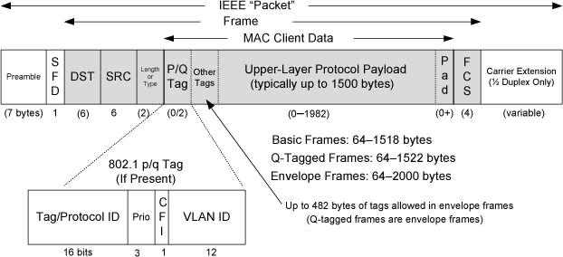
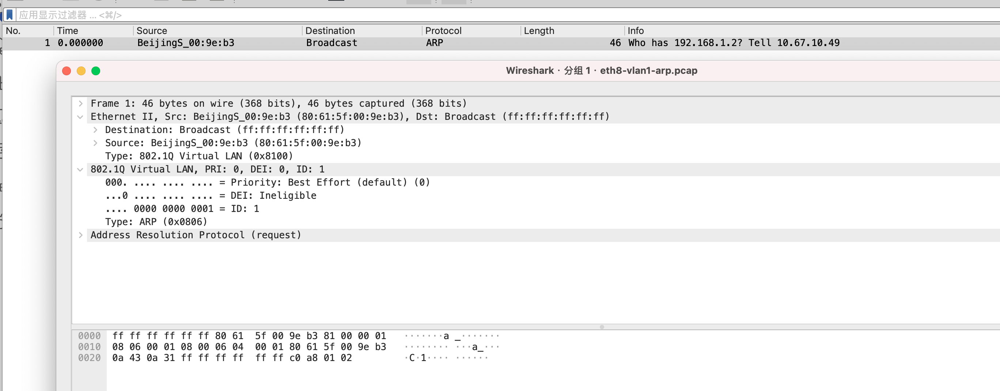

# 3.1. Introduction

   Ethernet（以太网）是一套用于局域网的通信技术体系，主要由 IEEE 802.3 标准定义，规定了数据在链路层和物理层如何被封装、寻址、发送和接收。
   Ethernet 之所以被设计成局域网技术，是因为它在地址、广播、时延假设和控制机制上，天然只适合小范围、低时延、受控规模的网络环境。
   LAN 是网络的“使用范围/场景”，而 Ethernet 是实现 LAN 的一种具体二层技术。
   LAN 是在受控、小规模、低时延环境中运行的二层网络，典型技术是 Ethernet；WAN 是跨组织、需依赖三层路由和分层地址实现大规模互联的网络，典型技术是 IP。
   WAN 是跨越多个独立网络、默认不可信的广域互联网络，通常通过路由器与局域网隔离；PC 一般不直接接入 WAN，而是通过路由器间接访问。
   WAN 口通常是 路由器或防火墙的外网接口。提供 公网访问 / 跨网段通信。

| 技术 / 概念 | 所在层次 | 解决的问题 | 是否多点 | 是否广播 | 典型场景 | 核心特征 |
|------------|----------|------------|----------|----------|----------|----------|
| Ethernet（以太网） | 链路层 | 局域网内数据传输 | ✅ | ✅ | 局域网、交换机 | MAC 地址、帧、交换 |
| Wi-Fi（802.11） | 链路层 | 无线局域网传输 | ✅ | ✅ | 无线接入 | CSMA/CA、ACK |
| PPP | 链路层 | 点到点传输 | ❌ | ❌ | 拨号、专线 | LCP / NCP |
| PPPoE | 链路层 | 以太网上跑 PPP | ❌ | ❌ | 宽带接入 | 认证 + IP 分配 |
| ARP | 链路层辅助 | IP → MAC 映射 | — | ✅ | 局域网 | 广播请求 |
| VLAN（802.1Q） | 链路层 | 二层隔离 | ✅ | ✅ | 企业网 | 逻辑分网 |
| STP | 链路层控制 | 消除环路 | — | — | 交换网络 | 阻塞冗余路径 |
| MRP | 链路层控制 | 注册 VLAN / 组播 | — | — | 特定网络 | 按需传播 |
| IP（Internet） | 网络层 | 跨网络寻址与转发 | ✅ | ❌ | 全网 | 无连接、尽力而为 |
| ICMP | 网络层 | 差错与诊断 | — | ❌ | ping | 差错报告 |
| TCP | 传输层 | 可靠传输 | 点到点 | ❌ | Web、SSH | 连接、重传 |
| UDP | 传输层 | 简单传输 | 点到点 | ❌ | DNS、视频 | 无连接 |
| HTTP | 应用层 | Web 传输 | — | — | 浏览器 | 请求 / 响应 |
| DNS | 应用层 | 名字解析 | — | — | 所有网络 | 域名 → IP |

| 名称 | 是协议吗 | 是网络范围吗 | 属于哪一层 | 常见误解 |
|----|----|----|----|----|
| 以太网（Ethernet） | ✅ | ❌ | 链路层 | 以为是“局域网本身” |
| 互联网（Internet / IP） | ✅ | ❌ | 网络层 | 以为是一张“网线” |
| LAN（局域网） | ❌ | ✅ | — | 以为 LAN = 以太网 |
| WAN（广域网） | ❌ | ✅ | — | 以为 WAN = Internet |
| MAN（城域网） | ❌ | ✅ | — | 以为是某种新协议 |


1. Different hardware uses different link-layer protocols:  
- **Wired LANs**: Ethernet  
- **Metropolitan networks (MANs)**: DSL, Cable  
- **Wired voice networks**: Modem  
- **Wireless networks**: Wi-Fi  

2. The link-layer PDU is called a **frame**. The **Maximum Transmission Unit (MTU)** specifies the largest frame size allowed by the link layer, which is an important characteristic for data transmission.

# 3.2. Ethernet and the IEEE 802 LAN/MAN Standards

**IEEE 802 LAN/MAN:**  
IEEE 802 is a working group within the IEEE responsible for defining data-link layer and physical layer standards for local area networks (LANs) and metropolitan area networks (MANs). It has produced a family of 802.x standards, such as IEEE 802.3 (wired Ethernet) and IEEE 802.11 (Wi-Fi), which form the foundation of modern TCP/IP networks. Although the IEEE 802 framework conceptually includes both LAN and MAN technologies, MAN standards such as IEEE 802.16 (WiMAX) have largely fallen out of mainstream use, with today’s metropolitan networks being built primarily as extensions of Ethernet and IP technologies.

**CSMA/CD:**  
CSMA/CD is the media access control mechanism used in early IEEE 802.3 Ethernet designed for shared-medium, half-duplex bus networks. It coordinates access by sensing the carrier, detecting collisions, and applying an exponential backoff algorithm. With the widespread adoption of switched, full-duplex Ethernet, where each link is a point-to-point connection and collisions no longer occur, CSMA/CD is no longer used in practice, but it remains important for understanding the historical evolution of Ethernet and concepts such as collision domains.

## 3.2.1. The IEEE 802 LAN/MAN Standards

IEEE 802 is a standards framework centered on the data-link layer, whose primary goal is to define common Layer 2 and physical-layer technologies for LAN and MAN networks. Within the IEEE 802 architecture, the data-link layer is explicitly divided into two sublayers: the Logical Link Control (LLC) sublayer, defined by IEEE 802.2, which provides a relatively uniform interface to the network layer, and the Media Access Control (MAC) sublayer, defined by specific standards such as IEEE 802.3, 802.11, 802.15, and 802.16, which specify frame formats, MAC addressing, and medium access methods. In addition to these data-carrying MAC/PHY technologies, IEEE 802 also includes standards such as 802.1 and 802.21 that focus on Layer 2 control, management, and cross-layer coordination, and do not directly carry TCP/IP data.

```c
数据链路层
├── LLC（Logical Link Control） → 802.2
└── MAC（Media Access Control） → 802.3 / 802.11 / 802.15 / 802.16
```

| IEEE 802 标准 | 网络类型 | 名称 / 技术 | 主要用途 | 与 TCP/IP 的关系 |
|--------------|----------|-------------|----------|------------------|
| 802.1        | LAN/MAN  | Bridging, VLAN, MAC control | 二层交换、VLAN、链路管理 | 为 IP 提供二层转发与管理基础 |
| 802.2        | LAN/MAN  | Logical Link Control (LLC)  | 统一上层接口 | 为多种 MAC 提供一致接口（历史作用为主） |
| 802.3        | LAN      | Ethernet     | 有线局域网 | TCP/IP 最主要、最常用承载技术 |
| 802.11       | LAN      | Wireless LAN (Wi-Fi) | 无线局域网 | TCP/IP 在无线 LAN 中的主要承载方式 |
| 802.15       | LAN      | Wireless PAN (Bluetooth 等) | 短距离通信 | 部分配置可承载 IP（如 6LoWPAN） |
| 802.16       | MAN      | WiMAX       | 城域网宽带接入 | 可承载 TCP/IP（实际部署较少） |
| 802.21       | LAN/MAN  | Media Independent Handoff | 跨网络切换 | 辅助 IP 在异构网络间无缝切换 |

## 3.2.2. The Ethernet Frame Format



**书上的这个图有点问题， Length/Type 应该插入在other tags后面, 抓包可以看到Type字段， 例：Type: IPv4 (0x0800)**

| 帧类型 | 标准/来源 | 特点 |
|--------|-----------|------|
| Ethernet II (DIX) | 原始以太网，DIX 联盟 | Type 字段 2B 表示上层协议类型（IPv4/ARP/IPv6），最常用于 TCP/IP 网络 |
| IEEE 802.3 (原始长度字段) | IEEE 802.3 标准 | Length 字段 2B 表示数据长度，如果上层使用 LLC（Logical Link Control）就跟随 DSAP/SSAP 字段 |
| IEEE 802.3 + LLC | IEEE 802.2 | 在 802.3 长度字段基础上，加入 LLC 头（DSAP 1B + SSAP 1B + Control 1B），可以承载多种上层协议 |
| IEEE 802.1Q VLAN 帧 | IEEE 802.1Q | 在源 MAC 与 Type/Length 之间插入 TPID (0x8100) + TCI (VLAN 标签) 4B，支持 VLAN 分类和优先级 |
| Jumbo Frames / 扩展帧 | 厂商扩展 | 最大长度超过 1500 字节（可达 9000+ 字节），提高大数据传输效率 |

**Ethernet II** 是由 DIX 联盟最早定义的以太网帧格式，**也是现代 TCP/IP 网络的主流帧类型**。它的 **Length/Type 字段表示上层协议类型**（如 IPv4 = 0x0800、ARP = 0x0806），Payload 紧跟其后，上层数据直接承载在帧内，FCS 用于校验帧完整性。VLAN（802.1Q）等扩展可以在 Ethernet II 帧上插入 4 字节标签而不改变原有 Type 字段，使同一物理网络可以支持逻辑隔离和优先级控制。


#### 基本字段

| 字段 | 大小 | 功能 |
|------|------|------|
| Preamble 前导码 | 7B | 帮助接收端同步时钟 |
| SFD（Start Frame Delimiter） | 1B | 标识帧开始 |
| 目的 MAC 地址 | 6B | 接收端硬件地址 |
| 源 MAC 地址 | 6B | 发送端硬件地址 |
| Length/Type | 2B | 值 ≥ 0x0600 → 上层协议类型 (Type)，值 ≤ 0x05DC → 数据长度 (Length) |
| Payload 数据 | 46~1500B | 上层协议数据 |
| FCS (CRC32) | 4B | 校验帧是否损坏 |

**重点**：Length/Type 字段是“重载字段”，根据数值大小判断用途。现在以太网中，Length/Type 字段几乎总是表示上层协议类型（Ethernet II 标准），例如 IPv4、ARP 或 IPv6，而不再表示数据长度；如果网络使用 VLAN 或多标签（PQ Tag/Other Tags），这些标签紧跟在 Type 字段之后进行分类和优先级控制，但不会改变 Type 字段的含义。

---

#### PQ Tag（802.1p/q）

- **标准**：IEEE 802.1Q / 802.1p  
- **长度**：4 字节（32 位）  
- **位置**：紧跟在基本以太网帧的 MAC 地址之后或 Type/Length 之后（取决于图示或标准顺序）  

| 字段 | 位数 | 说明 |
|------|------|------|
| TPID | 16 | Tag Protocol Identifier，固定 0x8100，表示这是 VLAN 标签 |
| TCI  | 16 | Tag Control Information，**包含以下子字段**： |
| PCP  | 3  | Priority Code Point，优先级 0~7 |
| DEI  | 1  | Drop Eligible Indicator，可丢弃标志 |
| VLAN ID | 12 | VLAN 标识符，范围 1~4094 |

**作用**
- 指定 VLAN ID → 帧属于哪个虚拟局域网  
- 指定优先级 → QoS 控制  
- 帮助交换机在多 VLAN 网络中进行分类和转发  

---

#### Other Tags（可叠加标签）

- **位置**：紧跟在 PQ Tag 之后，可连续叠加  
- **长度**：每个标签 4 字节（同样是 TPID+TCI）  

**作用**
- 支持 **多层 VLAN（Q-in-Q）**  
- 支持 **MPLS over Ethernet** 或其他链路层扩展协议  
- 允许网络提供多租户隔离或多级优先级策略  

#### Frame Check Sequence/Cyclic Redundancy Check (CRC)

略

#### Frame Sizes

1. The minimum is 64 bytes, requiring a minimum data area (payload) length of 48 bytes (no tags & Type/Length (2B) + Data (46B)). 
2. he maximum frame size of conventional Ethernet is 1518 bytes (including the 4-byte CRC and 14-byte header). 

## 3.2.3. 802.1p/q: Virtual LANs and QoS Tagging

#### 1. PQ Tag（802.1Q / 802.1p）

```c
  0               15 16              31
  +----------------+------------------+
  |      TPID      |        TCI       |
  +----------------+------------------+
                    |PCP|D|  VLAN ID |
                    | 3 |1|   12     |
```

| 字段 | 位数 | 字节 | 子字段 | 取值 / 结构 | 作用说明 |
|----|----|----|----|----|----|
| TPID | 16 bit | 2B | — | 固定 `0x8100` | 标识该帧包含 802.1Q / 802.1p 标签（VLAN 帧） |
| TCI | 16 bit | 2B | PCP | 3 bit（0–7） | 802.1p 定义的 QoS 优先级 |
|     |        |    | DEI | 1 bit | 拥塞时是否允许丢弃（1 = 可丢弃） |
|     |        |    | VLAN ID | 12 bit（1–4094） | VLAN 标识；0 表示无 VLAN、仅携带优先级 |

#### 2. Key Concepts of VLAN Communication and Identification

**1. Inter-VLAN communication requires a router**  
VLANs provide logical Layer 2 isolation within a switched network. An Ethernet switch forwards frames only within the same VLAN, so even hosts connected to the same physical switch cannot communicate directly if they belong to different VLANs. Communication between VLANs must therefore be handled by a Layer 3 device, such as a router or a Layer 3 switch, which routes traffic between the corresponding VLAN interfaces.

**2. Methods for VLAN membership assignment**  
VLAN membership defines which hosts belong to which logical network. The most common method is port-based VLAN assignment, where a switch port is configured as a member of a specific VLAN and any device connected to that port automatically joins that VLAN. Other methods include MAC-address-based and IP-address-based VLAN assignment, but these require additional mapping tables and are more complex to manage, so they are less commonly used in practice.

**3. VLAN identification across multiple switches**  
When multiple VLANs must span across multiple switches, the switches need a way to identify which VLAN each Ethernet frame belongs to. This is achieved by adding an IEEE 802.1Q VLAN tag to frames transmitted over trunk links between switches. The tag carries a VLAN identifier (VLAN ID), allowing the receiving switch to correctly classify and forward the frame within the appropriate VLAN.

**4. VLAN Tagging / Untagging Behavior Summary**

**Access ports** are used to connect end hosts (such as PCs or servers) and belong to **exactly one VLAN**. Ethernet frames sent and received on an access port are **untagged**. The VLAN membership of the traffic is determined solely by the switch’s port configuration, and the end host does not need to be aware of VLANs.

**Trunk ports** are used to interconnect network devices such as switches or routers and are designed to carry **traffic from multiple VLANs over a single physical link**. To distinguish between VLANs, frames on a trunk port are typically **tagged with an IEEE 802.1Q VLAN tag**, allowing receiving devices to identify which VLAN each frame belongs to.


| 端口类型 | 方向 | 接收到的帧 | 交换机处理方式 | 发出的帧 |
|--------|------|-----------|---------------|---------|
| Access | Ingress（进） | Untagged（无 VLAN Tag） | 根据端口的 PVID，将帧内部关联到对应 VLAN（逻辑标记，不一定真正插 Tag） | — |
| Access | Egress（出） | 属于该端口 VLAN 的帧 | 若内部带 VLAN 信息，发送前去掉 VLAN Tag | Untagged（无 VLAN Tag） |
| Trunk | Ingress（进） | Tagged（带 802.1Q Tag） | 读取 VLAN ID，将帧归入对应 VLAN | — |
| Trunk | Ingress（进） | Untagged（无 VLAN Tag） | 将帧归入 native VLAN | — |
| Trunk | Egress（出） | 普通 VLAN 的帧 | 在发送前插入 802.1Q Tag（携带 VLAN ID / PCP） | Tagged（有 VLAN Tag） |
| Trunk | Egress（出） | native VLAN 的帧 | 不插入 VLAN Tag | Untagged（无 VLAN Tag） |

Trunk 端口是用于连接交换机（或交换机与路由器）的端口，它可以在同一条链路上传输多个 VLAN 的流量。为了让对端设备区分每个以太网帧属于哪个 VLAN，交换机会在帧中插入 802.1Q 标签（包含 VLAN ID），因此 Trunk 口上传输的帧通常都是“带标签的帧”。

Native VLAN 是 Trunk 端口上的一个特殊 VLAN，用来处理“未打 802.1Q 标签的帧”。当一个帧以未打标签的形式进入 Trunk 端口时，交换机会自动将它归属到 Native VLAN；同时，属于 Native VLAN 的帧在发出时可以不携带 VLAN 标签。Native VLAN 的设计主要用于兼容不支持 VLAN 的旧设备或历史网络环境。

#### 3. 举例说明

**一个例子正好把 Access / Trunk / VLAN tag 全串起来：**

1. **主机发送帧（无标签）**  
   主机发送的是普通以太网帧，不包含 VLAN 标签，主机本身并不知道 VLAN 的存在。

2. **帧进入交换机 Access 口**  
   Access 口被配置为某个 VLAN（如 VLAN 10）。交换机根据端口配置，将该帧逻辑上归类到 VLAN 10，但帧内容仍然是无标签的。

3. **帧从 Trunk 口转发（打标签）**  
   当帧需要通过 Trunk 口发送到另一台交换机时，交换机会在以太网帧中插入 802.1Q VLAN 标签，写入 VLAN ID（如 10），用于标识该帧所属的 VLAN。

4. **对端交换机 Trunk 口接收**  
   对端交换机从 Trunk 口收到带 VLAN 标签的帧，读取 VLAN ID，并在对应的 VLAN 逻辑广播域内进行转发。

5. **帧从 Access 口发给主机（去标签）**  
   当帧需要发送给接在 Access 口上的主机时，交换机会移除 VLAN 标签，以普通以太网帧的形式发送，主机对此过程无感知。

**一句话总结**  
VLAN 标签仅用于交换机之间的识别：Trunk 口负责打标签和识别标签，Access 口始终对主机呈现无标签的以太网帧。

####  4. Linux 配置 VLAN 子接口的根本意义

虽然交换机的 Access 口进出帧都不带 VLAN 标签，但 Linux 配置 VLAN 子接口的前提是：  
**Linux 并不是通过 Access 口接入网络，而是通过 Trunk 口参与 VLAN 通信。**  
在这种情况下，Linux 需要自己识别和生成 802.1Q VLAN 标签，否则它无法区分不同 VLAN 的二层流量。

---

**Access 口场景：不需要 VLAN 子接口**

如果交换机端口被配置为 Access 口，例如：

switchport mode access  
switchport access vlan 10  

那么 Linux 主机收到的始终是无 VLAN 标签的普通以太网帧。  
此时 VLAN 的归属完全由交换机决定，Linux 对 VLAN 毫无感知，也不应该配置 VLAN 子接口，直接使用 `eth0` 即可。

---

**Trunk 口场景：VLAN 子接口才有意义**

当交换机端口被配置为 Trunk 口，例如：

switchport mode trunk  
allowed vlan 10,20  

交换机会在发往 Linux 的帧中携带 VLAN 标签。Linux 若想正确处理这些帧，就必须创建对应的 VLAN 子接口：

ip link add link eth0 name eth0.10 type vlan id 10  
ip link add link eth0 name eth0.20 type vlan id 20  

这样：

- `eth0.10` 只接收 / 发送 VLAN 10 的帧  
- `eth0.20` 只接收 / 发送 VLAN 20 的帧  

一块物理网卡即可同时承载多个 VLAN 的流量。

---

**VLAN 子接口的典型用途示例**

例如，一台服务器同时承担多种角色：

- VLAN 10：业务流量  
- VLAN 20：管理流量  

交换机使用 Trunk 口连接服务器，Linux 上分别配置：

eth0.10 → 业务 IP  
eth0.20 → 管理 IP  

操作系统根据 VLAN ID 将不同二层帧送到不同逻辑接口，三层以上完全隔离，但物理链路只有一根。

---

**总结一句话**

**VLAN 子接口不是给 Access 口用的，而是让 Linux 像交换机 Trunk 口一样，显式处理 VLAN 标签；如果接的是 Access 口，配置 VLAN 子接口不仅没意义，反而是错误的。**

#### 5. linux 配置 & 查看 子接口

```shell
// 在物理接口 eth8 上 & 创建 VLAN ID = 1 & 生成接口：eth8.1
vconfig add eth8 1

// 查看vlan 子接口
root>ip -d link show eth8.1
19: eth8.1@eth8: <BROADCAST,MULTICAST,UP,LOWER_UP> mtu 1500 qdisc noqueue state UP mode DEFAULT qlen 1000
    link/ether 80:61:5f:00:9e:b3 brd ff:ff:ff:ff:ff:ff promiscuity 0 
    vlan protocol 802.1Q id 1 <REORDER_HDR> addrgenmode eui64 
```

#### 6. 抓包来看vlan

**抓包一**

```shell
// 1. 初始状态
root>ip -d link show eth8.1
19: eth8.1@eth8: <BROADCAST,MULTICAST,UP,LOWER_UP> mtu 1500 qdisc noqueue state UP mode DEFAULT qlen 1000
    link/ether 80:61:5f:00:9e:b3 brd ff:ff:ff:ff:ff:ff promiscuity 1 
    vlan protocol 802.1Q id 1 <REORDER_HDR> addrgenmode eui64 

root>ifconfig eth8.1
eth8.1: flags=4163<UP,BROADCAST,RUNNING,MULTICAST>  mtu 1500
        inet6 fe80::8261:5fff:fe00:9eb3  prefixlen 64  scopeid 0x20<link>
        ether 80:61:5f:00:9e:b3  txqueuelen 1000  (Ethernet)
        RX packets 0  bytes 0 (0.0 B)
        RX errors 0  dropped 0  overruns 0  frame 0
        TX packets 48  bytes 2208 (2.1 KiB)
        TX errors 0  dropped 0 overruns 0  carrier 0  collisions 0

// 2. 抓包
tcpdump -i eth8.1 -n -e arp -c 1 -w /tmp/eth8.1-arp.pcap

// 3. 发包
arping -I eth8.1 -c 3 192.168.1.2

// 4. 分析
VLAN 子接口抓不到 802.1Q 标签，在 Linux 内核中，eth8.1 是逻辑接口，内核会自动 剥掉 VLAN tag，上层协议看到的报文就像普通以太帧
```

**抓包二**

```c
// 1. 抓包 抓物理口
tcpdump -i eth8 -n -e vlan and arp -c 1 -w /tmp/eth8-vlan1-arp.pcap

// 2. 发送 arp
arping -I eth8.1 -c 3 192.168.1.2

// 3. 分析 报文如下
```


## 3.2.4. 802.1AX: Link Aggregation (Formerly 802.3ad)

**Linux 使用 bonding 驱动（bond 接口）来实现多网卡逻辑绑定，其中只有 bonding 的 802.3ad 模式（mode 4）严格实现了 IEEE 802.1AX 链路聚合。**

| Mode | 名称 | 是否属于链路聚合 | 是否符合 802.1AX | 是否使用 LACP | 带宽叠加 | 冗余 | 对端要求 | 典型场景 |
|------|------|------------------|------------------|---------------|----------|------|----------|----------|
| 0 | balance-rr | ⚠️ 伪聚合 | ❌ | ❌ | ⚠️ | ⚠️ | 交换机需特殊支持 | 实验、极少使用 |
| 1 | active-backup | ❌ | ❌ | ❌ | ❌ | ✅ | 无 | 高可靠、跨交换机 |
| 2 | balance-xor | ⚠️ 半聚合 | ❌ | ❌ | ⚠️ | ✅ | 交换机静态聚合 | 简单负载分担 |
| 3 | broadcast | ❌ | ❌ | ❌ | ❌ | ✅ | 无 | 极端可靠性 |
| 4 | 802.3ad | ✅ 真正聚合 | ✅ | ✅ | ✅（多流） | ✅ | 对端支持 LACP | 服务器 / 交换机 |
| 5 | balance-tlb | ❌ | ❌ | ❌ | ⚠️（TX） | ✅ | 无 | 无交换机配置 |
| 6 | balance-alb | ❌ | ❌ | ❌ | ⚠️（TX/RX） | ✅ | 无 | 无交换机配置 |


**书中示例如下**
```shell
Linux# modprobe bonding  // 创建bond口  bonding 使用 默认模式：mode 0
Linux# ifconfig bond0 10.0.0.111 netmask 255.255.255.128  // 配置ip & mask
Linux# ifenslave bond0 eth0 wlan0  // eth0 wlan0 加入bond0中
```
**解释如下**
master / slave 是 Linux bonding 驱动内部的逻辑角色：master = 逻辑接口（虚拟网卡）  &&  slave = 被 master 接管的物理接口
Linux 的 bonding 驱动通过不同的 mode，决定 IPv4 流量从 bond0 发出时，由哪个 slave 接口承载，以及是否做负载分担、主备切换或标准化的链路聚合。

**LACP**
动态链路聚合：LACP 是一种用于自动协商和维护链路聚合的控制协议，本身不承载业务流量，只决定“哪些链路可以被捆绑在一起”。

**MLAG**
MLAG 通过在两台交换机之间同步控制状态，使它们对下游设备表现为一个 LACP 端点，从而实现无单点故障的链路聚合。

# 3.3. Full Duplex, Power Save, Autonegotiation, and 802.1X Flow Control

1. In addition, Ethernet was modified to operate in full duplex, effectively disabling the collision detection circuitry（碰撞检测）.
2. This also allowed the physical length of the Ethernet to be extended, because the timing constraints associated with half-duplex operation and collision detection were removed. （这也允许以太网的物理链路长度得以延长，因为与半双工操作和碰撞检测相关的时序约束被移除了。）


```shell
Linux# ethtool eth0
Settings for eth0:
           Supported ports: [ TP MII ]
           Supported link modes: 10baseT/Half 10baseT/Full
           100baseT/Half 100baseT/Full
           Supports auto-negotiation: Yes
           Advertised link modes: 10baseT/Half 10baseT/Full
           100baseT/Half 100baseT/Full
           # Autonegotiation information is exchanged at the physical layer using signals sent when data is not being transmitted or received. 
           Advertised auto-negotiation: Yes  
           Speed: 10Mb/s
           Duplex: Half
           Port: MII
           PHYAD: 24
           Transceiver: internal
           Auto-negotiation: on
           Current message level: 0x00000001 (1)
           Link detected: yes

WAF# root>ethtool eth0
Settings for eth0:
        Supported ports: [ TP ]
        Supported link modes:   10baseT/Half 10baseT/Full 
                                100baseT/Half 100baseT/Full 
                                1000baseT/Full 
        Supported pause frame use: Symmetric
        Supports auto-negotiation: Yes
        Advertised link modes:  10baseT/Half 10baseT/Full 
                                100baseT/Half 100baseT/Full 
                                1000baseT/Full 
        Advertised pause frame use: Symmetric
        Advertised auto-negotiation: Yes
        Speed: 1000Mb/s
        Duplex: Full
        Port: Twisted Pair
        PHYAD: 1
        Transceiver: internal
        Auto-negotiation: on
        MDI-X: on (auto)
        Supports Wake-on: pumbg  // 支持的wake模式
        Wake-on: d               // 当前模式
        Current message level: 0x00000007 (7)
                               drv probe link
        Link detected: yes
```

## 3.3.1. Duplex Mismatch

**duplex mismatch**: when a computer and its associated switch port are configured using different duplex configurations or when autonegotiation is disabled at one end of the link but not the other. 

## 3.3.2. Wake-on LAN (WoL), Power Saving, and Magic Packets

 In Windows the Wake-Up Capabilities and in Linux the Wake-On options are used to bring the network interface and/or host computer out of a lower-power (sleep) state based on the arrival of certain kinds of packets

| 字母 | 触发条件 | 说明 |
|------|---------|------|
| p    | PHY activity | 物理层信号变化（任意链路活动） |
| u    | Unicast | 发给本机 MAC 的帧 |
| m    | Multicast | 多播帧 |
| b    | Broadcast | 广播帧 |
| a    | ARP | ARP 请求帧 |
| g    | Magic Packet | 常用的 WOL 魔术包 |
| s / g with password | Magic Packet + password | 包含密码的魔术包 |

Magic Packet：唤醒远程主机的网卡，使系统从低功耗状态（如 S3/S4/S5）恢复， 仅依赖 网卡硬件，不需要 CPU 或操作系统参与（网卡要支持 WOL）。

## 3.3.3. Link-Layer Flow Control

when multiple stations send to the same destination (called output port contention). If the aggregate traffic rate headed for a station exceeds the station’s link rate, frames start to be stored in the intermediate switches. If this situation persists for a long time, frames may be dropped.（交换机也会丢包）

One way to mitigate this situation is to apply flow control to senders (i.e., slow them down). Some Ethernet switches (and interfaces) implement flow control by sending special signal frames between switches and NICs. (交换机给主机发流量控制信号)

通过：MAC Control Frame 是一种特殊以太网帧，PAUSE 帧是其唯一常用类型，用于全双工链路上的 802.3x 流控，通过 opcode + pause time 暂停对端发送以缓解拥塞。（纯链路层（Layer 2）帧，没有上层协议）

# 3.4. Bridges and Switches

1. The IEEE 802.1d standard specifies the operation of bridges, and thus switches, which are essentially high-performance bridges. （一句话定性：交换机就是高性能的桥）
2. Note that every network element, including each switch, has its own MAC address. Nonlocal MAC addresses are “learned” by each bridge over time so that eventually every switch knows the port upon which every station can be reached.  （交换机会学习mac 表， called filtering databases）
3. Today, most operating systems support the capability to bridge between network interfaces, meaning that a standard computer with multiple interfaces can be used as a bridge. （大多数系统都支持桥）
4. Filtering databases & Bridges :

```shell
#!/bin/bash
# =============================================================================
# Linux Bridge (brctl) 使用示例与说明
# =============================================================================
# 本脚本演示如何创建 Linux 桥接设备，添加接口，并查看 MAC 地址表
# 同时解释 MAC 学习、老化机制和泛洪行为
# =============================================================================

# -----------------------------
# 1️⃣ 创建桥接设备 br0
# -----------------------------
# 创建一个桥接设备 br0
brctl addbr br0
# 将物理接口 eth0 和 eth1 加入桥
brctl addif br0 eth0
brctl addif br0 eth1
# 启动接口
ifconfig eth0 up
ifconfig eth1 up
ifconfig br0 up

# 删除接口示例（可选）
# brctl delif br0 eth1

# -----------------------------
# 2️⃣ 查看桥接接口状态
# -----------------------------
# 显示桥接及其成员接口
# 输出示例：
# bridge name bridge id         STP enabled interfaces
# br0         8000.0007e914a9c1 no          eth0 eth1
brctl show

# -----------------------------
# 3️⃣ 查看 MAC 地址表（过滤数据库 fdb）
# -----------------------------
# brctl showmacs br0 显示每个端口学习到的 MAC 地址
# 输出示例：
# port no mac addr         is local? ageing timer
# 1       00:04:5a:9f:9e:80 no       0.79
# 2       00:07:e9:14:a9:c1 yes      0.00
brctl showmacs br0

# -----------------------------
# 4️⃣ MAC 学习与老化机制
# -----------------------------
# 桥接会动态学习 MAC 地址，将 MAC 对应端口记录到过滤数据库
# 每条 MAC 条目有老化时间（默认 300 秒 / 5 分钟）
# 如果超过老化时间未再次看到该 MAC，条目会被删除
# 删除后的帧会泛洪（flood）到除了接收端口的所有端口
# MAC 条目会在收到帧时重新学习

# 设置老化时间为 1 秒（演示用途）
brctl setageing br0 1
brctl showmacs br0

# -----------------------------
# 5️⃣ 泛洪与性能优化说明
# -----------------------------
# - 当 MAC 表为空或未知 MAC 时，桥会将帧发送到所有端口（除了接收端口） —— 泛洪
# - 学习 MAC 表是性能优化，减少泛洪
# - 多桥冗余链路可能造成循环转发 / 广播风暴
# - 使用 STP（生成树协议）防止环路
# - MAC 表、泛洪和 STP 是桥接性能和安全优化的关键
# -----------------------------
```

**配置举例**

```shell
# 1. br0 其实就是个交换机， 有 mac & ip
# 2. 为什么br0可以配置ip？物理机需要IP地址与外界通信， 当物理接口加入桥后，原IP必须移到 br0
[root@localhost ~]# brctl show
bridge name     bridge id               STP enabled     interfaces
br0             8000.000d485678dd       no              enp102s0
                                                        vnet0
                                                        vnet1
                                                        vnet10

[root@localhost ~]# ifconfig
br0: flags=4163<UP,BROADCAST,RUNNING,MULTICAST>  mtu 1500
        inet 10.67.10.233  netmask 255.255.252.0  broadcast 10.67.11.255
        inet6 fe80::2314:e381:e2df:4c67  prefixlen 64  scopeid 0x20<link>
        ether 00:0d:48:56:78:dd  txqueuelen 1000  (Ethernet)
        RX packets 266182705  bytes 46937840874 (43.7 GiB)
        RX errors 0  dropped 2712678  overruns 0  frame 0
        TX packets 9364836  bytes 11600854272 (10.8 GiB)
        TX errors 0  dropped 0 overruns 0  carrier 0  collisions 0
```

## 3.4.1. Spanning Tree Protocol (STP)

### 1. 环路问题：二层环路不仅会放大广播流量，还会破坏 MAC 地址表，使单播帧退化为洪泛，从而同样陷入环路。

以太网交换机不会记住“帧来过哪里”，
广播帧也不会自己“死掉”，
因此一旦形成二层环路，帧就会在网络中不断转圈并被指数级复制。
同时，由于环路导致 MAC 地址表持续震荡，交换机无法稳定学习端口与 MAC 的对应关系，原本应当定向转发的单播帧也会退化为洪泛转发，同样进入环路并引发风暴。
交换机退化为“集线器”

### 2. 为什么三层不怕这种问题？

IP 网络是“有边界的”：TTL + 路由计算

### 3. 如何解决

交换机配置STP。

## 3.4.2. 802.1ak: Multiple Registration Protocol (MRP)

| 问题 | STP | MRP |
|------|-----|-----|
| 有没有环？ | ✅ 管 | ❌ 不管 |
| 哪条路能走？ | ✅ 决定 | ❌ 不管 |
| 谁需要 VLAN / 组播？ | ❌ 不管 | ✅ 管 |
| 防广播风暴 | ✅ | ❌ |
| 动态成员关系 | ❌ | ✅ |

MRP（Multiple Registration Protocol）是一类二层注册协议，用于在交换机之间动态通告“谁需要什么”（如 VLAN 或组播 MAC），让让 VLAN 和组播只在真正需要的链路和端口上存在，从而减少不必要的泛洪；它不负责消除环路、不决定转发表路径，通常与 STP 并存，按需启用，主要用于精细化控制二层资源而非网络保活。

# 3.5. Wireless LANs—IEEE 802.11(Wi-Fi)

IEEE 802.11 通过 CSMA/CA、确认重传和复杂帧控制，在不可靠的无线介质上模拟出“看起来可靠的以太网服务”，但代价是更高的时延、更低的实际吞吐和更复杂的链路层机制。

# 3.6. Point-to-Point Protocol (PPP)

PPP（Point-to-Point Protocol）是一种用于两端设备之间的链路层协议，通过 LCP 建立和维护链路、可选的 PAP/CHAP 认证以及 NCP（如 IPCP）为网络层配置参数，在不需要 MAC 和广播的点到点链路上封装并承载 IP 等多种网络层协议，典型用于拨号、专线和 PPPoE 等接入场景。

## 3.7. Loopback

1. An IP datagram sent to the loopback interface must not appear on any network. 