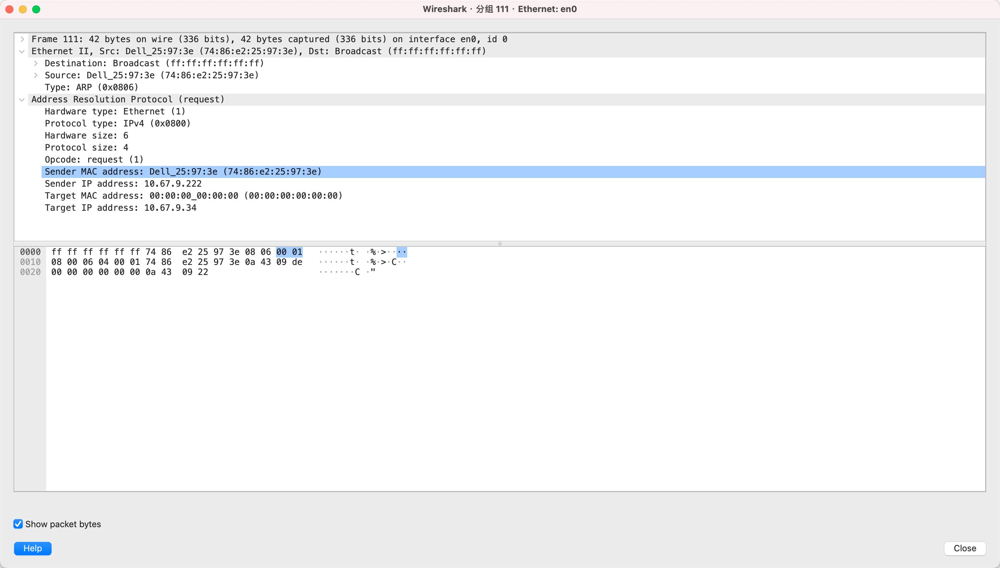
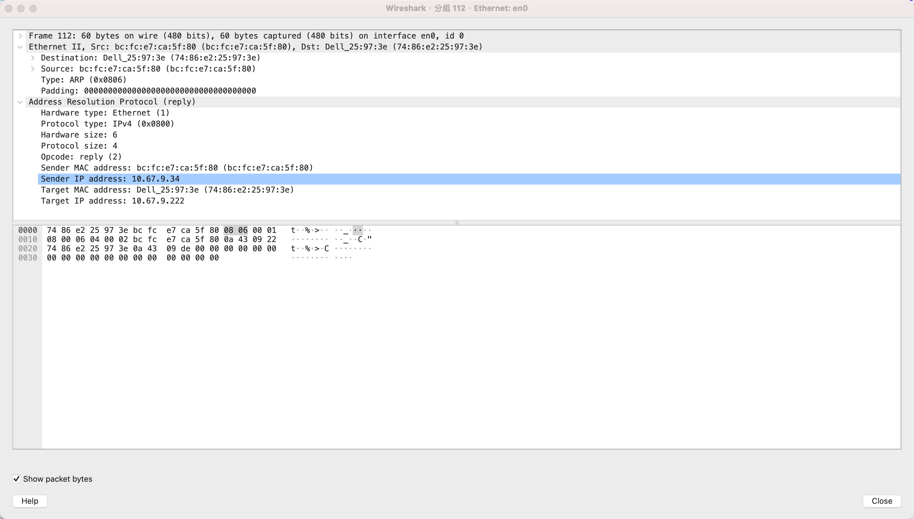
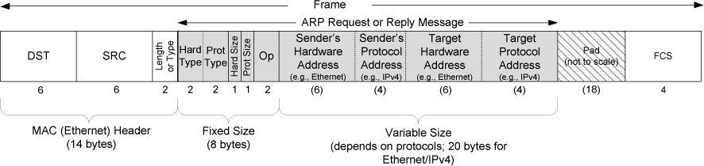

# 4.1. Introduction

1. ARP is used with IPv4 only; IPv6 uses the Neighbor Discovery Protocol, which is incorporated into ICMPv6.
2. ARP provides a dynamic mapping from a network-layer address to a corresponding hardware address.

# 4.2. An Example

ARP operates only within the same IP subnet (broadcast domain) and is used to resolve the MAC address of the next-hop IP address. If the destination IP is on the local subnet, ARP resolves the destination host’s MAC address; if the destination IP is on a remote subnet, ARP resolves the MAC address of the default gateway instead. As a result, ARP requests are not forwarded by routers and cannot cross Layer 3 network boundaries.

在跨交换机的同一 **VLAN / 同一 IP 子网** 中，**ARP** 能正常工作，是因为 **ARP 请求以二层广播帧的形式发送**，交换机会在 **广播域** 内转发该帧。交换机在这一过程中 **并不参与 ARP 解析**，也 **不维护 ARP 状态**，只是按照 **二层转发规则** 转发帧。

交换机 **一定维护 MAC 表（CAM 表）**，但 **MAC 表与 ARP 缓存是两回事**。**MAC 表** 记录的是 **“MAC 地址 → 端口”** 的映射关系，用于 **二层转发**；而 **ARP 缓存** 记录的是 **“IP 地址 → MAC 地址”** 的映射关系，**只存在于主机和三层设备中**。二层交换机 **既不保存 IP → MAC 的映射**，也 **无法根据 IP 地址直接转发数据**。

在 **ARP 工作过程中**，交换机会在转发 **ARP 报文** 时 **被动学习源 MAC 地址** 并更新 **MAC 表**。当目标主机返回 **ARP Reply（单播）** 时，交换机依据 **MAC 表** 将该帧 **精确转发到对应端口**，从而完成跨交换机的通信。**ARP 负责解决 IP → MAC，交换机 MAC 表负责解决 MAC → 端口**，两者 **职责严格分离，互不替代**。

**ARP 的响应机制是只有目的主机才会响应 ARP 请求。**

*


# 4.3. ARP Cache

交换机 MAC 表 ≠ ARP Cache. 
交换机是**纯二层设备**, 只看 MAC，不看 IP

```shell
root>arp
Address                  HWtype  HWaddress           Flags Mask            Iface
10.67.9.223              ether   70:b5:e8:2c:6e:be   C                     eth0
10.67.9.222              ether   74:86:e2:25:97:3e   C                     eth0
gateway                  ether   6c:16:32:7e:d2:6a   C                     eth0
10.67.9.49               ether   cc:b0:a8:9e:f7:9f   C                     eth0

// 老化时间
root>cat /proc/sys/net/ipv4/neigh/eth0/gc_stale_time
60
```

# 4.4. ARP Frame Format

**Protocol Type 使 ARP 可以支持多种网络层协议，而不仅仅是 IPv4。**

| 字段           | 长度    | 说明                              |
|----------------|---------|----------------------------------|
| Hardware Type  | 2 字节  | 硬件类型，例如 Ethernet = 1       |
| Protocol Type  | 2 字节  | 协议类型，例如 IPv4 = 0x0800      |
| Hardware Size  | 1 字节  | 硬件地址长度（MAC=6）            |
| Protocol Size  | 1 字节  | 协议地址长度（IPv4=4）           |
| Opcode         | 2 字节  | 操作类型：1=请求、2=应答         |
| Sender MAC     | 6 字节  | 发送方 MAC 地址                   |
| Sender IP      | 4 字节  | 发送方 IP 地址                    |
| Target MAC     | 6 字节  | 目标 MAC（ARP 请求填 0）         |
| Target IP      | 4 字节  | 目标 IP 地址                      |




# 4.5. ARP Examples  & 4.6. ARP Cache Timeout

```shell
xm@hcss-ecs-4208:~$ arp
Address                  HWtype  HWaddress           Flags Mask            Iface
_gateway                 ether   fa:16:3e:38:9b:2e   C                     eth0
192.168.0.244                    (incomplete)                              eth0
192.168.0.241                    (incomplete)                              eth0
```

### ARP Cache 条目类型与意义

1️⃣ **完整条目（Completed Entry）**  
- 已经收到 ARP Reply，知道 IP → MAC 映射  
- 老化时间约 20 分钟  
- 超过老化时间且未被再次使用，条目被删除  
- 下次发送到同一 IP 时，需要重新发 ARP Request  

2️⃣ **不完整条目（Incomplete Entry）**  
- 发出 ARP Request 但未收到 Reply  
- 记录的是“尝试解析 IP，但还没成功”的条目  
- 老化时间约 3 分钟  
- 超过老化时间仍未收到 Reply，条目被删除  

3️⃣ **Incomplete Entry 的意义**  
1. **记录尝试解析状态**：表示该 IP 地址正在解析中  
2. **避免重复广播过快**：控制 ARP Request 重发频率，提高网络效率  
3. **提供超时管理**：3 分钟超时未响应则删除，释放 ARP Cache 资源
4. **只是记录状态**，方便操作系统管理重试次数和超时删除， 不是说在`incomplete`状态就不重传arp报文了。

# 4.7 Proxy ARP 总结

**Proxy ARP** 是一种由中间设备（通常是路由器或三层设备）代替目标主机应答 ARP 请求的机制。当主机请求某个不在本地链路上的 IP 地址时，Proxy ARP 设备使用自己的 MAC 地址回应 ARP，使请求方误以为目标主机就在本地，从而将数据帧发送给该中间设备，由其再进行转发。Proxy ARP 可以在不修改主机路由配置的情况下实现跨网段通信，但会模糊网络边界、增加 ARP 流量，通常不推荐在设计良好的网络中使用。

# 4.8 Gratuitous ARP and Address Conflict Detection (ACD)

**gratuitous ARP（主动ARP）**: It occurs when a host sends an ARP request looking for its own address. This is usually done when the interface is configured “up” at bootstrap time.

**Address Conflict Detection (ACD)**： Address Conflict Detection（ACD，地址冲突检测） 是 IPv4 主机在配置或启用某个 IP 地址时，用于确认该地址是否已被同一广播域内其他主机占用的机制。主机通常通过发送 Gratuitous ARP（源 IP 与目标 IP 相同的 ARP 请求）来探测网络，如果收到 ARP 应答，则表明存在 IP 地址冲突，主机会放弃或报警该地址；若未收到应答，则认为该地址在当前二层广播域内可安全使用。ACD 的核心目的是在地址正式投入使用前发现冲突，避免因重复 IP 导致的通信异常。

```shell
// 请求
ARP:
  Hardware Type:   1 (Ethernet)
  Protocol Type:   0x0800 (IPv4)
  Hardware Size:   6
  Protocol Size:   4
  Opcode:          1 (request)
  Sender MAC:      00:11:22:33:44:55
  Sender IP:       192.168.1.100
  Target MAC:      00:00:00:00:00:00
  Target IP:       192.168.1.100

// 响应
ARP Reply:
  Sender MAC:  aa:bb:cc:dd:ee:ff
  Sender IP:   192.168.1.100
  Target MAC:  00:11:22:33:44:55
  Target IP:   192.168.1.100
```

# 4.9. The arp Command

略

# 4.10. Using ARP to Set an Embedded Device’s IPv4 Address

```shell
arp -s 192.168.1.100 AA:BB:CC:DD:EE:FF
ping 192.168.1.100
```

在嵌入式设备刚上电、尚未配置任何 IP 地址时，外部主机（PC）向该设备的 MAC 地址 发送一个 ARP 帧，设备收到后通过固件中的“非标准约定”，直接把 ARP 报文里的 Target IP 当作自己的 IPv4 地址使用；因为以太网帧按 MAC 投递、与是否已有 IP 无关，这种方法可以在没有 DHCP、没有完整 IP 配置机制的情况下，用最小成本完成设备的初始 IP 引导配置。

# 4.11. Attacks Involving ARP

主要讲的是：由于 ARP 没有认证机制、任何主机都可以发送 ARP 报文，攻击者可以伪造 ARP 响应，把“某个 IP → 某个 MAC”的映射篡改为自己的 MAC，从而实施 ARP 欺骗 / ARP 投毒；其结果包括把自己伪装成网关进行 中间人攻击（MITM）、截获或篡改通信数据，或通过错误映射导致 拒绝服务（DoS），本质原因在于 ARP 设计时默认局域网是可信的，而在不可信网络中这一假设不再成立。