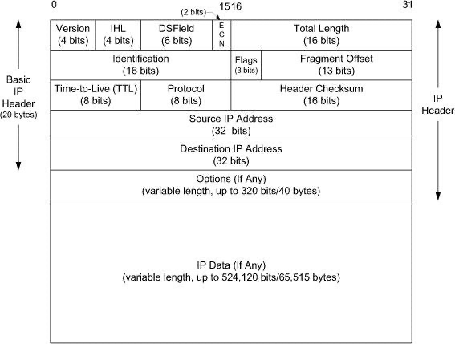
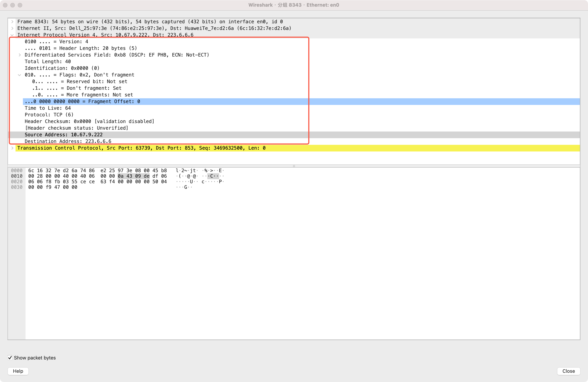
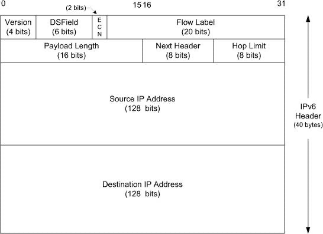
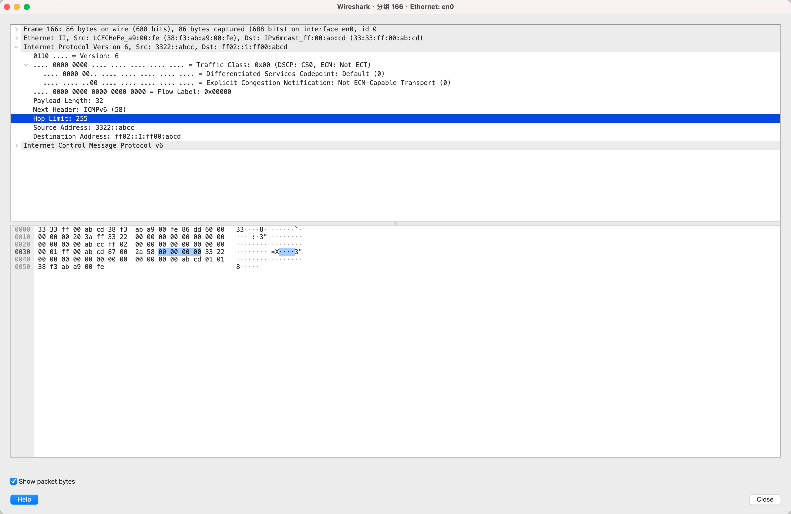
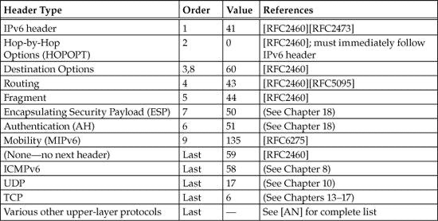
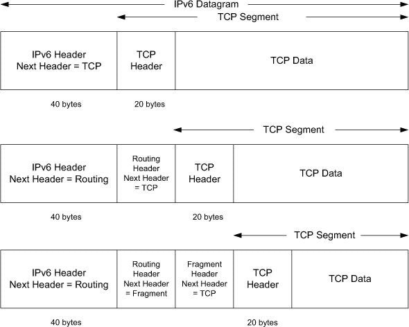
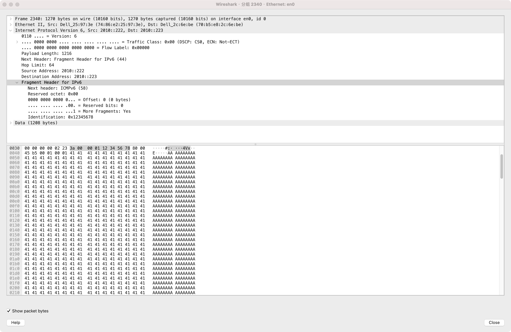

# 5.1. Introduction

IP provides a best-effort, connectionless datagram delivery service. 

# 5.2. IPv4 and IPv6 Headers

## 5.2.1. IP Header Fields

1. a host is not required to be able to receive an IPv4 datagram larger than 576 bytes.
2. In IPv6 a host must be able to process a datagram at least as large as the MTU of the link to which it is attached, and the minimum link MTU is 1280 bytes.
3. Many applications that use the UDP protocol (see Chapter 10) for data transport (e.g., DNS, DHCP, etc.) use a limited data size of 512 bytes to avoid the 576-byte IPv4 limit. TCP chooses its own datagram size based on additional information 

> **在 IPv4 中，协议保证：任何主机都必须能够“成功接收并重组”一个长度 ≤ 576 字节的完整 IPv4 数据报。**
> 在 IPv4 中，协议只要求主机至少能够接收长度不超过 576 字节的数据报，更大的报文并不保证所有主机都能处理。相比之下，IPv6 明确提高了这一最低能力要求，规定主机必须能够处理至少等于其直连链路 MTU 的数据报，**并将链路的最小 MTU 设为 1280 字节**。
>
> IPv4 标准只规定主机必须能够接收并重组总长度不超过 576 字节的 IP 数据报，这并不意味着路径中不会发生分片。由于 UDP 不提供重传和路径 MTU 探测机制，一旦分片中的任意一片丢失，整个报文都会失效，因此许多基于 UDP 的应用（如 DNS、DHCP）在设计时选择将应用层数据限制在 512 字节左右，以降低分片带来的风险并提高跨网络环境的兼容性。相比之下，TCP 通过 MSS 协商和路径 MTU 发现等机制，由协议栈动态调整报文段大小，应用本身通常无需关心底层的 MTU 和分片问题。
>
> **IP 层并不会预先知道整条路径上的最小 MTU。发送端 IP 层只能依据本地出口接口的 MTU 构造数据报**；当数据报在中途转发时，如果超过某个路由器出口接口的 MTU，该路由器要么进行 IPv4 分片（DF=0），要么丢弃报文并通过 ICMP 通知发送端（DF=1 或 IPv6）。发送端主机上的上层协议（如 TCP）根据这些 ICMP 消息逐步学习路径 MTU，并调整后续交给 IP 层的数据报大小。
>
> **对于 UDP，发送端主机默认不会根据 ICMP PTB 消息自动调整应用报文大小**.虽然内核可能维护路径 MTU 缓存，但 UDP 协议本身不利用该信息进行报文大小控制。除非应用显式启用 DF 语义并处理 EMSGSIZE 或实现应用层 PMTUD，否则 UDP 报文可能被 IPv4 分片或在路径中被丢弃。
> 
> **TCP 根据接收到的 ICMP PTB 消息更新其最大报文段大小（MSS），并通过内核维护的路径 MTU 缓存限制后续构造的 TCP 段大小**，从而确保交给 IP 输出路径的数据报大小不超过已知的路径 MTU。IP 协议实体本身不维护路径 MTU 状态，仅执行封装与逐跳转发规则。
>
>在 Linux 中，**路径 MTU（PMTU）由路由子系统维护并缓存在 struct dst_entry 中，主要依据接收到的 ICMP Packet Too Big 等错误进行更新**。IP 层本身不主动探测路径 MTU，也不会独立决定“合适的报文大小”；它仅根据上层提交的数据长度、dst_entry 中的 MTU 以及 DF/IPv6 语义，决定是否分片或直接返回错误。TCP 是 PMTU 感知的协议，内核会在 tcp_current_mss() 等路径中基于 dst_entry 的 PMTU 动态调整 MSS，从而在进入 IP 层之前就限制 TCP 段大小，使应用层通常无需关心 PMTU。**UDP 则完全不同：UDP 协议本身不使用 PMTU 信息来调整报文大小，内核默认可能依赖 IPv4 分片，或在 IPv6/启用 DF 语义时因超过 PMTU 而返回 EMSGSIZE 并触发 ICMP。若 UDP 应用希望正确适配路径 MTU，必须通过套接字 API 主动配合 PMTUD（如设置 IP_MTU_DISCOVER、IPV6_MTU_DISCOVER，并处理 EMSGSIZE/错误队列）**，由应用层根据内核返回的 PMTU 信息自行控制每个 UDP 报文大小，从而避免分片并实现真正的路径 MTU 感知发送。
>
> 交换机端口同样存在 MTU 限制，但它约束的是二层以太网帧的最大长度；当帧长度超过端口 MTU 时，**交换机通常直接丢弃该帧而不会进行分片或通知**，从而间接限制了上层 IP 报文的大小。


### IPv4 Header

**ipv4**:**The header is of variable size, limited to fifteen 32-bit words (60 bytes) by the 4-bit IHL field. A typical IPv4 header contains 20 bytes (no options).**





1. **Version**：标识所使用的 IP 协议版本，IPv4 中该字段固定为 4，用于区分不同版本的网络层协议并指导接收方按正确的协议格式解析数据报。

2. **IHL (Internet Header Length)**：表示 IPv4 首部长度，以 32 位字为单位，取值范围为 5–15，用于指示上层协议头部的起始位置，在存在首部选项时尤为关键。

3. **DS Field (Differentiated Services Field)**：用于表达服务质量与拥塞控制语义，其中 DSCP 指示分组的转发优先级，ECN 用于显式拥塞通知，但其端到端语义在跨自治系统环境中通常不稳定。

4. **Total Length**：表示整个 IPv4 数据报（首部加数据）的总长度，以字节为单位，是分片、重组以及分组边界判定的基础。

5. **Identification**：为原始 IPv4 数据报提供标识，使接收端能够将属于同一数据报的多个分片正确地进行重组。

6. **Flags**：包含分片控制位，其中 DF 表示禁止分片，MF 表示后续仍有分片，该字段与路径 MTU 发现机制（PMTUD）密切相关。

7. **Fragment Offset**：指示当前分片在原始数据报中的相对位置，以 8 字节为单位，是分片正确重组及防御分片相关攻击的重要依据。

8. **Time To Live (TTL)**：限制数据报在网络中的最大转发跳数，每经过一个路由器递减 1，用于防止分组在路由环路中无限传播。

9. **Protocol**：指明 IPv4 数据字段所封装的上层协议类型，使网络层能够将数据正确分用给相应的传输层或控制协议。

10. **Header Checksum**：对 IPv4 首部进行差错检测，每一跳转发时都需重新计算，用以保证首部在逐跳传输过程中的基本完整性。

11. **Source Address**：标识数据报的发送方 IPv4 地址，主要用于差错报告与反向通信，但不具备身份认证的安全语义。

12. **Destination Address**：标识数据报的目标 IPv4 地址，是路由查找与转发决策的核心依据。

13. **Options**：为 IPv4 提供可扩展功能支持（如时间戳、记录路由等），但由于性能与安全代价高，在实际网络中极少部署和使用。

14. **每经过一跳，IPv4 头部中的 TTL 字段都会减 1，而 IPv4 的头校验和只覆盖“头部”，因此必须重新计算。**

### IP Fragmentation (IPv4)

IP 分片是网络层为了解决**路径上链路 MTU 不一致**而引入的机制。当一个 IP 数据报长度超过出口链路的 MTU 时，IP 层会将其拆分为多个更小的分片分别发送。所有分片共享同一个 **Identification**，并通过 **Fragment Offset** 与 **MF（More Fragments）标志位**来标识它们在原始数据报中的位置以及是否还有后续分片。

在 IPv4 中，分片既可以发生在**源主机**，也可以发生在**中间路由器**；但**分片重组只在最终接收主机进行**。IP 层本身不提供重传机制，因此只要任意一个分片丢失，整个原始 IP 数据报都会被丢弃，这使得 IP 分片对丢包非常敏感。

由于分片带来的性能损耗、实现复杂度以及安全风险，现代网络设计倾向于**尽量避免 IP 分片**。TCP 通过 **MSS（Maximum Segment Size）** 在传输层提前进行分段，并结合 **DF 位 + Path MTU Discovery（PMTUD）** 动态探测路径 MTU，从而确保 IP 层不需要分片。IPv6 更是直接禁止路由器分片，将分片责任完全交给源主机，从协议层面弱化了 IP 分片的使用。

### IPv6 Header

**ipv6**:**The IPv6 header is of fixed size (40 bytes) and contains 128-bit source and destination addresses.**






1. **Version**：标识所使用的 IP 协议版本，在 IPv6 中该字段固定为 6，用于区分 IPv4 与 IPv6 并指导接收方按 IPv6 首部格式解析分组。

2. **Traffic Class**：用于表示分组的服务质量与拥塞控制语义，其功能等价于 IPv4 的 DS Field，包含 DSCP 和 ECN，比特语义在跨域网络中同样可能被重写。

3. **Flow Label**：用于标识同一流（flow）的 IPv6 分组，使网络设备能够对属于同一流的分组进行一致性处理，但在实际部署中使用程度有限。

4. **Payload Length**：表示 IPv6 基本首部之后所有负载的长度（不包含基本首部），用于界定分组边界并辅助接收端解析扩展首部链。

5. **Next Header**：指示紧随其后的**扩展首部或上层协议类型**，既承担 IPv4 中 Protocol 字段的功能，又用于串联 IPv6 扩展首部。

6. **Hop Limit**：限制分组在网络中的最大转发跳数，功能等同于 IPv4 的 TTL，每经过一个路由器递减 1，用于防止路由环路。

7. **Source Address**：标识分组的发送方 IPv6 地址，通常为 128 位单播、多播或地址，可被上层协议或安全机制进一步约束。

8. **Destination Address**：标识分组的接收方 IPv6 地址，是路由查找与转发决策的核心字段，在存在路由型扩展首部时可能发生逻辑变化。

9. **Extension Headers（扩展首部）**：用于承载可选功能（如分片、路由、安全等），以链式结构存在，使 IPv6 基本首部保持固定长度并简化路由器快速转发路径。

10. **Fragment Header（分片扩展首部）**：用于源主机对 IPv6 分组进行分片，IPv6 明确禁止中间路由器分片，**分片与重组完全由端系统负责**。

11. **ICMPv6 依赖**：IPv6 在路径 MTU 发现、差错报告和邻居发现等关键机制上高度依赖 ICMPv6，其可靠传递对 IPv6 正常运行至关重要。

### IPv4 vs IPv6

**IPv4 中，源主机和中间路由器都可以对数据包进行分片；而在 IPv6 中，只有源主机可以进行分片，中间路由器绝不分片。**

| 维度 | IPv4 | IPv6 |
|---|---|---|
| 二层地址解析 | ARP（广播） | NDP（多播） |
| 广播 | 大量使用 | 完全取消 |
| 首部长度 | 可变 | 固定 |
| 分片 | 路由器可分片 | 路由器禁止分片 |
| 校验和 | 有 | 无 |
| 控制协议 | 分散（ARP、ICMP、DHCP 等） | 集中于 ICMPv6 |
| 设计取向 | 功能集中 | 简化核心，功能外移 |

**总结性观点**

IPv6 相比 IPv4 的首要进步在于对网络层职责的重新定位。IPv6 将基本首部固定为 40 字节，删除校验和、路由器分片和可选字段，使网络层核心功能聚焦于高速、无状态的数据转发，从架构上更适合硬件化和大规模网络。

在可扩展性方面，IPv6 通过扩展首部机制取代 IPv4 的 IP Options，将可选功能模块化、链式组织，并明确区分端系统处理与逐跳处理的边界，从而避免可选功能对核心转发路径造成结构性影响。

在分片与控制模型上，IPv6 禁止路由器分片，将分片责任完全交由端系统，并通过 ICMPv6 统一承载错误、控制和邻居发现等功能，减少协议碎片化并提高网络行为的可预测性。

总体而言，IPv6 并非简单扩展地址空间，而是基于 IPv4 工程经验的一次体系化重构，其设计目标是在保证长期可演进性的同时，使网络层保持简洁、高效和可规模化。

## 5.2.3. DS Field and ECN (Formerly Called the ToS Byte or IPv6 Traffic Class)

略

## 5.2.4. IP Options

IP Options 是 IPv4 首部中用于扩展网络层功能的可选机制，采用 TLV（Type–Length–Value）编码形式，位于基本首部之后，使 IPv4 首部长度可由固定的 20 字节扩展至最多 60 字节。其设计目标是在网络层直接支持路径控制、测量、调试和安全标记等高级功能。

从结构上看，IP Options 并非等长字段，而是由多个长度不一的选项顺序拼接而成，并通过 NOP 与 EOL 选项完成 32 位对齐。每个选项的 Type 字段同时编码了分片复制语义（Copy bit）、功能类别和具体编号，这使得 Options 在分片场景下具有明确但复杂的处理规则。

典型的 IP Options（如 Record Route、Timestamp、Source Route）主要用于路径记录与控制，但它们在可扩展性、性能和安全性方面存在明显缺陷。例如，Options 会迫使路由器进入慢路径处理，Source Route 还可能被滥用于绕过安全策略，因此在实际网络中通常被过滤或直接丢弃。

从设计演进角度看，IP Options 反映了 IPv4“在网络层集中解决问题”的早期互联网思想，而其在工程实践中的失败经验，直接促成了 IPv6 采用扩展首部（Extension Headers）重新设计可选功能，并将复杂逻辑从核心转发路径中系统性地移除。

## 5.3. IPv6 Extension Headers

the designers of IPv6 have made the design and construction of high-performance routers easier because the demands on packet processing at routers can be simpler than with IPv4.（头固定， 处理更高效）

> 从协议语义上看，IPv4 并不要求路由器无条件解析所有 IP Options，部分选项仅由目的节点处理，路由器在规范层面可以选择忽略不关心的选项。
>
> 但在工程实现中，IPv4 的可变首部长度使路由器无法真正“跳过”Options：即使不处理其语义，也必须解析 IHL 以确定上层首部位置，同时还需考虑分片复制语义和潜在的逐跳选项，从而增加转发路径复杂度。
> 
> 相比之下，IPv6 通过固定长度的基本首部，将转发所需信息限定在固定偏移位置，使路由器在不理解扩展首部内容的情况下即可完成转发，从结构上实现了“是否解析扩展首部”的真正可选性。
>
> 因此，两者的关键差异不在于是否允许忽略可选字段，而在于首部结构是否允许在规模化、高速转发环境中将可选功能彻底隔离出核心转发路径。

**The values for the IPv6 Next Header field may indicate extensions or headers for other protocols. The same values are used with the IPv4 Protocol field, where appropriate.**


> IPv6 扩展首部在报文中按约定顺序排列，每个首部通过 Next Header 字段指向下一个首部，最终指向上层协议。这个顺序称为“Order Value”，确保逐跳处理的首部与端到端处理的首部明确分离。
> 
> 典型顺序是：Hop-by-Hop Options → Routing Header → Fragment Header → AH/ESP → Destination Options → 上层协议。其中 Hop-by-Hop Options 紧跟基本首部，逐跳路由器可能解析；Destination Options 可出现两次，用于途中节点或最终节点处理。
> 
> 通过 Order Value，IPv6 实现了可扩展性和高速转发的平衡：路由器只需处理核心必须字段即可快速转发，扩展功能模块化、逐步演进，而不会影响转发路径性能或协议兼容性。

**IPv6 headers form a chain using the Next Header field. Headers in the chain may be IPv6 extension headers or transport headers. The IPv6 header appears at the beginning of the datagram and is always 40 bytes long.**


### 5.3.1. IPv6 Options

#### 总览举例：

```shell
IPv6 Base Header (40B)
      ↓
Extension Header 1 (Hop-by-Hop Options Header)
      └─ Options 1 (Type, Length, Value)
      └─ Options 2 (Type, Length, Value)
      ...
      ↓
Extension Header 2 (Destination Options Header)
      └─ Options A
      └─ Options B
      ...
      ↓
上层协议 (TCP/UDP/ICMPv6)
```

**IPv6 报文在固定 40 字节的基本首部之后，可以按需串联 0 个或多个 Extension Header；这些 Extension Header 用来定义扩展信息的“处理范围和位置”。其中只有特定类型的扩展首部（Hop-by-Hop Options Header 和 Destination Options Header）采用 Options 这种 TLV 形式作为内部负载，因此一个这样的扩展首部内部可以包含 0 个或多个 IPv6 Option，而其他扩展首部本身即携带语义，不包含 Options。**

#### Extension Header 说明

| Extension Header 名称                  | Next Header 值 | 是否包含 Options | 典型长度 / 结构        | 处理节点                         | 作用说明                                                           |
| ------------------------------------ | ------------- | ------------ | ---------------- | ---------------------------- | -------------------------------------------------------------- |
| Hop-by-Hop Options Header            | 0             | 是            | 8 字节起，8 字节对齐，可变长 | 每一跳路由器                       | 承载逐跳需要处理的 IPv6 Options（如 Router Alert、Jumbo Payload），会显著影响转发性能 |
| Destination Options Header           | 60            | 是            | 8 字节起，8 字节对齐，可变长 | 目的节点或 Routing Header 指定的中间节点 | 承载仅对特定节点有意义的 Options，常用于端到端、隧道或控制语义                            |
| Routing Header                       | 43            | 否            | 8 字节起，可变长        | 被指定的路由节点                     | 指定数据包必须经过的节点列表（源路由），现代网络中使用受限                                  |
| Fragment Header                      | 44            | 否            | 固定 8 字节          | 仅目的节点                        | IPv6 分片与重组控制，中间路由器不进行分片                                        |
| Authentication Header (AH)           | 51            | 否            | 可变长（32 位对齐）      | 安全通信端点                       | 提供报文完整性、数据源认证与防重放，不加密负载                                        |
| Encapsulating Security Payload (ESP) | 50            | 否            | 可变长              | 安全通信端点                       | 提供负载加密与可选认证，常用于 IPsec                                          |
| No Next Header                       | 59            | 否            | 无                | —                            | 明确表示报文到此结束，没有上层协议                                              |

#### Options 说明

**Hop-by-Hop Options Header 和 Destination Options Header 复用同一套 IPv6 Option 的 TLV 编码与处理机制，但具体 Option 的语义明确限定其只能出现在特定的扩展首部中（例如 Router Alert 仅用于 Hop-by-Hop）。**


```shell
// Options 主要结构如下， 这里不做过多展开， 略
  0                   7 8                  15
  +-------------------+----------------------+
  |    Option Type    |    Option Length     |
  |      (8 bits)     |      (8 bits)        |
  +-------------------+----------------------+
  |                                              
  |            Option Data (Length bytes)
  |                                              
  +----------------------------------------------+
```

### 5.3.2. Routing Header

---

IPv6 Routing Header 是一种 IPv6 扩展首部，用于由源节点在数据包中显式指定一个或多个必须经过的中间节点，从而对数据包的转发路径施加约束。与 IPv6 Options 不同，Routing Header 自身即为完整语义结构，不采用 TLV 形式，也不承载 IPv6 Options。

Routing Header 位于 IPv6 基本首部之后，并通过 Next Header 字段与其他扩展首部串联。其核心机制是在转发过程中允许临时修改 IPv6 基本首部中的 Destination Address，使数据包在到达最终目的节点之前，能够依次被导向 Routing Header 指定的中间节点。

Routing Header 通过 Routing Type 字段指示具体的路由方式，并通过 Segments Left 字段表示尚未访问的节点数量。每当数据包到达一个被指定的节点并由其处理时，Segments Left 会递减，同时更新 IPv6 基本首部中的目的地址为下一个待访问的节点。

只有当节点发现当前 IPv6 目的地址与自身匹配且 Segments Left 大于 0 时，才会处理 Routing Header；普通中间路由器仅依据常规转发表进行转发，不解析 Routing Header 的节点列表。由于安全性和可控性方面的考虑，传统源路由相关的 Routing Header 类型在现代 IPv6 网络中使用受到严格限制。

### 5.3.3. Fragment Header

---

IPv6 Fragment Header 是一种 IPv6 扩展首部，用于支持数据包在**源节点**进行分片并在**目的节点**进行重组。与 IPv4 不同，IPv6 明确规定中间路由器不得对数据包进行分片，分片行为只能由源节点发起，这一设计简化了转发路径并提高了整体转发性能。

Fragment Header 位于 IPv6 基本首部之后，通过 Next Header 字段与后续扩展首部或上层协议首部相连。其结构为固定长度 8 字节，包含 Fragment Offset、M（More Fragments）标志以及 Identification 字段，用于在目的节点正确识别、排序和重组分片后的数据包。

Fragment Offset 字段指示当前分片在原始数据包中的位置，单位为 8 字节；M 标志用于表明是否还有后续分片存在；Identification 字段用于唯一标识属于同一个原始数据包的所有分片。目的节点依据这些字段，在接收完所有分片后完成重组并交付上层协议。

只有最终目的节点会处理 Fragment Header，中间路由器在转发过程中既不解析也不修改该扩展首部。如果目的节点在重组过程中发现分片缺失、重叠或超时，重组将失败并丢弃相关分片。Fragment Header 的存在使 IPv6 将分片复杂度从网络核心转移至通信端点，符合端到端设计原则。

#### 举例

**构造带有Fragment Header的ipv6报文**

```py
    1 from scapy.all import *
    2 
    3 pkt = (
    4     IPv6(
    5         src="2010::222",
    6         dst="2010::223"
    7     ) /
    8     IPv6ExtHdrFragment(
    9         id=0x12345678,
   10         offset=0,
   11         m=1      # More Fragments = 1
   12     ) /
   13     ICMPv6EchoRequest(
   14         id=1,
   15         seq=1
   16     ) /
   17     Raw(b"A" * 1200)
   18 )
   19 
   20 send(pkt, iface="en0")
```

**抓包**



#### scapy 简介

**Scapy 概述**

Scapy 是一个基于 Python 的报文构造与解析库，用于在用户态精确描述、生成、发送和解析网络协议报文。它不是对 socket 的简单封装，而是将各层网络协议抽象为可组合的对象，使开发者可以直接操作协议字段本身，而不受限于操作系统提供的高层网络接口。

**报文构造能力**

Scapy 的核心能力在于：

* 可以构造完全符合 RFC 的标准协议报文
* 可以构造字段缺失、顺序异常或值非法的非标准报文
* 可以发送被操作系统协议栈通常禁止或自动修正的报文

因此，Scapy 特别适合用于协议学习、抓包验证、安全测试以及网络设备异常行为分析，而这些场景是普通 socket 编程难以覆盖的。

**发送模型（L2 / L3）**

Scapy 支持两种主要发送方式：

* **L3 发送（send / sr）**：
  报文会进入内核协议栈，由内核负责路由选择、邻居发现（ARP / ND）等处理，适合验证主机正常协议行为。

* **L2 发送（sendp / srp）**：
  直接构造并发送以太网帧，绕过内核协议栈，可完全控制 MAC、VLAN、IPv6 扩展头等细节，适合底层协议与设备行为测试。

**使用定位说明**

Scapy 的设计目标是“精确控制，而非高性能通信”。它并不适合用于生产环境中的高吞吐数据传输，但在以下场景中具有不可替代的价值：

* 网络协议机制验证
* 报文级调试与复现问题
* 防火墙 / WAF / 路由设备行为分析
* 安全测试与模糊测试（Fuzzing）

在工程实践中，Scapy 更像是一把“协议级手术刀”，而不是通用网络通信库。

**模拟发送syn包**

```py
from scapy.all import *

pkt = IPv6(
    src="2001:db8::1",
    dst="2001:db8::2"
) / TCP(
    sport=12345,
    dport=80,
    seq=1000,
    flags="S"
)

send(pkt, verbose=True)
```

# 5.4. IP Forwarding

> In our general scheme, the IP protocol can receive a datagram either from another protocol on the same machine (TCP, UDP, etc.) or from a network interface. The IP layer has some information in memory, usually called a routing table or forwarding table, which it searches each time it receives a datagram to send. （这段读的很别扭：数据报可能来自两个方向：一是由本地主机上的上层协议（如 TCP、UDP）交付给 IP；二是由网络接口接收后，经链路层解封装交付给 IP。）
> 
> 当 IP 层接收到一个目的地址不属于本机的 IP 数据报时，该数据报被视为过境流量。如果启用了 IP 转发功能，数据报将按照路由表通过输出路径进行转发；如果未启用转发，则该数据报会被丢弃。在某些错误情况下（例如未找到可用路由），IP 层可能会向源主机发送 ICMP 错误报文。

### 补充：透明代理

1️⃣ **主机作为下一跳（L2 目的 MAC 是本机）**
- 上游设备把帧的目的 MAC 指向本机，但 IP 目的地址仍然不是本机。
- 典型用途：软路由、网关、透明代理盒子。
- 这是合法收到的过境流量。

2️⃣ **二层欺骗 / 劫持（ARP / ND）**
- 主机通过欺骗让客户端认为它是默认网关，从而接收原本发往其他 IP 的流量。
- 常见于透明代理、安全设备、流量分析、攻防实验。
- 这是透明代理最常用的流量引导方式。

3️⃣ **交换机行为导致的旁路接收**
- 主机被动收到数据报，但不参与正常转发路径，例如 Port Mirroring、Hub/Flood、无线监听模式。
- 透明代理一般不使用这种方式。

## 5.4.1. Forwarding Table

1️⃣ **什么是 IP 转发和转发表**  
IP 转发是指在网络中将收到的 IP 数据报送往目的地的过程。每台路由器或主机通过**转发表（forwarding table）**决定下一步该把数据报送往哪个节点。转发表只提供**下一跳（next hop）**的 IP 地址，而不是整条路径。

2️⃣ **IP 转发的原则**  
- **下一跳离目的地更近**：hop-by-hop 转发假设每次向下一跳前进，离目的地更近，保证数据报沿正确路径前进，不会绕路。  
- **下一跳必须可达**：下一跳路由器必须与当前节点直接相连（同一网络/子网），才能通过链路层发送数据报。  
- **防止环路**：数据报不会无限循环，TTL（IPv4）或 Hop Limit（IPv6）限制了最大跳数。

3️⃣ **如何保证转发表正确性**  
IP forwarding 本身只按转发表转发，不会计算路由。转发表的正确性依赖**路由协议**来维护。路由协议负责学习网络拓扑、计算各目的地的最佳下一跳，并避免形成转发环路。  
常见路由协议包括：
- RIP（距离向量）  
- OSPF（链路状态）  
- BGP（自治系统间路由）  
- IS-IS（链路状态）

4️⃣ **直接投递的特殊情况**  
对于与主机或路由器直接相连的目的地，数据报可以直接通过链路层投递到目标，不需要经过下一跳路由器。

## 5.4.2. IP Forwarding Actions

IP 转发时，系统会对目的 IP 地址执行 **最长前缀匹配（Longest Prefix Match）**，在转发表中查找所有能够匹配该目的地址的条目，并选择 **掩码中 1 的数量最多**（即最具体）的那一条作为最佳匹配。随后，系统使用该条目中指定的 **下一跳 IP 地址** 将数据报转发出去。

在实际系统中，主机和路由器的转发表通常都包含一条 **默认路由**（IPv4 为 `0.0.0.0/0`，IPv6 为 `::/0`），用于匹配所有未被更具体路由覆盖的目的地址。因此，对普通主机而言，绝大多数目的地址都会至少匹配到默认路由，数据报会被发送到默认网关，而不是在本机直接判定为不可达。

**只有在转发表中确实不存在任何匹配条目（包括默认路由）时**，数据报才会被认为是不可达。在这种情况下：

- 对于 **本地主机**，操作系统会向产生该数据报的应用返回错误（如 *host unreachable*）。
- 对于 **路由器**，通常会向数据报的源主机发送一条 **ICMP Destination Unreachable** 错误消息。

需要注意的是，目的地址“最终不可达”并不等同于“本机没有路由匹配”。在大多数实际场景中，数据报仍然会按照默认路由被发送到下一跳，只是在网络中的后续某一跳被丢弃或返回 ICMP 错误。

### 补充说明一：协议栈视角主机发包流程

一句话总结就是： **IP层找到下一跳， 链路层找到对应下一跳的mac**
主机发送数据时，经历了应用层、传输层、网络层、链路层和物理层的逐层处理，流程如下：

---

**1. 应用层 / 传输层**
- 应用层生成要发送的数据（例如 HTTP 请求）。
- 传输层（TCP/UDP）将数据封装成段（Segment）或数据报（Datagram），加上源端口和目的端口。

---

**2. 网络层（IP 层）**
- TCP/UDP 段交给 IP 层，封装成 IP 数据报，填入源 IP 和目的 IP。
- **路由匹配**：
  - 查路由表（Routing Table），找到目的 IP 对应的下一跳（Next Hop）。
  - 使用最长前缀匹配（子网掩码中 1 最多的条目）。
  - 如果路由表没有匹配条目，主机无法找到下一跳，数据报会发送失败（主机会丢包），并返回给应用层一个网络不可达错误。

---

**3. 数据链路层（以太网）**
- 根据下一跳 IP，通过 ARP 查询对应 MAC 地址。
- 封装成以太网帧：
  - 源 MAC：本机接口 MAC
  - 目的 MAC：下一跳设备 MAC
  - 如果涉及 VLAN 或 Trunk，还会加上 VLAN 标签。

---

**4. 物理层**
- 帧通过网卡发送，沿物理介质（电缆、光纤、无线）到达下一跳。

## 5.4.3. Examples

### 这一节在讲什么
5.4.3 通过具体例子说明：当 IP 层要发送一个数据报时，是如何根据路由表决定采用**直接交付**还是**间接交付**的。核心不在协议字段细节，而在于 **路由匹配 → 下一跳选择 → 数据报交付方式**。

### 直接交付（Direct Delivery）
当目的 IP 地址与本机某个接口处于**同一 IP 网络（前缀匹配）**时，IP 层认为目的主机就在本地链路上。此时不需要经过路由器，IP 层把数据报交给链路层，通过 ARP 解析目的主机的 MAC 地址，直接封装成链路层帧并发送，这称为直接交付。

### 间接交付（Indirect Delivery）
当目的 IP 地址不属于任何本地接口的网络时，IP 层在路由表中找不到直连网络匹配项，就会选择一条更通用的路由（通常是默认路由）。此时数据报的下一跳是路由器，链路层解析的是**路由器的 MAC 地址**，数据报被发送给路由器，再由路由器继续转发，这称为间接交付。

### 核心结论
- IP 层只负责决定**下一跳 IP**，不关心最终目的主机是否就在本地。
- 是否直接交付，完全由**路由匹配结果**决定，而不是物理拓扑的直觉判断。
- **ARP 总是在下一跳确定之后发生**，用于把“下一跳 IP”映射为对应的 MAC 地址。

# 5.5. Mobile IP

### 什么是 Mobile IP
Mobile IP 是一种工作在 **网络层（IP 层）** 的机制，用于支持一台主机在 **更换 IP 网络** 时，仍然能够继续使用原来的 IP 地址进行通信。它解决的不是“如何接入网络”，而是“当主机的位置发生变化后，IP 层如何保证数据包仍能送达”。

---

### 它不等同于“移动网络”
Mobile IP 与手机、基站、无线链路、4G/5G 等 **移动通信技术无直接关系**。这些技术解决的是物理层和链路层的接入问题；Mobile IP 假设主机已经连入某个 IP 网络，只关注 **IP 地址与网络位置不再一致时的处理方式**。

---

### Mobile IP 的核心逻辑
Mobile IP 的基本思想是：**不让整个互联网感知主机的移动，而由主机原来的网络代替它接收数据包并进行转发**。主机对外始终使用固定的归属地址，而其当前位置通过一个临时地址告知原网络中的代理节点。

---

### 关键机制
发往移动主机的 IP 数据报按照普通路由规则到达其归属网络，由归属代理截获后，通过 **IP 封装（隧道）** 的方式转发到主机当前所在的网络。对通信对端而言，IP 地址和通信过程都保持不变。

---

### 本章的意义
Mobile IP 并非一个被广泛采用的现代方案，而是一个用于展示 **IP 设计边界和代价** 的典型例子。本章说明：当试图在 IP 层支持移动性时，必须引入代理、隧道和额外状态，从而导致路径不最优和系统复杂度上升。

---

### 一句话总结
Mobile IP 本质上是 **“网络层的代理机制 + 隧道转发”**，用于在不修改现有 IP 路由体系的前提下，为主机移动提供一种工程性的补救方案。

# 5.6. Host Processing of IP Datagrams

A more subtle point we shall explore is whether to accept traffic destined for a local IP address if it arrives on the wrong interface (i.e., one that is not configured with the destination address present in a received datagram).


在多接口、多地址的主机上，主机不仅要决定**发送数据报时使用哪个源 IP 和接口**，还必须决定**接收数据报时是否接受某个目的 IP 属于自己的报文**。相比之下，路由器只负责转发分组，并不需要考虑这些选择问题。

所谓 **“错误接口（wrong interface）”**，是指一个数据报的**目的 IP 地址配置在本地主机上**，但该报文却是**从一个并未配置该 IP 地址的网络接口进入**的。从 IP 语义上看，这是发往本机的合法报文；但从接口划分和网络拓扑的角度看，这是一条不合理的到达路径。

这种情况并非罕见。非对称路由、ARP 异常、广播或泛洪、虚拟化环境、透明代理，以及恶意构造的报文，都可能导致数据报从“错误”的接口到达主机。因此，简单地将其视为错误并丢弃并不总是合适的。

为此，主机协议栈提出了两种不同的接收模型：  
**弱主机模型（Weak Host Model）** 只要目的 IP 属于本机，便接收该报文，而不关心其入接口；  
**强主机模型（Strong Host Model）** 则要求目的 IP 必须与入接口上配置的地址匹配，否则丢弃。  
这种模型选择直接影响主机的安全性、路由一致性，以及防火墙、虚拟化和流量劫持等高级网络功能的行为。

### 一些题外话

**1. 驱动 & 固件 & 协议栈**

| 组件                     | 主要对应的网络层             | 本质角色                    |
| ---------------------- | -------------------- | ----------------------- |
| **网卡固件（NIC Firmware）** | 物理层 + 数据链路层（L1 + L2） | 硬件侧的数据收发与部分 L2 offload  |
| **网卡驱动（NIC Driver）**   | 数据链路层（L2）＋ L2/L3 边界  | 操作系统与网卡之间的桥梁            |
| **协议栈（Network Stack）** | 网络层及以上（L3–L7）        | IP / TCP / UDP / 应用协议实现 |

**2. 链路层 vs IP 层的“接收判断”本质区别**

Weak Host Model / Strong Host Model 只存在于 IP 层（L3）

原因在于 IP 地址是主机级的全局标识，一台主机可以有多个接口、多个 IP。内核必须决定：当一个数据包从某个接口进入，而目的 IP 属于“本机但不属于该入接口”时，是否接收。这正是 Strong Host（必须属于入接口）与 Weak Host（属于任意接口即可）的差异来源。

---

**3. 链路层没有 Weak / Strong Host Model**

链路层（L2）不存在 Weak / Strong Host Model 的概念。  
L2 的判断逻辑极其简单且严格：**逐接口判断目的 MAC**。每个网口独立检查收到的以太网帧，只有当目的 MAC 是**本接口 MAC、广播地址或该接口已加入的多播 MAC**时才会接收，否则直接丢弃。链路层从不考虑“这个 MAC 是否属于本机其他接口”，也不存在跨接口的语义判断。

---

**4. 混杂模式不是 Weak Host Model**

---

混杂模式（Promiscuous Mode）只是关闭了链路层的 MAC 过滤，让接口把“本不该收的帧”也交给上层查看，常用于抓包、桥接或调试。  
它不改变协议语义，也不引入跨接口判断，因此与 Weak Host Model 完全不是一类机制。


---

**5. 把“本不该收的帧”也交给上层查看**

混杂模式只改变链路层的行为：原本因目的 MAC 不匹配而被丢弃的以太网帧，仍会被递交给上层协议栈。但进入上层后，内核会按正常的协议语义继续判断：在 IP 层，目的 IP 不属于本机（或不满足 Strong / Weak Host Model）的数据包会被直接丢弃；即使 IP 合法，传输层在没有对应 socket 的情况下也会继续丢包。因此，混杂模式并不意味着数据“被接收成功”，它只是让这些帧有机会被观察或旁路处理，真正是否接收仍由 IP 和传输层决定。


---

**6.一句话总结**

IP 层之所以需要 Weak / Strong Host Model，是因为 IP 是主机级地址；而 MAC 是接口级身份，链路层只做“是不是我的帧”判断，因此根本不需要这种模型。


## 5.6.1. Host Models (重要)

> 一台多网卡主机，到底是“一个整体”，还是“多个接口的集合”？

There are two host models, the strong host model and the weak host model.

There are two host models, the strong host model and the weak host model. In the strong host model, a datagram is accepted for delivery to the local protocol stack only if the IP address contained in the Destination IP Address field matches one of those configured on the interface upon which the datagram arrived. In systems implementing the weak host model, the opposite is true—a datagram carrying a destination address matching any of the local addresses may arrive on any interface and is processed by the receiving protocol stack, irrespective of the network interface upon which it arrived. Host models also apply to sending behavior. That is, a host using the strong host model sends datagrams from a particular interface only if one of the interface’s configured addresses matches the Source IP Address field in the datagram being sent.

### 一点题外话

本节（5.6 Host Processing of IP Datagrams / 5.6.1 Host Models）虽然位于一本较早的 TCP/IP 经典著作中，但其讨论的问题，构成了**现代透明代理、WAF、虚拟化与 Netfilter 流量劫持的 IP 层理论基础**。

---

#### 1. 5.6 在解决什么核心问题

5.6 关注的并不是路由算法，而是一个更基础的问题：

> **当 IP 数据报已经通过二层（MAC）校验并进入主机后，IP 层是否应该接收这个数据报？**

尤其是以下场景：

* 目的 IP 是本机地址
* 但数据报是从**未配置该 IP 的接口**进入

这个问题直接决定了：

* 主机是否能够接收“非本地接口”的流量
* 后续是否存在流量重定向、代理或劫持的可能性

---

#### 2. Host Models：接收语义的分水岭

##### 2.1 Weak Host Model（弱主机模型）

**核心思想**

* 只要目的 IP 属于本机，就接收数据报
* 不要求进入接口与 IP 地址绑定

**工程后果**

* 允许非对称路由
* 支持透明代理与流量劫持
* 接口隔离较弱，安全边界依赖额外机制

---

##### 2.2 Strong Host Model（强主机模型）

**核心思想**

* 目的 IP 必须属于本机
* 且必须从配置该 IP 的接口进入

**工程后果**

* 接口边界清晰
* 安全性更高
* 对透明代理与中间人行为不友好

---

#### 3. 与 WAF 透明代理的直接关系

透明 WAF 的典型特征是：

* 接收到的流量目的 IP 是**真实服务器地址**
* 而非 WAF 本机接口 IP

从 5.6 的角度看：

* 这类流量天然属于 *wrong interface* 场景
* 只有在弱主机模型或等效放行策略下，IP 层才会接收该流量

若严格执行强主机模型：

* 数据包会在 IP 层被直接丢弃
* Netfilter 与用户态代理将无法介入

---

#### 4. 与 Netfilter 流量劫持的关系

Linux Netfilter 的一个关键事实是：

> **Netfilter 只能处理已经被 IP 层接收的数据包**

其逻辑位置可以抽象为：

```
L2 接收
  ↓
IP 基本校验（版本、长度、校验和）
  ↓
IP 接收判定（Host Model）
  ↓
Netfilter 钩子（PREROUTING / INPUT 等）
```

因此：

* 5.6 / 5.6.1 的接收策略
* 是 DNAT、REDIRECT、TPROXY 等机制成立的前提

---

#### 5. 与 KVM / 虚拟化网络的关系

在 KVM、容器与虚拟交换场景中：

* 一台物理主机往往同时扮演：

  * 终端主机
  * 路由器
  * 二层或三层交换节点

虚拟机流量经常进入宿主机的接口，但目的 IP 并非宿主机本身。

这迫使系统在以下两者之间做出权衡：

* 主机级 IP 接收
* 接口级网络隔离

而这一权衡，正是 5.6.1 Host Models 讨论的核心问题。

---

#### 6. 为什么这一章具有前瞻性

作者在本章中已经清楚地指出：

> **IP 层的接收语义，将决定一台主机是否能够成为“流量拦截点”**

这一结论直接影响了后来的：

* 透明代理
* WAF / IPS
* SDN
* 虚拟化网络
* Service Mesh
* eBPF 流量控制

---

#### 7. 总结

**TCP/IP 详解 卷一第 5.6 / 5.6.1 章，本质上是在回答一个问题：**

> *一台主机，在 IP 层是否允许自己成为一个中间节点，而不仅仅是通信端点？*

现代的流量劫持与透明代理技术，正是这一问题在工程实践中的自然延伸。

## 5.6.2. Address Selection

### 一、这一节解决什么问题

**Address Selection（地址选择）**回答的是主机在发包时的核心问题：

> 当**本机有多个 IP 地址**、**对端也可能有多个 IP 地址**时，  
> **源 IP 和目的 IP 应该选哪一个？**

这是**主机（host）**必须处理的问题，而不是路由器的问题。

---

### 二、基本思想（总原则）

#### 1. 路由优先，地址随后

地址选择一定发生在**路由选择之后**：

1. 根据候选的目的 IP 查路由表  
2. 得到：
   - 出接口（egress interface）
   - 下一跳（next hop）
3. **源地址只能从该出接口拥有的地址中选择**

> 地址选择不能违背路由选择结果。

---

#### 2. 源地址必须“逻辑上可达”

被选中的源地址必须满足：

- 属于出接口
- 与目的地址地址族一致（IPv4 ↔ IPv4，IPv6 ↔ IPv6）
- 地址状态可用  
  - 不能是 tentative / duplicated  
  - IPv6 中不能是 deprecated
- 地址作用域（scope）合理  
  - 不能用 link-local 去访问 global 地址

---

### 三、IPv4 的 Address Selection（相对简单）

IPv4 的规则较为朴素：

- 默认使用出接口的 **主地址**
- 如果接口有多个 IPv4 地址：
  - 选择与目的地址**网络前缀最匹配**的
- 如果应用显式 `bind()` 源地址：
  - 协议栈必须使用该地址（前提是路由可达）

> IPv4 中地址类型单一，因此不需要复杂优先级规则。

---

### 四、IPv6 的 Address Selection（重点内容）

IPv6 中一个接口可能同时存在：

- link-local
- global
- unique-local
- temporary（隐私地址）
- deprecated 地址
- 多个前缀

因此 IPv6 定义了**严格的地址选择规则**（RFC 6724）。

---

#### IPv6 源地址选择的核心规则（简化版）

当存在多个候选源地址时，按顺序比较：

1. **避免不可用地址**
   - 不选 deprecated、tentative 地址
2. **作用域匹配（Scope Match）**
   - link-local ↔ link-local
   - global ↔ global
3. **匹配目的地址的前缀**
   - 与目的地址前缀相同或更接近的更优
4. **地址类型优先级**
   - 是否使用 temporary 地址取决于系统策略
5. **最长前缀匹配**
   - 前缀越长，优先级越高

> 这些规则的目标是保证可达性、路径对称性以及隐私与稳定性的平衡。

---

### 五、目的地址的选择（DNS 返回多个地址）

当应用使用 **hostname** 连接时：

1. DNS 返回多个 A / AAAA 记录
2. 协议栈或应用：
   - 按策略排序（IPv6 / IPv4 优先）
   - 或逐个尝试
3. **每尝试一个目的地址，都会重新进行一次源地址选择**

> Address Selection 本质上是  
> **「目的地址 × 本地接口地址」的组合决策过程**。

---

### 六、错误地址选择的典型后果

如果地址选择不当，可能导致：

- 数据包从**错误接口**发出
- 源地址与出接口不匹配
- 对端回包走另一条路径
- 最终表现为：
  - 连接失败
  - “看起来像丢包”

这也是为什么：

> **主机必须比路由器更严格地进行地址选择**

路由器只转发，不生成通信语义；  
主机是通信端点，必须保证地址语义正确。

---

### 七、一段话总结

> **5.6.2 Address Selection 描述了主机在发包前，如何在多接口、多地址的环境下，在路由确定之后，根据接口、地址状态、作用域和前缀匹配规则，为每一次通信选择一个逻辑上可达且语义正确的源地址与目的地址组合；其中 IPv6 由于地址类型复杂，定义了严格的优先级规则，而 IPv4 相对简单。**
