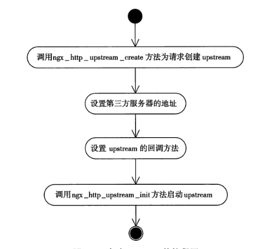
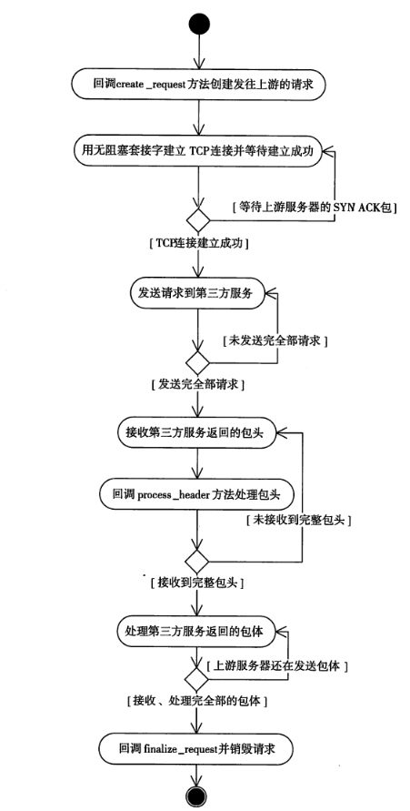
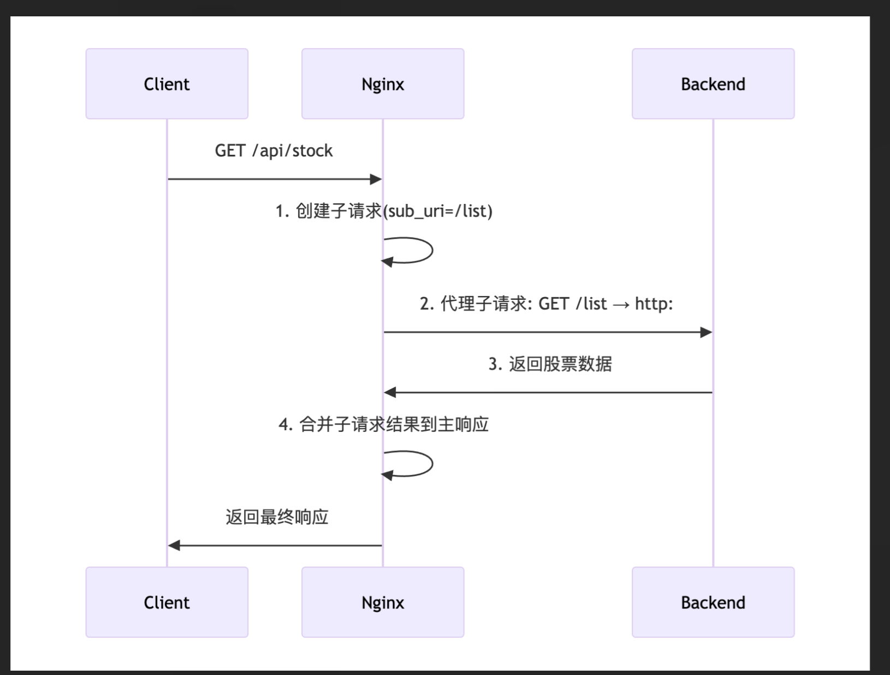
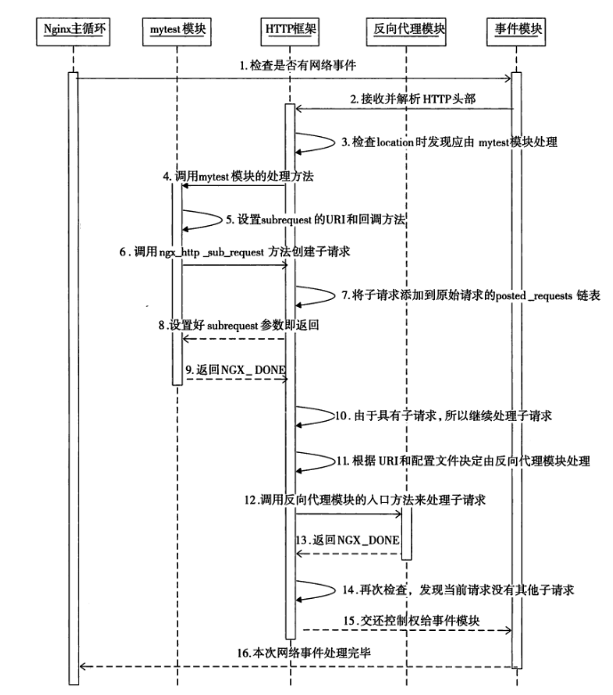

## 1. Upstream

### 1.1 总览





**结构概览**
```c
// 1.
ngx_http_mytest_handler(ngx_http_request_t * r)

// 2.
typedef struct ngx_http_request_s     ngx_http_request_t;

// 3.
struct ngx_http_request_s {
    ...
    ngx_http_upstream_t              *upstream;
    ...
}

// 4. upstream 结构体 
struct ngx_http_upstream_s {
    ngx_http_upstream_handler_pt     read_event_handler;
    ngx_http_upstream_handler_pt     write_event_handler;

    ngx_peer_connection_t            peer;

    ngx_event_pipe_t                *pipe;

    ngx_chain_t                     *request_bufs; // 发送什么样的请求给上游

    ngx_output_chain_ctx_t           output;
    ngx_chain_writer_ctx_t           writer;

    ngx_http_upstream_conf_t        *conf;  // 限制参数

    ngx_http_upstream_headers_in_t   headers_in;

    ngx_http_upstream_resolved_t    *resolved; // 上游服务器地址

    ngx_buf_t                        buffer;  // 上游服务器响应
    size_t                           length;

    ngx_chain_t                     *out_bufs;
    ngx_chain_t                     *busy_bufs;
    ngx_chain_t                     *free_bufs;

    ngx_int_t                      (*input_filter_init)(void *data);
    ngx_int_t                      (*input_filter)(void *data, ssize_t bytes);
    void                            *input_filter_ctx;

#if (NGX_HTTP_CACHE)
    ngx_int_t                      (*create_key)(ngx_http_request_t *r);
#endif
    ngx_int_t                      (*create_request)(ngx_http_request_t *r); // 发送给上游服务器的请求内容
    ngx_int_t                      (*reinit_request)(ngx_http_request_t *r);
    ngx_int_t                      (*process_header)(ngx_http_request_t *r); // 收到响应后回调
    void                           (*abort_request)(ngx_http_request_t *r); 
    void                           (*finalize_request)(ngx_http_request_t *r, 
                                         ngx_int_t rc);  // 销毁时调用
    ngx_int_t                      (*rewrite_redirect)(ngx_http_request_t *r,
                                         ngx_table_elt_t *h, size_t prefix);

    ngx_msec_t                       timeout;

    ngx_http_upstream_state_t       *state;

    ngx_str_t                        method;
    ngx_str_t                        schema;
    ngx_str_t                        uri;

    ngx_http_cleanup_pt             *cleanup;

    unsigned                         store:1;
    unsigned                         cacheable:1;
    unsigned                         accel:1;
    unsigned                         ssl:1;  // 是否基于ssl
#if (NGX_HTTP_CACHE)
    unsigned                         cache_status:3;
#endif

    unsigned                         buffering:1;  // 是否使用多个缓冲区？

    unsigned                         request_sent:1;
    unsigned                         header_sent:1;
};
```

#### subrequest_in_memory && buffering

```c
// 1. subrequest_in_memory = 0  upstream 直接将上游响应包体转发到下游（客户端）
// 2. subrequest_in_memory = 1  upstream ​​不转发​​响应包体，而是由 HTTP 模块自定义的 input_filter 方法处理。
// 3. 
struct ngx_http_request_s {
     unsigned                          subrequest_in_memory:1; 
}

// 1. ​​buffering = 1  行为​​：启用更多内存和磁盘缓存上游响应，提升吞吐量（适合高速上游）。
// 2. ​​buffering = 0  行为​​：使用固定大小的缓冲区（如 proxy_buffer_size）直接流转发。
struct ngx_http_upstream_s { 
     unsigned                         buffering:1;
}
```


### 1.2 参数配置

```c
// upstream 配置
    ngx_http_upstream_conf_t        *conf; 

typedef struct {
    ngx_http_upstream_srv_conf_t    *upstream;
    // 必现配置的三个配置 否则永远无法与上游服务器建立tcp连接
    ngx_msec_t                       connect_timeout;  // 连接上游服务器 超时时间
    ngx_msec_t                       send_timeout;   // 发送tcp 包到上游的超时时间
    ngx_msec_t                       read_timeout;  // 收到tcp 包的超时时间
    ...
}ngx_http_upstream_conf_t;

```

```c
// 上游服务器参数配置 port or ip
ngx_http_upstream_resolved_t    *resolved; // 上游服务器地址

typedef struct {
    ngx_str_t                        host;
    in_port_t                        port;
    ngx_uint_t                       no_port; /* unsigned no_port:1 */

    ngx_uint_t                       naddrs;
    in_addr_t                       *addrs;

    struct sockaddr                 *sockaddr;
    socklen_t                        socklen;

    ngx_resolver_ctx_t              *ctx;
} ngx_http_upstream_resolved_t;
```

### 1.3 启动

```c
    //启动upstream
    ngx_http_upstream_init(r);
```

### 1.4 回调

#### 必须实现的三个回调

```c
    u->create_request  // 创建
    u->process_header // 处理响应头部
    u->finalize_request  // 销毁前调用
```


```c
#include <ngx_http.h>

// 1. create_request: 在创建发送到上游服务器的请求时调用
static ngx_int_t my_create_request(ngx_http_request_t *r) {
    // 在这里可以自定义请求的构建逻辑
    // 例如：修改请求头、请求体或 URI
    return NGX_OK; // 返回 NGX_OK 表示成功
}

// 2. reinit_request: 在重新初始化请求时调用（例如，请求需要重试时）
static ngx_int_t my_reinit_request(ngx_http_request_t *r) {
    // 在这里可以重新构建请求
    // 例如：重置请求状态或修改请求参数
    return NGX_OK; // 返回 NGX_OK 表示成功
}

// 3. process_header: 在接收到上游服务器的响应头时调用
static ngx_int_t my_process_header(ngx_http_request_t *r) {
    // 在这里可以解析和处理上游服务器的响应头
    // 例如：提取特定的头信息或验证响应状态
    return NGX_OK; // 返回 NGX_OK 表示成功
}

// 4. abort_request: 在请求被中止时调用（例如，客户端断开连接）
static void my_abort_request(ngx_http_request_t *r) {
    // 在这里可以清理资源或执行其他中止逻辑
    // 例如：释放内存或记录日志
}

// 5. finalize_request: 在请求完成时调用
static void my_finalize_request(ngx_http_request_t *r, ngx_int_t rc) {
    // 在这里可以清理资源或执行其他完成逻辑
    // 例如：释放资源或记录请求结果
}

// 6. input_filter_init: 在初始化输入过滤器时调用
static ngx_int_t my_input_filter_init(void *data) {
    // 在这里可以自定义输入过滤器的初始化逻辑
    // 例如：初始化过滤器上下文或分配资源
    return NGX_OK; // 返回 NGX_OK 表示成功
}

// 7. input_filter: 在处理上游服务器的响应体时调用
static ngx_int_t my_input_filter(void *data, ssize_t bytes) {
    // 在这里可以自定义响应体的处理逻辑
    // 例如：修改响应内容或提取特定数据
    return NGX_OK; // 返回 NGX_OK 表示成功
}

// 8. rewrite_redirect: 在重定向时调用
static ngx_int_t my_rewrite_redirect(ngx_http_request_t *r, ngx_table_elt_t *h, size_t prefix) {
    // 在这里可以自定义重定向逻辑
    // 例如：修改重定向 URL 或记录重定向信息
    return NGX_OK; // 返回 NGX_OK 表示成功
}

// 总结：
// 这些回调方法是 Nginx upstream 模块的核心机制，允许开发者在请求的不同阶段插入自定义逻辑。
// 每个回调方法都有特定的用途，例如构建请求、处理响应、清理资源等。
// 通过实现这些回调方法，可以深度定制 Nginx 的行为。
```


## 2. 子请求

1. 只要不是完全将上游服务器的响应包体转发到下游客户端的 基本都会使用subrequest 创建出子请求
2. 子请求是由父请求生成的 不是由接收客户端发出来的网络包再有http框架解析出的

**子请求举例说明**



```c
// 1. 触发子请求
// 当 Nginx 主请求（如用户访问 /api/stock）触发子请求（如 /list）时：
// sub_uri 设置为 /list，Nginx 会查找匹配的 location /list 配置。
ngx_http_subrequest(r, &sub_uri, &args, &subr, &ps, 0);

// 2.反向代理跳转（关键步骤）​
// 在 nginx.conf 中配置了代理规则：
location /list {
    proxy_pass http://hq.sinajs.cn;  # 核心跳转指令
    proxy_set_header Accept-Encoding "";  # 禁用压缩
}
// 将子请求 /list 的流量​​透明转发​​到 http://hq.sinajs.cn，新浪服务器无法感知这是子请求。

// 3. 数据流与回调​
​//-  ​请求阶段​​：
//    子请求 /list 被 Nginx 拦截，代理模块将其转发到 hq.sinajs.cn。
//    新浪服务器返回响应（如股票数据）。
​//- ​响应阶段​​：
//    Nginx 代理模块接收响应后，​​不直接返回给客户端​​，而是将数据传递给子请求的 upstream 模块。
//    子请求完成后，自动触发 ​​预设的回调方法​​（如 ngx_http_post_subrequest_pt），处理原始数据。

```

### 2.1 基本结构

#### 子请求完成后的回调函数

```c
typedef struct {
    ngx_http_post_subrequest_pt       handler;  // 子请求完成后的回调函数，用于处理子请求的结果
    void                             *data;     // 传递给回调函数的自定义数据（可以是任意类型）
} ngx_http_post_subrequest_t;

    //设置子请求回调方法为mytest_subrequest_post_handler
    psr->handler = mytest_subrequest_post_handler;
    psr->data = myctx;

// 回调函数定义  
// data 为上述设置的回调函数自定义数据
// rc 为http 响应码
typedef ngx_int_t (*ngx_http_post_subrequest_pt)(ngx_http_request_t *r,
    void *data, ngx_int_t rc);

// 这里需要会看补充一小节
    5.6.3 后补充
```

#### 父请求重新激活后的请求方法

```c
ngx_http_request_t          *pr = r->parent;
//这一步很重要，设置接下来父请求的回调方法
pr->write_event_handler = mytest_post_handler;

// 5.6.4 后补充
```

#### ngx_http_finalize_request （补充章节）

ngx_http_finalize_request 是 Nginx 中用于 ​结束一个 HTTP 请求 的函数。它的核心作用是：

1. ​根据请求的处理结果（rc）决定下一步该做什么：
    - 比如，请求成功了就发送响应，失败了就记录错误并关闭连接。

2. ​处理子请求的回调逻辑：
    - 如果当前请求是一个子请求，调用子请求的回调函数。

3. ​继续处理父请求：
    - 如果当前请求是子请求，确保父请求的逻辑能够继续执行。


可以把 ngx_http_finalize_request 想象成一个 ​请求的收尾管家： 当一个请求（或子请求）处理完后，这个函数负责：  检查请求的结果（成功还是失败）。 or 执行一些收尾工作（比如发送响应、记录日志、释放资源）。 or 如果这是一个子请求，通知父请求继续处理。

```c
void ngx_http_finalize_request(ngx_http_request_t *r, ngx_int_t rc) {
    // 1. 如果是子请求，并且有回调函数
    if (r 是子请求 && r 有回调函数) {
        // 调用回调函数
        rc = 回调函数(r, 回调数据, rc);
    }

    // 2. 根据请求结果 rc 决定下一步
    if (rc == NGX_OK) {
        发送响应数据(); // 请求成功，发送响应
    } else if (rc == NGX_ERROR) {
        记录错误日志(); // 请求失败，记录错误
        关闭连接();     // 关闭连接
    }

    // 3. 如果是子请求，继续处理父请求
    if (r 是子请求) {
        ngx_http_finalize_request(r->main, rc); // 继续处理父请求
    }

    // 4. 如果是主请求，释放资源并关闭连接
    if (r 是主请求) {
        释放资源(); // 释放请求占用的资源
        关闭连接(); // 关闭连接
    }
}
```

#### 创建子请求

```c
// 函数原型
ngx_http_request_t *ngx_http_subrequest(
    ngx_http_request_t      *r,         // 父请求对象
    ngx_str_t              *uri,        // 子请求的目标 URI
    ngx_str_t              *args,       // 子请求的查询参数（可选）
    ngx_http_request_t     **psr,       // 输出参数：子请求对象的指针
    ngx_http_post_subrequest_t *ps,     // 子请求完成后的回调函数
    ngx_uint_t              flags       // 控制标志
);


    //调用ngx_http_subrequest创建子请求，它只会返回NGX_OK
    //或者NGX_ERROR。返回NGX_OK时，sr就已经是合法的子请求。注意，这里
    //的NGX_HTTP_SUBREQUEST_IN_MEMORY参数将告诉upstream模块把上
    //游服务器的响应全部保存在子请求的sr->upstream->buffer内存缓冲区中
    ngx_int_t rc = ngx_http_subrequest(r, &sub_location, NULL, &sr, psr, NGX_HTTP_SUBREQUEST_IN_MEMORY);
    if (rc != NGX_OK)
    {
        return NGX_ERROR;
    }

    //必须返回NGX_DONE，理由同upstream
    return NGX_DONE;
```

### 2.2 subrequest 执行过程中的主要场景

- 启动subrequest后子请求如何运行的
- 子请求如何存放接收到的响应
- 子请求结束时如何回调处理方法 以及如何激活父请求的处理方法


#### 概览 http 框架 

| 名称                          | 定义说明                                          |
| --------------------------- | --------------------------------------------- |
| **HTTP 框架**（http framework） | Nginx 核心用于支持 HTTP 协议的基础结构，管理请求生命周期，调度各阶段处理函数。 |
| **HTTP 模块**（http module）    | 插件模块，注册到 HTTP 框架的某个阶段，完成某些功能（如代理、压缩、访问控制）。    |
| **处理阶段**（11 phases）         | HTTP 框架将请求处理过程分为 11 个阶段，每个阶段可挂多个模块的处理函数。      |

```
                     [ Nginx Core ]
                           │
                   ┌───────▼────────┐
                   │  HTTP Framework│
                   │ (生命周期调度器)│
                   └───────┬────────┘
        ┌──────────────────┼──────────────────────┐
        ▼                  ▼                      ▼
 [ Phase 1 ]        [ Phase 2 ]           ...  [ Phase 11 ]
 post_read          server_rewrite              log
        │                  │                          │
   [模块A处理]         [模块B处理]              [模块X处理]
```

- 每个阶段可以有 0 个或多个模块挂载其处理逻辑

- 框架按顺序调用每个阶段，依次调用挂载模块的 handler 函数

**一个比喻**：

HTTP 框架是传送带系统，定义了 11 个处理工序（阶段）；

HTTP 模块是不同工位上的机器，注册在哪些阶段就在哪些工序上工作；

框架负责把请求沿着各个阶段传下去，模块按顺序处理请求。

**除了http框架，还有什么框架**

| 框架名称          | 用途说明                      | 示例模块                                                |
| ------------- | ------------------------- | --------------------------------------------------- |
| **HTTP 框架**   | 处理基于 HTTP/HTTPS 的请求流程     | `ngx_http_proxy_module`, `ngx_http_gzip_module`     |
| **Stream 框架** | 支持 TCP/UDP 层的长连接数据转发      | `ngx_stream_proxy_module`, `ngx_stream_ssl_module`  |
| **Mail 框架**   | 处理邮件协议（SMTP、POP3、IMAP）请求  | `ngx_mail_core_module`, `ngx_mail_auth_http_module` |
| **Event 框架**  | 底层事件驱动模型，统一管理连接/定时器等      | 所有子系统都依赖于它                                          |
| **Core 框架**   | 提供 Nginx 核心功能，如配置解析、模块加载等 | `ngx_core_module`, `ngx_conf_module`                |


#### 如何启动subrequest

    父请求的处理方法中返回NGX_DONE后， http 框架开始处理子请求



#### 如何转发多个子请求的响应包体

postpone 模块​​（或更准确地说，​​ngx_http_postpone_filter_module​​）是一个内置的 ​​Filter 模块​​，用于处理 HTTP 响应体的异步生成和分块传输（chunked encoding）。它的核心作用是​​延迟响应体的处理​​，直到所有前置操作（如上游请求、子请求）完成，再统一发送响应给客户端。

**核心**

- ​​延迟响应​​：
    当 Nginx 需要处理子请求（subrequest）或异步操作（如反向代理）时，postpone 模块会暂存主请求的响应数据，直到所有相关子请求完成，再按正确顺序组装和发送最终响应。
- ​​解决“响应乱序”问题​​：
    防止主请求和子请求的响应体交叉传输（例如，子请求的响应先于主请求到达客户端）。


#### 子请求如何激活父请求

    暂略 下章完成后补充

### 2.3 subrequest 举例说明

