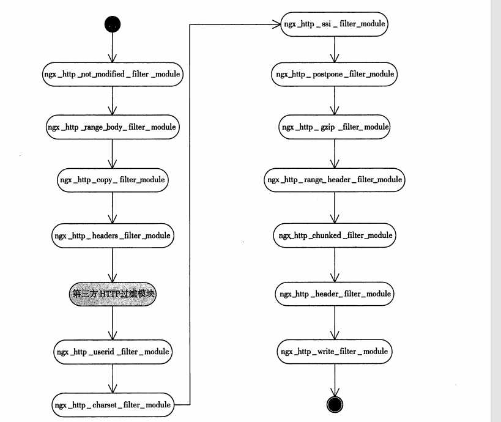

## 1. 概览


### 1. nginx 模块分类

---
// 25.8.14 补充

《深入理解nginx》书中， Nginx源码中明确标记为NGX_CORE_MODULE类型的模块只有以下6个，它们是Nginx运行的最底层基础：

Nginx的核心模块采用分层架构设计，每个核心模块不仅是功能实现者，更是模块类型的管理者。ngx_events_module、ngx_http_module和ngx_mail_module这三个核心模块分别定义了NGX_EVENT_MODULE、NGX_HTTP_MODULE和NGX_MAIL_MODULE三种模块类型，并全权管理对应类型的模块。这种设计赋予核心模块双重角色：既作为基础功能的提供者，又作为模块体系的架构师，通过类型定义实现功能解耦，使得事件处理、HTTP服务和邮件代理等不同领域的模块能够独立演化，同时保持整体架构的统一性。

| 模块名称               | 源码文件              | 核心作用                                                                 |
|------------------------|-----------------------|--------------------------------------------------------------------------|
| `ngx_core_module`      | `ngx_core.c`         | 解析main配置块（worker_processes/pid等）                                |
| `ngx_errlog_module`    | `ngx_errlog.c`       | 错误日志系统初始化                                                     |
| `ngx_events_module`    | `ngx_event.c`        | 事件驱动框架抽象层                                                     |
| `ngx_openssl_module`   | `ngx_event_openssl.c`| OpenSSL加密库集成                                                      |
| `ngx_http_module`      | `ngx_http.c`         | HTTP协议框架                                                           |
| `ngx_mail_module`      | `ngx_mail.c`         | 邮件协议框架                                                           |

---

| 大类模块       | 作用                                   | 配置块          | 示例模块                     |
|----------------|---------------------------------------|-----------------|-----------------------------|
| **Core 模块**   | Nginx 基础功能（进程、事件、日志等）    | 全局或 `events {}` | `ngx_core_module`<br>`ngx_events_module` |
| **HTTP 模块**   | 处理 HTTP/HTTPS 请求（Web 服务）        | `http {}`        | `ngx_http_core_module`      |
| **Mail 模块**   | 代理邮件协议（SMTP/IMAP/POP3）          | `mail {}`        | `ngx_mail_core_module`      |
| **Stream 模块** | 处理 TCP/UDP 流量（四层代理）           | `stream {}`      | `ngx_stream_core_module`   |

### 2. http 模块分类


HTTP 模块是 Nginx 中处理 HTTP/HTTPS 请求的核心模块，负责请求解析、路由、过滤、反向代理等。以下是 HTTP 模块的详细分类和核心机制：


#### 2.1 按照4 层架构分类

**举例**：
```nginx
http {
    # 1. 核心结构
    server {
        listen 80;
        
        # 2. 请求处理（三选一）
        location /static {
            root /data;  # 静态资源
        }
        location /api {
            proxy_pass http://backend;  # 反向代理
        }
        
        # 3. 响应加工（可叠加）
        gzip on;                   # 压缩
        sub_filter 'old' 'new';    # 内容替换
        
        # 4. 辅助控制
        deny 192.168.1.1;         # 访问控制
        access_log /var/log/nginx/access.log;  # 日志
    }
    
    # 负载均衡定义
    upstream backend {
        server 10.0.0.1:8080;
    }
}
```


##### 1. 核心结构模块
- **作用**：定义 HTTP 基础框架，不可禁用。  
- **模块**：`ngx_http_core_module`  
- **关键指令**：
```nginx
server { listen 80; }
location / { ... }
```

##### 2. 请求处理模块
- **作用**：直接生成响应或转发请求（必须选择一种，互斥）。
- **​​子类与示例**：


| 类型       | 功能                      | 模块                     | 指令              |
|------------|--------------------------|--------------------------|------------------|
| 静态资源   | 返回文件/目录             | `ngx_http_static_module` | `root`, `try_files` |
| 反向代理   | 转发请求到后端            | `ngx_http_proxy_module`  | `proxy_pass`     |
| FastCGI    | 处理 PHP/Python 等动态请求 | `ngx_http_fastcgi_module` | `fastcgi_pass`  |
| 重定向     | 返回 3xx 跳转             | `ngx_http_rewrite_module` | `return 302`, `rewrite` |

##### 3. 响应加工模块
- **作用**：对已有响应进行修改（可叠加使用）。
- **​​子类与示例**：

| 类型       | 功能               | 模块                     | 指令              |
|------------|-------------------|--------------------------|------------------|
| 压缩       | Gzip/Brotli 压缩   | `ngx_http_gzip_module`   | `gzip on`       |
| 内容替换   | 修改响应文本       | `ngx_http_sub_filter_module` | `sub_filter`  |
| 缓存控制   | 设置缓存头         | `ngx_http_headers_module` | `expires`, `add_header` |

##### 4. 辅助控制模块
- **作用**：安全、日志、负载均衡等。
- **​​子类与示例**：

| 类型       | 功能               | 模块                     | 指令              |
|------------|-------------------|--------------------------|------------------|
| 访问控制   | IP/密码限制       | `ngx_http_access_module` | `allow`, `deny` |
| 负载均衡   | 多后端服务器分发   | `ngx_http_upstream_module` | `upstream`    |
| 日志记录   | 记录请求信息       | `ngx_http_log_module`    | `access_log`   |

##### 5. 总结
​1. **​层级关系**​​：
核心结构 → 选择处理方式 → 加工响应 → 附加控制。
​​2. **互斥性**​​：
每个请求只能由 ​​一个请求处理模块​​ 响应（如不能同时用 proxy_pass 和 static）。
3. **​​叠加性**​​：
​​响应加工模块​​ 可组合使用（如 Gzip + 内容替换）。

#### 2.2 按照是否为过滤模块分类

HTTP 模块可进一步细分为非过滤模块和过滤模块，具体如下：

| 模块类型       | 功能                     | 典型模块示例                     |
|----------------|--------------------------|----------------------------------|
| 非过滤模块     | 处理请求逻辑（路由、代理等） | `ngx_http_core_module`、`ngx_http_proxy_module` |
| Header Filters | 修改 HTTP 响应头         | `ngx_http_headers_filter_module` |
| Body Filters   | 修改 HTTP 响应体         | `ngx_http_gzip_filter_module`    |

#### 2.3 总结

过滤模块的执行确实 ​​不依赖阶段（Phase）​​，而是通过 ​​全局过滤链​​ 动态执行。要准确判断一个自定义模块是否为过滤模块，需要从 ​​代码实现机制​​ 和 ​​运行时行为​​ 两个维度验证。


##### 1. 过滤模块的绝对判定标准（代码级）
###### (1) 必须插入全局过滤链
```c
// 在模块初始化函数中
ngx_http_next_header_filter = ngx_http_top_header_filter;
ngx_http_top_header_filter = my_header_filter;  // 插入Header过滤链

ngx_http_next_body_filter = ngx_http_top_body_filter;
ngx_http_top_body_filter = my_body_filter;      // 插入Body过滤链
```
> 如果没有这段代码，100%不是过滤模块

###### (2) 必须实现过滤函数签名
```c
// Header过滤函数
static ngx_int_t my_header_filter(ngx_http_request_t *r);

// Body过滤函数
static ngx_int_t my_body_filter(ngx_http_request_t *r, ngx_chain_t *in);
```

###### (3) 必须调用下一跳过滤函数
```c
static ngx_int_t my_body_filter(ngx_http_request_t *r, ngx_chain_t *in) {
    // 处理逻辑...
    return ngx_http_next_body_filter(r, in);  // 关键！
}
```

##### 2. 过滤模块的运行时特征
###### (1) 依赖前置响应
```nginx
location / {
    my_filter "text";        # 过滤模块
    proxy_pass http://backend; # 需要前置生成器
}
```

###### (2) 可叠加执行
```nginx
location / {
    proxy_pass http://backend;
    my_filter "A";     # 过滤模块A
    other_filter "B";   # 过滤模块B → 可叠加
}
```


##### 3. 快速验证方案
###### 步骤1：检查模块初始化函数
```c
// 过滤模块必有：
// Nginx的全局header过滤链入口指针，所有header过滤模块通过此链串联。
ngx_http_top_header_filter = my_header_filter;
```

###### 步骤2：测试配置依赖
```nginx
location / {
    my_custom_module on;  # 单独使用
}
```
- 报错要求前置响应 → 过滤模块
- 能独立工作 → 非过滤模块

###### 总结对比表
| 特征               | 过滤模块                     | 非过滤模块                 |
|--------------------|----------------------------|--------------------------|
| 注册方式           | 插入`ngx_http_top_*_filter` | 注册`ngx_http_handler_pt` |
| 执行时机           | 所有响应生成后             | 特定阶段                 |
| 返回值             | 必须调用next_filter        | 直接返回状态码           |
| 配置依赖           | 需要前置响应               | 可独立运行               |


## 2. HTTP 请求处理的 11 个阶段
Nginx 将 HTTP 请求处理分为 11 个阶段，非过滤模块可以挂载到不同阶段执行逻辑：

| 阶段                          | 说明                     | 典型模块                     |
|-------------------------------|--------------------------|------------------------------|
| NGX_HTTP_POST_READ_PHASE      | 读取请求头后立即执行      | `ngx_http_realip_module`（修改客户端IP） |
| NGX_HTTP_SERVER_REWRITE_PHASE | Server 块内的 URL 重写   | `ngx_http_rewrite_module`    |
| NGX_HTTP_FIND_CONFIG_PHASE    | 查找匹配的 Location 配置  | （Nginx 内部逻辑，无模块直接介入） |
| NGX_HTTP_REWRITE_PHASE        | Location 块内的 URL 重写 | `ngx_http_rewrite_module`    |
| NGX_HTTP_POST_REWRITE_PHASE   | 重写后的后处理           | （通常无模块介入）            |
| NGX_HTTP_PREACCESS_PHASE      | 访问控制前的预处理       | `ngx_http_limit_req_module`（限流） |
| NGX_HTTP_ACCESS_PHASE         | 访问权限控制（如 IP 黑白名单） | `ngx_http_access_module`    |
| NGX_HTTP_POST_ACCESS_PHASE    | 访问控制后的处理         | （通常无模块介入）            |
| NGX_HTTP_PRECONTENT_PHASE     | 生成内容前的预处理       | `ngx_http_try_files_module`（检查文件是否存在） |
| NGX_HTTP_CONTENT_PHASE        | 生成响应内容（核心阶段） | `ngx_http_proxy_module`（反向代理） |
| NGX_HTTP_LOG_PHASE           | 请求日志记录            | `ngx_http_log_module`       |

## 3. 过滤模块的执行顺序
过滤模块（Header/Body Filters）不依赖阶段，而是通过过滤链执行：

| 过滤模块类型   | 执行顺序                  | 典型模块                     |
|---------------|--------------------------|------------------------------|
| Header Filters | 按 `ngx_modules[]` 顺序执行 | `ngx_http_headers_filter_module` |
| Body Filters  | 反向 `ngx_modules[]` 顺序执行 | `ngx_http_gzip_filter_module` |

### 为什么 Body Filters 要反向执行？
假设有两个 Body Filters：
- **分块模块（A）**：将响应体分块传输。
- **压缩模块（B）**：压缩响应体。

**逻辑需求**：
应该先压缩整个响应体，再分块传输（即 B → A）。
但 Nginx 的模块是按 A → B 顺序编译的，因此通过反向执行实现 B → A 的实际效果。

## 4. HTTP 模块开发关键点
### (1) 非过滤模块如何挂载到阶段？
在模块的 postconfiguration 回调中注册阶段处理器：

```c
static ngx_int_t my_postconfiguration(ngx_conf_t *cf) {
    ngx_http_handler_pt *h = ngx_array_push(&cmcf->phases[NGX_HTTP_CONTENT_PHASE].handlers);
    *h = my_content_handler;  // 模块的处理函数
    return NGX_OK;
}
```


### (2) 过滤模块如何注册？

通过 ngx_http_next_header_filter 或 ngx_http_next_body_filter 插入过滤链

```c
static ngx_int_t my_header_filter(ngx_http_request_t *r) {
    // 修改响应头
    return ngx_http_next_header_filter(r);
}

static ngx_int_t my_body_filter(ngx_http_request_t *r, ngx_chain_t *in) {
    // 修改响应体
    return ngx_http_next_body_filter(r, in);
}
```

## 5. 总结
- HTTP 模块的核心机制
​- 非过滤模块​​：按 11 个阶段顺序执行（如代理、重定向）。
​​- Header Filters​​：按模块编译顺序处理响应头。
​​- Body Filters​​：反向模块编译顺序处理响应体（确保逻辑正确性）。


## 1. Nginx HTTP 模块详解

Nginx 的 HTTP 模块是处理 HTTP 请求和响应的核心组件。根据其职责和用途，HTTP 模块可以分为多种类型。以下是常见的 HTTP 模块类型及其作用。

```c
ngx_module_t ngx_http_xxx_module = {  // 模块变量名带 `http_` 前缀
    NGX_MODULE_V1,
    &ngx_http_xxx_module_ctx,          // 上下文
    ngx_http_xxx_commands,             // 指令集
    NGX_HTTP_MODULE,                   // 关键标记：必须是这个类型
    ...
};
```


| **大分类**            | **分类说明**                                                                 | **模块名称**                  | **作用阶段**               | **功能说明**                                                                 | **典型指令**             |
|-----------------------|-----------------------------------------------------------------------------|-----------------------------|--------------------------|----------------------------------------------------------------------------|--------------------------|
| **核心基础模块**       | Nginx 必备基础功能，提供 HTTP 服务核心配置                                           | `ngx_http_core_module`      | 多阶段                   | HTTP 基础配置（`server`/`location` 块、请求解析、变量处理）                     | `server`, `listen`, `root` |
| **Handler 模块**      | **生成响应内容**（直接处理请求并返回数据，如静态文件、代理结果、动态程序输出）                         | `ngx_http_static_module`    | `NGX_HTTP_CONTENT_PHASE` | 处理静态文件请求（如 HTML/图片）                                              | `root`, `alias`          |
|                       |                                                                             | `ngx_http_proxy_module`     | `NGX_HTTP_CONTENT_PHASE` | 反向代理（转发请求到后端服务器）                                               | `proxy_pass`            |
|                       |                                                                             | `ngx_http_fastcgi_module`  | `NGX_HTTP_CONTENT_PHASE` | 处理 FastCGI 请求（如 PHP-FPM）                                              | `fastcgi_pass`          |
| **Filter 模块**       | **修改响应内容**（对 Handler 生成的响应进行加工，如压缩、修改 Header、日志记录）                      | `ngx_http_headers_module`  | `NGX_HTTP_HEADER_FILTER_PHASE` | 修改响应头（如 `Cache-Control`、`CORS`）                                 | `add_header`           |
|                       |                                                                             | `ngx_http_gzip_filter_module` | `NGX_HTTP_BODY_FILTER_PHASE` | Gzip 压缩响应内容（减少传输体积）                                          | `gzip on`              |
|                       |                                                                             | `ngx_http_log_module`       | `NGX_HTTP_LOG_PHASE`     | 记录访问日志（时间、IP、状态码）                                              | `access_log`           |
| **Upstream 模块**     | 管理与后端服务器的交互（负载均衡、健康检查）                                                 | `ngx_http_upstream_module` | `NGX_HTTP_UPSTREAM_PHASE` | 定义后端服务器组（负载均衡、健康检查）                                        | `upstream`, `server`    |
| **访问控制模块**       | 实现请求的访问控制（如 IP 黑白名单、鉴权）                                                 | `ngx_http_access_module`    | `NGX_HTTP_ACCESS_PHASE`  | 基于 IP 的访问控制（黑白名单）                                               | `allow`, `deny`        |
| **SSL/TLS 模块**      | 提供 HTTPS 加密支持                                                                 | `ngx_http_ssl_module`       | `NGX_HTTP_SSL_PHASE`     | 配置 HTTPS 证书和加密协议                                                   | `ssl_certificate`      |
| **URL 重写模块**      | 修改请求的 URL 路径（重定向、正则匹配）                                                   | `ngx_http_rewrite_module`  | `NGX_HTTP_REWRITE_PHASE` | URL 重定向和重写（正则匹配）                                                 | `rewrite`, `return`    |
| **第三方模块**        | 扩展 Nginx 功能（需手动编译或动态加载）                                                   | `ngx_http_lua_module`       | 多阶段                   | 嵌入 Lua 脚本（动态逻辑、鉴权）                                               | `content_by_lua`       |

## 2. 过滤模块意义 ———— http 框架的11 个阶段

| 阶段（Phase）          | 是否允许模块接入 | 说明                                                                 |
|-----------------------|------------------|----------------------------------------------------------------------|
| **1. POST_READ**       | ✅ 是            | 读取请求头后立即执行，可用于全局变量初始化（如 `ngx_http_realip_module`）。 |
| **2. SERVER_REWRITE**  | ✅ 是            | 在 `server` 块内执行 URL 重写（如 `ngx_http_rewrite_module`）。           |
| **3. FIND_CONFIG**     | ❌ 否            | Nginx 核心阶段，决定使用哪个 `location` 块，模块无法干预。                 |
| **4. REWRITE**         | ✅ 是            | 在 `location` 块内执行 URL 重写（如 `ngx_http_rewrite_module`）。           |
| **5. POST_REWRITE**    | ❌ 否            | 检查 `REWRITE` 阶段是否导致 `location` 变更，模块无法干预。                 |
| **6. PREACCESS**       | ✅ 是            | 访问控制前执行（如限流 `ngx_http_limit_req_module`）。                      |
| **7. ACCESS**          | ✅ 是            | 访问权限检查（如 `ngx_http_access_module`、`ngx_http_auth_basic_module`）。 |
| **8. POST_ACCESS**     | ❌ 否            | 检查 `ACCESS` 阶段结果，模块无法干预。                                     |
| **9. PRECONTENT**      | ✅ 是            | 生成内容前的最后处理（如 `ngx_http_try_files_module`）。                     |
| **10. CONTENT**        | ✅ 是            | 生成响应内容（如 `ngx_http_proxy_module`、`ngx_http_static_module`）。      |
| **11. LOG**            | ✅ 是            | 记录访问日志（如 `ngx_http_log_module`）。                                   |


## 3. Nginx 中的所有模块 ？  启动顺序等

### 概览

1. ngx_modules 中保存着所有的ngxin 编译模块
2. Nginx 启动时，会按 ngx_modules[] 数组顺序依次调用每个模块的 init_module 钩子（如果定义了）。​越靠前的模块越早初始化​​（例如核心模块 ngx_http_core_module 通常在最前面）

```c

~/nginx-1.0.14/objs/ngx_modules.c

ngx_module_t *ngx_modules[] = {
    &ngx_core_module,
    &ngx_errlog_module,
    &ngx_conf_module,
    &ngx_events_module,
    &ngx_event_core_module,
    &ngx_epoll_module,
    &ngx_http_module,
    &ngx_http_core_module,
    &ngx_http_log_module,
    &ngx_http_upstream_module,
    &ngx_http_static_module,
    &ngx_http_autoindex_module,
    &ngx_http_index_module,
    &ngx_http_auth_basic_module,
    &ngx_http_access_module,
    &ngx_http_limit_zone_module,
    &ngx_http_limit_req_module,
    &ngx_http_geo_module,
    &ngx_http_map_module,
    &ngx_http_split_clients_module,
    &ngx_http_referer_module,
    &ngx_http_rewrite_module,
    &ngx_http_proxy_module,
    &ngx_http_fastcgi_module,
    &ngx_http_uwsgi_module,
    &ngx_http_scgi_module,
    &ngx_http_memcached_module,
    &ngx_http_empty_gif_module,
    &ngx_http_browser_module,
    &ngx_http_upstream_ip_hash_module,
    &ngx_http_mytest_module,
    &ngx_http_write_filter_module,
    &ngx_http_header_filter_module,
    &ngx_http_chunked_filter_module,
    &ngx_http_range_header_filter_module,
    &ngx_http_gzip_filter_module,
    &ngx_http_postpone_filter_module,
    &ngx_http_ssi_filter_module,
    &ngx_http_charset_filter_module,
    &ngx_http_userid_filter_module,
    &ngx_http_headers_filter_module,
    &ngx_http_copy_filter_module,
    &ngx_http_range_body_filter_module,
    &ngx_http_not_modified_filter_module,
    NULL
};
```

### 3.1顺序说明

所有模块（核心/第三方）均按编译顺序存入 ngx_module_t *ngx_modules[] 数组，其顺序严格决定以下行为

```c
// 示例数组结构（实际由configure生成）
ngx_module_t *ngx_modules[] = {
    &ngx_core_module,            // 核心模块1（最先加载）
    &ngx_http_core_module,       // HTTP核心模块
    &ngx_http_rewrite_module,    // 标准HTTP模块
    &my_custom_module,           // 第三方模块
    NULL                         // 数组结束
};
```

#### 1. 第一定律：全局初始化顺序​

```c
// nginx.c 中的初始化逻辑
for (i = 0; ngx_modules[i]; i++) {
    if (ngx_modules[i]->init_module) {
        ngx_modules[i]->init_module(cycle); // 绝对按数组顺序执行
    }
}
```

- 做什么​​：内存池/全局变量等基础初始化

- 顺序不可变​​：ngx_core_module 必须第一个初始化

#### 2. 第二定律：HTTP模块配置初始化​

```c
// ngx_http_block() 中的HTTP模块初始化
for (i = 0; ngx_modules[i]; i++) {
    if (ngx_modules[i]->type != NGX_HTTP_MODULE) continue;
    
    hmod = ngx_modules[i]->ctx;
    if (hmod->preconfiguration) hmod->preconfiguration(cf);  // 阶段1
    if (hmod->postconfiguration) hmod->postconfiguration(cf); // 阶段2
}
```

- 顺序规则​​：
- 仍按 ngx_modules[] 顺序调用
- 但 preconfiguration 和 postconfiguration 是分开的两个阶段

#### 3. 第三定律：请求处理顺序​

不是所有 HTTP 模块都会完整参与 Nginx 的 ​​11 个请求处理阶段​​。模块是否介入这些阶段，完全取决于它的 ​​功能定位​​ 和 ​​开发者的设计意图​​。

| 模块类型          | 顺序规则                     | 示例模块                     |
|-------------------|-----------------------------|-----------------------------|
| **非过滤模块**     | 按11个阶段顺序执行           | `ngx_http_proxy_module`     |
| **Header Filters** | 与 `ngx_modules[]` 顺序相同  | `ngx_http_headers_filter_module` |
| **Body Filters**   | 与 `ngx_modules[]` 顺序相反  | `ngx_http_gzip_filter_module`   |

### 3.2再谈配置解析

```c
static ngx_http_module_t  ngx_http_mytest_module_ctx =
        {
                NULL,                              /* preconfiguration */
                NULL,                  	          /* postconfiguration */

                NULL,                              /* create main configuration */
                NULL,                              /* init main configuration */

                NULL,                              /* create server configuration */
                NULL,                              /* merge server configuration */

                NULL,       			/* create location configuration */
                NULL         			/* merge location configuration */
        };
```

**调用每个模块的 create xxx configuration  && preconfiguration**

```c
// 当解析到http{}块时执行的伪代码（ngx_http_block函数简化版）
void ngx_http_block(ngx_conf_t *cf) {
    // 阶段1：调用所有HTTP模块的preconfiguration
    for (i = 0; ngx_modules[i]; i++) {
        if (ngx_modules[i]->type != NGX_HTTP_MODULE) continue;
        hmod = ngx_modules[i]->ctx;
        if (hmod->preconfiguration) {
            hmod->preconfiguration(cf);  // 此时尚未创建任何配置结构
        }
    }

    // 阶段2：创建配置结构（MAIN/SRV/LOC）
    for (i = 0; ngx_modules[i]; i++) {
        if (ngx_modules[i]->type != NGX_HTTP_MODULE) continue;
        hmod = ngx_modules[i]->ctx;
        
        if (hmod->create_main_conf) {
            ctx->main_conf[mi] = hmod->create_main_conf(cf);
        }
        if (hmod->create_srv_conf) {
            ctx->srv_conf[mi] = hmod->create_srv_conf(cf);
        }
        if (hmod->create_loc_conf) {
            ctx->loc_conf[mi] = hmod->create_loc_conf(cf);
        }
    }

    // 阶段3：解析server{}和location{}配置
    parse_servers_and_locations(cf);

    // 阶段4：调用所有HTTP模块的postconfiguration
    for (i = 0; ngx_modules[i]; i++) {
        if (ngx_modules[i]->type != NGX_HTTP_MODULE) continue;
        hmod = ngx_modules[i]->ctx;
        if (hmod->postconfiguration) {
            hmod->postconfiguration(cf);  // 此时所有配置已就绪
        }
    }
}
```

**preconfiguration & postconfiguration**
| 特性                | preconfiguration                          | postconfiguration                         |
|---------------------|------------------------------------------|------------------------------------------|
| **调用阶段**         | 刚进入http{}块，尚未解析任何server/location | 已完成http{}内所有server/location的解析  |
| **典型用途**         | 早期全局初始化                            | 注册处理程序/过滤器                       |
| **执行顺序**         | 按`ngx_modules[]`数组顺序                 | 按`ngx_modules[]`数组顺序                 |
| **可否访问配置**      | ❌ 配置未生成                             | ✅ 可读取main/srv/loc配置                 |
| **官方模块使用案例**  | `ngx_http_realip_module`                  | `ngx_http_gzip_filter_module`            |


### ngxin中的过滤模块顺序

| ​**模块名称**                                | ​**功能说明**                                                                                                                                                                                                                     |
|---------------------------------------------|---------------------------------------------------------------------------------------------------------------------------------------------------------------------------------------------------------------------------------|
| `ngx_http_not_modified_filter_module`       | 仅对 HTTP 头部做处理。在返回 200 成功时，根据请求中的 `If-Modified-Since` 或 `If-Unmodified-Since` 头部获取浏览器缓存文件的最后修改时间，决定是否直接发送 `304 Not Modified` 响应给用户。                                       |
| `ngx_http_range_header_filter_module`       | 处理请求中的 `Range` 信息，根据 `Range` 中的要求返回文件的一部分给用户。                                                                                                                                                        |
| `ngx_http_copy_filter_module`               | 仅对 HTTP 包体做处理。将用户发送的 `ngx_chain_t` 结构的 HTTP 包体复制到新的 `ngx_chain_t` 结构中（仅复制指针，不包括实际 HTTP 响应内容），后续的 HTTP 过滤模块处理的 `ngx_chain_t` 类型的成员都是该模块处理后的变量。             |
| `ngx_http_headers_filter_module`            | 仅对 HTTP 头部做处理。允许通过配置文件在响应中添加任意的 HTTP 头部。                                                                                                                                                           |
| `ngx_http_userid_filter_module`             | 基于 Cookie 提供简单的认证管理功能。                                                                                                                                                                                           |
| `ngx_http_charset_filter_module`            | 仅对 HTTP 包体做处理。将响应包按照配置文件中的配置重新编码后返回给用户。                                                                                                                                                       |
| `ngx_http_ssi_filter_module`                | 仅对 HTTP 包体做处理。支持 SSI（Server Side Include），将文件内容嵌入到网页中并返回给用户。                                                                                                                                     |
| `ngx_http_postpone_filter_module`           | 处理子请求的响应，确保多个子请求的响应按顺序发送。                                                                                                                                                                             |
| `ngx_http_gzip_filter_module`               | 仅对 HTTP 包体做处理。对特定的 HTTP 响应包体（如网页或文本文件）进行 Gzip 压缩后返回给用户。                                                                                                                                   |
| `ngx_http_range_filter_module`              | 支持 `Range` 协议。                                                                                                                                                                                                             |
| `ngx_http_chunked_filter_module`            | 支持 `chunked` 编码。                                                                                                                                                                                                           |
| `ngx_http_header_filter_module`             | 将响应头部序列化为字符流，并通过 `ngx_http_write_filter_module` 发送到客户端。                                                                                                                                                   |
| `ngx_http_write_filter_module`              | 负责向客户端发送 HTTP 响应包体。                                                                                                                                                                                               |

**第三方过滤模块执行顺序**



## 3. Http 模块 和 Http Filter 模块区别？

```c
// config
HTTP_FILTER_MODULES="$HTTP_FILTER_MODULES ngx_http_myfilter_module"
```

还有的一些http 模块：

- ngx_http_ssl_module
- ngx_http_upstream_module
- 等

## 4. Nginx filter 模块示例

```c
#include <ngx_config.h>
#include <ngx_core.h>
#include <ngx_http.h>


typedef struct
{
    ngx_flag_t		enable;
} ngx_http_myfilter_conf_t;

typedef struct
{
    ngx_int_t   	add_prefix;
} ngx_http_myfilter_ctx_t;


static ngx_http_output_header_filter_pt ngx_http_next_header_filter;
static ngx_http_output_body_filter_pt    ngx_http_next_body_filter;

//将在包体中添加这个前缀
static ngx_str_t filter_prefix = ngx_string("[my filter prefix]");


static void* ngx_http_myfilter_create_conf(ngx_conf_t *cf);
static char *
ngx_http_myfilter_merge_conf(ngx_conf_t *cf, void *parent, void *child);

static ngx_int_t ngx_http_myfilter_init(ngx_conf_t *cf);
static ngx_int_t
ngx_http_myfilter_header_filter(ngx_http_request_t *r);
static ngx_int_t
ngx_http_myfilter_body_filter(ngx_http_request_t *r, ngx_chain_t *in);


static ngx_command_t  ngx_http_myfilter_commands[] =
        {
                {
                        ngx_string("add_prefix"),
                        NGX_HTTP_MAIN_CONF | NGX_HTTP_SRV_CONF | NGX_HTTP_LOC_CONF | NGX_HTTP_LMT_CONF | NGX_CONF_FLAG,
                        ngx_conf_set_flag_slot,
                        NGX_HTTP_LOC_CONF_OFFSET,
                        offsetof(ngx_http_myfilter_conf_t, enable),
                        NULL
                },

                ngx_null_command
        };


static ngx_http_module_t  ngx_http_myfilter_module_ctx =
        {
                NULL,                                  /* preconfiguration方法  */
                ngx_http_myfilter_init,            /* postconfiguration方法 */

                NULL,                                  /*create_main_conf 方法 */
                NULL,                                  /* init_main_conf方法 */

                NULL,                                  /* create_srv_conf方法 */
                NULL,                                  /* merge_srv_conf方法 */

                ngx_http_myfilter_create_conf,    /* create_loc_conf方法 */
                ngx_http_myfilter_merge_conf      /*merge_loc_conf方法*/
        };


ngx_module_t  ngx_http_myfilter_module =
        {
                NGX_MODULE_V1,
                &ngx_http_myfilter_module_ctx,     /* module context */
                ngx_http_myfilter_commands,        /* module directives */
                NGX_HTTP_MODULE,                       /* module type */
                NULL,                                  /* init master */
                NULL,                                  /* init module */
                NULL,                                  /* init process */
                NULL,                                  /* init thread */
                NULL,                                  /* exit thread */
                NULL,                                  /* exit process */
                NULL,                                  /* exit master */
                NGX_MODULE_V1_PADDING
        };


static ngx_int_t ngx_http_myfilter_init(ngx_conf_t *cf)
{
    //插入到头部处理方法链表的首部
    ngx_http_next_header_filter = ngx_http_top_header_filter;
    ngx_http_top_header_filter = ngx_http_myfilter_header_filter;

    //插入到包体处理方法链表的首部
    ngx_http_next_body_filter = ngx_http_top_body_filter;
    ngx_http_top_body_filter = ngx_http_myfilter_body_filter;

    return NGX_OK;
}

static ngx_int_t
ngx_http_myfilter_header_filter(ngx_http_request_t *r)
{
    ngx_http_myfilter_ctx_t   *ctx;
    ngx_http_myfilter_conf_t  *conf;

    //如果不是返回成功，这时是不需要理会是否加前缀的，直接交由下一个过滤模块
    //处理响应码非200的情形
    if (r->headers_out.status != NGX_HTTP_OK)
    {
        return ngx_http_next_header_filter(r);
    }

    //获取http上下文
    ctx = ngx_http_get_module_ctx(r, ngx_http_myfilter_module);
    if (ctx)
    {
        //该请求的上下文已经存在，这说明
        // ngx_http_myfilter_header_filter已经被调用过1次，
        //直接交由下一个过滤模块处理
        return ngx_http_next_header_filter(r);
    }

    //获取存储配置项的ngx_http_myfilter_conf_t结构体
    conf = ngx_http_get_module_loc_conf(r, ngx_http_myfilter_module);

    //如果enable成员为0，也就是配置文件中没有配置add_prefix配置项，
    //或者add_prefix配置项的参数值是off，这时直接交由下一个过滤模块处理
    if (conf->enable == 0)
    {
        return ngx_http_next_header_filter(r);
    }

    //构造http上下文结构体ngx_http_myfilter_ctx_t
    ctx = ngx_pcalloc(r->pool, sizeof(ngx_http_myfilter_ctx_t));
    if (ctx == NULL)
    {
        return NGX_ERROR;
    }

    //add_prefix为0表示不加前缀
    ctx->add_prefix = 0;

    //将构造的上下文设置到当前请求中
    ngx_http_set_ctx(r, ctx, ngx_http_myfilter_module);

    //myfilter过滤模块只处理Content-Type是"text/plain"类型的http响应
    if (r->headers_out.content_type.len >= sizeof("text/plain") - 1
        && ngx_strncasecmp(r->headers_out.content_type.data, (u_char *) "text/plain", sizeof("text/plain") - 1) == 0)
    {
        //1表示需要在http包体前加入前缀
        ctx->add_prefix = 1;

        //如果处理模块已经在Content-Length写入了http包体的长度，由于
        //我们加入了前缀字符串，所以需要把这个字符串的长度也加入到
        //Content-Length中
        if (r->headers_out.content_length_n > 0)
            r->headers_out.content_length_n += filter_prefix.len;
    }

    //交由下一个过滤模块继续处理
    return ngx_http_next_header_filter(r);
}


static ngx_int_t
ngx_http_myfilter_body_filter(ngx_http_request_t *r, ngx_chain_t *in)
{
    ngx_http_myfilter_ctx_t   *ctx;
    ctx = ngx_http_get_module_ctx(r, ngx_http_myfilter_module);
    //如果获取不到上下文，或者上下文结构体中的add_prefix为0或者2时，
    //都不会添加前缀，这时直接交给下一个http过滤模块处理
    if (ctx == NULL || ctx->add_prefix != 1)
    {
        return ngx_http_next_body_filter(r, in);
    }

    //将add_prefix设置为2，这样即使ngx_http_myfilter_body_filter
    //再次回调时，也不会重复添加前缀
    ctx->add_prefix = 2;

    //从请求的内存池中分配内存，用于存储字符串前缀
    ngx_buf_t* b = ngx_create_temp_buf(r->pool, filter_prefix.len);
    //将ngx_buf_t中的指针正确地指向filter_prefix字符串
    b->start = b->pos = filter_prefix.data;
    b->last = b->pos + filter_prefix.len;

    //从请求的内存池中生成ngx_chain_t链表，将刚分配的ngx_buf_t设置到
    //其buf成员中，并将它添加到原先待发送的http包体前面
    ngx_chain_t *cl = ngx_alloc_chain_link(r->pool);
    cl->buf = b;
    cl->next = in;

    //调用下一个模块的http包体处理方法，注意这时传入的是新生成的cl链表
    return ngx_http_next_body_filter(r, cl);
}


static void* ngx_http_myfilter_create_conf(ngx_conf_t *cf)
{
    ngx_http_myfilter_conf_t  *mycf;

    //创建存储配置项的结构体
    mycf = (ngx_http_myfilter_conf_t  *)ngx_pcalloc(cf->pool, sizeof(ngx_http_myfilter_conf_t));
    if (mycf == NULL)
    {
        return NULL;
    }

    //ngx_flat_t类型的变量，如果使用预设函数ngx_conf_set_flag_slot
    //解析配置项参数，必须初始化为NGX_CONF_UNSET
    mycf->enable = NGX_CONF_UNSET;

    return mycf;
}

static char *
ngx_http_myfilter_merge_conf(ngx_conf_t *cf, void *parent, void *child)
{
    ngx_http_myfilter_conf_t *prev = (ngx_http_myfilter_conf_t *)parent;
    ngx_http_myfilter_conf_t *conf = (ngx_http_myfilter_conf_t *)child;

//合并ngx_flat_t类型的配置项enable
    ngx_conf_merge_value(conf->enable, prev->enable, 0);

    return NGX_CONF_OK;
}
```