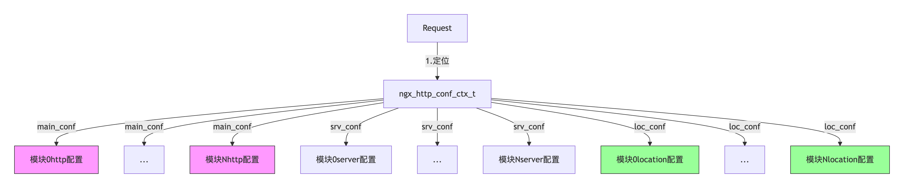
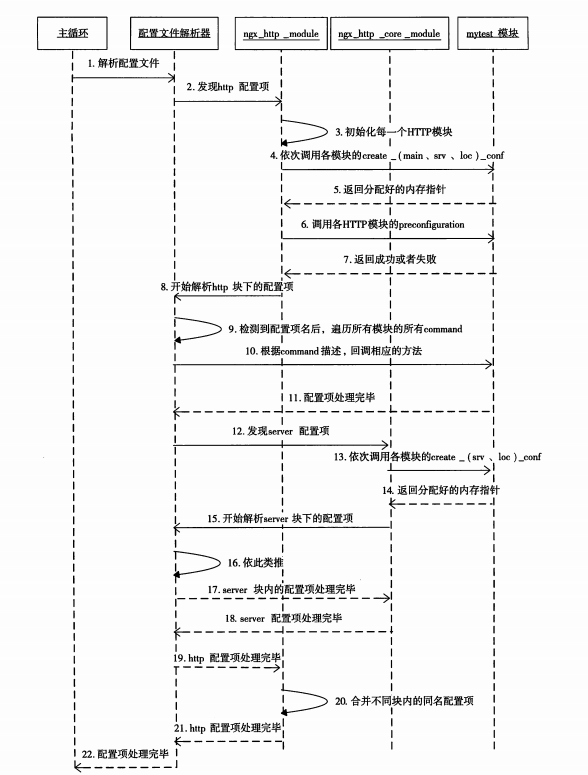
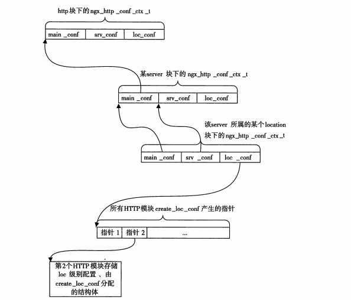

## 1. ngx_command_t

### 1.1 示例


```c
static ngx_command_t  ngx_http_mytest_commands[] =
        {

                {
                        ngx_string("test_flag"),
                        NGX_HTTP_LOC_CONF | NGX_CONF_FLAG,
                        ngx_conf_set_flag_slot,
                        NGX_HTTP_LOC_CONF_OFFSET,
                        offsetof(ngx_http_mytest_conf_t, my_flag),
                        NULL
                },

        }

typedef struct ngx_command_s     ngx_command_t;
struct ngx_command_s {
    ngx_str_t             name;       // 指令名称，如 "listen"、"server_name" 等
    ngx_uint_t            type;       // 指令的类型和上下文，如 NGX_HTTP_MAIN_CONF、NGX_HTTP_SRV_CONF , 简单来说就是可以出现在哪些配置体中。
    char               *(*set)(ngx_conf_t *cf, ngx_command_t *cmd, void *conf);  // 指令的解析函数
    ngx_uint_t            conf;       // 指令的配置存储位置，如 NGX_HTTP_MAIN_CONF_OFFSET、NGX_HTTP_SRV_CONF_OFFSET， 简单来说就是这个配置存放于ngx_http_conf_ctx_t 的哪个块中， server local？
    ngx_uint_t            offset;     // 指令在配置结构体中的偏移量，用于定位存储位置
    void                 *post;      // 指令解析后的回调函数，通常为 NULL
};
```

### 1.2 ngx_uint_t  type; 

| ​**类型**           | ​**值**                  | ​**说明**                                                                 |
|--------------------|------------------------|--------------------------------------------------------------------------|
| ​**指令类型**       | `NGX_CONF_NOARGS`      | 指令不接受任何参数。                                                     |
|                    | `NGX_CONF_TAKE1`       | 指令接受 1 个参数。                                                      |
|                    | `NGX_CONF_TAKE2`       | 指令接受 2 个参数。                                                      |
|                    | `NGX_CONF_TAKE3`       | 指令接受 3 个参数。                                                      |
|                    | `NGX_CONF_TAKE4`       | 指令接受 4 个参数。                                                      |
|                    | `NGX_CONF_TAKE5`       | 指令接受 5 个参数。                                                      |
|                    | `NGX_CONF_TAKE6`       | 指令接受 6 个参数。                                                      |
|                    | `NGX_CONF_TAKE7`       | 指令接受 7 个参数。                                                      |
|                    | `NGX_CONF_TAKE12`      | 指令接受 1 或 2 个参数。                                                 |
|                    | `NGX_CONF_TAKE13`      | 指令接受 1 或 3 个参数。                                                 |
|                    | `NGX_CONF_TAKE23`      | 指令接受 2 或 3 个参数。                                                 |
|                    | `NGX_CONF_TAKE123`     | 指令接受 1、2 或 3 个参数。                                              |
|                    | `NGX_CONF_TAKE1234`    | 指令接受 1、2、3 或 4 个参数。                                           |
|                    | `NGX_CONF_FLAG`        | 指令是一个标志，接受 `on` 或 `off` 作为参数。                            |
|                    | `NGX_CONF_1MORE`       | 指令至少接受 1 个参数。                                                  |
|                    | `NGX_CONF_2MORE`       | 指令至少接受 2 个参数。                                                  |
|                    | `NGX_CONF_MULTI`       | 指令可以接受多个参数（数量不限）。                                       |
| ​**指令上下文**     | `NGX_MAIN_CONF`        | 指令可以出现在全局配置块中（`main` 级别）。                              |
|                    | `NGX_EVENT_CONF`       | 指令可以出现在 `events{}` 块中。                                        |
|                    | `NGX_HTTP_MAIN_CONF`   | 指令可以出现在 `http{}` 块中。                                          |
|                    | `NGX_HTTP_SRV_CONF`    | 指令可以出现在 `server{}` 块中。                                        |
|                    | `NGX_HTTP_LOC_CONF`    | 指令可以出现在 `location{}` 块中。                                      |
|                    | `NGX_HTTP_UPS_CONF`    | 指令可以出现在 `upstream{}` 块中。                                      |
|                    | `NGX_HTTP_SIF_CONF`    | 指令可以出现在 `server{}` 块中的 `if` 条件中。                          |
|                    | `NGX_HTTP_LIF_CONF`    | 指令可以出现在 `location{}` 块中的 `if` 条件中。                        |
|                    | `NGX_HTTP_LMT_CONF`    | 指令可以出现在 `limit_except{}` 块中。                                  |
|                    | `NGX_STREAM_MAIN_CONF` | 指令可以出现在 `stream{}` 块中。                                        |
|                    | `NGX_STREAM_SRV_CONF`  | 指令可以出现在 `server{}` 块中（`stream` 模块）。                       |
|                    | `NGX_MAIL_MAIN_CONF`   | 指令可以出现在 `mail{}` 块中。                                          |
|                    | `NGX_MAIL_SRV_CONF`    | 指令可以出现在 `server{}` 块中（`mail` 模块）。                         |
| ​**其他标志**       | `NGX_CONF_BLOCK`       | 指令是一个块指令（如 `server{}`、`location{}`）。                        |
|                    | `NGX_CONF_ANY`         | 指令可以出现在任何配置块中。                                             |
|                    | `NGX_CONF_UNSET`       | 指令的值可以被取消设置（如 `unset`）。  

### 1.3 char  *(*set)(ngx_conf_t *cf, ngx_command_t *cmd, void *conf);    

    nginx 提供14 中预设方法来解析配置

| ​**方法名**                     | ​**说明**                                                                 |
|--------------------------------|--------------------------------------------------------------------------|
| `ngx_conf_set_flag_slot`       | 解析 `on` 或 `off` 标志，并将结果存储到配置结构体中。                     |
| `ngx_conf_set_str_slot`        | 解析字符串参数，并将结果存储到配置结构体中。                              |
| `ngx_conf_set_str_array_slot` | 解析字符串数组参数，并将结果存储到配置结构体中。                          |
| `ngx_conf_set_keyval_slot`    | 解析键值对参数，并将结果存储到配置结构体中。                              |
| `ngx_conf_set_num_slot`        | 解析数字参数，并将结果存储到配置结构体中。                                |
| `ngx_conf_set_size_slot`       | 解析大小参数（如 `10k`、`20m`），并将结果存储到配置结构体中。              |
| `ngx_conf_set_off_slot`        | 解析偏移量参数（如 `10k`、`20m`），并将结果存储到配置结构体中。            |
| `ngx_conf_set_msec_slot`       | 解析时间参数（如 `10ms`、`20s`），并将结果存储到配置结构体中。             |
| `ngx_conf_set_sec_slot`        | 解析时间参数（以秒为单位），并将结果存储到配置结构体中。                   |
| `ngx_conf_set_bufs_slot`       | 解析缓冲区数量和大小的参数，并将结果存储到配置结构体中。                   |
| `ngx_conf_set_enum_slot`       | 解析枚举值参数，并将结果存储到配置结构体中。                              |
| `ngx_conf_set_bitmask_slot`    | 解析位掩码参数，并将结果存储到配置结构体中。                              |
| `ngx_conf_set_access_slot`    | 解析访问权限参数（如 `0644`），并将结果存储到配置结构体中。                |
| `ngx_conf_set_path_slot`       | 解析路径参数（如 `/path/to/file`），并将结果存储到配置结构体中。           |


挑出一个例子，`ngx_conf_set_flag_slot` 说明：

```c
char *
ngx_conf_set_flag_slot(ngx_conf_t *cf, ngx_command_t *cmd, void *conf)
{
    char  *p = conf;

    ngx_str_t        *value;
    ngx_flag_t       *fp;
    ngx_conf_post_t  *post;

    fp = (ngx_flag_t *) (p + cmd->offset);

    if (*fp != NGX_CONF_UNSET) {
        return "is duplicate";
    }

    value = cf->args->elts;

    if (ngx_strcasecmp(value[1].data, (u_char *) "on") == 0) {
        *fp = 1;

    } else if (ngx_strcasecmp(value[1].data, (u_char *) "off") == 0) {
        *fp = 0;

    } else {
        ngx_conf_log_error(NGX_LOG_EMERG, cf, 0,
                     "invalid value \"%s\" in \"%s\" directive, "
                     "it must be \"on\" or \"off\"",
                     value[1].data, cmd->name.data);
        return NGX_CONF_ERROR;
    }

    if (cmd->post) {
        post = cmd->post;
        return post->post_handler(cf, post, fp);
    }

    return NGX_CONF_OK;
}

几点说明：
1. 参数conf就是http框架传给我们的，在ngx_http_mytest_create_loc_conf 回调方法中分配的结构体ngx_http_mytest_conf_t
2. cf->args是1个ngx_array_t队列，它的成员都是ngx_str_t结构。我们用value指向ngx_array_t的elts内容，其中value[1]就是第1个参数，同理value[2]是第2个参数
3.  ngx_command_t *cmd 则是触发命令 ~  
```

### 1.4 ngx_uint_t   conf;

| ​**值**                      | ​**说明**                                                                 |
|-----------------------------|--------------------------------------------------------------------------|
| `NGX_HTTP_MAIN_CONF_OFFSET` | 配置存储在 `main` 级别的配置结构体中（对应 `http{}` 块）。                |
| `NGX_HTTP_SRV_CONF_OFFSET`  | 配置存储在 `server` 级别的配置结构体中（对应 `server{}` 块）。             |
| `NGX_HTTP_LOC_CONF_OFFSET`  | 配置存储在 `location` 级别的配置结构体中（对应 `location{}` 块）。         |
| `NGX_STREAM_MAIN_CONF_OFFSET`| 配置存储在 `stream` 模块的 `main` 级别配置结构体中（对应 `stream{}` 块）。 |
| `NGX_STREAM_SRV_CONF_OFFSET`| 配置存储在 `stream` 模块的 `server` 级别配置结构体中（对应 `server{}` 块）。|
| `NGX_MAIL_MAIN_CONF_OFFSET` | 配置存储在 `mail` 模块的 `main` 级别配置结构体中（对应 `mail{}` 块）。     |
| `NGX_MAIL_SRV_CONF_OFFSET`  | 配置存储在 `mail` 模块的 `server` 级别配置结构体中（对应 `server{}` 块）。 |

### 1.5 ngx_uint_t offset

Nginx 首先通过 conf 成员找到应该用哪个结构体来存放，然后通过 offset 成员找到这个结构体中的相应成员，以便存放该配置。如果是自定义的专用配置项解析方法（只解析某一个配置项），则可以不设置 offset 的值。

### 1.6 NGX_HTTP_LOC_CONF 与 NGX_HTTP_LOC_CONF_OFFSET 字段

- main 配置块的数据存储在 ngx_http_core_main_conf_t 结构体中。
- server 配置块的数据存储在 ngx_http_core_srv_conf_t 结构体中。
- location 配置块的数据存储在 ngx_http_core_loc_conf_t 结构体中。


## 2. Nginx 配置问题

### 2.1 ​**ngx_http_conf_ctx_t 结构体**

ngx_http_conf_ctx_t 是一个关键的结构体，用于管理 HTTP 模块的配置数据。它的定义如下：

```c
typedef struct {
    void ​**main_conf;  // 指向所有模块的全局配置数组
    void ​**srv_conf;   // 指向所有模块的 server 配置数组
    void ​**loc_conf;   // 指向所有模块的 location 配置数组
} ngx_http_conf_ctx_t;
```

在 Nginx 解析配置文件时，会按照以下流程存储配置数据：

1. 调用每个模块的 create_main_conf、create_srv_conf 和 create_loc_conf 方法，生成配置结构体。
2. 将配置结构体的指针分别存储到 main_conf、srv_conf 和 loc_conf 数组中。
3. 将这三个数组的指针保存到 ngx_http_conf_ctx_t 结构体中。



### 2.2 create xxx configuration

在 Nginx 的 HTTP 模块开发中，create server configuration 是一个可选的回调函数，用于为每个 server 块创建配置**结构体**, 划重点， 结构体。

如果不定义， 默认结构体如下：

​- **ngx_http_core_loc_conf_t**：用于存储 location{} 块的配置。
​- **ngx_http_core_srv_conf_t**：用于存储 server{} 块的配置。
​- **ngx_http_core_main_conf_t**：用于存储 http{} 块的配置。

#### 默认结构体

当模块 ​​不定义​​ create_server_conf 时，Nginx 核心会自动使用以下内置结构体,默认结构体​​：核心模块已提供基础字段，适用于简单需求.

```c
// http{} 块配置（必须通过 create_main_conf 自定义）
typedef struct {
    ngx_array_t               servers;         // 所有server{}配置的集合
    ngx_http_phase_engine_t   phase_engine;    // HTTP处理阶段引擎
    ngx_uint_t               *server_names_hash_max_size;
    /* 其他30+个全局HTTP配置字段... */
} ngx_http_core_main_conf_t;

// server{} 块配置（默认结构体）
struct ngx_http_core_srv_conf_s { 
    ngx_str_t    server_name;      // 服务器名
    ngx_array_t  listen;           // 监听端口
    /* 其他40+个核心字段... */
};

// location{} 块配置（默认结构体） 
struct ngx_http_core_loc_conf_s {
    ngx_str_t    name;             // location匹配规则
    void       **handler;          // 内容处理器
    /* 其他30+个核心字段... */
};
```

1. 默认结构体 与 自定义结构体是否可以通用
    默认结构体​​（如 ngx_http_core_loc_conf_t）和 ​​自定义结构体​​ 完全可以协同工作

2. 创建过程
    默认结构体​​：由 ngx_http_core_module 强制创建（索引0）
    自定义结构体​​：由模块通过 create_loc_conf 创建（索引n）

3. 两个api

    ```c
    static ngx_int_t ngx_http_mymodule_handler(ngx_http_request_t *r) {
        // 同时使用两种配置
        ngx_http_core_loc_conf_t *clcf = ngx_http_get_module_loc_conf(r, ngx_http_core_module);
        ngx_http_mymodule_loc_conf_t *mlcf = ngx_http_get_module_loc_conf(r, ngx_http_mymodule);

        // 示例：当模块启用且location非内部时处理
        if (mlcf->enable && !clcf->internal) {
            ngx_log_debug2(NGX_LOG_DEBUG_HTTP, r->connection->log, 0,
                        "core: %d, my: %V", clcf->internal, &mlcf->custom_header);
        }
    }
    ```


#### 一些易混淆的api： ngx_http_conf_get_xxx

**1. 区别概览**：

| 宏                                | 返回值类型                  | 数据来源               | 使用阶段         | 典型场景                     | 关键区别                                                                 |
|-----------------------------------|----------------------------|------------------------|------------------|-----------------------------|--------------------------------------------------------------------------|
| `ngx_http_conf_get_module_loc_conf` | 模块自定义的 loc_conf 结构体 | 配置上下文 `cf->ctx`   | 配置解析阶段     | 解析`nginx.conf`指令时       | 获取原始配置（未合并），用于模块指令回调和配置合并函数                   |
| `ngx_http_get_module_loc_conf`    | 模块自定义的 loc_conf 结构体 | 请求对象 `r->loc_conf` | 请求处理阶段     | 处理HTTP请求的业务逻辑中      | 获取最终生效配置（已合并继承），只能用于请求处理相关的回调函数            |

**2. api**：
```c
// 在请求处理阶段获取配置
static ngx_int_t ngx_http_mymodule_handler(ngx_http_request_t *r) {
    ngx_http_mymodule_loc_conf_t *mlcf = ngx_http_get_module_loc_conf(r, ngx_http_mymodule_module);
    // 使用 mlcf->custom_setting 等字段
}


// 在配置解析阶段获取配置
static char *ngx_http_mymodule_directive(ngx_conf_t *cf, ngx_command_t *cmd, void *conf) {
    ngx_http_mymodule_loc_conf_t *mlcf = ngx_http_conf_get_module_loc_conf(cf, ngx_http_mymodule_module);
    // 设置 mlcf->custom_setting 等字段
}
```

**3.举例说明**

```c

/* 请求处理函数 */
static ngx_int_t ngx_http_mymodule_content_handler(ngx_http_request_t *r)
{
    // 使用 ngx_http_get_module_loc_conf 获取运行时配置
    ngx_http_mymodule_loc_conf_t *mlcf = ngx_http_get_module_loc_conf(r, ngx_http_mymodule_module);

    if (!mlcf->enable) {
        return NGX_DECLINED;
    }

    // 设置响应头
    r->headers_out.content_type.len = sizeof("text/plain") - 1;
    r->headers_out.content_type.data = (u_char *) "text/plain";
    r->headers_out.status = NGX_HTTP_OK;

    // 发送响应体
    ngx_buf_t *b = ngx_pcalloc(r->pool, sizeof(ngx_buf_t));
    ngx_chain_t out;
    out.buf = b;
    out.next = NULL;

    b->pos = mlcf->response_text.data;
    b->last = mlcf->response_text.data + mlcf->response_text.len;
    b->memory = 1;
    b->last_buf = 1;

    r->headers_out.content_length_n = mlcf->response_text.len;
    ngx_http_send_header(r);
    return ngx_http_output_filter(r, &out);
}

/* 注册内容处理阶段 */
// 指令定义
static ngx_command_t ngx_http_hello_commands[] = {
        {
                ngx_string("hello_message"),          // 指令名
                NGX_HTTP_LOC_CONF | NGX_CONF_TAKE1,   // 使用位置和参数限制
                ngx_http_hello_set_message,           // 解析指令的函数
                NGX_HTTP_LOC_CONF_OFFSET,             // 配置存储在结构中的偏移量
                0,                                    // 用于指令的标志，通常为 0
                NULL                                  // 指令的回调，通常为 NULL
        },
        ngx_null_command
};
// 配置指令解析函数
static char *ngx_http_hello_set_message(ngx_conf_t *cf, ngx_command_t *cmd, void *conf) {
    ngx_http_hello_loc_conf_t *hlcf = conf;

    ngx_str_t *value = cf->args->elts;
    hlcf->message = value[1];

    // 设置 handler
    ngx_http_core_loc_conf_t *clcf;
    clcf = ngx_http_conf_get_module_loc_conf(cf, ngx_http_core_module);
    clcf->handler = ngx_http_hello_handler; // 注册处理函数

    return NGX_CONF_OK;
}
```

**4. ngx_http_get_module_loc_conf 是不是可以又用官方配置 又用自定义配置**

```c
// 打开抽屉，找到标着"核心模块"的格子
// 这个格子里的东西是 Nginx 官方定义的（如 alias、proxy_pass 等指令的配置）
ngx_http_core_loc_conf_t *clcf = 
    ngx_http_get_module_loc_conf(r, ngx_http_core_module);

// 同一个抽屉里，找到标着"我的模块"的格子
// 这个格子里的东西是您自己定义的（如 my_custom_header 等指令的配置）
ngx_http_mymodule_loc_conf_t *mlcf =
    ngx_http_get_module_loc_conf(r, ngx_http_mymodule_module);
```

**5. ngx_http_conf_get_module_loc_conf 是不是可以又用官方配置 又用自定义配置**

```c
ngx_http_core_loc_conf_t *clcf = 
    ngx_http_conf_get_module_loc_conf(cf, ngx_http_core_module);
// 可访问 clcf->alias, clcf->proxy_pass 等核心字段

ngx_http_mymodule_loc_conf_t *mlcf =
    ngx_http_conf_get_module_loc_conf(cf, ngx_http_mymodule_module);
// 可访问 mlcf->custom_setting 等自定义字段
```

**5. 指令解析函数参数解析**

```c
static char *ngx_http_hello_set_message(ngx_conf_t *cf, ngx_command_t *cmd, void *conf)
```

| 参数   | 类型               | 作用                                   | 典型用法示例                                                                 |
|--------|--------------------|----------------------------------------|------------------------------------------------------------------------------|
| `cf`   | `ngx_conf_t*`      | 配置解析上下文，包含当前解析状态的所有信息 | 访问 `cf->args` 获取指令参数，`cf->pool` 分配内存                           |
| `cmd`  | `ngx_command_t*`   | 当前指令的定义，描述指令的类型和约束     | 检查 `cmd->type` 确认指令类型，`cmd->name` 获取指令名                        |
| `conf` | `void*`            | 模块的配置存储位置                      | 强制转换为模块自定义的配置类型（如 `ngx_http_hello_loc_conf_t*`）并修改字段 |

```c
// 一个例子说清楚
static char *ngx_http_hello_set_message(ngx_conf_t *cf, ngx_command_t *cmd, void *conf) {
    // 1. 获取模块配置结构体
    ngx_http_hello_loc_conf_t *hlcf = (ngx_http_hello_loc_conf_t *)conf;
    
    // 2. 从cf获取指令参数（如 hello_message "Hi"）
    ngx_str_t *args = cf->args->elts;
    hlcf->message = args[1];  // args[0]是指令名，args[1]是第一个参数
    
    // 3. 通过cmd检查指令类型
    if (!(cmd->type & NGX_HTTP_LOC_CONF)) {
        return "directive only allowed in location context";
    }
    
    return NGX_CONF_OK;
}
```

**6. 若创建多个结构体， ngx_http_conf_get_module_loc_conf 返回的是哪一个？**

​​每个模块​​（包括自定义模块）​​只能有一个主配置结构体​​
ngx_http_conf_get_module_loc_conf ​​永远返回该模块在 create_loc_conf 中创建的结构体​​。


### 2.3 配置解析流程简述

引用三张图吧， 比较清晰






### 2.4 有关配置合并的问题解析

如果实现了create_main_conf方法，那么它所创建的结构体只会存放直接出现在http{}块下的配置项，因此create_main_conf只会被调用一次。
如果实现了create_srv_conf方法，那么它所创建的结构体既会存放直接出现在http{}块下的配置项，也会存放直接出现在server{}块下的配置项。为什么呢？这其实是HTTP框架的一种优秀设计。例如，虽然某个配置项是针对于server虚拟主机才生效的，但http{}块下面可能有多个server{}块，对于用户来说，如果希望在http{}块下面写入这个配置项后对所有的server{}块都生效，这应当是允许的，因为它减少了用户的工作量。而对于HTTP框架来说，它会先调用create_srv_conf方法为http{}块创建配置结构体，再为每个server{}块调用create_srv_conf方法创建配置结构体

#### 举例

```c
typedef struct {
    ngx_str_t my_config;  // 配置项
} ngx_http_mytest_srv_conf_t;

static void *
ngx_http_mytest_create_srv_conf(ngx_conf_t *cf)
{
    ngx_http_mytest_srv_conf_t *conf;

    conf = ngx_pcalloc(cf->pool, sizeof(ngx_http_mytest_srv_conf_t));
    if (conf == NULL) {
        return NULL;
    }

    // 初始化配置
    conf->my_config.len = 0;
    conf->my_config.data = NULL;

    return conf;
}

static char *
ngx_http_mytest_merge_srv_conf(ngx_conf_t *cf, void *parent, void *child)
{
    ngx_http_mytest_srv_conf_t *prev = parent;  // 父配置（http{} 块）
    ngx_http_mytest_srv_conf_t *conf = child;   // 子配置（server{} 块）

    // 如果子配置未设置，则使用父配置
    if (conf->my_config.len == 0) {
        conf->my_config = prev->my_config;
    }

    return NGX_CONF_OK;
}

static ngx_command_t ngx_http_mytest_commands[] = {
    {
        ngx_string("my_config"),  // 指令名称
        NGX_HTTP_SRV_CONF | NGX_CONF_TAKE1,  // 支持 http{} 和 server{} 块
        ngx_conf_set_str_slot,
        NGX_HTTP_SRV_CONF_OFFSET,  // 配置数据存储到 server 配置块
        offsetof(ngx_http_mytest_srv_conf_t, my_config),  // 存储到 my_config 字段
        NULL
    },
    ngx_null_command
};

static ngx_http_module_t ngx_http_mytest_module_ctx = {
    NULL,                                  // preconfiguration
    NULL,                                  // postconfiguration
    NULL,                                  // create main configuration (移除)
    NULL,                                  // init main configuration
    ngx_http_mytest_create_srv_conf,       // create server configuration
    ngx_http_mytest_merge_srv_conf,        // merge server configuration
    NULL,                                  // create location configuration
    NULL                                   // merge location configuration
};

ngx_module_t ngx_http_mytest_module = {
    NGX_MODULE_V1,
    &ngx_http_mytest_module_ctx,           // module context
    ngx_http_mytest_commands,              // module directives
    NGX_HTTP_MODULE,                       // module type
    NULL,                                  // init master
    NULL,                                  // init module
    NULL,                                  // init process
    NULL,                                  // init thread
    NULL,                                  // exit thread
    NULL,                                  // exit process
    NULL,                                  // exit master
    NGX_MODULE_V1_PADDING
};
```

配置文件

```nginx
http {
    my_config "global_value";  # 在 http{} 块中写配置

    server {
        # 未设置局部配置，使用全局配置
    }

    server {
        my_config "server2_value";  # 在 server{} 块中写配置
    }
}
```

- 对于第一个 server{} 块，my_config 的值是 "global_value"（来自 http{} 块）。
- 对于第二个 server{} 块，my_config 的值是 "server2_value"（来自 server{} 块）。

### 2.5 问题答疑

1. NGX_HTTP_SRV_CONF | NGX_CONF_TAKE1,  // 只支持 server 块  ； 还可以在http 块中写配置吗？

    即使指令标志中只写了 NGX_HTTP_SRV_CONF，仍然可以在 http{} 块中写配置。这是因为 create_srv_conf 方法的设计允许配置项在 http{} 块和 server{} 块中都生效。

2. 什么要在 解析http 配置阶段调用 ngx_http_mytest_create_srv_conf 函数？

    `Nginx 的配置解析是按照 ​块（block）​ 的层级进行的。在解析 http{} 块时，Nginx 会：`
    - 调用 create_main_conf 方法，为 http{} 块创建全局配置结构体。
    - 调用 create_srv_conf 方法，为 http{} 块创建 server 配置结构体。
    - 在解析 server{} 块时，再次调用 create_srv_conf 方法，为每个 server{} 块创建独立的 server 配置结构体。

    `​为什么在 http{} 块中调用 create_srv_conf？`
    - 在 http{} 块中调用 create_srv_conf 方法的主要原因是：​**支持全局默认配置。**

## 3. 模块上下文

总结来说： 每一个**模块** 对应 每一个 **请求** ， 都有一个单独的上下文。

```c
typedef struct
{
    ngx_http_status_t           status;
    ngx_str_t					backendServer;
} ngx_http_mytest_ctx_t;

    //首先建立http上下文结构体ngx_http_mytest_ctx_t
    ngx_http_mytest_ctx_t* myctx = ngx_http_get_module_ctx(r, ngx_http_mytest_module);
    if (myctx == NULL)
    {
        myctx = ngx_palloc(r->pool, sizeof(ngx_http_mytest_ctx_t));
        if (myctx == NULL)
        {
            return NGX_ERROR;
        }
        //将新建的上下文与请求关联起来
        ngx_http_set_ctx(r, myctx, ngx_http_mytest_module);
    }
```

## 4. 解惑说明


    Nginx 配置解析中 `create_conf` 和 `指令处理函数` 的区别

这是一个常被混淆的点。你说的：

1. **创建配置结构体的函数**（比如 `create_loc_conf`）
2. **处理配置指令的函数**（比如 `ngx_http_mytest`）

它们**作用不同、触发时机不同、目的也不同**。

---

## ✅ 一、`create_loc_conf` —— **创建配置结构体内存**

这个函数在解析配置文件之前，**Nginx 主框架就会调用**每个模块的这个函数，用于：

- 为该模块在对应配置层级（main/srv/loc）下**分配一块内存空间**。
- 返回的指针会被保存在模块上下文中，后续解析指令、合并配置时都用它。

```c
static void *
ngx_http_mytest_create_loc_conf(ngx_conf_t *cf) {
    ngx_http_mytest_conf_t *conf;
    conf = ngx_pcalloc(cf->pool, sizeof(ngx_http_mytest_conf_t));
    conf->my_flag = NGX_CONF_UNSET;  // 设置默认值（unset）
    return conf;
}
```

✔️ 它是为 “这个 location 的模块配置” 分配结构体空间的。

---

## ✅ 二、`ngx_http_mytest()` —— **解析指令的处理函数**

这个是和 `ngx_command_t` 绑定的，当配置文件中出现了对应的指令（比如 `my_flag on;`）时：

- 配置解析器会查找这个指令
- 找到你模块定义的 `ngx_http_mytest` 函数
- 调用它来**解析参数并写入对应的配置结构体**

例如：

```nginx
location / {
    my_flag on;
}
```

指令定义如下：

```c
static ngx_command_t ngx_http_mytest_commands[] = {
    {
        ngx_string("my_flag"),
        NGX_HTTP_LOC_CONF|NGX_CONF_FLAG,
        ngx_conf_set_flag_slot,
        NGX_HTTP_LOC_CONF_OFFSET,
        offsetof(ngx_http_mytest_conf_t, my_flag),
        NULL
    },
    ngx_null_command
};
```

✔️ 它是对配置文件中**每一条出现的指令**进行处理。

---

## 🔁 关系总结表

| 类型 | 函数 | 被谁调用 | 作用 |
|------|------|----------|------|
| 创建配置结构体 | `create_loc_conf` | Nginx 在解析开始时 | 为模块在某个层级准备配置内存 |
| 合并配置结构体 | `merge_loc_conf` | 配置解析完成时 | 把父层级配置合并到子层级 |
| 配置指令解析函数 | `ngx_http_mytest`（或绑定的 `set_xxx_slot`） | 解析到 `my_flag` 这类指令时 | 把指令的参数写入配置结构体 |

---

## 🌟 实际流程举例

1. 配置文件开始解析 location 块，框架会调用你模块的 `create_loc_conf`，返回 `mytest_conf` 指针；
2. 配置中出现 `my_flag on;`，框架根据 `ngx_command_t` 找到你的 `ngx_http_mytest` 函数；
3. 函数读取 `"on"`，转换成 `1`，写入 `mytest_conf->my_flag = 1;`；
4. 后续如果还有更细的 location，父配置会和子配置合并，调用 `merge_loc_conf`。

---

如果你需要将图示逐步对应上函数的调用时机，也可以在图中标注继续讲解。
