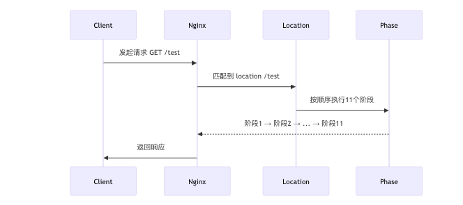

## 1. 11 个阶段 = 流水线的 11 个楼层

HTTP 框架将请求处理过程分为 11 个阶段，每个阶段可挂多个模块的处理函数。

| 楼层（阶段） | 工作任务                    | 默认工人（内置模块）      | 你可以加的自定义工人 |
|--------------|-----------------------------|---------------------------|------------------------|
| 1楼          | 刚收到请求，检查包裹        | realip 模块               | 「签名验证工人」        |
| 2楼          | 修改快递地址（URL重写）     | rewrite 模块              | 「自动补全地址工人」    |
| 3楼          | 分配车间（匹配 location）   | Nginx 核心                | ❌ 不允许加人（老板亲自处理） |
| 4楼          | 再次修改地址（location重写）| rewrite 模块              | 「智能地址转换工人」    |
| ...          | ...                         | ...                       | ...                    |
| 9楼          | 生成包裹内容                | proxy/static 模块         | 「自动打包机器人」      |
| 11楼         | 登记发货记录                | log 模块                  | 「大数据分析工人」      |

---

## 2. 自定义模块如何「入职」这个工厂？

你需要做三件事：

### （1）填写入职申请表（定义模块）

```c
ngx_module_t ngx_http_mymodule = {
    NGX_MODULE_V1,
    &ngx_http_mymodule_ctx,       // 模块技能描述
    ngx_http_mymodule_commands,   // 模块能接受的指令
    NGX_HTTP_MODULE,              // 声明这是HTTP模块
    NULL, NULL, NULL, NULL, NULL, NULL, NULL, NULL,
    NGX_MODULE_V1_PADDING
};
```

---

### （2）选择工作楼层（注册到阶段）

```c
// 注册到9楼：CONTENT_PHASE
static ngx_int_t ngx_http_mymodule_init(ngx_conf_t *cf) {
    ngx_http_handler_pt *h = ngx_array_push(
        &cmcf->phases[NGX_HTTP_CONTENT_PHASE].handlers
    );
    *h = ngx_http_mymodule_handler;  // 工作函数
    return NGX_OK;
}
```

---

### （3）定义工作内容（处理函数）

```c
static ngx_int_t ngx_http_mymodule_handler(ngx_http_request_t *r) {
    ngx_buf_t *b = ngx_create_temp_buf(r->pool, 1024);
    ngx_sprintf(b->pos, "Hello, this is my module!");
    b->last = b->pos + ngx_strlen("Hello, this is my module!");

    r->headers_out.status = NGX_HTTP_OK;
    r->headers_out.content_length_n = b->last - b->pos;

    ngx_http_send_header(r);
    ngx_http_output_filter(r, b);
    return NGX_OK;
}
```

---

## 3. 实际案例：开发一个「请求头检查模块」

### ✅ 需求：

- 在请求刚到达时（1楼 POST_READ_PHASE）  
- 检查是否存在 `X-Auth-Token` 请求头  
- 没有则直接返回 401

### ✅ 代码实现：

```c
// 1. 定义处理函数
static ngx_int_t ngx_http_check_token_handler(ngx_http_request_t *r) {
    ngx_table_elt_t *token = r->headers_in.headers.part.elts;

    for (ngx_uint_t i = 0; i < r->headers_in.headers.part.nelts; i++) {
        if (ngx_strcmp(token[i].key.data, "X-Auth-Token") == 0) {
            return NGX_OK; // 有 token，放行
        }
    }

    // 无 token，拒绝
    r->headers_out.status = NGX_HTTP_UNAUTHORIZED;
    ngx_http_send_header(r);
    return NGX_HTTP_UNAUTHORIZED;
}

// 2. 注册到 POST_READ_PHASE
static ngx_int_t ngx_http_check_token_init(ngx_conf_t *cf) {
    ngx_http_handler_pt *h = ngx_array_push(
        &cmcf->phases[NGX_HTTP_POST_READ_PHASE].handlers
    );
    *h = ngx_http_check_token_handler;
    return NGX_OK;
}
```

---

## 4. 关键总结

- ✅ **阶段是固定的**：就像工厂楼层，Nginx 已经建好，不能改
- ✅ **模块是灵活的**：你可以在任意阶段插入逻辑（除非禁止）
- ✅ **同一阶段的模块执行顺序**：按配置加载顺序运行
- ✅ **可通过 `postconfiguration` 控制优先级**

### 🚀 常用阶段推荐：

| 目标              | 使用阶段                        |
|-------------------|----------------------------------|
| 拦截请求          | POST_READ_PHASE、PREACCESS_PHASE |
| 修改 URI          | SERVER_REWRITE_PHASE、REWRITE_PHASE |
| 生成内容响应      | CONTENT_PHASE                   |
| 请求日志处理      | LOG_PHASE                       |

> 通过这种设计，Nginx 保持了核心流程的稳定，又通过模块机制实现了极致的可扩展性，就像“在精确位置插积木”一样加逻辑！

## 5. 举例说明

本文展示如何将一个自定义模块注册到 Nginx 的 `CONTENT_PHASE`（内容生成阶段），并拦截请求，返回自定义内容。

---

### 1. 模块结构定义

```c
#include <ngx_config.h>
#include <ngx_core.h>
#include <ngx_http.h>

// 模块的处理函数（核心逻辑）
static ngx_int_t ngx_http_myhandler(ngx_http_request_t *r);

// 模块的指令定义（可以通过 nginx.conf 配置）
static ngx_command_t ngx_http_mycommands[] = {
    { ngx_string("my_module"),               // 指令名
      NGX_HTTP_LOC_CONF|NGX_CONF_NOARGS,    // 指令适用范围
      ngx_http_myhandler,                   // 指令对应的函数
      0,
      0,
      NULL },
    ngx_null_command
};

// 模块上下文结构
static ngx_http_module_t ngx_http_mymodule_ctx = {
    NULL,  // preconfiguration
    NULL,  // postconfiguration
    NULL,  // create main conf
    NULL,  // init main conf
    NULL,  // create server conf
    NULL,  // merge server conf
    NULL,  // create location conf
    NULL   // merge location conf
};

// 模块定义
ngx_module_t ngx_http_mymodule = {
    NGX_MODULE_V1,
    &ngx_http_mymodule_ctx,
    ngx_http_mycommands,
    NGX_HTTP_MODULE,
    NULL,                      // init master
    ngx_http_mymodule_init,    // init module（注册阶段用）
    NULL, NULL, NULL, NULL, NULL,
    NGX_MODULE_V1_PADDING
};
```

---

### 2. 实现处理函数逻辑

```c
// 内容生成处理函数（返回固定文本）
static ngx_int_t ngx_http_myhandler(ngx_http_request_t *r) {
    // 设置响应头
    r->headers_out.status = NGX_HTTP_OK;
    r->headers_out.content_type.len = sizeof("text/plain") - 1;
    r->headers_out.content_type.data = (u_char *) "text/plain";

    // 构造响应内容
    ngx_buf_t *b = ngx_create_temp_buf(r->pool, 128);
    ngx_sprintf(b->pos, "Hello, this is my custom module!");
    b->last = b->pos + ngx_strlen("Hello, this is my custom module!");

    // 输出响应
    r->headers_out.content_length_n = b->last - b->pos;
    ngx_http_send_header(r);
    ngx_http_output_filter(r, b);

    return NGX_OK;
}
```

---

### 3. 注册模块到 `CONTENT_PHASE`

```c
// 模块初始化函数，在 nginx 启动时被调用
static ngx_int_t ngx_http_mymodule_init(ngx_cycle_t *cycle) {
    ngx_http_core_main_conf_t *cmcf;

    // 获取 HTTP 核心配置结构体
    cmcf = ngx_http_cycle_get_module_main_conf(cycle, ngx_http_core_module);
    if (cmcf == NULL) {
        return NGX_ERROR;
    }

    // 注册处理函数到 CONTENT_PHASE
    ngx_http_handler_pt *h = ngx_array_push(&cmcf->phases[NGX_HTTP_CONTENT_PHASE].handlers);
    if (h == NULL) {
        return NGX_ERROR;
    }

    *h = ngx_http_myhandler;
    return NGX_OK;
}
```

---

### 4. Nginx 配置使用方法

在 nginx.conf 中配置：

```nginx
http {
    server {
        listen 80;
        location /test {
            my_module;  # 激活模块
        }
    }
}
```

访问 `http://localhost/test` 时，返回内容应为：

```
Hello, this is my custom module!
```


## 6. ​​Nginx 处理阶段的完整执行顺序（含自定义模块）​

你的疑问核心在于 ​​location 匹配、my_module 触发、11 个阶段的执行顺序​​。以下是彻底清晰的解析：

### ​1. 完整流程图示​



### 2. 关键顺序详解

#### （1）先匹配 location，再执行阶段

- **location 匹配**：  
  Nginx 首先根据请求的 URI 找到匹配的 location 块（如 `location /test { ... }`）。  
- **阶段执行**：  
  匹配到 location 后，按照 11 个阶段的固定顺序依次执行，与 location 中指令的顺序无关。

#### （2）my_module 的触发时机

假设你的配置如下：

```nginx
location /test {
    my_module;    # 自定义指令
    proxy_pass http://backend;
}
```

- **my_module 的作用**：  
  它只是一个指令，用于告诉 Nginx：“在这个 location 中激活我的模块逻辑”。  
- **实际执行**：  
  由模块注册的阶段决定（例如注册到 CONTENT_PHASE）。

#### （3）阶段执行的本质

- **模块在阶段中的位置**：  
  每个阶段（如 CONTENT_PHASE）可能包含多个模块的处理函数，按模块加载顺序执行。  

  例如：
  ```c
  // 模块A注册到 CONTENT_PHASE
  ngx_array_push(&cmcf->phases[NGX_HTTP_CONTENT_PHASE].handlers, &module_a_handler);

  // 模块B也注册到 CONTENT_PHASE
  ngx_array_push(&cmcf->phases[NGX_HTTP_CONTENT_PHASE].handlers, &module_b_handler);
  ```

- **执行顺序**：  
  先执行 `module_a_handler`，再执行 `module_b_handler`。

---

### 3. 完整案例演示

#### 场景

用户访问 `GET /hello`，匹配到以下 location：

```nginx
location /hello {
    my_module;       # 自定义模块指令
    proxy_pass http://backend;
}
```

#### 执行步骤

1. **匹配 location**  
   Nginx 发现 URI `/hello` 匹配到 location /hello，读取其中的指令（my_module 和 proxy_pass）。  
2. **按阶段顺序执行**  
   - 阶段1-8：跳过未注册模块的阶段。  
   - 阶段9（CONTENT_PHASE）：  
     先执行 my_module 的处理函数（如果它注册在此阶段）。  
     再执行 proxy_pass 的处理函数（内置的 ngx_http_proxy_module）。  
   - 阶段11（LOG_PHASE）：记录访问日志。  
3. **响应生成**  
   - 如果 my_module 返回 NGX_OK，继续执行 proxy_pass。  
   - 如果 my_module 返回 NGX_DECLINED，跳过 proxy_pass。

---

### 4. 关键结论

- **location 是入口**：决定哪些指令和模块会被激活。  
- **阶段是固定的流水线**：无论 location 里写了什么指令，都按 11 个阶段的顺序执行。  
- **模块的执行顺序**：  
  - 同一阶段内，按模块加载顺序执行（可通过调整模块编译顺序控制）。  
  - 不同阶段按数字顺序执行（1 → 2 → ... → 11）。

---

### 5. 类比解释

把 Nginx 想象成一个 **快递分拣中心**：

- **location**：像是一个分拣规则（例如“所有上海的快件送到A区”）。
- **11 个阶段**：像是 A 区内的流水线（卸货 → 扫描 → 打包 → 装车...）。
- **my_module**：像是你自定义的一个打包机器人（安装在“打包”阶段）。

无论分拣规则如何，流水线的阶段顺序不变，你的机器人只在自己注册的阶段工作！
**必须先匹配到 location​​，然后才会按照固定的 ​​11 个阶段顺序​​ 执行相关模块的逻辑。**


### 6. 总结

---

#### 1. NGX_HTTP_POST_READ_PHASE
- **作用**：HTTP 请求头读取完成后，进入框架。  
- **可挂载**：✅ 可以。  
- **典型模块**：`realip_module`（替换客户端 IP）。  
- **开发者实践**：常用于 **预处理**（黑名单、限速、header 修改）。  

---

#### 2. NGX_HTTP_SERVER_REWRITE_PHASE
- **作用**：确定虚拟主机之前的 rewrite 阶段。  
- **可挂载**：✅ 可以。  
- **典型模块**：`rewrite_module`（基于 server 的 rewrite）。  
- **开发者实践**：用于 **域名级别跳转** 或 **请求预处理**。  

---

#### 3. NGX_HTTP_FIND_CONFIG_PHASE
- **作用**：匹配 `location` 配置。  
- **可挂载**：❌ 不可以。  
- **典型模块**：无（核心逻辑）。  
- **开发者实践**：这是 **Nginx 内部阶段**，不能扩展。  

---

#### 4. NGX_HTTP_REWRITE_PHASE
- **作用**：进入 location 之后的 rewrite 阶段。  
- **可挂载**：✅ 可以。  
- **典型模块**：`rewrite_module`（基于 location 的 rewrite）。  
- **开发者实践**：常用于 **URI 改写、跳转**。  

---

#### 5. NGX_HTTP_POST_REWRITE_PHASE
- **作用**：rewrite 后收尾，可能重新跳回 FIND_CONFIG。  
- **可挂载**：❌ 不可以。  
- **典型模块**：无（核心逻辑）。  
- **开发者实践**：框架内部 **防死循环** 控制。  

---

#### 6. NGX_HTTP_PREACCESS_PHASE
- **作用**：访问控制前的准备工作。  
- **可挂载**：✅ 可以。  
- **典型模块**：`limit_req_module`（请求速率限制）。  
- **开发者实践**：可做 **WAF 检查、频率控制**。  

---

#### 7. NGX_HTTP_ACCESS_PHASE
- **作用**：权限检查。  
- **可挂载**：✅ 可以。  
- **典型模块**：`access_module`（allow/deny）。  
- **开发者实践**：做 **IP 白名单、认证** 等。  

---

#### 8. NGX_HTTP_POST_ACCESS_PHASE
- **作用**：收尾，判断 access 的结果。  
- **可挂载**：❌ 不可以。  
- **典型模块**：无（框架逻辑）。  
- **开发者实践**：框架自动 **拦截拒绝**，无需扩展。  

---

#### 9. NGX_HTTP_TRY_FILES_PHASE
- **作用**：处理 `try_files` 指令。  
- **可挂载**：❌ 一般不可以（专属 `try_files` 模块）。  
- **典型模块**：`try_files`。  
- **开发者实践**：属于 **特殊保留阶段**。  

---

#### 10. 🔴 NGX_HTTP_CONTENT_PHASE
- **作用**：生成 HTTP 响应的核心阶段。  
- **可挂载**：✅ 可以（最重要）。  
- **典型模块**：  
  - `static_module`（静态文件）  
  - `proxy_module`（反向代理）  
  - `fastcgi_module`  

- **两种介入方式**：  
  1. **独占式（clcf->handler）**  
     - 在 `location` 里直接绑定一个 handler。  
     - 一旦设置，**只会执行该 handler**，不会再遍历其他 content handlers。  
     - 用于 **静态服务、代理、业务 API**。  
  2. **链式（phase handler 队列）**  
     - 如果 `clcf->handler` 没有设置，则遍历 `cmcf->phases[CONTENT_PHASE].handlers`。  
     - 多个 handler 可以依次尝试，返回 `NGX_DECLINED` 则继续下一个。  
     - 最终仍然只有 **第一个成功处理的 handler** 会生成响应。  

- **开发者实践**：  
  - **独占式**：适合业务响应模块。  
  - **链式**：适合“候补型”模块，例如尝试处理部分请求。  

---

#### 11. NGX_HTTP_LOG_PHASE
- **作用**：请求完成后，写日志。  
- **可挂载**：✅ 可以。  
- **典型模块**：`log_module`。  
- **开发者实践**：用于 **访问日志、统计、监控**。  

---

### 总结表格

| 阶段 | 功能 | 可否挂载 | 模块示例 | 说明 |
|------|------|----------|----------|------|
| POST_READ | 请求头读完 | ✅ | realip | 预处理 |
| SERVER_REWRITE | server 级 rewrite | ✅ | rewrite | 域名跳转 |
| FIND_CONFIG | 匹配 location | ❌ | - | 内部逻辑 |
| REWRITE | location 级 rewrite | ✅ | rewrite | URL 改写 |
| POST_REWRITE | rewrite 收尾 | ❌ | - | 防死循环 |
| PREACCESS | 访问前准备 | ✅ | limit_req | WAF、限流 |
| ACCESS | 权限检查 | ✅ | access | allow/deny |
| POST_ACCESS | access 收尾 | ❌ | - | 内部逻辑 |
| TRY_FILES | try_files 处理 | ❌ | try_files | 专属模块 |
| 🔴 CONTENT | 生成响应 | ✅ | static/proxy/fastcgi | 独占式 / 链式 |
| LOG | 写日志 | ✅ | log | 日志统计 |

### checker 方法对应

进入某个阶段 → 执行该阶段的 checker 方法 → checker 内部依次调用该阶段注册的 handler

| Checker 方法                     | 对应的 Phase                                | 用途 / 特点 |
|---------------------------------|--------------------------------------------|-------------|
| ngx_http_core_generic_phase      | POST_READ、PREACCESS、POST_ACCESS、LOG     | 通用 checker，逐个调用 handler；适合限流、统计、日志等模块 |
| ngx_http_core_rewrite_phase      | SERVER_REWRITE、REWRITE                     | URI 重写；如果 URI 改变，跳回 FIND_CONFIG 重新匹配 |
| ngx_http_core_find_config_phase  | FIND_CONFIG                                 | 查找匹配的 server/location 配置；决定请求落点 |
| ngx_http_core_post_rewrite_phase | POST_REWRITE                                | rewrite 收尾；确认是否需要二次 FIND_CONFIG |
| ngx_http_core_access_phase       | ACCESS                                      | 权限认证、allow/deny；任一拒绝即终止请求 |
| ngx_http_core_try_files_phase    | TRY_FILES                                   | 处理 try_files；命中直接返回，未命中进入 CONTENT |
| ngx_http_core_content_phase      | CONTENT                                     | 执行内容生成 handler（static、proxy、fastcgi…），产出响应 |


### Nginx Phase 与 Checker、Handler 理解

#### 核心概念区分

| 名称 | 定义 | 作用 |
|------|------|------|
| **Phase（阶段）** | Nginx 请求处理生命周期中的一个逻辑步骤，如 rewrite、access、content 等 | 作为状态机的“节点”，用来组织请求处理流程 |
| **Checker 方法** | 针对某一类阶段的调度函数，如 `ngx_http_core_generic_phase`、`ngx_http_core_rewrite_phase` | 调度并执行属于该 checker 管辖的阶段的所有 handler，决定流程是否继续 |
| **Handler 方法** | 模块注册在某个阶段的实际回调函数，如 `ngx_http_rewrite_handler` | 执行具体功能（rewrite URI、权限控制、生成内容等） |

> 注意：**一个 checker 方法可能管理多个阶段**，所以并不是一一对应。

#### 调用流程（准确版）

1. **请求到达 Nginx 核心 HTTP 框架**  
2. **状态机选择当前阶段（phase）**  
3. **根据当前阶段找到对应的 checker**  
   - 例如：rewrite 阶段 → `ngx_http_core_rewrite_phase`  
   - access 阶段 → `ngx_http_core_access_phase`  
   - LOG、POST_ACCESS 等阶段 → `ngx_http_core_generic_phase`  
4. **Checker 内部**  
   - 遍历该阶段注册的 handler 列表  
   - 按顺序调用 handler  
   - 根据 handler 返回值决定：继续下一个 handler、跳到下一阶段或挂起等待事件  
5. **处理完成**  
   - 状态机推进到下一个阶段  
   - 重复上述过程直到请求完成