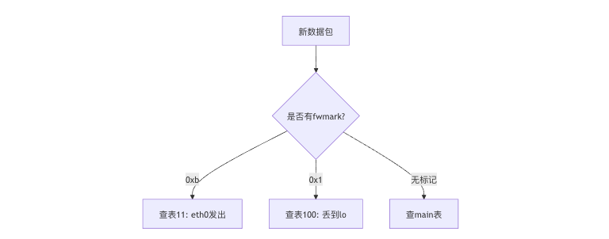
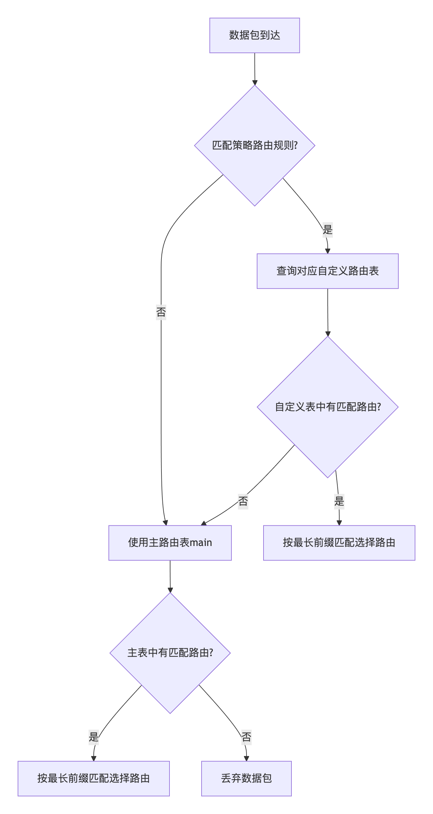

## 1. Linux 路由机制

### 1.1 概览

简单来说：

    Linux 的路由机制决定了一个数据包从本机发出去时，要经过哪个网卡、发给谁（下一跳）。

你可以把它想象成一张“**高速公路指路牌**”：
谁该走哪个出口，全靠这张“路由表”来指导。

### 1.2 聊聊 lo 接口

```shell
lo: flags=73<UP,LOOPBACK,RUNNING>  mtu 65536
        inet 127.0.0.1  netmask 255.0.0.0
        inet6 ::1  prefixlen 128  scopeid 0x10<host>
        loop  txqueuelen 1000  (Local Loopback)
        RX packets 93131  bytes 19613242 (18.7 MiB)
        RX errors 0  dropped 0  overruns 0  frame 0
        TX packets 93131  bytes 19613242 (18.7 MiB)
        TX errors 0  dropped 0 overruns 0  carrier 0  collisions 0
```

ifconfig 或 ip addr 命令中的 ​​lo​​（Loopback Interface）是 Linux 系统的​​虚拟环回接口​​，用于本地主机内部的网络通信。

- 名称：lo（全称 loopback）。
- IP 地址：默认绑定 127.0.0.1（IPv4）和 ::1（IPv6）。
- 作用域：仅在本地主机内有效，不经过物理网卡，数据包不会离开主机。
- MTU：通常为 65536（64KB），远高于普通网卡（1500），因为无需分片。

#### lo 口收发包逻辑

- 数据不离开主机：所有流量仅在操作系统内部处理。
- 高速转发：无需经过物理设备，延迟极低。
- MTU 超大（65536）：无需分片，支持大包传输。
- IP 地址：默认绑定 127.0.0.1（IPv4）和 ::1（IPv6）


```shell
场景 1：本机进程间通信（TCP）​​
假设本机的 ​​Nginx​​（监听 127.0.0.1:80）和 ​​curl​​ 通过 lo 通信：

# Nginx 监听本地 80 端口
sudo systemctl start nginx

# 使用 curl 访问本机服务
curl http://127.0.0.1

​​数据流路径​：​
​1. ​curl 发送请求​​：
应用层（curl）构造 HTTP 请求，目标地址为 127.0.0.1:80。
内核协议栈识别目标 IP 是环回地址，直接交给 lo 接口处理。
​​
2. 内核协议栈转发​​：
​​发送路径​​：数据从 curl 进程 → 内核 TCP/IP 协议栈 → lo 发送队列。
​​接收路径​​：内核将数据从 lo 接收队列 → 交给监听 80 端口的 Nginx 进程。
​​全程不经过物理网卡​​，甚至不涉及设备驱动。

3. ​​统计计数​​：
lo 的 RX（接收）和 TX（发送）计数器均会增加：
ifconfig lo
# 输出示例：
lo: TX packets 15  bytes 1200 (1.2 KB)
     RX packets 15  bytes 1200 (1.2 KB)
```

#### 说说mtu

MTU 是链路层定义的单次传输尺寸上限，硬件通过它限制帧大小，而 IP 层在必要时（且允许时）主动分片，但 TCP 会优先通过 MSS 避免分片。​​

```shell
应用数据
  │
  ▼
TCP分段（MSS限制） ←───────────────────┐
  │                                    │
  ▼                                    │
IP封装（MTU限制） → 若超限则分片        │
  │               （若DF=0）           │
  ▼                                    │
链路层帧 ──────────────── 超限则丢弃 ────┘
```

- ​​MSS = MTU - 40（IPv4头20+TCP头20）​​
- ​​MTU是硬限制，MSS是软优化​​
- ​​TCP宁愿多传几次小包，也绝不分片​

### 1.3 聊聊 桥接口

```c
// 1. 在 Linux 上创建一个 bridge 设备，名字叫 VLAN112.3。
/sbin/brctl addbr VLAN112.3

// 2. 把物理口或 VLAN 子接口加入桥
brctl addif VLAN112.3 eth0
brctl addif VLAN112.3 eth0.112

// 3. 配置 IP 或路由
ip addr add 192.168.112.1/24 dev VLAN112.3
ip link set VLAN112.3 up
```

作用：
- 桥接 VLAN 接口或物理口，让多个接口处于同一二层网络

- 对 WAF 来说，常用于：

   - 把多个 VLAN 流量聚合到一个逻辑接口处理

   - 做策略路由或防火墙规则时，把逻辑接口当作入口/出口


### 1.4 聊聊 vlan 接口

#### 1.4.1 举例说明


##### 网络拓扑假设

- 企业局域网中存在两个逻辑分组：  
  1. **财务部门**，VLAN 10，IP 网段 192.168.10.0/24  
  2. **研发部门**，VLAN 20，IP 网段 192.168.20.0/24  
- 交换机为三层可管理交换机（Layer 3/2），端口可配置 Access 或 Trunk 模式  
- 服务器需通过单个物理网卡接入多个 VLAN  

---

##### 1. VLAN 的定义与划分

根据 IEEE 802.1Q 标准，每个 VLAN 通过在以太网帧头插入 **VLAN Tag（4字节）** 来标识逻辑网络：  

- **VLAN ID**：10、20  
- **广播域隔离**：不同 VLAN 的广播、组播及未知单播数据帧互不干扰  
- **二层逻辑网络**：每个 VLAN 形成独立的二层网络，实现安全与管理隔离  

---

##### 2. 交换机端 VLAN 配置

###### 2.1 VLAN 创建

```shell
vlan 10
 name Finance
vlan 20
 name R&D
```

###### 2.2 Access 端口配置（终端主机接入）

```shell
# 财务部门终端
interface GigabitEthernet0/1
 switchport mode access
 switchport access vlan 10

# 研发部门终端
interface GigabitEthernet0/2
 switchport mode access
 switchport access vlan 20
```
- **Access 模式**：端口隶属于单一 VLAN，终端主机接入无需打 VLAN tag  

###### 2.3 Trunk 端口配置（服务器/交换机间链路）
```shell
interface GigabitEthernet0/24
 switchport mode trunk
 switchport trunk allowed vlan 10,20
```
- **Trunk 模式**：允许多个 VLAN 的流量通过同一物理链路  
- 802.1Q Tag 标识帧所属 VLAN  
- 接收端需识别 VLAN Tag 以分离流量  

---

###### 3. 服务器端 VLAN 子接口配置（Linux）

假设物理接口为 `eth0`，需接入 VLAN 10 和 VLAN 20：

```bash
# VLAN 10 子接口
ip link add link eth0 name eth0.10 type vlan id 10
ip addr add 192.168.10.100/24 dev eth0.10
ip link set eth0.10 up

# VLAN 20 子接口
ip link add link eth0 name eth0.20 type vlan id 20
ip addr add 192.168.20.100/24 dev eth0.20
ip link set eth0.20 up
```
- 每个子接口对应 trunk 端口上允许的 VLAN  
- 服务器可同时处理不同 VLAN 的逻辑网络流量  

---

###### 4. 流量分布与广播域隔离

```shell
PC 财务 192.168.10.10 ---Access VLAN10---> Switch G0/1
PC 研发 192.168.20.10 ---Access VLAN20---> Switch G0/2
Linux 服务器 trunk eth0 ---Trunk VLAN10/20---> Switch G0/24
```

- VLAN Tag 决定数据帧的广播域  
- VLAN 10 和 VLAN 20 形成逻辑隔离的二层网络  
- Trunk 接口可复用物理链路承载多 VLAN 流量，提高资源利用率  

---

###### 总结

1. **VLAN 的核心作用**：在同一物理网络上，通过逻辑分割形成多个广播域，实现安全隔离和灵活管理。  
2. **Access 与 Trunk 区别**：  
   - Access：端口只属于单一 VLAN，主机无需理解 VLAN Tag  
   - Trunk：端口承载多个 VLAN，通过 802.1Q Tag 区分流量  
3. **Linux VLAN 子接口**：在 Trunk 端口上通过逻辑接口处理不同 VLAN 流量，实现多租户或多部门业务在同一物理接口上的隔离。  


#### 1.4.2 Trunk  &  Aeecss


| 类型     | 功能描述 |
|---------|---------|
| **Access** | 端口只属于一个 VLAN，接入普通终端（PC、打印机），终端无需 VLAN 配置。 |
| **Trunk**  | 端口可以承载多个 VLAN，通常用于交换机间链路或服务器接入，帧带 802.1Q Tag。 |

---

##### 1. Access 特点

- **单 VLAN**  
- **端口负责 VLAN 归属**，终端无需理解 VLAN  
- **常见用途**：连接普通主机或摄像头  

**交换机示例配置：**

<```>
interface GigabitEthernet0/1
 switchport mode access
 switchport access vlan 10
<```>

- Host 直接接入即可，无需配置 VLAN  

---

##### 2. Trunk 特点

- **多个 VLAN**  
- **帧打标签（802.1Q）**，区分不同 VLAN 流量  
- **常见用途**：交换机互联、服务器多 VLAN 接入  

**交换机示例配置：**

<```>
interface GigabitEthernet0/24
 switchport mode trunk
 switchport trunk allowed vlan 10,20
<```>

- 可以同时传输 VLAN 10 和 VLAN 20 流量  
- 接收端（交换机或服务器）根据 VLAN Tag 拆分流量  

---

##### 3. Linux 示例

假设物理接口 `eth0` 连接 Trunk：

- VLAN 10 子接口：
<```bash>
ip link add link eth0 name eth0.10 type vlan id 10
ip addr add 192.168.10.100/24 dev eth0.10
ip link set eth0.10 up
<```>

- VLAN 20 子接口：
<```bash>
ip link add link eth0 name eth0.20 type vlan id 20
ip addr add 192.168.20.100/24 dev eth0.20
ip link set eth0.20 up
<```>

- **Access** 端口不需要在终端配置 VLAN  
- **Trunk** 端口需要在终端（服务器）配置 VLAN 子接口  

---

##### 4. 图形化理解（ASCII）

<```>
Host A (VLAN10) ---[Access 10]---+
                                 |
Host B (VLAN20) ---[Access 20]---+--- Switch ---[Trunk 10,20]--- Server
<```>

- Access 端口连接终端  
- Trunk 端口连接服务器或交换机  
- Trunk 端口上每帧带 VLAN Tag，交换机识别并转发到对应 VLAN  

---

##### 5. 总结

- **Access**：端口只属于一个 VLAN，终端无需 VLAN 配置  
- **Trunk**：端口承载多个 VLAN，终端需要 VLAN 配置或支持 VLAN Tag  


#### 1.4.3 举例说明 vlan tag 标签

```shell
Host A (VLAN10) ---[Access VLAN10]---+
                                      |
Host B (VLAN20) ---[Access VLAN20]---+--- Switch ---[Trunk 10,20]--- Server
                                                      |--- eth0.10 (VLAN10)
                                                      |--- eth0.20 (VLAN20)
```


- **Host A**：Access 端口，VLAN10  
- **Host B**：Access 端口，VLAN20  
- **Switch**：汇聚 Access 端口 → Trunk 端口，允许 VLAN10 和 VLAN20  
- **Server**：Trunk 接入，物理接口 eth0，子接口 eth0.10 (VLAN10)、eth0.20 (VLAN20)  

---

##### 1 Host → Server 流程

###### Host A → Server

1. Host A 发送普通以太网帧（不带 VLAN Tag）  
2. Access 端口接收，交换机内部标记 VLAN10  
3. 转发到 Trunk 端口，交换机 **打上 802.1Q VLAN10 Tag**  
4. Server 的 eth0.10 接收，识别 VLAN10，剥掉 Tag，交给操作系统  

###### Host B → Server

1. Host B 发送普通以太网帧（不带 VLAN Tag）  
2. Access 端口接收，交换机内部标记 VLAN20  
3. 转发到 Trunk 端口，交换机 **打上 802.1Q VLAN20 Tag**  
4. Server 的 eth0.20 接收，识别 VLAN20，剥掉 Tag，交给操作系统  

---

##### 2 Server → Host 流程

###### Server eth0.10 → Host A

1. Server 的 eth0.10 打 VLAN10 Tag  
2. Trunk 端口发送给交换机  
3. 交换机 Trunk 接收，根据 Tag 转发到 VLAN10 的 Access 端口  
4. Access 端口剥掉 Tag，发送普通以太网帧给 Host A  

###### Server eth0.20 → Host B

1. Server 的 eth0.20 打 VLAN20 Tag  
2. Trunk 端口发送给交换机  
3. 交换机 Trunk 接收，根据 Tag 转发到 VLAN20 的 Access 端口  
4. Access 端口剥掉 Tag，发送普通以太网帧给 Host B  

---

##### 3 VLAN 标签打/剥总结

1️⃣ Host A 发送帧

- Host A 是普通终端  
- **发送的数据帧不带 VLAN Tag**  

2️⃣ Access 端口接收

- Access 端口属于 VLAN10  
- **交换机内部逻辑标记 VLAN10**  
- **帧本身仍是普通以太网帧**  
- Host A 发出的帧不需要修改  

3️⃣ 转发到 Trunk 端口

- Trunk 端口承载多个 VLAN  
- 为区分 VLAN10、VLAN20，交换机在转发前 **打上 802.1Q VLAN10 Tag**  
- 现在帧变成“标准 VLAN 帧”，能被下游 Trunk 或 VLAN 子接口识别

4️⃣ Server 接收

- Server 的 eth0.10 子接口绑定 VLAN10  
- 子接口 **识别 802.1Q Tag 是 VLAN10**  
- **剥掉 Tag**，交给操作系统  
- OS 收到的帧 **和 Host A 发出的帧一致**  

| 链路段                   | 帧状态           | 标签处理者                     |
|---------------------------|----------------|-------------------------------|
| Host A → Access 端口       | ❌ 不带        | Host A 不打标签，交换机内部逻辑标记 VLAN10 |
| Access → Trunk 端口        | ✅ 有          | 交换机打 802.1Q VLAN10 Tag     |
| Trunk → Server eth0.10     | ✅ 有          | Server 子接口识别 VLAN10，剥掉 Tag |

1. **Access 端口**：不打标签，Host 发送普通帧；交换机内部逻辑区分 VLAN  
2. **Trunk 端口**：多 VLAN 承载，发送方（交换机或支持 VLAN 的设备）打标签  
3. **Server VLAN 子接口**：根据标签拆分流量，剥掉标签，交给 OS  

#### 1.4.4 子接口 & 接口别名

```shell
eth8:1: flags=4355<UP,BROADCAST,PROMISC,MULTICAST> mtu 1500
    inet 2.2.2.2  netmask 255.255.255.0 ...
    ether 08:35:71:14:a5:aa ...
    device memory 0xdf660000-df67ffff
eth8.1: flags=4099<UP,BROADCAST,MULTICAST> mtu 1500
    ether 08:35:71:14:a5:aa ...
    RX packets 0  TX packets 0 ...
```

###### eth8:1
- 这是 **IP 地址别名**（老式 `ifconfig` 风格）。  
- `ethtool` 对它的输出其实还是 **物理网卡 eth8 的信息**，因为 `eth8:1` 根本不是独立网卡，只是 `eth8` 上挂的一个 IP 地址。  
- 所以看到的 PHY、速率、自动协商等信息完全和 `eth8` 一致。  
- `Speed: Unknown! / Duplex: Unknown!` 说明此时物理口 `eth8` 没有链路。  

###### eth8.1
- 名字带点号的接口通常是 **VLAN 子接口**。  
- 但 `ethtool eth8.1` 输出结果也和 `eth8` 一模一样（`PHYAD=1`，`Port=TP` 等）。  
- 说明当前系统里这个 `eth8.1` **不是一个独立的虚拟接口驱动设备**，而是直接映射回了 `eth8`。  
- 这大概率是因为你用的 **不是标准的**  
  ```bash
  ip link add link eth8 name eth8.1 type vlan id 1
  ```
  来创建 VLAN 子接口，而是某种工具/脚本手工加的名字，内核并没有真正给它挂上 VLAN 功能。
- 所以它现在表现出来和 eth8:1 类似，本质上还是 eth8。


## 2. 传统路由

传统路由 = 静态路由 + 动态路由

Linux 本身不自带动态路由协议，但你可以安装例如 RIP OSPF 等动态工具， 这些工具会定时和别的路由器“聊天”，交流网络路径，从而动态更新 Linux 的路由表。

下文展开传统路由中的静态路由。

### 静态路由

```shell
root>ip route show
default via 10.67.9.254 dev eth0 
10.67.8.0/22 dev eth0  proto kernel  scope link  src 10.67.10.49 
```

```shell
# 第一行：默认路由
default via 10.67.9.254 dev eth0

说明：
- 所有找不到明确目标网段的流量都会发送到 10.67.9.254。
- 流量会通过 eth0 接口转发出去。
- 常用于“出口网关”场景。

# 第二行：本地子网路由
10.67.8.0/22 dev eth0  proto kernel  scope link  src 10.67.10.49

说明：
- 子网为 10.67.8.0 ~ 10.67.11.255（掩码 255.255.252.0）
- 此网段是 eth0 接口直连的，不走网关（scope link）
- 源 IP 默认是 10.67.10.49（也就是 eth0 的 IP）
- `proto kernel` 说明该条是系统自动生成的，通常由 `ip addr add` 时自动创建
```

### 静态路由——下一跳

#### 概览

```shell
ip route add <目标网络> via <下一跳IP> dev <出口网卡>

sudo route -n add -inet6 2024::209/128 2abc:abc:123::aaa:145
sudo route -n add 202.8.27.209/32 10.67.10.145
```

#### 与默认路由区别？

- 下一跳（Next Hop）​​：
​    **​所有路由条目的共同属性**​​，表示“这个数据包下一步该发给谁”。
    （无论是默认路由还是静态路由，最终都要指定下一跳）
- ​​默认路由​​：
    是下一跳的一种**​​特殊应用场景**​​，当目标IP​​不匹配任何具体路由​​时，使用 0.0.0.0/0 的下一跳。

| 概念               | 类比现实场景               | 路由表示例                          | 技术要点说明                     |
|--------------------|--------------------------|-----------------------------------|-------------------------------|
| **静态路由**   | "去上海走京沪高速"        | `ip route add 192.168.2.0/24 via 10.1.1.1` | 精确匹配目标网络，优先级高于默认路由 |
| **默认路由**       | "其他所有地方都走国道G101" | `ip route add default via 10.1.1.254`     | 目标网络为0.0.0.0/0，优先级最低   |
| **策略路由**       | "快递按邮政编码分拣"      | `ip rule add from 192.168.1.100 lookup 100` | 基于源IP/端口等条件选择路由表     |
| **黑洞路由**       | "死胡同禁止通行"          | `ip route add blackhole 203.0.113.0/24`   | 直接丢弃匹配流量，用于安全防护     |

## 3. 策略路由

- 静态路由就像高速公路的固定路标：所有车（数据包）只看车头（目标地址），跟着标志走一条固定路线。

- 策略路由就像在路口装了“智能交通灯”：它不仅看车头，还会看车的车牌（源地址）、车种（接口）、司机身份（用户）等多种条件，来决定让车走哪条路。

总结来说：**策略路由就是给不同来源的流量分配不同的路由表，静态路由是路由表里的具体路线。**

### 举例说明

```shell
// 常用命令
ip rule show —— 看策略路由规则，决定流量走哪张路由表

ip route show [table XXX] —— 看对应路由表里的具体静态路由

cat /etc/iproute2/rt_tables —— 查看路由表的名称和编号
```


```shell
// 举例 查看策略路由
root>ip rule show
0:      from all lookup local   // 优先级最高
32756:  from all fwmark 0xb lookup 11 
32757:  from all fwmark 0x1 lookup 100 
32766:  from all lookup main 
32767:  from all lookup default 
```

|序号|规则内容|说明|
|-|-|-|
|0|`from all lookup local`|本地路由表，处理本机的回环和本地地址，这条规则是系统默认，优先级最高|
|32756|`from all fwmark 0xb lookup 11`|匹配所有包，只要数据包打上了防火墙标记（fwmark）为 `0xb`，就使用路由表编号 11 查路由|
|32757|`from all fwmark 0x1 lookup 100`|匹配所有包，只要包的防火墙标记为 `0x1`，使用路由表 100 查路由|
|32766|`from all lookup main`|默认主路由表|
|32767|`from all lookup default`|默认路由表|

### local 路由表

```shell
root>ip route show table local
broadcast 10.67.8.0 dev eth0  proto kernel  scope link  src 10.67.10.49 
local 10.67.10.49 dev eth0  proto kernel  scope host  src 10.67.10.49 
broadcast 10.67.11.255 dev eth0  proto kernel  scope link  src 10.67.10.49 
broadcast 127.0.0.0 dev lo  proto kernel  scope link  src 127.0.0.1 
local 127.0.0.0/8 dev lo  proto kernel  scope host  src 127.0.0.1 
local 127.0.0.1 dev lo  proto kernel  scope host  src 127.0.0.1 
broadcast 127.255.255.255 dev lo  proto kernel  scope link  src 127.0.0.1 
```

### 11 路由

表 11：强制流量从 eth0 发出​

```shell
​​# 作用​​：所有查此表的流量强制从 eth0 发出，​​不经过默认网关​​。
​​# 关键限制​​：scope link 表示仅限二层通信（如ARP），​​无法访问跨网段IP​​（需补充网关路由）。
root>ip route show table 11 
default dev eth0  scope link 
```

### 100 路由

```shell
​# ​作用​​：
1. 将匹配的流量重定向到环回接口 lo。
2. 若无服务监听，内核直接拒绝连接（Connection refused）。
​​
# 典型场景​​：
1. 拦截黑名单IP
2. 实现防火墙丢弃规则

root>ip route show table 100
local default dev lo  scope host 
```



## 4. 总结

### 策略路由（Policy-Based Routing, PBR）的三大核心组件

策略路由通过以下三大核心组件协同工作，实现对网络流量的灵活控制：

---

### 1. 规则（Rule）
**功能**：定义流量匹配的条件，决定哪些数据包需要被特殊处理。  
**关键属性**：  
- **匹配条件**：基于源/目的IP、端口、协议、接口、ToS（服务类型）或防火墙标记（fwmark）等。  
- **优先级**：规则按优先级顺序匹配，一旦命中则跳过后续规则。  
- **动作**：通常是将匹配的流量导向指定的路由表或下一跳。  

**示例**：  
```bash
ip rule add from 192.168.1.100 lookup 100  # 源IP为192.168.1.100的流量使用路由表100
ip rule add to 10.0.0.0/24 lookup 200      # 目的IP为10.0.0.0/24的流量使用路由表200
```

---

### 2. 路由表（Table）
**功能**：存储独立的路由规则，与主路由表（通常为main表）隔离，实现多路径转发。  
**特点**：  
- **自定义路由**：每个表可包含特定路由（如默认网关、静态路由等）。  
- **隔离性**：不同规则可指向不同路由表，避免冲突。  
- **标识方式**：通过数字ID（如100）或名称（如custom_table）引用。  

**示例**：  
```bash
ip route add default via 203.0.113.1 dev eth1 table 100  # 在表100中添加默认路由
```

---

### 3. 防火墙标记（fwmark）
**功能**：通过iptables/nftables为数据包打标记，实现基于应用层或复杂条件的路由。  
**使用场景**：  
- **高级匹配**：如基于服务类型（VoIP、SSH）、QoS需求或特定连接状态。  
- **跨层协作**：结合Netfilter标记数据包，再由策略路由处理。  

**流程**：  
1. **标记数据包**：  
   ```bash
   iptables -A PREROUTING -t mangle -p tcp --dport 80 -j MARK --set-mark 1
   ```  
2. **基于标记路由**：  
   ```bash
   ip rule add fwmark 1 lookup 200  # 标记为1的流量使用表200
   ```

---

### 三者的协同工作
1. **规则匹配**：数据包首先被规则（Rule）匹配（如源IP或fwmark）。  
2. **表查询**：命中规则后，系统查询关联的路由表（Table）决定下一跳。  
3. **标记扩展**：若需复杂条件（如应用端口），通过fwmark间接匹配规则。  

---

### 实际应用案例
- **企业多出口**：内网用户（192.168.1.0/24）走专线（表100），视频流量（标记为2）走高速链路（表200）。  
- **负载均衡**：基于fwmark将不同服务分流至多个WAN接口。  

### 静态路由 策略路由 关联




**各类路由配置举例**

```shell
# 静态路由（main表）
ip route add 10.0.0.0/8 via 192.168.1.1
ip route add default via 192.168.1.254

# 策略路由规则
ip rule add from 192.168.1.100 lookup 100   # 特定IP走专线
ip rule add fwmark 1 lookup 200             # 标记流量走VPN

# 自定义表路由
ip route add default via 203.0.113.1 table 100   # 专线出口
ip route add default via 10.1.1.1 table 200      # VPN出口
```

**对比表格**

| 类型                    | 查询方法                         | 配置命令示例                                               | 示例说明                                      | 要点说明                       |
|-------------------------|----------------------------------|------------------------------------------------------------|-----------------------------------------------|--------------------------------|
| 静态路由               | `ip route show`                  | `ip route add 10.0.0.0/24 dev eth0`                        | 到目标网段直接路由                            | 用于直连或明确知道出口的网络   |
| 静态路由（下一跳）     | `ip route show`                  | `ip route add 10.0.0.0/24 via 192.168.1.1 dev eth0`        | 指定下一跳路由器                              | 更通用，适用于跨网段或非直连   |
| 默认路由               | `ip route show` / `route -n`     | `ip route add default via 192.168.1.1 dev eth0`            | 所有未命中路由走默认出口                      | 默认兜底，属于静态路由的一种   |
| 策略路由               | `ip rule show` + `ip route show table X` | 多命令组合，见示例                                      | 按来源 IP、fwmark 决定走哪个路由表            | 灵活分流，适用于多线、VPN 等   |


**策略路由配置举例**
```bash
# 添加路由表定义（如表 100）
echo "100 myroute" >> /etc/iproute2/rt_tables

# 添加目标路由到表 100
ip route add default via 192.168.1.1 dev eth0 table 100

# 添加匹配规则：来源地址匹配
ip rule add from 10.0.0.100 lookup 100

# 使用 iptables 打 fwmark（可选方案）
iptables -t mangle -A PREROUTING -s 10.0.0.100 -j MARK --set-mark 10
ip rule add fwmark 10 lookup 100

```

## 5. tap & tun 口

### 1️⃣ 概览

- **TUN（TUNnel）**  
  - 虚拟点对点网络接口  
  - 收发的是 **三层 IP 数据包**（L3）  
  - 典型用途：VPN、用户态协议栈封装  

- **TAP（TAp）**  
  - 虚拟以太网接口  
  - 收发的是 **二层以太网帧**（L2）  
  - 典型用途：虚拟机桥接网络、以太网流量捕获  

- **驱动关系**  
  - Linux 下，TUN/TAP **共用同一个内核模块** `tun`  
  - 设备节点 `/dev/net/tun`  
  - 区分接口类型靠用户态创建时的 `ioctl` 标志：`IFF_TUN` 或 `IFF_TAP`  

---

### 2️⃣ 区别

| 特性 | TUN | TAP |
|------|-----|-----|
| 数据层次 | L3（IP包） | L2（以太网帧） |
| 接收/发送 | IP 包 | 以太网帧（含 MAC） |
| 用户态处理 | 直接处理 IP 数据 | 处理完整以太网帧，可包含 ARP、VLAN 等 |
| 场景 | VPN、用户态路由器 | 虚拟机桥接、以太网流量捕获 |
| 接口创建 | `ioctl(fd, TUNSETIFF, IFF_TUN)` | `ioctl(fd, TUNSETIFF, IFF_TAP)` |

---

### 3️⃣ 用法举例

### TUN 示例（VPN）
```bash
# 创建 TUN 接口
ip tuntap add dev tun0 mode tun
ip addr add 10.0.0.1/24 dev tun0
ip link set dev tun0 up
```

- 用户态程序把 IP 包读写到 /dev/net/tun
- 用于加密或封装发送到另一台服务器

### TAP 示例（虚拟机桥接）

```bash
# 创建 TAP 接口
ip tuntap add dev tap0 mode tap
ip link set dev tap0 up
brctl addif br0 tap0  # 将 TAP 接入桥接
```

- 用户态程序可以收发完整以太网帧
- 虚拟机可以直接通过 TAP 接入物理网络