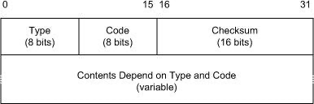
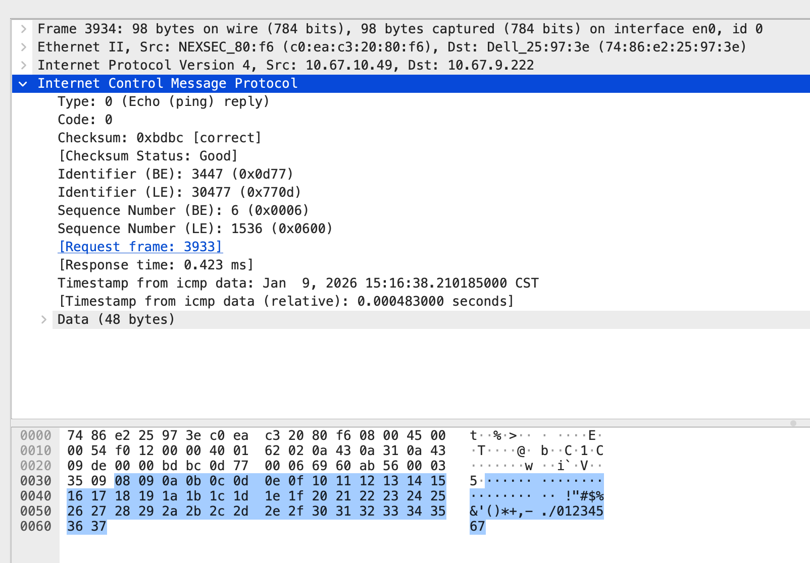
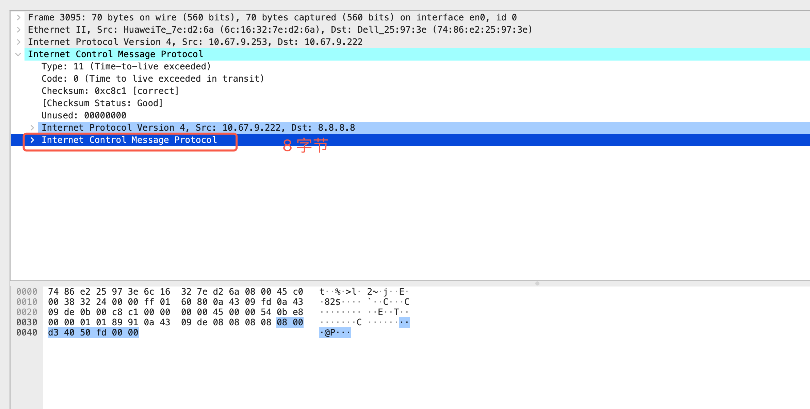

# 8.1. Introduction

IP 协议本身 **无法告知数据报是否送达**，也 **无法提供路径或延迟信息**。为解决这些问题，**ICMP（Internet Control Message Protocol）** 与 IP 配合使用，提供 **错误报告** 和 **控制信息**，帮助 **诊断网络问题** 和 **配置 IP 层**。ICMP 使用 IP 传输，因此既不是传统的网络协议，也不是传输协议，而是位于两者之间的控制协议。

ICMP 消息可以被 **IP 层、传输层（TCP/UDP）以及部分应用程序** 使用，但 **不保证 IP 可靠传输**，仅指示 **特定类型的失败或配置信息**。像路由器缓冲区溢出导致的丢包，ICMP 并不会通知源主机，这类情况通常由 TCP 等协议处理。

由于 ICMP 能 **影响系统操作** 并 **获取配置信息**，它也可能被 **黑客滥用**。因此，网络管理员通常 **屏蔽部分 ICMP 消息**，尤其在边界路由器上，这会影响 **ping、traceroute 等诊断工具** 的正常使用。

在 IPv4 中，**ICMPv4** 提供 **错误报告和信令**；在 IPv6 中，**ICMPv6 作用更广**，不仅用于 **错误报告**，还用于 **邻居发现 (ND)**、**路由器发现**、**多播地址管理**，以及 **移动 IPv6 切换管理**，是 **IPv6 网络运行不可或缺** 的关键协议。

## 一点题外话

```shell
$ ping 10.67.9.223
PING 10.67.9.223 (10.67.9.223): 56 data bytes
ping: sendto: Host is down
Request timeout for icmp_seq 0
```

ARP 表项状态：

```text
? (10.67.9.223) at (incomplete) on en0
```

当 ping 发送 ICMP Echo Request 时，协议栈需要先完成二层地址解析（ARP）。当前目标 IP 的 ARP 表项为 `(incomplete)`，说明内核尝试解析 MAC 地址但未成功，目标在二层被判定为不可达。

因此内核在 **ICMP 报文构造之前** 就在 `sendto()` 阶段直接返回错误，ping 显示 `Host is down`。此时 **ICMP 报文和以太网帧都不会被生成**，数据包从未进入网卡发送队列。

抓包工具只能捕获已经到达网卡层的报文，而该失败发生在协议栈内部，因此在网卡上 **抓不到任何 ICMP 或 ARP 报文**。`Request timeout` 只是 ping 的用户态输出，并不代表请求实际被发送。

## 报文结构

**ICMP 的 data 本身没有统一的协议语义，它的意义完全取决于 ICMP 的类型（Type）以及具体实现。**
**例如： ping 的 data 不是给 ICMP 用的，而是给 ping 工具自己用的：用于 RTT 计算、回包校验、MTU 探测和链路质量评估，其内容和长度完全由实现决定。**
**ICMP 校验和与 IPv4 头校验和不同，只要 ICMP 报文内容不变，ICMP 校验和在转发过程中不会发生变化。**




# 8.2. ICMP Messages


ICMP messages are grouped into two major categories: those messages relating to problems with delivering IP datagrams (called error messages), and those related to information gathering and configuration (called query or informational messages).

> ICMPv4 本质上就两类报文：
> 一类是“问一声/回一句”（信息类），一类是“出错了通知你”（差错类）。

## 8.2.1. ICMPv4 Messages

**表 1：常见 ICMPv4 消息类型（看 Type 就够）**

| Type | 名称                      | 类别            | 典型场景                | 是否常用      |
| ---- | ----------------------- | ------------- | ------------------- | --------- |
| 0    | Echo Reply              | 信息类           | ping 响应             | ✅         |
| 3    | Destination Unreachable | 差错类           | 目的不可达               | ✅         |
| 5    | Redirect                | 差错类           | 路由不优                | ⚠️（现代多禁用） |
| 8    | Echo Request            | 信息类           | ping 请求             | ✅         |
| 9    | Router Advertisement    | 信息类           | 路由器通告               | ❌         |
| 10   | Router Solicitation     | 信息类           | 请求路由器信息             | ❌         |
| 11   | Time Exceeded           | 差错类           | TTL 用尽 / traceroute | ✅         |
| 12   | Parameter Problem       | 差错类           | IP 头字段错误            | ⚠️        |
| 13   | Timestamp Request       | 信息类           | 测量延迟                | ⚠️        |
| 14   | Timestamp Reply         | 信息类           | 测量延迟响应              | ⚠️        |
| 15   | Information Request     | 信息类（historic） | 请求地址信息              | ❌         |
| 16   | Information Reply       | 信息类（historic） | 响应地址信息              | ❌         |


**表 2：常见 ICMPv4 差错消息的 Type / Code 对照表**

| Type | Code | 名称                | 含义说明                              | 典型场景       |
| ---- | ---- | ----------------- | --------------------------------- | ---------- |
| 3    | 0    | Dest Unreachable  | Network unreachable               | 路由表无匹配项    |
| 3    | 1    | Dest Unreachable  | Host unreachable                  | 主机不可达      |
| 3    | 2    | Dest Unreachable  | Protocol unreachable              | 传输层协议不支持   |
| 3    | 3    | Dest Unreachable  | Port unreachable                  | UDP 端口未监听  |
| 3    | 4    | Dest Unreachable  | Fragmentation Needed (DF set)     | PMTU 发现    |
| 11   | 0    | Time Exceeded     | TTL exceeded                      | traceroute |
| 11   | 1    | Time Exceeded     | Fragment reassembly time exceeded | 分片超时       |
| 5    | 0    | Redirect          | Redirect for Network              | 次优路由       |
| 5    | 1    | Redirect          | Redirect for Host                 | 次优路由       |
| 12   | 0    | Parameter Problem | Pointer 指示错误                      | IP 头字段错误   |
| 12   | 1    | Parameter Problem | Missing option (historic)         | 已废弃        |
| 12   | 2    | Parameter Problem | Bad IHL / Total Length            | IP 头长度错误   |


**当 IPv4 路由器在转发分组时，如果发现分组长度大于下一跳接口的 MTU，并且该分组的 DF（Don’t Fragment）位被置为 1，路由器将不会对该分组进行分片，也不会继续转发，而是直接将该分组丢弃。与此同时，路由器会向源主机发送一个 ICMPv4 Destination Unreachable 报文，其中 Type 为 3，Code 为 4（Fragmentation Required）。在支持的实现中，该 ICMP 报文还会携带下一跳的 MTU 值，用于告知源主机当前路径所能支持的最大分组大小。该机制构成了 IPv4 Path MTU Discovery（PMTUD）的基础，使源主机能够根据返回的 MTU 信息动态减小报文大小，从而避免在网络中发生分片。**


## 8.2.2. ICMPv6 Messages

**类型范围划分（最重要的一条）**

| Type 范围     | 含义                              | 说明           |
| ----------- | ------------------------------- | ------------ |
| **0–127**   | **错误类（Error Messages）**         | 网络或转发出错时使用   |
| **128–255** | **信息类（Informational Messages）** | 请求 / 应答 / 配置 |

**常见 ICMPv6 类型举例**

| 类型                      | Type | 类别 | 作用               |
| ----------------------- | ---- | -- | ---------------- |
| Destination Unreachable | 1    | 错误 | 无法到达目的           |
| Packet Too Big          | 2    | 错误 | MTU 不够（IPv6 无分片） |
| Time Exceeded           | 3    | 错误 | Hop Limit 用尽     |
| Parameter Problem       | 4    | 错误 | 报文格式问题           |
| Echo Request            | 128  | 信息 | ping 请求          |
| Echo Reply              | 129  | 信息 | ping 响应          |
| Router Solicitation     | 133  | 信息 | 主机找路由器           |
| Router Advertisement    | 134  | 信息 | 路由器公告            |
| Neighbor Solicitation   | 135  | 信息 | ND 请求            |
| Neighbor Advertisement  | 136  | 信息 | ND 响应            |

| Type | 名称                      | Code 的作用                     |
| ---- | ----------------------- | ---------------------------- |
| 1    | Destination Unreachable | 区分不可达原因（无路由 / 策略拒绝 / 地址不可达等） |
| 3    | Time Exceeded           | 区分 Hop Limit 超时 or 重组超时      |
| 4    | Parameter Problem       | 指出具体哪个字段有问题                  |

## 8.2.3. Processing of ICMP Messages

> ICMPv4：实现较松，历史兼容多，系统行为差异大
> ICMPv6：规则被严格规范，协议栈处理路径更可预测

**一、ICMPv4 的一般处理模型（背景）**
在 ICMPv4 中，报文处理行为在不同系统间存在差异。通常，信息类请求（如 Echo Request）由操作系统内核自动处理，而错误类报文则被交付给上层协议（如 TCP）或相关用户进程，由其决定是否响应或忽略。部分报文具有特殊处理逻辑，例如 Redirect 报文会触发主机路由表的自动更新，Destination Unreachable–Fragmentation Required 报文则被用于路径 MTU 发现机制（PMTUD），通常由传输层协议实现。整体而言，ICMPv4 的处理规则更多依赖历史实现和约定。

**二、ICMPv6 的处理规则（RFC 4443，重点）**
ICMPv6 对报文处理流程进行了更严格的规范：未知的错误类报文必须尽可能交付给产生原始报文的上层协议，而未知的信息类报文应直接丢弃；错误报文需携带尽可能多的原始 IPv6 报文内容，但不得超过最小 IPv6 MTU（1280 字节），并依据原始报文中的上层协议类型进行分发，无法识别时则静默丢弃。同时，IPv6 节点必须对 ICMPv6 错误报文的发送进行速率限制，以避免错误风暴和潜在的拒绝服务风险。

# 8.3. ICMP Error Messages


### 1. 为什么 ICMP 错误报文需要限制
ICMP 报文分为错误类（Error）和信息类（Informational）。其中，错误类 ICMP 是对其他报文的被动响应，如果不加限制，可能出现错误报文相互触发，或在广播、多播场景下被大量节点同时生成，从而引发错误级联甚至广播风暴。因此，RFC 对 ICMP 错误报文的生成条件、发送速率以及报文内容进行了严格规范。

---

### 2. ICMP 错误报文的生成限制（核心规则）

在以下情况下，**绝不能生成 ICMP 错误报文**：

- 不能对 **ICMP 错误报文** 再生成 ICMP 错误  
  防止错误报文相互响应，导致无限递归。

- 不能对 **IP 层广播或多播报文** 生成错误  
  否则一个报文可能引发多个节点同时返回 ICMP 错误。

- 不能对 **链路层广播或多播帧** 生成错误  
  原因同上，防止错误放大。

- 不能对 **非首分片** 生成错误  
  非首分片不包含完整的上层协议头，无法定位具体连接或进程。

- 不能对 **源地址无法唯一标识单一节点** 的报文生成错误  
  - IPv4：零地址、回环地址、广播地址、多播地址  
  - IPv6：未指定地址、多播地址、已知的 anycast 地址

#### ICMPv6 的额外限制
ICMPv6 在上述规则基础上进一步收紧：
- 不对 ICMPv6 错误报文生成错误
- 不对 ICMPv6 Redirect 报文生成错误
- 不对 IPv6 多播目的地址生成错误  
  - 例外：Packet Too Big（PTB）和 Parameter Problem（code 2）

---

### 3. ICMP 错误报文的速率限制
即使满足生成条件，在网络异常持续存在的情况下，仍可能产生大量 ICMP 错误报文。因此，RFC 要求对 ICMP 错误报文进行速率限制。  
常见实现方式是 **Token Bucket**，通过限制突发发送量和长期平均速率，防止 ICMP 错误流量失控。

---

### 4. ICMP 错误报文携带原始报文的内容与目的
ICMP 错误报文需要携带触发错误的“原始报文（offending packet）”的一部分，其目的在于：

- 确定出错的是哪个上层协议（TCP、UDP 等）
- 将错误准确交付给对应的连接或用户进程

携带内容包括：
- 原始 IP 头（包含所有 IP 选项）
- 原始 IP 负载的一部分

大小限制：
- IPv4：不超过 576 字节  
- IPv6：不超过最小 IPv6 MTU（1280 字节）

早期规范仅要求携带前 8 字节负载即可定位 TCP/UDP 端口，但随着隧道封装、IP-in-IP 等复杂场景的出现，这一长度已不足以进行准确诊断，因此后续规范允许并鼓励携带更多原始报文内容。

---

### 5. 本章核心理解
ICMP 错误机制的设计目标并不是尽可能多地报告错误，而是**在严格受控的前提下，向上层提供准确、可定位的网络异常信息**。通过限制生成条件、发送速率以及报文内容，ICMP 在提供诊断能力的同时，避免自身成为网络不稳定或流量放大的来源。


## 8.3.1. Extended ICMP and Multipart Messages

> RFC 4884 允许在“ICMP 错误报文”后面再带一段“扩展信息区”，用来放更多诊断信息；为了兼容老设备，前面必须至少保留 128 字节的老格式内容。

**1. 传统 ICMP 错误报文结构（v4 / v6 都类似）**

```shell
IP Header
ICMP Header
└── ICMP Payload（原始出错 IP 报文的一部分）
    ├── 原始 IP Header
    └── 原始 IP Payload 的前 N 字节（通常是 IP 头 + 前 8 字节）
```

手动构造icmp报文：
```shell
ping -c 1 -m 1 8.8.8.8  # ttl = 1 , 到达第一个网关&路由器时候必须回 ICMP Time Exceeded（Type 11）

3094	21.624878	10.67.9.222	8.8.8.8	ICMP	98	Echo (ping) request  id=0x50fd, seq=0/0, ttl=1 (no response found!)
3095	21.627225	10.67.9.253	10.67.9.222	ICMP	70	Time-to-live exceeded (Time to live exceeded in transit)

```



想起来一个好玩的事情： **如何知道直连第一个网关？ ttl = 1 发动icmp**

**2. RFC 4884 没有改 ICMP Header，只做了一件事：允许在“原始出错报文副本”后面，再追加一个“扩展结构”**

```shell
ICMP Header
└── Primary ICMP Payload（≥128B）
    ├── 原始 IP Header
    ├── 原始 IP Payload（一部分）
    ├── Padding（补齐）
    ├── Extension Header（32 bits）
    └── Extension Objects（0 个或多个）
```

## 8.3.2. Destination Unreachable (ICMPv4 Type 3, ICMPv6 Type 1) and Packet Too Big (ICMPv6 Type 2)

**Destination Unreachable（目的不可达）** 是 ICMP 中最常见的错误报文之一，用于指示：  
一个 IP 数据报由于传输途中出现问题，或目标端不存在合适的接收者，而无法被成功递交到最终目的地。

- **ICMPv4**
  - Type = 3
  - 共定义 16 种 Code
  - 实际常用的只有其中少数几种

- **ICMPv6**
  - Destination Unreachable 的 Type = 1
  - 共定义 7 种 Code

在 IPv6 中，“需要分片但不能分片”的情况不再使用 Destination Unreachable 的某个 Code 表示，而是定义了一个新的 ICMP 类型：  
**Packet Too Big（PTB，Type 2）**。

尽管在类型上有所不同，其用途与 IPv4 中的 **Code 4（Fragmentation Required）** 十分相似，因此在讨论时常被放在一起说明。

---

### ICMP Destination Unreachable / Packet Too Big 对照表

| 协议 | Type | Code | 名称 | 触发条件 | 典型场景 | 备注 |
|-----|------|------|------|----------|----------|------|
| ICMPv4 | 3 | 0 | Network Unreachable | 无匹配路由 | 路由器查表失败 | 较少使用 |
| ICMPv4 | 3 | 1 | Host Unreachable | 直连交付失败 | ARP 解析失败 | 最后一跳常见 |
| ICMPv4 | 3 | 2 | Protocol Unreachable | 协议不支持 | 极少出现 | 已废弃 |
| ICMPv4 | 3 | 3 | Port Unreachable | 端口无监听 | UDP 常见 | 应用层错误 |
| ICMPv4 | 3 | 4 | Fragmentation Required | DF=1 且 MTU 不足 | PMTUD | 携带下一跳 MTU |
| ICMPv4 | 3 | 5 | Source Route Failed | 源路由失败 | 已弃用 | 几乎不用 |
| ICMPv4 | 3 | 9 | Network Administratively Prohibited | 管理策略阻止 | 防火墙/ACL | 可配置静默丢弃 |
| ICMPv4 | 3 | 10 | Host Administratively Prohibited | 管理策略阻止 | 防火墙/ACL | 同上 |
| ICMPv4 | 3 | 13 | Communication Administratively Prohibited | 通信被禁止 | 安全策略 | 最常见禁止码 |
| ICMPv6 | 1 | 0 | No Route to Destination | 无路由 | 路由查表失败 | 明确区分路由问题 |
| ICMPv6 | 1 | 1 | Communication Administratively Prohibited | 管理策略阻止 | 防火墙 | IPv6 默认 |
| ICMPv6 | 1 | 2 | Beyond Scope of Source Address | 源地址作用域不足 | link-local 越界 | IPv6 特有 |
| ICMPv6 | 1 | 3 | Address Unreachable | 直连失败 | ND 解析失败 | 类似 v4 Code 1 |
| ICMPv6 | 1 | 4 | Port Unreachable | 端口无监听 | UDP | 语义同 v4 |
| ICMPv6 | 1 | 5 | Source Address Failed Policy | 源地址策略失败 | ingress/egress filter | IPv6 特有 |
| ICMPv6 | 1 | 6 | Reject Route to Destination | reject 路由 | 显式拒绝 | 管理用途 |
| ICMPv6 | 2 | 0 | Packet Too Big | MTU 不足 | PMTUD | 必须携带 MTU |

## 8.3.3. Redirect (ICMPv4 Type 5, ICMPv6 Type 137)

1. 只能由路由器发送， 只能发给主机， 不能被路由器转发。
2. 现代网络中用的很少。

在**同一链路上存在多个网关**时，如果主机把数据报发给了
**并非最优的网关 A**，而路由器 A 发现 **网关 B 更适合转发**，
则：

- A **仍然转发该数据报给 B**
- 同时向主机发送 **ICMP Redirect**
- 告诉主机：  
  **“以后同类目的地址，直接发给 B，不要再走我”**

## 8.3.4. ICMP Time Exceeded (ICMPv4 Type 11, ICMPv6 Type 3)

IPv4 使用 TTL、IPv6 使用 Hop Limit 来限制数据报最多经过的跳数。
路由器在转发数据报时会将该值减 1，
如果减完后变为 0，路由器就丢弃该数据报，
并向源主机发送 ICMP Time Exceeded 报文（ICMPv4 Type 11 / ICMPv6 Type 3，Code 0）。

traceroute 正是通过发送不同 TTL 值的数据报，
利用沿途路由器返回的 ICMP Time Exceeded 报文，
逐跳获取转发路径上的路由器地址。

如果分片的数据报在目的主机处未能在规定时间内收齐所有分片，
整个数据报会被丢弃，并返回 ICMP Time Exceeded（Code 1）。

```shell
traceroute www.example.com
```

traceroute 通过向目标主机发送一系列 IP 数据报，并逐步递增 TTL（或 Hop Limit）值，使数据报在路径上的不同路由器处过期；每当数据报的 TTL 被某一跳路由器减为 0，该路由器就丢弃该数据报并返回 ICMP Time Exceeded 报文，traceroute 由此获取该路由器的地址并测量往返时延；当探测报文最终到达目的主机时，不再产生 Time Exceeded，而是返回 ICMP Port Unreachable（或相应响应），从而标志路径探测结束。

## 8.3.5. Parameter Problem (ICMPv4 Type 12, ICMPv6 Type 4)

ICMP Parameter Problem 消息用于报告收到的 IP 报文头部存在无法修复的错误，当没有其他 ICMP 类型能够准确描述问题时发送。在 ICMPv4 中，该消息类型为 Type 12，常用 Code 为 0（大多数头字段错误）和 2（IHL 或 Total Length 错误），Pointer 字段指示出错字段在原始 IPv4 头中的字节偏移。在 ICMPv6 中，该消息类型为 Type 4，Code 0 表示头字段非法，Code 1 表示遇到无法识别的 Next Header 类型，Code 2 表示遇到未知的 IPv6 选项，Pointer 字段同样指示出错字段在 IPv6 报文头或扩展头中的偏移，从而精确定位问题。

# 8.4 ICMP 查询/信息消息（Query/Informational Messages）主要内容

## 1. 定义与作用
- **ICMP 查询/信息消息**用于主动探测网络状态或请求信息。
- 这类消息**不是错误报文**，用于网络管理、诊断和性能测量。
- 常用于：
  - 连通性测试（ping）
  - 网络延迟测量（timestamp）
  - 路由/邻居发现（尤其在 IPv6 中由 ND 协议替代历史信息请求）

---

## 2. ICMPv4 常见查询/信息消息

| Type | 名称 | 功能 | 典型用途 |
|------|------|------|----------|
| 0    | Echo Reply | 响应 ping 请求 | ping 回应 |
| 8    | Echo Request | 发起 ping 请求 | ping 测试主机可达性 |
| 13   | Timestamp Request | 请求时间戳 | 测量网络延迟 |
| 14   | Timestamp Reply | 响应时间戳请求 | 延迟测量响应 |
| 15   | Information Request | 请求地址信息（历史） | 很少使用 |
| 16   | Information Reply | 响应地址信息（历史） | 很少使用 |
| 9    | Router Advertisement | 路由器通告 | 网络自动配置（少用） |
| 10   | Router Solicitation | 请求路由器信息 | 网络自动配置（少用） |

**注意**：
- Echo Request / Reply 是最常用的测试工具。
- Timestamp / Information Request / Reply 已经很少使用。
- 信息类消息可能被防火墙拦截，不代表主机不可达。

---

## 3. ICMPv6 查询/信息消息

| Type | 名称 | 功能 | 典型用途 |
|------|------|------|----------|
| 128  | Echo Request | 发起 ping 请求 | ping 测试主机可达性 |
| 129  | Echo Reply | 响应 ping 请求 | ping 回应 |

**变化点**：
- IPv6 **去掉了历史的 Information Request/Reply 类型**。
- 地址发现、邻居发现等功能由 **Neighbor Discovery（ND）协议**替代。
- Echo 消息仍是信息类报文，用于网络连通性测试。

---

## 4. 工程/学习重点与容易忽略的点

1. **Identifier 与 Sequence Number 匹配**
   - 很多人以为 Echo Reply 只要返回就行。
   - 正确匹配请求和响应需要 **Identifier + Sequence Number**。
   - 特别在同时 ping 多个目标或多进程 ping 时非常关键。

2. **Timestamp Request 的限制**
   - 一些操作系统或防火墙默认屏蔽 Timestamp Request。
   - 学习时经常忽略这个历史类型，但理解它有助于理解网络延迟测量原理。

3. **ICMPv6 的 ND 替代设计**
   - 很多人以为 ICMPv6 也有信息请求类型，其实 ND 完全取代了它。
   - 忽略这一点容易混淆 IPv4 和 IPv6 的网络诊断方法。

4. **非错误 ICMP 报文也可能被丢弃**
   - 防火墙或路由器可能屏蔽 Echo / Timestamp / ND。
   - 导致 ping/traceroute 无法工作，但网络本身可达。
   - 学习中容易误判连通性。

5. **数据字段大小影响 MTU**
   - Echo Request 的 Data 字段太大 → 报文超过 MTU。
   - 会导致 IP 分片或丢包。
   - 在实验或压力测试中经常被忽略。

---

## 5. 一句话总结
> ICMP 查询/信息消息是一类非错误报文，用于主动探测网络可达性、测量延迟及收集状态信息。IPv4 包括 Echo、Timestamp 及历史信息请求类型；IPv6 保留 Echo 类型，并将其他探测功能交由 Neighbor Discovery 协议实现。在工程中，需要注意 Identifier/Sequence Number 匹配、防火墙拦截、MTU 限制以及 IPv6 ND 与历史信息请求的区别。

# 8.5. Neighbor Discovery in IPv6

| 通信方式 | 英文        | 中文翻译    | 目标节点          | IPv6 应用 / 举例              | 特点                 |
| ---- | --------- | ------- | ------------- | ------------------------- | ------------------ |
| 单播   | Unicast   | 单播      | 一个节点          | 普通通信                      | 一对一通信，最常用          |
| 广播   | Broadcast | 广播      | 同一网段所有节点      | IPv4 ARP 广播               | 一对所有通信，IPv6 不支持广播  |
| 多播   | Multicast | 多播 / 组播 | 一组订阅节点        | IPv6 ND 的 NS 消息、视频直播      | 一对多通信，只有订阅者收到      |
| 任播   | Anycast   | 任播 / 选播 | 多个节点中的最近或最优节点 | IPv6 Anycast DNS、CDN、负载均衡 | 一对最近节点通信，消息只送达一个节点 |

IPv6 的 **Neighbor Discovery（ND，邻居发现协议）** 是一个整合了 IPv4 中 ARP（地址解析）、Router Discovery（路由器发现）和 Redirect（重定向）功能的协议，同时支持移动 IPv6。与 IPv4 不同，IPv6 没有广播地址，ND 广泛使用 **多播（multicast）** 来替代广播，以便在网络和链路层高效地发现邻居和路由器。  

ND 主要用于让同一链路上的节点（主机和路由器）能够互相发现、确认双向连通性，并检测邻居是否不可用。同时，它也支持 **无状态地址自动配置（SLAAC）**，使主机可以根据路由器信息自动生成 IPv6 地址。ND 的功能完全依赖 ICMPv6，因此可以在不同链路层技术下工作，但在支持多播的链路上效率更高。  

ND 包含两大核心模块：  
- **Neighbor Solicitation / Advertisement（NS/NA）**：用于 IP 与链路层地址映射，类似 ARP，同时检查邻居存活。  
- **Router Solicitation / Advertisement（RS/RA）**：用于路由器发现、移动 IP 代理发现、重定向和地址自动配置。  

ND 还可以使用 **SEND（Secure Neighbor Discovery）** 提供身份验证和增强安全性。在消息传输上，ND 消息都是 ICMPv6 消息，并要求 **Hop Limit 为 255**，接收端会验证这一值以防止远程节点伪造消息。ND 消息还可以携带多种可选字段，如链路层地址、前缀信息和 MTU，大大丰富了协议功能。

**IPv6 的 Neighbor Solicitation 里用的“组播”，本质不是为了给一群主机发消息，而是为了解决不知道对方 MAC、又不想像 IPv4 ARP 那样广播吵醒所有人的问题：发送方根据目标 IPv6 地址的最后 24 位计算出一个 solicited-node multicast 地址，把 NS 只发到这个地址上，而只有真正拥有该 IPv6 地址（或极少数尾号相同）的主机会监听并回应 NA，从而以“接近单播的效果”完成邻居发现。**

## 8.5.2. ICMPv6 Neighbor Solicitation and Advertisement (IMCPv6 Types 135, 136)

主要讲的是 IPv6 邻居发现（NDP）中最核心的一对消息机制，系统性说明了 NS/NA 用来做什么、怎么发、发给谁、解决了 IPv4 的哪些问题：

这一节首先说明 Neighbor Solicitation（NS） 的作用：当主机需要知道某个 IPv6 地址对应的链路层地址（如 MAC），或检测某个邻居是否仍然可达、某个地址是否已被占用时，会发送 NS。NS 通常不是广播，而是发往由目标 IPv6 地址计算得到的 solicited-node 组播地址，从而将接收范围缩小到极少数节点，避免像 IPv4 ARP 那样对整条链路造成干扰。

随后介绍 Neighbor Advertisement（NA）：拥有该 IPv6 地址的节点会返回 NA，告知自己的链路层地址和当前状态。NA 可用于响应 NS，也可在地址或链路状态发生变化时主动发送，用于更新其他节点的邻居缓存。NA 中的标志位用于区分路由器/主机身份、通告的权威性以及是否为请求的响应。

本章还强调，NS/NA 不仅替代了 ARP，还承担了 重复地址检测（DAD） 和 邻居可达性检测（NUD） 的基础通信功能，是 IPv6 在二层与三层之间建立“邻居状态机”的关键机制。通过使用 ICMPv6 + 组播，IPv6 实现了更精细、更可控、可扩展的本地网络邻居管理方式。

**后面的几个小节暂略， ipv6 icmp 暂时用的少**

## 8.6. Translating ICMPv4 and ICMPv6

v6 & v4 转换问题. 略.