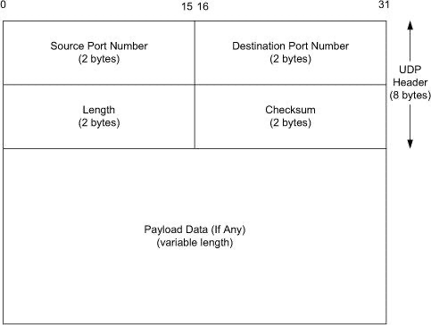
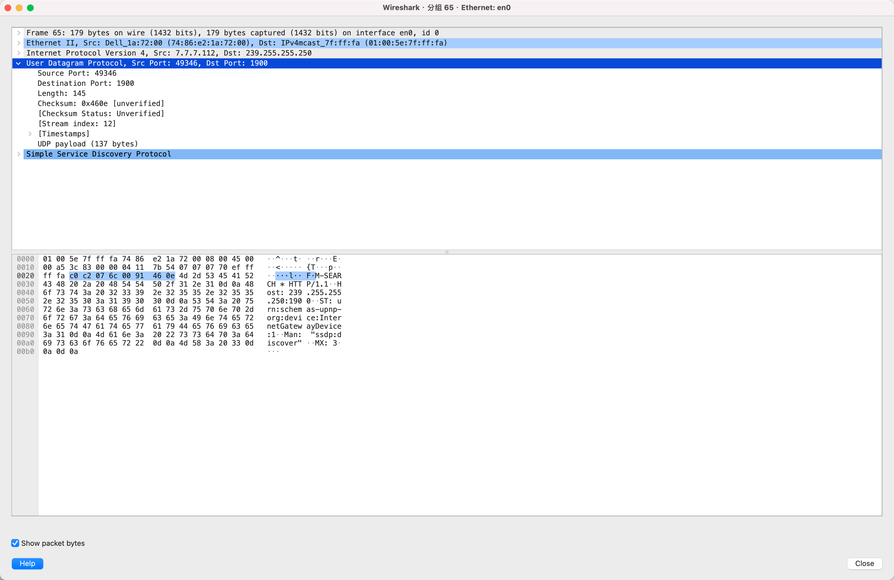
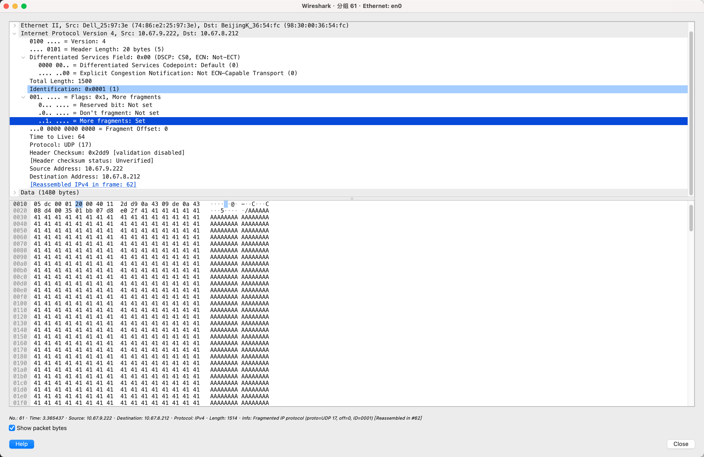

# 10.1. Introduction

TCP 是面向连接的流式协议，可靠传输且保证顺序，适合文件、网页和邮件等需要完整有序数据的场景；UDP 是无连接的报文式协议，不保证可靠性，保持每个报文边界，适合实时性高、能容忍丢包的应用如视频、语音、DNS 查询和在线游戏。

# 10.2. UDP Header






## 1. UDP 头部概览
- **UDP 头部固定为 8 字节**。
- 位于 UDP 数据报开头，紧跟着是实际数据（Payload）。
- 头部字段：
  1. **源端口（Source Port）**（可选）  
  2. **目标端口（Destination Port）**（必填）  
  3. **长度（Length）**  
  4. **校验和（Checksum）**

> UDP 头部 + 数据 = 整个 UDP 数据报

---

## 2. 端口（Ports）
- 端口号类似“邮箱”，用于标识发送和接收的进程。
- **16 位数字** → 范围 0~65535。
- **源端口**可以为 0，如果不需要回复。
- **目标端口**告诉接收端是哪个进程接收数据。

**关键点：**
- TCP 和 UDP 的端口空间独立 → 相同端口号可以在 TCP 和 UDP 中共存。
- 常用服务（如 DNS 53 端口）通常在 TCP/UDP 中使用相同端口，但这是约定，不是协议要求。

---

## 3. 校验和（Checksum）
- UDP 使用 **校验和** 来保证数据完整性。
- 校验范围包括 **UDP 头部、数据**以及 **IP 伪头部**（源 IP 和目的 IP）。
- 如果 IP 地址被修改（如 NAT），校验和必须重新计算。

---

## 4. 长度字段（Length）
- **UDP 长度字段**表示 **UDP 头部 + 数据的总长度（字节数）**。
- 最小值 = 8（只有头部，无数据）。
- 发送长度为 0 的 UDP 数据报是允许的，但不常见。

### UDP 长度与 IP 层长度的关系

- IPv4: UDP 长度 = IPv4 总长度 − IPv4 头部长度

- IPv6: UDP 长度 = Payload Length 字段 − 扩展头长度

# 10.3. UDP Checksum

## 1. 基本概念
- UDP 校验和是 **首个真正的端到端传输层校验**（ICMP 也有校验和，但不是传输协议）。  
- 校验范围：
  1. **UDP 头部**  
  2. **UDP 数据（Payload）**  
  3. **伪头部（Pseudo-header）**，由 IP 层信息构成  
- **计算方式**：由发送端计算，接收端验证，不在传输过程中修改（除非经过 NAT）。  
- **IPv4 IP 头校验和**仅覆盖 IP 头部，不包括数据，并且每经过一个路由器都会重新计算。  

**特点**：
- 在 IPv4 中 **可选**（强烈建议启用）  
- 在 IPv6 中 **必需**（因为 IPv6 没有 IP 层头校验和）  
- 目的是保证传输层数据传递给应用时 **无误**  

---

## 2. 校验和计算细节

### 2.1 偶数长度要求
- UDP 校验和算法按 **16 位字（2 字节）累加**计算。  
- 如果 UDP 数据报长度是奇数：
  - 在计算校验和时 **在末尾虚拟补一个 0 字节**（Pad byte）  
  - 仅用于计算，不实际发送  

### 2.2 伪头部（Pseudo-header）
- UDP（TCP 同样）计算校验和时，需要一个 **虚拟伪头部**：
  - IPv4 伪头部长度：12 字节  
  - IPv6 伪头部长度：40 字节  
- 伪头部包含：
  1. 源 IP 地址  
  2. 目标 IP 地址  
  3. 协议字段（Protocol/Next Header = 17 表示 UDP）  
  4. UDP 长度字段  
- **仅用于校验和计算，不发送**  
- 作用：保证 UDP 数据报 **到达正确目标**，防止 IP 层误投递或交给其他协议  

### 2.3 校验和存储规则
- 校验和计算结果为 `0x0000` → 存储为 `0xFFFF`（一补数表示法）  
- 校验和字段为 `0x0000` → 表示发送方未计算校验和  
- 接收端发现校验和错误 → **静默丢弃数据报**，不发送错误消息，但可更新统计  

---

## 3. UDP 校验和的重要性
- RFC1122 规定 **UDP 校验和默认启用**  
- 校验和重要性：
  1. 防止路由器软件/硬件错误修改数据报  
  2. 防止老旧数据链路协议（如 SLIP）无校验导致的数据报错误无法发现  

---

## 4. NAT 对 UDP 校验和的影响
- NAT 修改 IP 地址和/或 UDP 端口 → 需 **重新计算 UDP 伪头部校验和**  
- 属于“跨层操作”（Layering Violation），UDP 使用了 IP 信息  
- RFC4787 对 NAT 处理 UDP 的规则做了规范  

---

## 5. UDP-Lite 与部分校验和
- 部分应用（如多媒体）对错误容忍 → 可使用 **部分校验和（Partial Checksum）**  
- 仅覆盖 Payload 部分  
- 相关内容在 10.6 节 UDP-Lite 中讨论  

---

## ✅ 总结
1. UDP 校验和 = UDP 头部 + UDP 数据 + 伪头部  
2. 数据长度为奇数 → 末尾虚拟补 0 字节  
3. IPv4 中可选，IPv6 中必需  
4. 校验和错误 → 数据报丢弃  
5. NAT 修改地址/端口 → 需重新计算校验和  

# 10.4. Examples

**举例一**：

```shell
// py 脚本发送不可达端口报文
 dst_ip = "127.0.0.1"
    6 dst_port = 9999   # 随便选
    7 
    8 pkt = IP(dst=dst_ip) / UDP(sport=12345, dport=dst_port) / b"hello udp"
    9 
   10 send(pkt, verbose=False)

// 抓包
// 发送包
20:21:18.251635 IP (tos 0x0, ttl 64, id 1, offset 0, flags [none], proto UDP (17), length 37)
    127.0.0.1.12345 > 127.0.0.1.9999: [udp sum ok] UDP, length 9
// 收包
20:21:18.251733 IP (tos 0x0, ttl 64, id 15439, offset 0, flags [none], proto ICMP (1), length 56, bad cksum 0 (->4074)!)
    127.0.0.1 > 127.0.0.1: ICMP 127.0.0.1 udp port 9999 unreachable, length 36
        IP (tos 0x0, ttl 64, id 1, offset 0, flags [none], proto UDP (17), length 37)
    127.0.0.1.12345 > 127.0.0.1.9999: [no cksum] UDP, length 9
```

**举例二**：

```shell
// py 发包
    5 dst_ip = "10.67.8.212"
    6 dst_port = 443   # 随便选
    7 
    8 pkt = IP(dst=dst_ip) / UDP(sport=12345, dport=dst_port) / b"hello udp"
    9 
   10 send(pkt, verbose=False)

// 抓包举例
20:32:13.142965 IP (tos 0x0, ttl 64, id 1, offset 0, flags [none], proto UDP (17), length 37)
    10.67.9.222.12345 > 10.67.8.212.443: [udp sum ok] UDP, length 9
```

### 1. UDP 是无连接、无确认的协议
UDP 在发送数据前不会建立连接，也不会等待对端确认。发送方只负责把数据报交给内核发送，无法直接知道数据是否被接收，抓包时通常只能看到 UDP 数据报被发出。

### 2. 端口是否存在决定内核的后续行为
- **端口存在（有进程监听）**：  
  内核将 UDP 数据报交给对应进程处理，不返回任何响应报文，抓包中只会看到 UDP。
- **端口不存在（无进程监听）**：  
  内核会生成并返回 ICMP Destination Unreachable（Port Unreachable）报文，通知发送方该端口不可达。

### 3. ICMP 错误是异步且不可靠的
ICMP 报文不是 UDP 协议的一部分，可能在网络中被丢弃或被防火墙过滤。因此，没有收到 ICMP 并不意味着端口一定存在，UDP 本身仍然是不可靠的。

### 4. ICMP 报文包含原始 UDP 信息
ICMP Port Unreachable 报文中会携带原始“出错”UDP 报文的 IP 头、UDP 头及部分数据，用于让发送方识别是哪一个端口、哪一个数据报出现了问题。

### 5. 实验结论
通过抓包实验可以直观看到：  
UDP 发送成功并不等于数据被接收；只有在端口不存在这一明确错误场景下，内核才可能通过 ICMP 异步通知发送方。

# 10.5. UDP and IPv6

略

# 10.6. UDP-Lite

UDP-Lite 是 UDP 的扩展协议，允许只对数据报的一部分进行校验和覆盖，非常适合语音、视频等对部分错误容忍的多媒体应用，在保证轻量传输的同时减少不必要的数据丢弃。

# 10.7 IP Fragmentation

## 1. 为什么需要分片
- 链路层帧有最大传输单元（MTU）限制。  
- IP 层需要保持数据报抽象一致，因此会在发送端或中途路由器进行 **分片（fragmentation）**，并在目的端重新组装。  
- IPv4：发送端和路由器都可分片。  
- IPv6：只有发送端可分片，路由器不可分片。  

## 2. 分片机制
- 一个 IP 数据报大于接口 MTU → 被分成多个片（fragment）。  
- 每个片都有：  
  - **Identification**：标识属于同一数据报  
  - **Fragment Offset**：当前片在原始数据报中的偏移  
  - **MF（More Fragments）位**：表示后面是否还有片 ， 1 表示后面还有片，0 表示最后一个片。
- 目的端根据这些字段重组完整数据报，即使片乱序到达也能正确重组。  

**一个分片的ip报文**



## 3. UDP/IPv4 分片示例
- 假设 Ethernet MTU = 1500 字节：  
  - UDP 报文 ≤1472 字节 → 不分片  
  - UDP 报文 >1472 字节 → 产生分片  
- 分片会增加 IP 层开销（每个片多一个 IPv4 头部）。  
- 只有第一个片包含 UDP 头部（源端口/目的端口信息），后续片不含，影响防火墙或抓包显示。  

## 4. 分片风险与性能问题
- **丢片风险**：任意一个片丢失，整个数据报就丢失。  
- TCP 负责超时重传，但 UDP 不负责，应用层可能需要处理重传。  
- 因此，分片通常尽量避免。  

## 5. 重组超时机制
- 目的端收到第一个片时会启动定时器。  
- 如果在一定时间（通常 30~60 秒）内未收到所有片 → 丢弃已接片并发送 **ICMP Time Exceeded**（IPv4）通知源端。  
- 避免缓冲区被半片占满，也能防止恶意攻击。  

## ✅ 一句话总结
IP 分片是为了适应不同链路 MTU，将大数据报拆成多个片传输，IPv4 可在中途路由器分片，IPv6 只能由源端分片，丢失任意片都将导致整报文丢失，因此分片会带来性能风险，通常应尽量避免。

# 10.8. Path MTU Discovery with UDP

## 1. 基本概念

* **PMTU (Path Maximum Transmission Unit)**

  * 指源主机到目的主机路径中，**允许的最大 IP 数据报长度**（包括 IP 头和上层负载），不会触发分片。
  * 每条路由路径的 MTU 可能不同。

* **PMTUD (Path MTU Discovery)**

  * 一种机制，用于**动态发现路径 MTU**，保证 IP 数据报在传输过程中不被分片。
  * 主要依赖 **ICMP “Fragmentation Needed” (PTB, type 3 code 4)** 消息。

* **DF（Don't Fragment）位**

  * IP 头部的标志位，DF=1 表示 **不允许分片**。
  * PMTUD 依赖于 DF=1 触发 ICMP PTB 消息。

---

## 2. PMTUD 的工作原理

1. 源主机发送 UDP/IP 数据报，DF=1。
2. 数据报经过路由器，如果超过路由器 MTU：

   * 路由器无法分片 → 生成 ICMP PTB 消息返回源主机。
   * 消息中包含 **建议的下一跳 MTU**。
3. 源主机 IP 层接收到 ICMP PTB 后：

   * 更新 **路径 MTU 缓存**（每个目的主机单独缓存）。
   * 调整后续发送的数据报大小，保证不超过 PMTU。
4. 缓存有过期时间（Linux 默认 10 分钟，RFC1191 建议 10 分钟）。

**特点**：

* PMTUD 发生在 IP 层，对应用层通常是透明的（应用不直接看到 ICMP，除非发送失败）。
* 应用控制 UDP 负载大小，可以通过 API 查询或依赖 IP 层自动调整。

---

## 3. 典型问题

* **高速发送大包**：

  * ICMP 消息可能还没返回 → 应用看不到错误。
* **防火墙或过滤器丢弃 ICMP**：

  * PMTUD 失效 → 可能造成传输失败或大量丢包。
* **不同链路 MTU**：

  * 普通以太网 MTU = 1500
  * PPPoE MTU = 1492（1500 - 6 - 2 字节头部）

---

## 4. 实验一：快速发送大 UDP 包

* **目的**：演示 DF=1 数据报超过路径 MTU → 触发 PMTUD。
* **操作**：

```bash
sock -u -i -n 3 -w1473 www.cs.berkeley.edu echo
```

* 每个包 1473 字节负载 → IP 长度 1501
* DF=1，不允许分片
* **观察**：

  * 三个包快速发送，几乎同时完成
  * 路由器返回 ICMP PTB（need to frag，MTU=1500）
  * 应用可能看不到 ICMP 消息 → 第一轮发送可能失败
* **结论**：

  * PMTUD 依赖 ICMP
  * 快速发送可能导致应用层“感知不到”

---

## 5. 实验二：慢速发送大 UDP 包

* **目的**：展示 PMTUD 生效和应用层可感知情况
* **操作**：

```bash
sock -u -i -n 3 -w1473 -p 2 www.wisc.edu echo
```

* 每包发送间隔 2 秒
* 第一次发送 → ICMP PTB 返回，应用收到 “Message too long”
* 第二次发送 → 源主机已更新路径 MTU → 包按 PMTU 发送或分片
* **观察**：

  * PMTU 缓存更新后，数据包可以正常发送
  * 缓存过期后，PMTUD 重新触发
* **结论**：

  * PMTUD 需要时间 → 慢速发送或重试才能生效
  * 应用发送大包时，DF=1 + 延迟 = PMTUD 可见

---

## 6. 实践注意事项

1. **DF 位**：

   * 触发 PMTUD 的关键
   * DF=0 → 路由器可直接分片，不触发 ICMP PTB
2. **ICMP 消息处理**：

   * 应用通常不直接看到
   * IP 层缓存 PMTU 并自动调整
3. **防火墙问题**：

   * 丢弃 ICMP → PMTUD 失败 → 可能导致发送超大包失败
4. **系统配置**：

   * Linux：

     * `/proc/sys/net/ipv4/ip_no_pmtu_disc = 1` → 禁用 PMTUD
   * Windows：

     * 修改注册表 `EnablePMTUDiscovery = 0`
5. **RFC4821**：

   * 提供一种不依赖 ICMP 的 PMTUD 替代方案（尤其针对 TCP）

---

## 7. PMTUD 流程示意

```
源主机              路由器                  目的主机
  |                     |                       |
  |-- UDP包 (DF=1, 超大)--> |                   |
  |                     |--> ICMP PTB --------|
  |<-- ICMP PTB --------|                       |
  |                     |                       |
  |-- UDP包 (调整大小/分片) -->                  |
```

* 快速发送 → ICMP 来不及 → 应用看不到
* 慢速发送 → ICMP 返回 → IP 层调整 → PMTUD 生效

# 10.9. Interaction between IP Fragmentation and ARP/ND

## 一、问题背景

本节讨论 **IP 分片（IP Fragmentation）** 与 **ARP（IPv4）/ ND（IPv6）** 之间的实现层交互问题。

核心关注点包括：

1. 当一个 IP 数据报被分成多个分片时：
   - 会触发 **多少次 ARP 请求**？
2. 在 ARP 尚未完成地址解析前：
   - 有 **多少个分片会被缓存等待 ARP 回复**？
   - 其余分片是等待还是被丢弃？

---

## 二、实验条件与设计

- 传输协议：UDP
- 用户数据大小：8192 bytes
- 链路 MTU：1500 bytes（以太网）
- 结果：产生 **6 个 IP 分片**
- 实验前清空 ARP cache，确保触发 ARP
- 系统：Linux

---

## 三、实验现象与分析

### 1️⃣ 目标地址不存在（10.0.0.20）

观察到的行为：

- ARP 请求以 **约 1 秒 1 次** 的速率发送
- 总共发送 **3 次 ARP request**
- 无 ARP reply 后放弃
- **没有任何 IP 分片被真正发送**

结论：

- 分片不会导致 ARP 洪泛
- ARP 请求存在 **速率限制**
- 在地址未解析前，IP 分片不会盲目下发

---

### 2️⃣ 目标地址存在（10.0.0.3）

时间顺序表现：

1. 发送 ARP request
2. 约 **250 μs** 后收到 ARP reply
3. 约 **20 μs** 后发送第一个 IP 分片
4. 剩余分片在 **几微秒内连续发送完成**

Linux 的实现特性：

- **最后一个分片最先发送**
  - 即 fragment offset 最大的分片先发

结论：

- ARP 解析完成是分片发送的前置条件
- 一旦解析完成，分片会被快速、连续地下发

---

## 四、ARP 与分片交互的关键实现结论

### ✅ 1️⃣ ARP 请求数量控制

- 针对同一未解析 IP：
  - **不会为每个分片发送 ARP**
  - ARP 请求被限速（通常 ~1 次/秒）

依据：

- **RFC 1122**
  - 明确要求防止 ARP flooding

---

### ✅ 2️⃣ ARP 未完成时的分片缓存问题

历史实现中的问题：

- 只缓存 **一个分片**
- 其他分片被丢弃
- 导致 **整个 IP 数据报无法重组** （这些分片 不是稍后重发，而是 根本没进队列）

RFC 1122 的最低要求：

> 链路层 SHOULD 至少保存一个（最新的）待发送分组，
> 并在地址解析完成后发送它。

不足之处：

- 仅保存一个分片仍可能导致整包丢失

现代系统（如 Linux）改进：

- 提供 **更大的 pending queue**
- 在 ARP 完成后：
  - 尽量发送 **全部分片**
  - 减少不必要的丢包

---

## 五、与 IPv6 ND 的关系

- IPv6 使用 **Neighbor Discovery（ND）** 替代 ARP
- 交互问题本质相同：
  - 地址解析未完成时如何处理分片
- 同样需要：
  - 请求速率限制
  - 合理的数据缓存机制

---

## 六、一句话总结

**IP 分片不会引发 ARP 洪泛。现代实现会对 ARP 请求进行限速，并在地址解析完成前缓存多个分片；ARP 一旦解析成功，分片会被迅速连续发送。历史上因仅缓存单个分片而导致的整包丢失问题，在 RFC 1122 之后逐步得到改进。**


# 10.10. Maximum UDP Datagram Size

## 一、UDP 理论最大报文大小

### IPv4
- IPv4 Total Length 字段：16 bit  
- 最大 IP 数据报长度：65,535 bytes  
- IPv4 头部（无 option）：20 bytes  
- UDP 头部：8 bytes  
- **最大 UDP 用户数据：65,507 bytes**

### IPv6
- IPv6 Payload Length 字段：16 bit  
- 最大 IPv6 payload：65,535 bytes  
- UDP 头部占用：8 bytes  
- **最大 UDP 用户数据：65,527 bytes**
- 前提：不使用 jumbogram

---

## 二、为什么理论最大值通常无法端到端传输？

主要有两个原因：

1. **本地主机协议栈的实现限制**
2. **接收端应用程序的处理能力限制**

---

## 10.10.1 Implementation Limitations（实现限制）

### 1. Socket 缓冲区限制

- UDP 通过 sockets API 发送和接收数据
- 每个 socket 都有：
  - 发送缓冲区（SO_SNDBUF）
  - 接收缓冲区（SO_RCVBUF）
- 对 UDP 来说：
  - **socket 缓冲区大小直接限制单个 UDP datagram 的最大大小**

#### 常见默认值
- 8192 bytes
- 65,535 bytes

👉 通常可通过 `setsockopt()` 调整

---

### 2. IPv4 的最小重组能力要求

- IPv4 规范要求：
  - 主机必须至少能重组 **576-byte 的 IPv4 数据报**
- 因此许多 UDP 应用：
  - 将应用层数据限制在 **512 bytes 以内**
  - 以保证 IP 数据报不超过 576 bytes

#### 典型协议
- DNS
- DHCP

👉 属于历史背景下的保守工程设计

---

## 10.10.2 Datagram Truncation（UDP 报文截断）

### 核心问题

> 如果接收到的 UDP 报文大小  
> **超过应用 read/recv 指定的缓冲区大小，会发生什么？**

---

### 常见行为（因实现而异）

#### 情况一：直接截断（最常见）
- 超出应用缓冲区的数据被丢弃
- 一个 UDP 报文只会交付一次
- **应用层得到的是“不完整的数据”**

#### 情况二：分多次返回（少数系统）
- 一个 UDP 报文被拆成多次 read
- 应用层 **无法感知这些数据来自同一个 UDP 报文**

---

### 各系统实现差异

| 系统 | 行为 |
|----|----|
| Linux | 可使用 `MSG_TRUNC` 获取真实报文长度 |
| HP-UX | read 返回时设置 `MSG_TRUNC` 标志 |
| SVR4 / Solaris 2.x | 不截断，超出部分在后续 read 返回，且不通知应用 |

---

### UDP 与 TCP 的本质区别

| UDP | TCP |
|----|----|
| 有报文边界 | 无报文边界（字节流） |
| 一次 read 对应一个 datagram | read 消费任意数量字节 |
| 可能发生截断 | 不存在截断问题 |

---

## 核心工程结论

- UDP 在**理论上**支持非常大的报文
- 在**工程实践中**：
  - IP 分片
  - ARP/ND 等待队列
  - socket 缓冲区
  - 应用 read 行为
  - 不同 OS 的 API 语义差异  
  都会成为限制因素

👉 **大多数成熟 UDP 协议都会刻意限制 payload 大小**

---

## 一句话总结

> UDP 的最大报文大小受限的不是 IP 头字段，  
> 而是实现、缓冲区和应用层行为。

# 10.11. UDP Server Design

略， 后续要设计的时候再回看。

本章围绕 **UDP 服务器设计** 展开，核心在于理解 UDP“无连接、无状态”的特性对服务器实现带来的影响：UDP 服务器通常通过端口和地址绑定来同时服务多个客户端，往往需要借助**跨层信息**（如源/目的 IP、端口、是否广播或组播）而不仅是 payload 来正确区分请求、制定策略和保证安全；服务器可以使用**通配绑定或指定本地 IP 绑定**来控制接收范围，并可结合地址复用在同一端口上支持多个实例；UDP 还支持限制对端地址以形成“伪连接”，并在 IPv4/IPv6 跨地址族时需注意端口空间和实现差异；最后，由于 UDP **缺乏流量控制和拥塞控制**，服务器输入队列可能溢出且报文会被静默丢弃，因此高效、可靠的 UDP 服务必须在应用层自行设计并发、限速、重传与防拥塞等机制。


# 10.12. Translating UDP/IPv4 and UDP/IPv6 Datagrams

在前面的章节中，我们已经看到 UDP 作为一种**无连接、无状态**的传输协议，给应用带来了极大的灵活性。但当 UDP 报文进入更复杂的网络环境——例如 IPv4/IPv6 互通、NAT64、隧道与多媒体传输时，这种灵活性也会暴露出明显的工程问题。

本文结合 UDP 在 IPv4/IPv6 翻译中的行为（10.12）以及其在真实互联网中的使用情况（10.13），梳理 UDP 面临的核心挑战。

---

## 一、UDP 在 IPv4 ↔ IPv6 翻译中的核心问题

### 1. UDP 校验和的不对称设计

UDP 在 IPv4 和 IPv6 中的校验和规则并不一致：

- **UDP/IPv4**：校验和可以为 `0`，表示未计算  
- **UDP/IPv6**：校验和是**强制要求**，不能省略  

这意味着，当一个 UDP/IPv4 报文被翻译成 UDP/IPv6 时：

- 如果校验和原本为 0  
- 翻译器必须 **重新计算完整的 UDP 校验和**  
- 或者直接丢弃该报文  

是否重新计算，通常由翻译器的配置决定，因为计算校验和本身会带来额外性能开销。

---

### 2. 为什么“分片 + 零校验和”是致命组合

UDP 校验和的计算覆盖：

- UDP 头
- 整个 UDP payload
- IP 伪首部（源/目的地址）

然而，IPv4 的**分片发生在 IP 层**：

- 只有第一个分片包含 UDP 头
- 后续分片只是 payload 的一部分

因此，如果一个 UDP/IPv4 报文：

- 校验和为 0
- 并且已经被 IP 分片

那么在不重组的情况下，**根本无法计算 UDP/IPv6 所需的校验和**。

---

### 3. 无状态翻译器 vs 有状态翻译器

#### 无状态翻译器（Stateless）

特点：
- 不缓存分片
- 不进行重组
- 每个数据包独立翻译

结果：
- 遇到 `UDP/IPv4 + checksum=0 + 分片`
- 无法计算 UDP/IPv6 校验和
- **只能丢弃报文**

这是协议层面的限制，而非实现问题。

---

#### 有状态翻译器（Stateful，例如 NAT64）

特点：
- 维护会话状态
- 可以缓存并重组分片

处理流程：
1. 接收多个 IPv4 分片
2. 重组完整 UDP 报文
3. 计算 UDP/IPv6 校验和
4. 重新发送（必要时再分片）

因此，有状态翻译器可以正确处理上述“致命组合”。

---

### 4. 已计算校验和的分片

如果 UDP/IPv4 报文本身 **校验和非 0**：

- 翻译时只需在必要时调整校验和
- 不需要看到完整 payload
- 分片可以按常规 IPv4/IPv6 规则处理

---

### 5. IPv6 最小 MTU 的影响

IPv6 规定了 **最小 MTU 为 1280 字节**，且中间路由器不负责分片。

因此在 IPv4 → IPv6 翻译时：

- 如果翻译后的报文超过 IPv6 最小 MTU
- 翻译器必须 **在 IPv4 一侧提前分片**
- 以保证进入 IPv6 网络的报文是合法的

---

### 小结（10.12）

> UDP 在 IPv4/IPv6 翻译中的可行性，取决于是否需要重新计算校验和，以及翻译器是否具备重组分片的能力。

---

# 10.13. UDP in the Internet

### 1. UDP 的流量占比

测量研究表明：

- UDP 约占互联网流量的 **10%–40%**
- TCP 仍然占主导地位
- 但随着 P2P、多媒体和实时应用的发展，UDP 使用持续增长

---

### 2. UDP 是 IP 分片的主要来源

尽管整体分片比例并不高：

- 仅约 **0.3% 的包、0.8% 的字节**发生分片

但在所有被分片的流量中：

- **约 68% 是 UDP**

换句话说：  
> **IP 分片并不常见，但一旦出现，往往就是 UDP。**

---

### 3. 哪些 UDP 流量最容易分片？

主要集中在两类场景：

#### 多媒体流量
- 视频、音频、实时流
- 使用大 payload
- 不等待 PMTUD 反馈

#### 封装 / 隧道流量
- VPN、UDP 隧道
- 多层头部叠加
- 原本适配 1500 MTU 的报文被“挤爆”

---

### 4. 分片的真正原因

分片问题通常并非网络本身造成，而是：

1. 不当的多层封装设计  
2. 缺乏或忽略 PMTUD  
3. 应用层滥用大报文  

一个颇具讽刺意味的发现是：

> 许多 UDP 应用在 IPv4 层设置了 DF 位，试图进行 PMTUD，  
> 却又被封装进不设置 DF 的 UDP 隧道中，  
> 直接导致 PMTUD 机制失效。

---

### 小结（10.13）

> UDP 本身并不强制避免分片，但现实中的应用与封装方式，使其成为互联网中分片问题的主要来源。

---
