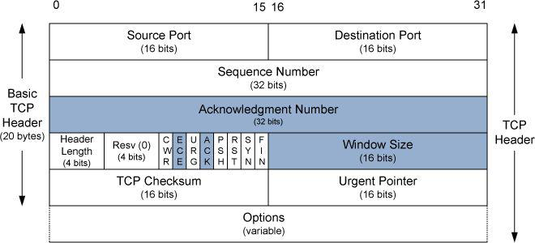

# 12.1. Introduction

## 12.1.1. ARQ and Retransmission

**乱序**、**重复**和**丢失**并不是 IP 层的内部状态，而是 IP 层服务模型在端系统处呈现的外在结果。IP 协议本身不维护分组之间的关系，因此无法感知顺序、唯一性或端到端意义上的丢失。IP 只负责逐包转发，也不试图消除这些现象，而是将它们完全留给上层协议处理。由于 IP 不保证顺序、唯一性和送达性，上层协议在使用 IP 服务时，可能观察到分组乱序、重复或缺失。这些现象并非 IP 的异常行为，而是其尽力而为服务模型的自然结果。

在多跳通信环境中，网络传输问题比单链路复杂得多。除了链路层常见的比特错误外，还可能出现一些系统性问题，例如：

- **分组乱序（Reordering）**：数据包到达顺序可能与发送顺序不同  
- **分组重复（Duplication）**：同一分组可能被多次接收  
- **分组丢失（Drop / Erasure）**：某些数据包可能在传输过程中消失  

这些现象是 IP 层“尽力而为”服务模型的自然表现。IP 本身不保证顺序、唯一性或可靠送达，因此上层传输协议必须处理这些问题。接下来，我们从抽象层面讨论可靠传输机制，并说明 TCP 是如何在互联网中实现它们的。

---

## 1. 重传与确认（ACK）的基本思想

最直接的可靠传输方法是 **ARQ（Automatic Repeat reQuest）自动重传请求**：

1. **发送方**发送一个分组后暂停发送，等待接收方返回 ACK；
2. **接收方**收到分组后发送 ACK；
3. **发送方**收到 ACK 后，继续发送下一个分组。

核心问题：

- 发送方如何判断分组是否被接收？
- 接收方收到的分组是否与发送方发送的相同？

通过 ACK 机制解决第一个问题；通过校验和或 CRC 机制检测分组错误，解决第二个问题。出错分组不发送 ACK，发送方超时后重传。

---

## 2. 三个关键问题

即便在最基本的模型下，也会引出三个重要问题：

1. **发送方应等待 ACK 多久？**  
   涉及 RTT 估计问题，后续 TCP 会详细讨论。

2. **ACK 丢失怎么办？**  
   发送方无法区分数据包丢失与 ACK 丢失，因此必须重发数据包。接收方可能收到重复分组，因此需要具备去重能力。

3. **分组到达但内容出错怎么办？**  
   使用校验和或 CRC 检测错误。发现错误时不发送 ACK，发送方超时重传。

---

## 3. 序号机制：解决重复分组问题

ACK 和重传机制仍无法避免接收重复分组。解决方法是 **序号（Sequence Number）**：

- 发送方为每个逻辑不同分组分配唯一序号；
- 分组随序号一起发送；
- 接收方根据序号判断是否已经接收过，重复分组直接丢弃。

序号机制是 TCP 实现可靠传输、有序性和去重能力的基础。

---

## 4. 停等协议（Stop-and-Wait）的性能瓶颈

在停等协议中，发送方任意时刻只能有一个未确认分组在网络中：

- 吞吐量 ≈ 分组大小 / RTT  
- RTT 越大，吞吐量越低  
- 丢包或重传进一步降低实际有效吞吐量（Goodput）

例如，在卫星链路中 RTT 可能达到数秒，如果每次只发送一个分组，网络大部分时间空闲，性能极低。

---

## 5. 为什么需要多个分组同时在途（流水线机制）

低丢包率网络中，吞吐量低的主要原因是网络资源未被充分利用。流水线类比：

- 每次只有一个工件进入流水线 → 大部分时间闲置  
- 多个工件同时在流水线 → 效率提升

网络中允许多个分组同时在途，可以显著提高链路利用率，提升吞吐量。

---

## 6. 多分组并发的复杂性

允许多个分组同时在途，会增加协议复杂度。

**发送方问题**：

- 何时发送新分组？  
- 一次允许多少个未确认分组？  
- 为每个未确认分组维护定时器  
- 缓存未确认数据以便重传  

**接收方问题**：

- 精确确认哪些分组已收到、哪些未收到  
- 缓存乱序分组  
- 不缓存乱序 → 性能极差  

**网络问题**：

- 如果接收方处理能力跟不上发送速率，或路由器无法承载流量，仍会丢包  
- 这些问题最终引出 **流量控制** 和 **拥塞控制** 的需求

---

## 7. 总结

- ARQ 与 ACK 是构建可靠传输的核心机制  
- Stop-and-Wait 简单可靠，但吞吐低  
- 流水线机制提高效率，但协议复杂度上升  
- TCP 正是建立在这些问题基础上，通过序号、滑动窗口、超时重传和乱序缓存实现可靠传输

## 12.1.2 分组窗口与滑动窗口（Windows of Packets and Sliding Windows）

为了解决前文 ARQ 重传机制中出现的各种问题，我们引入 **分组序号** 与 **窗口机制**：

- **分组序号**：每个逻辑不同的分组都被分配一个唯一序号，便于接收方去重和有序接收。  
- **发送窗口（Sender Window）**：指发送方已经发送但尚未完全确认（未收到 ACK）的分组集合。窗口大小就是集合中分组的数量。

> “窗口”这个术语源于形象比喻：如果把所有发送的分组排成一条长队，但你只能从一个小孔看到其中一部分，那么你所看到的这一小部分就像“窗口”一样。

### 滑动窗口的基本原理

1. 假设窗口大小为 3，当前发送方已经发送并确认了分组 3；
2. 分组 7 已就绪，但不在窗口内，暂时不能发送；
3. 当发送方收到分组 4 的 ACK 时，窗口向右滑动一格：
   - 分组 4 的缓存可以释放  
   - 分组 7 进入窗口并可发送  

这种机制就是 **滑动窗口协议（Sliding Window Protocol）** 的核心思想：窗口随着 ACK 向右滑动，允许发送新的分组，同时释放已确认的分组。

### 窗口在发送方和接收方的作用

- **发送方**：跟踪哪些分组可以发送，哪些分组等待 ACK，哪些分组尚未进入窗口  
- **接收方**：跟踪已收到并确认的分组，预计到达的分组，以及因内存限制无法缓存的分组  

> 注意：窗口机制方便管理数据流，但并不告诉我们窗口应多大，也不能解决接收方或网络无法处理发送方速率的问题。这就引出了 **流量控制与拥塞控制**。

---

## 12.1.3 可变窗口：流量控制与拥塞控制（Variable Windows: Flow Control and Congestion Control）

在实际网络中，发送方可能比接收方快得多，如果不加控制，接收方可能处理不过来。为此，引入 **流量控制（Flow Control）**。

### 流量控制方式

1. **基于速率的流量控制（Rate-Based Flow Control）**：
   - 给发送方分配固定数据率
   - 数据发送速率不得超过该分配  
   - 适合流媒体或广播/组播场景

2. **基于窗口的流量控制（Window-Based Flow Control）**：
   - 滑动窗口的大小可随时间变化  
   - 接收方通过 **窗口更新（Window Advertisement / Window Update）** 告诉发送方当前可用窗口大小  
   - 在 TCP 实践中，ACK 与窗口更新通常合并在同一个数据包中  

### 流量控制的原理

- 发送方可以在收到任何 ACK 前最多注入 **W 个分组**  
- 如果网络理想（无丢包、无限容量），传输速率 ≈ S × W / RTT  
  - S = 分组大小（比特）  
  - W = 窗口大小  
  - RTT = 往返时间  

窗口更新限制了 W，从而防止发送方压垮接收方。

### 拥塞控制（Congestion Control）

即便接收方可承受，网络中间的路由器可能有内存或链路限制。如果发送速率超过网络承载能力，就会出现 **网络拥塞**，导致丢包。为此，需要 **拥塞控制**：

- **显式信号（Explicit Signaling）**：使用协议字段告知发送方减速  
- **隐式信号（Implicit Signaling）**：发送方根据网络表现（如丢包、延迟变化）自行判断减速  

拥塞控制与排队论密切相关，是长期研究的热点问题。TCP 的具体拥塞控制技术将在后续章节（第16章）详细讲解。

---

### 7. 总结

- **滑动窗口**是 ARQ 的扩展，用于允许多个分组同时在途，提高链路利用率  
- **可变窗口**引入流量控制，确保发送方不会压垮接收方  
- **拥塞控制**确保发送方不会压垮网络，防止丢包和延迟过大  
- 滑动窗口 + 可变窗口 + 拥塞控制，是 TCP 在实际网络中实现高效可靠传输的基础

## 12.1.4 重传超时的设置与优化

在基于重传的可靠传输协议中，性能的关键之一是：**发送方等待多久才认为分组丢失并重传**。这就是所谓的 **重传超时（RTO, Retransmission Timeout）** 问题。

---

### 超时设置的直观理解

发送方在重传前需要等待的时间，可近似为以下各部分之和：

1. 数据分组发送所需时间  
2. 接收方处理分组并生成 ACK 的时间  
3. ACK 返回发送方的时间  
4. 发送方处理 ACK 的时间  

> 问题在于，这些时间既无法精确测量，也会随网络负载和路由器状态动态变化。

---

### RTT 估计：动态调整基础

由于无法人工提供这些参数，协议通常采用 **往返时间（RTT）估计** 来动态设置 RTO：

- 收集一系列 RTT 样本  
- 计算样本平均值作为估计  
- 随着网络路径或负载变化，平均 RTT 会动态更新  

> RTT 估计是设置合理 RTO 的核心机制。

---

### 设置 RTO 的原则

1. **不能直接使用 RTT 平均值**  
   - 平均值往往小于实际 RTT  
   - 直接使用会导致过早重传  

2. **RTO 应略大于平均 RTT**  
   - 设置过短 → 导致无谓重传  
   - 设置过长 → 网络空闲，吞吐量下降  

> 具体如何选取超时值，以及动态调整策略，TCP 在实际实现中有更复杂的处理（详见第14章）。

---

### 小结

- RTO 决定了重传机制的效率与可靠性  
- 动态 RTT 估计是实现合理 RTO 的有效方法  
- 超时设置需要平衡“及时重传”与“避免过多冗余”  
- TCP 的实现提供了实践中优化 RTO 的策略示例

# 12.2 Introduction to TCP

在前文已经讨论了影响可靠传输的一般性问题（如丢包、乱序、重复和时延变化）的基础上，本节开始系统性地分析这些问题在 TCP（Transmission Control Protocol）中的具体体现方式，以及 TCP 为互联网应用层所提供的服务类型。同时，本章也将引入 TCP 首部的字段结构，指出此前出现过的诸多概念（如确认机制 ACK、窗口通告等）是如何体现在协议首部设计中的。后续章节将对这些字段和机制进行更为深入的分析。

TCP 的整体描述始于本章，并将在随后的五章中持续展开：

* **第 13 章**：TCP 连接的建立与终止机制；
* **第 14 章**：TCP 对往返时延（RTT）的估计方法及其在重传超时（RTO）计算中的应用；
* **第 15 章**：TCP 的数据传输过程，涵盖交互式应用与大批量数据传输场景，以及窗口管理、流量控制和紧急机制；
* **第 16 章**：TCP 拥塞控制算法及其在高带宽或高丢包环境中的改进方案；
* **第 17 章**：TCP 在连接空闲阶段维持连接存活的机制。

最初的 TCP 规范由 **RFC 793** 给出，其部分错误随后在 **RFC 1122** 中得以修正。随着互联网规模和应用场景的不断扩展，TCP 的规范和实现也经历了大量修订与增强，涵盖了拥塞控制、重传超时、NAT 环境下的运行、安全性、连接管理以及紧急机制的实现指导等方面。此外，围绕 TCP 的性能改进和新特性，学术界与工程界也提出了大量实验性扩展，包括对重传行为、拥塞检测与控制策略以及多路径传输能力的探索。

---

## 12.2.1 TCP 的服务模型（The TCP Service Model）

尽管 TCP 与 UDP 同样运行在 IPv4 或 IPv6 之上，但 TCP 为应用层提供的服务模型与 UDP 存在本质差异。TCP 提供的是一种**面向连接、可靠的字节流服务**。

### 面向连接（Connection-Oriented）

所谓面向连接，是指通信双方在交换应用数据之前，必须先通过 TCP 协议建立连接。这一过程类似于电话通信中的呼叫与应答：双方在确认彼此存在并准备就绪之后，才开始进行信息交换。

一个 TCP 连接严格限定为两个通信端点之间的点对点关系。因此，广播和组播等一对多通信模式并不适用于 TCP。

### 字节流抽象（Byte Stream Abstraction）

TCP 向应用层提供的是连续的字节流抽象，而非独立的消息或记录。TCP 不会自动保留应用写操作之间的边界信息。例如，发送端应用即使分多次写入数据，接收端应用在读取时也无法区分这些写操作的原始边界。

这种设计意味着：

* TCP 本身不提供消息分界；
* 数据的组织与解析责任完全由应用层协议承担。

TCP 只保证字节流的顺序性与完整性，而不关心应用层语义。

### 数据透明性

TCP 不对传输的字节内容作任何解释。无论数据是二进制形式、ASCII 文本还是其他编码格式，其含义均由通信双方的应用层决定。尽管 TCP 提供了紧急机制用于标记特殊数据，但该机制在现代应用中已不被推荐使用。

---

## 12.2.2 TCP 中的可靠性机制（Reliability in TCP）

为了在不可靠的 IP 层之上提供可靠传输服务，TCP 采用了一系列相互配合的机制。

### 分段与封装（Packetization）

TCP 需要将应用层产生的连续字节流划分为适合网络传输的单位，这一过程称为分段（packetization）。每个 TCP 段通常被封装在一个 IP 数据报中，以尽量避免 IP 层分片。

与 UDP 不同，TCP 的序列号并非表示“第几个报文”，而是表示该段中**第一个字节在整个字节流中的偏移量**。这种以字节为单位的编号方式，使 TCP 能够支持可变长度段以及更灵活的数据重组（repacketization）。

### 校验和机制（Checksum）

TCP 使用强制性的端到端校验和，对 TCP 首部、应用数据以及 IP 伪首部字段进行校验。其目的是检测传输过程中产生的比特错误。

若接收到的 TCP 段校验失败，接收端将直接丢弃该段且不发送确认。由于 TCP 校验和在大规模数据传输场景下可能不足以提供极高的错误检测能力，因此在对数据完整性要求极高的应用中，通常需要在应用层引入额外的校验机制。

### 确认与重传（Acknowledgment and Retransmission）

TCP 使用累计确认（cumulative acknowledgment）机制。确认号表示接收端已经成功接收到该序号之前的所有字节。这种机制在 ACK 丢失的情况下仍能保证传输的健壮性。

在重传控制方面，TCP 通常为一个发送窗口维护单一的重传定时器，而非为每个段分别设置定时器。当在规定时间内未收到确认时，TCP 将触发重传。重传超时值基于 RTT 的动态估计结果进行调整。

### 全双工与有序交付

TCP 是一种全双工协议，允许数据在连接的两个方向上同时独立传输。每个方向均维护各自的序列号空间、确认机制和窗口大小。

由于 IP 层不保证顺序性，TCP 接收端需要对乱序到达的段进行重排，并丢弃重复段。在存在缺失数据的情况下，TCP 会缓存后续到达的数据，直到缺失部分被成功接收后，才按序将数据交付给应用层。

---

## 小结

TCP 通过面向连接的通信模型、字节流抽象以及一整套可靠性机制，在不可靠的 IP 网络之上为应用层提供了稳定、有序的数据传输服务。这些机制构成了 TCP 协议复杂但高度成功的设计基础，并为后续章节中关于连接管理、流量控制与拥塞控制的讨论提供了前提条件。

# 12.3. TCP Header and Encapsulation

## 1️⃣ TCP 封装
- TCP 是传输层协议，必须封装在 IP 数据报中（IPv4/IPv6）。
- TCP 段的数据部分可选，有些段只含头部（如 SYN、ACK 或纯 ACK）。

## 2️⃣ 连接标识
- 一个 TCP 连接由 **4 元组唯一确定**：
  `源 IP + 源端口 + 目的 IP + 目的端口`
- IP+端口叫 **socket/endpoint**，两端组合即完整连接。
- 允许服务器同时与多个客户端通信而不混淆数据。

## 3️⃣ 序列号与确认号
- **Sequence Number**：段中首字节的序号，每个字节都有编号（32 位，循环回绕）。
- **Acknowledgment Number**：发送 ACK 的方期望收到的下一个字节序号。
- **SYN 段**使用初始序列号（ISN），**FIN** 和数据字节也消耗序列号。
- 支持 **累计确认 + 选择性确认（SACK）** 处理乱序数据。

## 4️⃣ TCP 控制位（Flags）
- **SYN**：初始化连接  
- **ACK**：确认号有效  
- **FIN**：发送端完成数据发送  
- **RST**：重置连接  
- **URG**：紧急数据  
- **PSH**：立即交付应用（不常用）  
- **ECE / CWR**：显式拥塞通知相关

## 5️⃣ 头部长度与选项
- **Header Length**：单位 32 位字，最小 5（20 字节），最大 60 字节（含选项）。
- 常用选项：
  - MSS（最大报文段长度）
  - SACK（选择性确认）
  - Timestamp、Window Scale 等

## 6️⃣ 流量控制
- **Window Size**：接收端可接受的字节数，用于流量控制。
- 16 位字段限制为 65,535 字节，**Window Scale** 可以扩展。

## 7️⃣ 校验与可靠性
- **Checksum**：覆盖 TCP 头部、数据和伪头部，保证传输完整性。
- **Urgent Pointer**：在 URG 位时指向紧急数据的最后字节。
- TCP 可靠性来源：**序列号 + ACK + 重传 + 窗口控制**。

