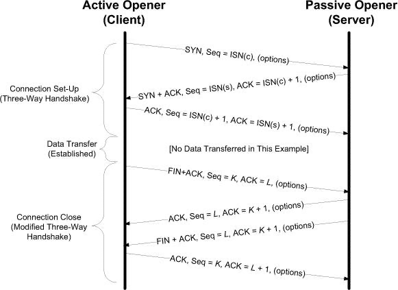
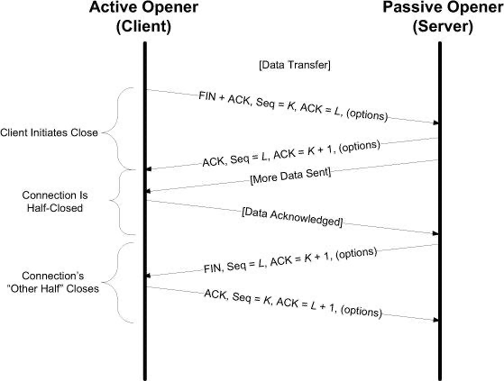
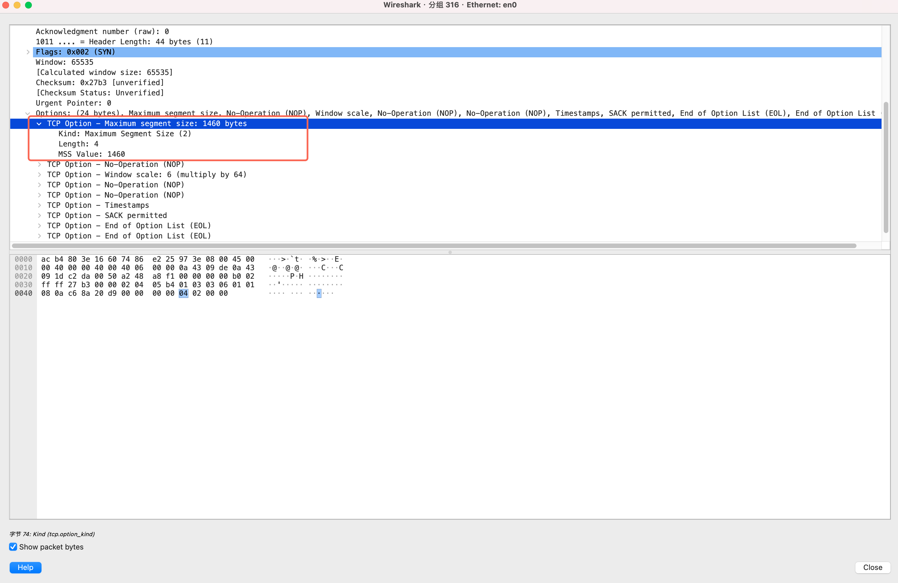
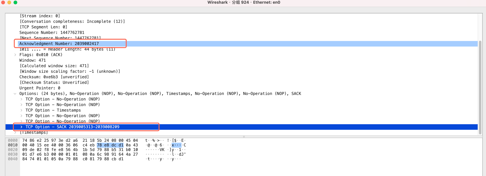
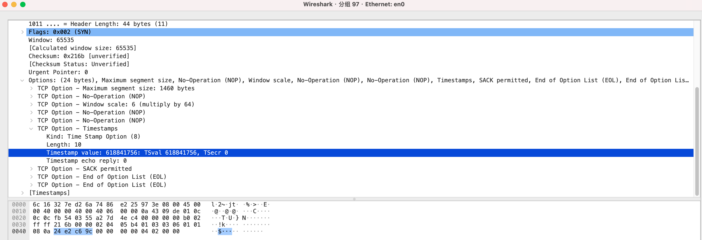
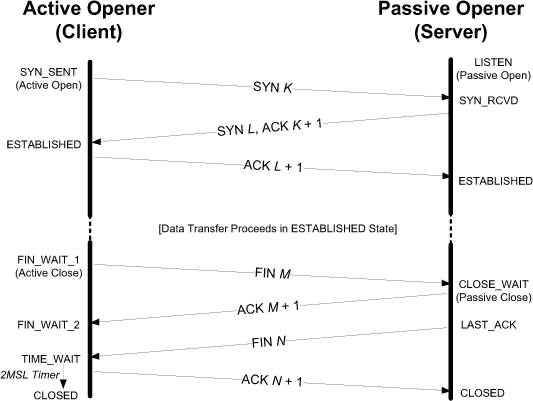
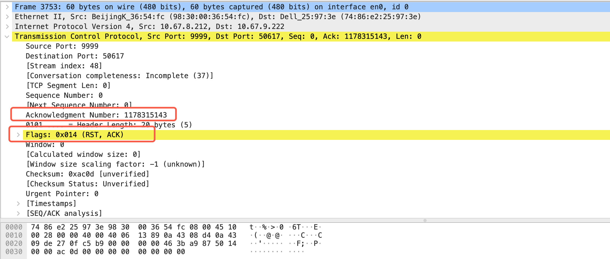

# 13.1. Introduction

TCP 连接不是“连上了”，而是两端进入一套复杂的状态机，并在建立阶段协商参数，之后通过序列号、ACK、窗口、重传、拥塞控制，把不可靠的 IP 网络抽象成可靠的字节流。

# 13.2. TCP Connection Establishment and Termination




### 1. TCP 连接的本质

#### 1.1 4 元组定义

TCP 连接由以下 4 元组唯一标识：

```
(src IP, src port, dst IP, dst port)
```

也可以理解为：

* 一个 TCP 连接 = 一对 socket
* 每个 socket = (IP, port)

工程含义：

| 场景                      | 结果           |
| ----------------------- | ------------ |
| 同一 client 连同一 server 多次 | 源端口不同 → 不同连接 |
| NAT 后面多个 client         | NAT 重写 4 元组  |
| TIME_WAIT 冲突            | 本质是 4 元组复用问题 |

**TIME_WAIT 冲突的本质：为什么说是 4 元组复用问题？**

本文从 TCP 协议与工程实现两个层面，系统解释 TIME_WAIT 状态的设计目的，以及为什么常说：TIME_WAIT 冲突的本质是 4 元组复用问题。

---

###### 1. TCP 连接的唯一标识：4 元组

在 TCP 中，一个连接由如下 4 元组唯一标识：

```
(src IP, src port, dst IP, dst port)
```

只要这四个字段完全相同，内核就认为这是同一个 TCP 连接。

因此，当应用在短时间内重新使用相同的源端口连接同一个目标地址和端口时，就会发生 4 元组复用。

---

###### 2. 什么是 4 元组复用？

4 元组复用指的是：

> 在旧 TCP 连接尚未完全从协议层安全消失时，新的 TCP 连接使用了完全相同的 (src IP, src port, dst IP, dst port)。

典型场景：

```
10.0.0.1:50000  →  1.2.3.4:80   （旧连接）
10.0.0.1:50000  →  1.2.3.4:80   （新连接）
```

---

###### 3. 为什么 4 元组复用是危险的？

即使应用认为连接已经关闭，网络中仍可能存在旧连接的迟到报文，例如：

* 延迟的 FIN
* 延迟的 ACK
* 乱序到达的数据包
* NAT / 防火墙缓存并延迟转发的报文

如果此时建立了一个使用相同 4 元组的新连接：

* 旧连接的迟到报文
* 会被协议栈误认为是新连接的合法报文

可能导致：

* 序列号错乱
* 连接被异常 RST
* 数据损坏
* 难以复现和定位的偶发问题

---

###### 4. TIME_WAIT 的协议级核心作用

```shell
在 TCP 连接终止过程中，进入 TIME_WAIT 状态的一方通常是主动关闭连接的一侧。这并非实现上的偶然，而是协议语义上的责任划分结果。主动关闭方发送了连接终止过程中的最后一个 ACK，因此它承担了保证对端 FIN 被可靠确认的责任。如果该最后 ACK 在网络中丢失，被动关闭方将重传 FIN。只有主动关闭方仍然保持连接状态，才能正确响应这些重传的 FIN 并重新发送 ACK，从而保证连接能够以有序、可靠的方式完成关闭。

与此同时，TIME_WAIT 还承担着防止旧连接报文污染新连接的重要职责。主动关闭的一方通常也是最有可能在短时间内重新发起新连接的一方，例如客户端在 close 之后立即再次 connect 到同一服务器。如果允许主动关闭方在连接终止后立即复用完全相同的四元组（源地址、源端口、目的地址、目的端口），那么网络中仍然滞留的旧连接报文（如迟到的数据段或 FIN 重传）就可能被新连接错误地接收，从而破坏 TCP 的有序性和可靠性语义。TIME_WAIT 通过延迟四元组的复用，为旧报文在网络中自然消失提供时间窗口，从协议层面避免这种混淆。

基于上述设计目标，在 TIME_WAIT 期间，内核通常会保护该连接对应的四元组，默认不允许立即复用。工程上常见的表现是，对同一四元组发起新的连接时，connect 可能返回 EADDRINUSE，而在绑定本地端口时，bind 可能返回 Address already in use。这种行为不是资源浪费，而是 TCP 为保证可靠关闭语义和防止旧连接干扰新连接而采取的必要保护机制。整体来看，TIME_WAIT 的存在体现的是 TCP 在连接生命周期末尾对可靠性和安全性的优先级选择，而非某个具体操作系统内核的实现细节。
```

TIME_WAIT 的设计目的不是浪费资源，而是提供一个安全窗口，用于：

> 确保旧连接的所有迟到报文在网络中自然消失，防止其污染后续复用相同 4 元组的新连接。

在 TIME_WAIT 期间：

* 内核仍然保留该连接的 4 元组
* 所有迟到报文都能被正确识别并丢弃
* 新连接不能复用相同的 4 元组

TIME_WAIT 的典型持续时间为：

```
2 × MSL (Maximum Segment Lifetime)
```

---

###### 5. 为什么说 TIME_WAIT 冲突 = 4 元组复用问题？

工程中常见的 TIME_WAIT 相关现象，其根因都指向 4 元组复用：

- 5.1 Address already in use

原因：

* 应用试图绑定仍处于 TIME_WAIT 的 4 元组
* 内核拒绝复用该连接标识

---

- 5.2 高并发短连接导致 TIME_WAIT 激增

典型场景：

* 爬虫
* 压测工具
* API 网关
* 短连接代理

特征：

* 大量 close()
* 快速重连同一目标
* 本地端口被频繁复用

本质：

> 端口资源有限 → 被迫复用 → 触发 4 元组复用压力 → TIME_WAIT 堆积

---

###### 5.3 为什么主动关闭方进入 TIME_WAIT？

TCP 协议规定：

* 主动关闭的一方负责：

  * 确保对端收到最后一个 ACK
  * 吸收并处理迟到的旧报文

因此：

> TIME_WAIT 出现在主动 close() 的一侧

---

###### 6. 协议级一句话总结

> TIME_WAIT 的存在，是为了防止相同 4 元组的新连接与旧连接的迟到报文发生混淆；所谓 TIME_WAIT 冲突，本质是应用试图在 2MSL 时间内复用相同 4 元组。

---

###### 7. 工程视角的正确应对方式

TIME_WAIT 不是 bug，而是 TCP 协议为可靠性付出的必要代价。

推荐的工程优化方向：

* 扩大本地临时端口范围
* 使用长连接（keep-alive）
* 降低短连接创建和销毁频率

应谨慎使用：

* tcp_tw_reuse
* 过度缩短 TIME_WAIT 时间

---

###### 8. 直觉类比

> 可以把 TIME_WAIT 理解为机场跑道的清场时间。飞机已经离开，但必须确认跑道上没有残留物，才能允许下一架飞机使用同一条跑道。同理，TIME_WAIT 确保旧连接的残留报文不会污染复用相同 4 元组的新连接。

---


#### 1.2 TCP 是状态机协议

TCP 不是简单的发包协议，而是：

* 状态（state）
* 序列号空间（sequence space）
* 定时器（retransmission timer）
* 重传机制
* 流量控制 + 拥塞控制

UDP 是无状态协议，TCP 是强状态协议，这是复杂度差异的根源。

---

### 2. TCP 连接的三大阶段

```
SETUP        → ESTABLISHED → TEARDOWN
(握手)          (传数据)       (挥手)
```

实现难点主要在于：

* 异常丢包
* 同时 open / close
* 半关闭（half-close）
* reset (RST)
* 超时

---

### 3. 三次握手（Three-Way Handshake）

#### 3.1 Segment 1 — Client → Server（Active Open）

```
SYN = 1
SEQ = ISN(c)
Options = MSS, WS, SACK, TS ...
```

语义：

* 请求建立连接
* 指定客户端初始序列号 ISN(c)
* 协商 TCP 选项

状态迁移：

```
CLOSED → SYN-SENT
```

---

#### 3.2 Segment 2 — Server → Client（Passive Open）

```
SYN = 1
ACK = 1
SEQ = ISN(s)
ACK = ISN(c) + 1
Options = MSS, WS, SACK, TS ...
```

语义：

* 确认客户端 SYN
* 提供服务端 ISN(s)
* 返回服务端支持的 TCP 选项

状态迁移：

```
LISTEN → SYN-RECEIVED
```

关键规则：

* SYN 消耗 1 个序列号

---

#### 3.3 Segment 3 — Client → Server（ACK）

```
ACK = 1
ACK = ISN(s) + 1
```

语义：

* 确认服务端 SYN
* 双方序列空间同步完成

状态迁移：

```
SYN-SENT → ESTABLISHED
SYN-RECEIVED → ESTABLISHED
```

---

#### 3.4 三次握手的深层目的

1. 双向连通性验证
2. 防止历史旧连接包污染
3. 同步双方序列号空间
4. 协商 TCP 连接参数（Options）

---

### 4. Active Open vs Passive Open

| 角色           | 行为       | 常见     |
| ------------ | -------- | ------ |
| Active Open  | 先发 SYN   | client |
| Passive Open | 监听，回 SYN | server |

特殊情况：

* Simultaneous Open（双方同时主动打开）

---

### 5. SYN 携带数据（理论支持）

协议允许：

```
SYN + DATA
```

但实际工程中：

* Berkeley sockets API 不支持
* NAT / 防火墙常丢弃
* 实际几乎不用

---

### 6. 四次挥手（Four-Way Termination）

核心原因：

> TCP 是全双工协议，两个方向独立关闭。

---

#### 6.1 Step 1 — Client 发 FIN（Active Close）

```
FIN = 1
SEQ = K
ACK = L
```

状态：

```
ESTABLISHED → FIN-WAIT-1
```

含义：

* Client 不再发送数据
* 仍可接收 Server 数据

---

#### 6.2 Step 2 — Server ACK Client FIN

```
ACK = K + 1
```

状态：

```
Server: ESTABLISHED → CLOSE-WAIT
Client: FIN-WAIT-1 → FIN-WAIT-2
```

此时进入半关闭（half-close）状态：

* Client → Server 方向关闭
* Server → Client 仍可发送

---

#### 6.3 Step 3 — Server 发 FIN

```
FIN = 1
SEQ = L
```

状态：

```
Server: CLOSE-WAIT → LAST-ACK
```

---

#### 6.4 Step 4 — Client ACK Server FIN

```
ACK = L + 1
```

状态：

```
Client: TIME-WAIT
Server: CLOSED
```

---

### 7. 为什么是四次，而不是三次？

因为：

* ACK(确认对方关闭) 与 FIN(自己关闭) 是两个独立语义
* 中间允许继续发送数据

---

### 8. Half-close（半关闭）机制

TCP 有两个独立方向：

```
Client → Server
Server → Client
```

FIN 只关闭一个方向。

常见接口：

* shutdown(SHUT_WR)

---

### 9. TCP 最小优雅开销

| 阶段   | 报文数 |
| ---- | --- |
| 三次握手 | 3   |
| 四次挥手 | 4   |
| 合计   | 7   |

结论：

* 小数据交互下 TCP 开销较大
* UDP 更轻量，但需自行实现可靠性

---

### 10. 工程关键后果

#### 10.1 TIME_WAIT 不是 bug

作用：

* 确保最后 ACK 可靠送达
* 防止旧连接污染新连接

---

#### 10.2 SYN Flood 的协议根源

* SYN-RECEIVED 占用资源
* 握手未完成即消耗半连接

---

#### 10.3 常见卡死状态

| 状态         | 含义                 |
| ---------- | ------------------ |
| CLOSE_WAIT | 对端关了，本端应用没 close() |
| FIN_WAIT_2 | 本端已关写，对端迟迟不关       |
| TIME_WAIT  | 主动关闭端等待超时          |

---

### 11. 高密度总结

> TCP 用三次握手同步双向序列空间和参数，用四次挥手独立关闭两个方向的数据流。连接不是一根线，而是一组状态；关闭不是一次动作，而是两个方向各自的终止。

---


## 13.2.1. TCP Half-Close




TCP 是全双工协议，连接包含两个相互独立的数据方向：

```
A → B
A ← B
```

每个方向都是独立关闭的。

---

#### 什么是 Half-Close

**Half-close（半关闭）** 表示：

> 关闭一个方向的数据流，但保持另一个方向继续通信。

在协议层：

* 发送 **FIN** = 我这个方向的数据已经发完（EOF）
* 并不表示连接整体断开

---

#### API 语义（Sockets）

##### 半关闭

```c
shutdown(fd, SHUT_WR);
```

含义：

* 不再发送数据
* 仍然可以接收数据
* 内核立即发送 FIN

##### 全关闭

```c
close(fd);
```

含义：

* 发送方向关闭
* 接收方向关闭
* 连接整体结束


**close(fd) 的真实语义（不只是“关闭连接”）**

`close(fd)` 在应用层的含义只是：当前进程不再使用这个文件描述符。  
该 fd 会立即从进程的文件描述符表中移除，但 TCP 连接本身并不一定立刻关闭。

内核会在合适的时机驱动 TCP 状态机，而不是同步、立即终止连接。

---

**发送方向（TCP 发送侧）**

在发送方向上，内核通常会发送 FIN，表示：

> 本端不再发送数据（TCP 半关闭的发送侧）

这相当于告诉对端：  
我这边已经写完了，但连接未必完全结束。

---

**接收方向（应用层视角）**

由于 fd 已关闭：

* 应用程序无法再从该连接读取数据
* 即使对端继续发送数据，应用也无法接收

从应用层看，接收方向已经被彻底关闭。

---

**close 之后，对端再发数据的处理**

在实际实现（如 Linux）中，close 之后：

* 内核可能仍接收对端发来的数据（TCP 状态机仍存在）
* 但由于没有应用进程可以消费：
  * 数据可能被直接丢弃
  * 也可能触发对端收到 RST

因此，这并不是简单的“静默丢包”。

---

**触发 RST 的典型场景**

以下情况中，对端继续发送数据，很容易收到 RST：

* socket 已完全关闭或进入异常终止路径
* 应用显式关闭接收方向（如 `shutdown(SHUT_RD)`）
* 使用 abortive close（如 `SO_LINGER = 0`）
* 内核判断该连接已无有效接收者

RST 的协议语义是：

> 该连接已不存在或不再接受数据（硬性终止）

---

**工程视角总结（代理 / 高性能系统常见）**

在真实系统中（尤其是代理、转发设备）：

> `close(fd)` 往往不仅表示“我不再使用这个连接”，  
> 更隐含着：  
> 如果你再发送数据，我可能会直接 reset 你。

这也是为什么在抓包中经常看到：

* 一侧已 close
* 另一侧继续发数据
* 本侧立即返回 RST

这是 TCP 栈在连接生命周期管理中的正常协议级行为。


##### 常见工程误区

- 误区 1：FIN = 连接断开 ❌

错误理解：

> 收到 FIN 就认为连接已经没用了

正确理解：

> FIN 只表示一个方向的 EOF

---

- 误区 2：收到 FIN 就 close socket ❌

后果：

* 丢弃对方后续数据
* 代理提前中断响应

正确做法：

* 进入 CLOSE_WAIT
* 继续读取对方数据
* 发送完自己数据后再 FIN

---

- 与 TIME_WAIT 的关系

Half-close 会更容易出现：

* FIN_WAIT_2
* CLOSE_WAIT

如果应用层不正确 close：

* 容易导致 CLOSE_WAIT 泄漏
* FD 资源耗尽

## 13.2.2. Simultaneous Open and Close

暂略， 同时关闭用的少

## 13.2.3. Initial Sequence Number (ISN)

ISN 的本质不是计数，而是区分不同“连接实例”，防止旧连接的延迟报文污染新连接。在 TCP 设计中，TIME_WAIT 负责时间隔离，ISN 负责序列号隔离，两者共同解决 4 元组复用带来的协议级风险。

**TIME_WAIT 冲突本质是 4 元组复用问题**

**4 元组复用 + ISN 变化 + TIME_WAIT，是解决 同一个 4 元组被重复使用时，如何区分不同连接实例。**

## 13.2.4. Example

略

## 13.2.5. Timeout of Connection Establishment

TCP 建连失败时，内核会按指数退避重传 SYN，
直到达到最大重试次数后超时返回。
这是 TCP 拥塞控制和健壮性设计的一部分，
而不是应用层行为。

```shell
xm@VM-0-9-ubuntu:~$ sysctl net.ipv4.tcp_syn_retries
net.ipv4.tcp_syn_retries = 6
```

## 13.2.6. Connections and Translators

TCP + NAT 并不是简单改地址，而是要求 NAT 维护 TCP 状态、重算校验、甚至重写序列号；一旦 NAT 状态与端点不同步，连接会以难以诊断的方式异常，这也是 NAT + 应用层编辑被认为是脆弱设计的根本原因。

## 13.3. TCP Options

TCP Options 提供了一种在不改变 TCP 基本首部格式的前提下扩展协议功能的机制。TCP 首部最多允许 40 字节用于 Options，用于在连接建立及数据传输过程中进行能力协商、参数声明以及性能与可靠性相关特性的支持。Options 采用可扩展的 TLV 结构，未识别的选项必须被忽略以保证向前兼容性。现代 TCP 的多项关键机制（如 MSS、SACK、窗口扩大和时间戳）均依赖 Options 实现，使 TCP 能够在不同链路特性和网络条件下进行自适应优化。由于 Options 空间受限，不同选项之间需要共享有限的首部资源，这也使得中间设备对 Options 的修改可能对 TCP 性能与行为产生显著影响。

```shell
TCP Option - No-Operation (NOP)
TCP Option - No-Operation (NOP)
```

TCP No-Operation（NOP，Kind=1）选项是一种仅占用 1 字节的填充选项，其设计目的在于为 TCP Options 提供细粒度的对齐与填充能力，以满足 TCP 首部长度必须按 32 位对齐的约束。与 End of Option List（EOL，Kind=0）不同，NOP 不终止 Options 的解析流程，可用于在 Options 列表中间插入以调整后续选项的起始位置；而 EOL 用于显式标识 Options 列表结束，后续字节被视为填充而不再参与解析。

## 13.3.1. Maximum Segment Size (MSS) Option



Maximum Segment Size（MSS）选项用于声明**本端愿意接收的最大 TCP 数据段长度**，仅包含 TCP 负载（不含 TCP/IP 头）。MSS 通常在连接建立阶段的 SYN 或 SYN+ACK 报文中携带，用于告知对端其发送段大小的上限。MSS 不是双向协商结果，而是**单向接收能力通告**：对端必须遵守该上限。**若未携带 MSS 选项，IPv4 默认 MSS 为 536 字节（基于最小 576 字节 IPv4 报文减去 20B IP 头和 20B TCP 头）**。在以太网 MTU 为 1500 字节时，典型 IPv4 MSS 为 1460 字节，IPv6 因首部更大，典型 MSS 为 1440 字节。MSS 的主要作用是避免 IP 分片并提升传输效率，实际发送端的有效发送 MSS（SMSS）通常取路径 MTU（PMTU）减去 IP/TCP 首部长度。

**如果本端在 TCP 三次握手中没有声明 MSS，则对端会默认认为本端的最大接收段为 536 字节，并以此大小发送 TCP 数据，以保证 IPv4 最小可接受 MTU（576B）不被分片。**

虽然 MSS 只在三次握手阶段通过 SYN/SYN+ACK 进行通告，但 TCP 实际发送的数据段大小（SMSS）在连接运行过程中是**可以动态变化的**。发送端并不是固定使用握手阶段协商得到的 MSS，而是以当前路径 MTU（PMTU）为核心约束，按公式动态计算：  
**SMSS = PMTU − IP 头长度 − TCP 头长度。**

当路径中出现更小 MTU 的链路时，中间路由器在无法转发设置了 DF 标志的 IP 报文时，会返回 ICMP “Fragmentation Needed”（IPv4）或 ICMPv6 “Packet Too Big”。**发送端接收到该 ICMP 后，会更新对应目的地址的 PMTU 缓存，并立即降低后续发送报文的最大 IP 报文长度，从而使 TCP 实际发送的段大小同步减小**. 这一过程不需要重建连接，也不会重新协商 MSS 选项，而是完全在运行期通过 PMTUD 自动生效。

在抓包中，这种动态变化通常表现为：在连接建立初期，TCP 数据段大小接近握手阶段通告的 MSS；而在收到 ICMP 差错报文之后，后续 TCP 数据段的 payload 长度明显变小，并稳定在新的上限附近。工程上可通过同时抓取 TCP 与 ICMP 报文进行验证：先观察 ICMP “Fragmentation Needed / Packet Too Big” 报文中的 MTU 值，再对比该报文之后的 TCP 段长度，即可确认 PMTU 更新导致的 SMSS 动态调整。

## 13.3.2. Selective Acknowledgment (SACK) Options

#### 1. SACK 协商（SACK Permitted）

TCP 的 SACK 机制需要在连接建立阶段通过 TCP Option 进行协商。在三次握手过程中，通信双方在 SYN 和 SYN+ACK 报文中携带 **SACK Permitted（Kind=4, Length=2）** 选项，用于声明支持 SACK。只有当双方均声明支持时，后续连接中才允许在 ACK 报文中携带 SACK Option（Kind=5）用于选择性确认乱序数据区间。SACK Permitted 仅用于能力协商，本身不携带任何序列号区间信息。

#### 2. SACK 工作方式示例

设发送端发送以下数据段：

```
1000–1999   已到达
2000–2999   丢失
3000–3999   已到达
4000–4999   已到达
```

接收端对发送端的反馈为：

* Cumulative ACK = 2000（表示连续收到至 1999）
* SACK Blocks = [3000, 5000)

该 ACK 的语义为：接收端已连续接收到 0–1999，同时已额外接收到 3000–4999 区间的数据，但仍在等待 2000–2999 区间的数据。发送端据此可仅重传丢失的 2000–2999 段，从而避免对已成功接收数据的冗余重传，提高丢包场景下的重传效率与链路利用率。

#### 3. 示例



## 13.3.3. Window Scale (WSCALE or WSOPT) Option

**TCP 窗口扩大选项（Window Scale, WSCALE / WSOPT）**用于突破 TCP 原生 16 位窗口字段的限制，将窗口容量从 16 位扩展到约 30 位。它并不改变 TCP 头部的字段大小，而是通过一个 缩放因子（scale factor） 对原始 16 位窗口值进行左移操作，相当于将窗口值乘以 2^s（s 为缩放因子，范围 0~14）。例如，当缩放因子为 14 时，最大窗口可达约 1GB（65,535 × 2¹⁴），而 TCP 内部仍用 32 位变量维护真实窗口大小。**该选项只能出现在 SYN 报文中，因此每个方向的缩放因子在连接建立时固定，并且双方必须在各自的 SYN 报文中声明才能启用。**

在实际使用中，发送方和接收方的窗口值通过缩放因子转换：收到的 16 位窗口值左移 R 位得到真实接收窗口，发送时将真实 32 位窗口右移 S 位写入 16 位字段。缩放因子通常由 TCP 根据接收缓冲区大小自动选择，应用也可修改缓冲区大小以调整因子。Window Scale 选项在 大带宽-高延迟网络（即带宽-延迟积较大的网络）中最为关键，可显著提高批量数据传输效率，同时保持与不支持该选项的系统兼容。

## 13.3.4. Timestamps Option and Protection against Wrapped Sequence Numbers (PAWS)

### 一、Timestamps 选项（TSOPT）的基本机制

TCP 的 Timestamps 选项允许发送方在每个 TCP 报文段中携带两个 32 位时间戳字段：TSval（Timestamp Value）和 TSecr（Timestamp Echo Reply）。发送方在 TSval 中填入一个单调递增的时间戳值，接收方在 ACK 中将该值原样回显到 TSecr。这样，发送方就可以通过比较发送时的 TSval 与收到 ACK 时的时间，精确测量 RTT。该选项会使 TCP 头部增加 10 字节（8 字节时间戳 + 2 字节类型和长度）。

时间戳值本身不要求双方时钟同步，也不关心具体单位，只要求单调递增。RFC 1323 建议至少每秒递增 1。相比没有时间戳时“每个窗口只能采样一次 RTT”，使用 Timestamps 后，TCP 可以对几乎每个 ACK 进行 RTT 采样，从而更精细地估算 RTT，并更准确地设置重传超时（RTO），提高重传和拥塞控制的性能。



在 TCP 启用 Timestamps 选项时，每个携带该选项的报文段都会同时包含 TSval 和 TSecr 两个字段，这是该选项的固定格式。在连接建立的第一个 SYN 报文中，发送方只能填写自己的时间戳（TSval），由于尚未收到对端的任何时间戳值，因此无法回显对方时间戳，TSecr 必然为 0；只有在收到对端的报文后，才会在后续的 SYN+ACK 和 ACK 中将对方的 TSval 回显到 TSecr。因而，在 SYN 包中看到同时存在 TSval 和 TSecr 且 TSecr=0 是完全正常、符合规范的行为。

### 二、PAWS：防止序列号回绕导致旧包被误收

除了 RTT 测量，Timestamps 还用于实现 PAWS（Protection Against Wrapped Sequence Numbers）。在高带宽、大窗口（例如使用 Window Scale，窗口接近 1GB）的连接中，32 位 TCP 序列号可能在短时间内发生回绕。如果网络中存在延迟很久的旧报文，当序列号回绕后，这些旧报文的序列号可能与当前有效数据的序列号“看起来合法”，从而被错误接收，导致数据混乱。

PAWS 的做法是：接收方把时间戳视为序列号的“扩展部分”。接收方只接受时间戳不小于最近已接受报文时间戳的报文段。如果一个延迟很久才到达的旧报文，其时间戳明显小于当前连接中最近看到的时间戳，即使它的 TCP 序列号在数值上是“正确的”，也会被直接丢弃。这样，Timestamps 实际上为 TCP 提供了额外的 32 位有效序列空间，从而在高速、大带宽-时延积网络中防止因序列号回绕而引发的旧包重现问题。

### 三、总结

- Timestamps 选项提供了更频繁、更精细的 RTT 采样，有助于更准确地设置重传超时（RTO）。
- PAWS 利用时间戳机制防止 TCP 序列号回绕时旧报文被误当作新数据接收。
- 在大带宽-高延迟（大带宽-时延积，BDP）网络中，Timestamps + PAWS 是保证 TCP 性能和正确性的关键机制。

## 13.3.5 User Timeout (UTO) Option

User Timeout（UTO）选项允许 TCP 端点将其愿意等待未确认数据的最长时间显式地通告给对端，从而使双方以及中间设备（如 NAT）能够更好地适配长 RTT、间歇性连接或移动网络等场景。与传统仅由本地配置决定 USER_TIMEOUT 不同，UTO 通过在 SYN 及后续报文中携带超时建议值，使对端能够调整自身行为，避免因短暂网络中断而过早终止连接，提高长连接在复杂网络环境中的鲁棒性。

UTO 的取值是建议性的而非强制性的，最终 USER_TIMEOUT 由本地上下限（L_LIMIT、U_LIMIT）以及双方通告的 UTO 值共同决定，并通过规范化公式进行裁剪，以在连接可用性与资源消耗、DoS 风险之间取得平衡。RFC1122 推荐的 R1/R2 语义（如约 100 秒后关闭连接）仍然对最小超时具有约束意义，确保在保持兼容性的同时，避免因过长或过短的超时设置而引发资源耗尽或误断连接的问题。

## 13.3.6 Authentication Option (TCP-AO)

TCP Authentication Option（TCP-AO）是一种用于增强 TCP 连接安全性的选项，旨在替代早期的 TCP-MD5 机制，通过基于密码学散列算法和预共享密钥对每个 TCP 段进行认证，从而防止 TCP 欺骗、注入和伪造等攻击。发送方和接收方使用共享密钥派生流量密钥，对报文进行认证校验，使接收方能够以高概率确认报文的完整性和来源真实性。

与 TCP-MD5 相比，TCP-AO 支持多种加密算法并允许在连接中进行密钥切换，提高了算法灵活性和长期安全性，但其仍不提供完整的密钥管理或分发机制，需要通过带外方式预先配置共享密钥。由于部署复杂、需要两端及中间设备支持，TCP-AO 目前主要应用于对安全性要求极高的控制类连接（如路由协议），而在普通应用层 TCP 流量中尚未广泛普及。

## 13.4. Path MTU Discovery with TCP

**IP 层的分片行为只基于“当前出接口的 MTU”，是逐跳、无状态、无学习的；**
**IP 协议本身不会因为收到 ICMP（包括 PTB）而改变未来分片策略。**

## 一、为什么 TCP 的 PMTUD 比 UDP 重要

| 协议  | 是否能自适应 MTU | 原因                     |
| --- | ---------- | ---------------------- |
| UDP | ❌ 很难       | 应用指定报文大小，传输层不拆包        |
| TCP | ✅ 可以       | TCP 是字节流，可自行切分 segment |

> TCP 能根据路径情况调整 segment size（SMSS），避免 IP 分片，提高性能和可靠性。

## 二、TCP PMTUD 的完整工作流程

### 1️⃣ 连接建立时：初始 SMSS 的选择

```
SMSS = min(本地接口 MTU, 对端通告的 MSS)
```

* 对端未通告 MSS → 默认 536 字节（现在很少）
* 有些系统会缓存 per-destination 的 PMTU
* ⚠️ 双向路径 MTU 可能不同（非常常见）

### 2️⃣ 传输中：强制 DF + 等 PTB

* IPv4：设置 DF (Don't Fragment)
* IPv6：默认禁止中间设备分片（等价 DF）

如果路径中某一跳 MTU 更小：

* 路由器返回 ICMP PTB（Packet Too Big）

| 协议   | ICMP 类型                        |
| ---- | ------------------------------ |
| IPv4 | Dest Unreachable - Frag Needed |
| IPv6 | Packet Too Big                 |

### 3️⃣ 收到 PTB 后：TCP 如何调整

```
新 MSS = Next-Hop MTU - IP 头 - TCP 头
```

* PTB 未带 MTU（老设备） → TCP 二分搜索或尝试更小 segment
* 影响：

  * 拥塞控制（Congestion Control）
  * 重传行为

### 4️⃣ 路由变化：探测更大 MTU

* 路由可能改善 → 可尝试增大 segment size
* RFC 建议约每 10 分钟尝试一次，最大不超过初始 SMSS

## 三、PMTUD 的经典大坑：Black Hole

### 1️⃣ 什么是 PMTUD 黑洞？

* 防火墙 / NAT 丢弃 ICMP PTB → TCP 收不到 PTB
* 小包（SYN / SYN+ACK）正常
* 大包全丢 → TCP 不断重传，连接“假死”

> 典型症状：能建立连接，但一传大文件就卡死

### 2️⃣ 系统的补救：Black Hole Detection

* 部分 TCP 实现会在多次重传失败后自动尝试更小 MSS
* ⚠️ 这是工程补丁，不是标准 PMTUD

# 13.5. TCP State Transitions

## 13.5.1. TCP State Transition Diagram



```shell
xm@VM-0-9-ubuntu:~$ sudo ss -tanp
State          Recv-Q         Send-Q                 Local Address:Port                    Peer Address:Port          Process                                                                                                               
LISTEN         0              4096                       127.0.0.1:9090                         0.0.0.0:*              users:(("clash",pid=60206,fd=9))    
```

TCP 的连接管理本质是一个严格的状态机：
ESTABLISHED 是数据态，FIN_WAIT* 是主动关闭态，CLOSE_WAIT/LAST_ACK 是被动关闭态，TIME_WAIT 是主动关闭方的责任态。

**所谓“非典型但合法”的 TCP 状态（如 simultaneous close 导致的 CLOSING、以及双 FIN 交叉的状态转换）**，本质上源于 TCP 全双工语义下发送与接收方向的独立关闭机制，在极端时序和并发条件下，双方可能在尚未确认对方 FIN 之前就各自发送 FIN，从而产生双 FIN 交错与 CLOSING 等边界状态；这些状态在 RFC 的有限状态机中是为保证协议在竞态、异常与重叠时序下的逻辑完备性而存在，但在正常应用通信中极少出现，更多体现的是协议层为处理双向关闭竞态而引入的形式化状态，而非工程常态路径。

## 13.5.2. TIME_WAIT (2MSL Wait) State

1. TIME_WAIT 的根本目的 = 可靠关闭 + 防旧包  
   - 保证最后 ACK 丢失时可重传，完成四次挥手  
   - 防止旧连接的延迟报文被新连接误接收  
   本质：可靠性 + 协议安全性

2. 主动关闭方进入 TIME_WAIT  
   - 谁主动 close()，谁 TIME_WAIT  
   - 常见：客户端 TIME_WAIT，服务端通常没有  
   本质：角色行为，而非客户端/服务端属性

3. 工程问题集中在固定端口一侧（通常是服务器）  
   - 客户端：ephemeral port，多 TIME_WAIT 一般可接受  
   - 服务器：固定 well-known port  
   - 主动关闭 + 重启 ⇒ bind: Address already in use  
   本质：固定端口 + TIME_WAIT = 生产痛点

4. OS 实现通常比标准更严格  
   - 标准：仅限制相同 4-tuple  
   - 实现：常按 local port 维度限制  
   - 端口出现在 TIME_WAIT 中就可能 bind 失败  
   本质：实现策略差异，而非 TCP 必然

5. SO_REUSEADDR 只是放宽本地 bind，不是关闭 TIME_WAIT  
   - 允许绑定到存在 TIME_WAIT 的本地端口  
   - 不绕过 4-tuple / 序列号 / 时间戳等 TCP 安全语义  
   - 无法影响远端的 TIME_WAIT  
   本质：本地策略开关，而非协议语义修改


### 实验


> sock 参数说明：  
> - `-s` ：作为服务器（server），监听端口  
> - `-v` ：verbose，显示本地/远端 IP 和端口  
> - `-b <port>` ：绑定（bind）到指定本地端口  
> - `-A` ：设置 SO_REUSEADDR socket 选项  

---

#### 实验总览（压缩版）

| 实验 | 主机关系 | 服务器参数 | 客户端参数 | 关键现象 | 原文要证明 |
|------|----------|------------|------------|----------|------------|
| 1 | 同一主机 | `-s` | 默认 | 服务器重启 bind 失败 | TIME_WAIT 阻止服务端端口复用 |
| 2 | 同一主机 | `-s` | `-b 原端口` | 客户端 bind 失败 | 客户端本地端口也受 TIME_WAIT 限制 |
| 3 | 同一主机 | `-A -s` | 默认 | 服务器可立即重启 | SO_REUSEADDR 放宽服务端 bind |
| 4 | 同一主机 | `-A -s` | `-b 原端口` | 客户端 bind 仍失败 | -A 只影响使用该选项的一侧 |
| 5 | 同一主机 | `-A -s` | `-A -b 原端口` | 同一 4-tuple 成功 | 同机可在 RFC 允许下强制复用 |
| 6 | 不同主机 | `-s` (Linux) | `-A -b 原端口` (Windows) | connect() → EADDRINUSE | Windows 不允许客户端复用 TIME_WAIT 本地端口 |
| 7 | 不同主机 | `-s` (Windows) | `-A -b 原端口` (Linux) | Linux 允许 bind/connect | Linux 放宽 TIME_WAIT 本地端口复用限制 |

---

#### 一句话理解每个实验

- 实验 1：服务器刚退出 → 端口还在 TIME_WAIT → 服务器起不来  
- 实验 2：客户端想用原端口 → 端口还在 TIME_WAIT → 失败  
- 实验 3：服务器加 `-A` → 本机允许 bind → 服务器可立即起  
- 实验 4：只有服务器加 `-A` → 客户端端口仍在 TIME_WAIT → 客户端失败  
- 实验 5：两边都加 `-A` + 同机 → 内核可区分 → 允许复用同一连接  
- 实验 6：不同主机 + Windows 客户端  
  → Windows 在本地严格禁止复用 TIME_WAIT 本地端口  
  → 即使启用 SO_REUSEADDR，connect() 仍返回 EADDRINUSE  

- 实验 7：不同主机 + Linux 客户端  
  → Linux 放宽 TIME_WAIT 对本地端口的限制  
  → 允许 bind()/connect() 复用原端口并发起新连接  
  → 新旧连接区分更多依赖对端与 4-tuple 语义


> 实验 6 与实验 7 共同说明了两个层面的差异：首先，在本地主机实现上，Windows 对处于 TIME_WAIT 的本地端口采取更严格的策略，即使应用启用了 SO_REUSEADDR（port reuse），客户端仍然无法 bind/复用原端口，connect() 直接返回 EADDRINUSE；而 Linux 的实现更为宽松，在 RFC1122 / RFC6191 允许的范围内，允许客户端在 TIME_WAIT 期间复用本地端口并发起新的连接。其次，在跨主机场景下，即使本地主机允许复用端口，远端主机若仍处于与该 4-tuple 相关的 TIME_WAIT 或等价保护状态，也可能拒绝该连接请求，从而导致连接失败。这两个实验共同表明：TIME_WAIT 对连接复用的实际影响，既取决于本地操作系统对端口复用的实现策略，也取决于远端对旧连接状态的保护机制，而不仅仅是 TCP 规范中的抽象语义。

## 13.5.3. Quiet Time Concept


TIME_WAIT 通过 2MSL 等待机制，在正常运行的主机场景下防止旧连接的延迟报文被新连接误接收，但它隐含假设主机在等待期间不会崩溃或重启；一旦主机在 MSL 内重启并立即复用相同的 4-tuple，旧连接的延迟报文仍可能污染新连接，因此 RFC793 又引入 Quiet Time，要求主机在重启后至少等待一个 MSL 才允许建立新连接，以从主机级别清空网络中可能残留的旧报文，但由于现实中主机重启时间通常大于 MSL 且应用层普遍具备校验与加密机制，Quiet Time 在工程实现中很少被严格执行，更多依赖现实条件而非协议强制保证。

## 13.5.4. FIN_WAIT_2 State

```shell
xm@VM-0-9-ubuntu:~$ sysctl net.ipv4.tcp_fin_timeout
net.ipv4.tcp_fin_timeout = 60
```

FIN_WAIT_2 表示主动关闭方已发送 FIN 且对端已确认，但仍需等待对端应用层关闭并发送自己的 FIN 才能进入 TIME_WAIT，如果对端应用一直不 close，则本端会长期停留在 FIN_WAIT_2（对端停在 CLOSE_WAIT），形成理论上的“无限等待”；因此大多数实现引入工程级超时机制，当主动关闭方执行的是完整关闭（而非半关闭）时，会在 FIN_WAIT_2 状态启动定时器，若连接在超时内保持空闲则直接转为 CLOSED 以回收资源，在 Linux 中该超时由 net.ipv4.tcp_fin_timeout 控制，默认约 60 秒，用于防止 FIN_WAIT_2 长时间占用内核连接资源。

## 13.5.5. Simultaneous Open and Close Transitions

TCP 支持 simultaneous open，即双方几乎同时主动发起连接，两端同时进入 SYN_SENT，在收到对端 SYN 后转入 SYN_RCVD 并同时发送 SYN+ACK，最终在收到对端的 SYN+ACK 后进入 ESTABLISHED，从而合并为一条正常连接；同样，TCP 也支持 simultaneous close，即双方在 ESTABLISHED 状态下几乎同时 close，双方同时进入 FIN_WAIT_1 并发送 FIN，两个 FIN 在网络中交叉，当各自收到对端 FIN 后进入 CLOSING 并发送最终 ACK，最终在收到对端对该 ACK 的确认后进入 TIME_WAIT 并启动 2MSL 等待，这保证了即使在双方同时关闭的竞态场景下，连接仍能以一致且安全的方式完成释放。

# 13.6. Reset Segments

TCP 协议头中包含一个 **RST（Reset）位**，当该位被置为 “on” 时，该段称为 **reset segment** 或简称 **reset**。一般情况下，当 TCP 收到一个对指定连接（由 TCP/IP 头中的 4 元组唯一标识）不合法的段时，会发送 reset。Reset 段通常会导致 TCP 连接的 **快速拆除**。以下通过典型场景说明 reset 的用途。

## 13.6.1 连接请求到不存在的端口

生成 reset 的常见场景之一是：当连接请求到达目标端口，但该端口没有进程在监听时。用户通常会看到 **“connection refused”** 错误，这在 TCP 中很常见。与 UDP 不同，UDP 在端口未使用时会触发 ICMP Destination Unreachable（Port Unreachable）消息，而 TCP 则使用 reset 段。

例如，可以使用 Telnet 客户端尝试连接一个未使用的端口：

```bash
Linux% telnet localhost 9999
Trying 127.0.0.1...
telnet: connect to address 127.0.0.1: Connection refused
```

客户端会立即返回错误信息。对应的网络数据包交换如下：

```text
1 22:15:16.348064 127.0.0.1.32803 > 127.0.0.1.9999:
       S [tcp sum ok] 3357881819:3357881819(0) win 32767
       <mss 16396,sackOK,timestamp 16945235 0,nop,wscale 0>
       (DF) [tos 0x10]  (ttl 64, id 42376, len 60)

2 22:15:16.348105 127.0.0.1.9999 > 127.0.0.1.32803:
       R [tcp sum ok] 0:0(0) ack 3357881820 win 0
       (DF) [tos 0x10]  (ttl 64, id 0, len 40)
```



**SYN 和 FIN 都占用 1 个序列号**, 在 reset 段中，需要关注 **Sequence Number** 和 **ACK Number** 字段。由于到达的 SYN 段中 **ACK 位未置位**，reset 的序列号被设置为 0，而 ACK Number 被设置为到达 SYN 段的 **初始序列号（ISN）加上数据字节数**。因为 SYN 位在逻辑上占用 1 个序列号空间，所以在此例中 ACK Number = ISN + 0（数据长度）+ 1（SYN 位）。

为了安全，TCP 只接受 **ACK 位被置位且 ACK Number 在有效窗口范围内** 的 reset 段，这可以防止攻击者通过伪造 reset 破坏。

## 13.6.2 中断连接（Aborting a Connection）

TCP 的正常连接关闭方式是发送 **FIN**，这被称为 **有序释放**，因为 FIN 会在发送完所有已排队数据后发送，通常不会丢失数据。但也可以通过发送 **RST** 代替 FIN 来立即中断连接，这称为 **非正常释放（abortive release）**。

使用 RST 中断连接会带来两个效果：

1. 所有排队数据被丢弃，并立即发送 reset 段；
2. 接收方可以区分这是中断连接而非正常关闭。

应用程序可以通过 **套接字 API** 使用 `SO_LINGER` 选项设置 `linger = 0` 来实现非正常释放，即“不要等待数据发送完成，立即中断连接”。

当应用程序通过套接字选项启用 `SO_LINGER` 并将 `l_linger` 设为 0 时，`close()` 操作不再执行正常的 FIN 有序关闭，而是立即丢弃发送缓冲区中的未发送数据，并由内核直接发送一个 RST 段中断连接。这种 abortive close 会使对端 TCP 立即终止连接，并向其应用层报告诸如 **“Connection reset by peer”** 的错误，从而表明连接是被对方强制中断而非正常关闭。

例如，当用户通过 SSH 执行输出大量内容的命令并中断时：

```bash
Linux% ssh linux cat /usr/share/dict/words
Aarhus
Aaron
Ababa
... 
^C
Killed by signal 2.
```

用户中断命令后，SSH 进程收到 SIGINT 并终止。tcpdump 输出如下（省略中间数据包）：

```text
1 22:33:06.386747 192.168.10.140.2788 > 192.168.10.144.ssh:
            S [tcp sum ok] 1520364313:1520364313(0) win 65535
            <mss 1460,nop,nop,sackOK>

2 22:33:06.386855 192.168.10.144.ssh > 192.168.10.140.2788:
            S [tcp sum ok] 181637276:181637276(0) ack 1520364314
            <mss 1460,nop,nop,sackOK>

3 22:33:06.387676 192.168.10.140.2788 > 192.168.10.144.ssh:
            . [tcp sum ok] 1:1(0) ack 1 win 65535

4 22:33:13.648247 192.168.10.140.2788 > 192.168.10.144.ssh:
            R [tcp sum ok] 1343:1343(0) ack 132929 win 0
```

前 1–3 段显示了正常连接建立。用户中断后，RST 段发送，中断连接。注意 RST 段包含序列号和确认号，但接收方不会回应，它立即关闭连接并通知应用程序，通常会显示 **“Connection reset by peer”** 或类似错误信息。

## 13.6.3. Half-Open Connections

TCP half-open 连接是指一端已经异常消失（如 crash、掉电或重启），但另一端并不知情，仍然认为连接处于 ESTABLISHED 状态。由于 TCP 在空闲期间不会主动发送任何报文，只要没有数据交互，存活一端就无法检测对端是否已经失效，从而使 half-open 连接可能在系统中长期存在。这种状态在客户端直接断电、服务器异常重启或网络设备静默丢弃连接状态时尤为常见。

当一端异常重启后，其 TCP 协议栈会丢失所有已有连接状态。如果另一端继续使用原有连接发送数据，重启后的主机将收到一个不属于任何已知连接的数据段。根据 TCP 规范，接收端必须返回 RST，从而明确告知对端该连接不存在，并在双方立即关闭连接。实验抓包中服务器在重启后对后续数据返回 RST，正是 half-open 被被动发现并清理的标准过程。

half-open 的工程风险在于，如果连接长期空闲，存活一端既不发送数据，也不进行探测，half-open 连接就无法被发现，会长期占用系统资源，形成逻辑失效但内核仍存在的“假活连接”。这在长连接服务、云环境和存在 NAT/防火墙状态老化的场景中尤为突出。

TCP keepalive 提供了一种协议级的主动探测机制，用于在连接空闲时发现 half-open。其典型实现方式是在空闲超时后，发送一个带有**不在当前接收窗口内的序号（如 seq = snd_una - 1）**的探测报文。该报文不会被对端当作有效数据接收，但会强制对端的 TCP 协议栈作出反应：如果对端仍然存活并保持连接状态，将返回一个 ACK 以纠正序号；如果对端已经重启或该连接在其协议栈中不存在，将返回 RST；如果网络被中间设备静默丢弃，则不会收到任何响应。**通过这种方式，内核可以区分对端存活、对端已失效以及网络黑洞三种情况。**

在 Linux 中，keepalive 的触发与判死由 tcp_keepalive_time、tcp_keepalive_intvl 和 tcp_keepalive_probes 三个参数共同控制。tcp_keepalive_time 定义连接空闲多久后开始发送探测，tcp_keepalive_intvl 定义相邻探测之间的时间间隔，tcp_keepalive_probes 定义最多发送多少次探测。在连续多次探测仍未收到 ACK 或 RST 的情况下，内核在探测次数耗尽后判定连接死亡并回收。其最坏判死时间为 tcp_keepalive_time 加上 tcp_keepalive_intvl 与 tcp_keepalive_probes 的乘积。

需要强调的是，keepalive 并不会对所有 TCP 连接自动生效，**只有应用或框架显式开启 SO_KEEPALIVE 的 socket 才会真正发送 keepalive 探测**。此外，Linux 默认 keepalive 参数为小时级，这在现代长连接与云环境中通常过于保守，容易导致 half-open 连接长时间存在。工程实践中通常需要结合 NAT、负载均衡与防火墙的 idle timeout，将 keepalive 参数调整到分钟级，并与应用层心跳机制配合使用，以减少假活连接和资源泄漏风险。

## 13.6.4 TIME-WAIT Assassination (TWA)

### 背景
- TIME_WAIT 用于吸收延迟到达的旧报文，防止旧连接数据污染新连接
- 持续时间：2MSL
- 期间仅保存状态，不再正常传输数据

### 机制（TWA 形成过程）
1. 连接正常关闭：
   - Client 进入 TIME_WAIT
   - Server 已清理连接状态

2. 延迟旧报文到达 Client：
   - SEQ = L - 100（旧）
   - ACK = K - 200（旧）

3. Client 行为：
   - 判断为旧报文
   - 回复当前有效 ACK：
     - SEQ = K
     - ACK = L

4. Server 行为：
   - 无该连接状态
   - 回复 RST

5. Client 收到 RST：
   - 若实现不防护：
     - TIME_WAIT → CLOSED（提前退出）

➡️ TIME_WAIT 被“暗杀”（TWA）

### 本质
- 一端仍保留 TIME_WAIT 状态
- 另一端已无连接状态
- 旧报文触发 ACK
- ACK 触发对端 RST
- RST 破坏 TIME_WAIT 的 2MSL 保护语义

### 风险
- TIME_WAIT 被提前清除
- 旧连接残留报文可能影响新连接
- 可能引发异常 RST、连接错乱

### 工程对策（关键）
- TIME_WAIT 状态下忽略 RST
- 不因 RST 退出 TIME_WAIT
- 确保 2MSL 语义完整

### 一句话总结
> TWA 是指 TIME_WAIT 状态下，延迟旧报文触发 ACK，进而被对端无状态 RST 终止 TIME_WAIT，导致 TIME_WAIT 被提前清除。现代 TCP 通过在 TIME_WAIT 状态下忽略 RST 来保证 2MSL 的保护语义。

# 13.7. TCP Server Operation


### 并发服务器基本模型

大多数 TCP 服务器是 **并发服务器（concurrent server）**，典型流程如下：

1. 服务器在固定端口上 `LISTEN`
2. 收到客户端 SYN
3. 内核创建新的 TCP 连接控制块（TCB）
4. `accept()` 返回新的 socket
5. 服务器为该连接 fork 进程或创建线程
6. 原监听 socket 继续保持 LISTEN

### 核心结论

* 监听 socket 永远存在
* 每个客户端连接都有独立的 TCP 连接实例
* TCP 协议栈在内核中创建新连接
* 应用层通过 `accept()` 感知新连接

---

## 13.7.1 TCP Port Numbers

本节通过 sshd + netstat 演示 TCP 如何支持并发连接。

---

### 1. 仅有 LISTEN 状态

```bash
Linux% netstat -a -n -t
Proto Recv-Q Send-Q    Local Address    Foreign Address   State
tcp        0      0            :::22               :::*   LISTEN
```

#### Local Address = :::22

* `::` 表示 IPv6 通配地址（wildcard）
* 等价于 IPv4 的 `0.0.0.0`
* 表示：

> 在所有本地接口上的 22 端口监听

工程含义：

* 绑定所有本地 IP
* 任意网卡收到目的端口 22 的 SYN 都会被接受

#### Foreign Address = :::*

表示：

* 远端 IP 未知
* 远端端口未知

因为 LISTEN 状态下还没有客户端。

---

### 2. 第一个客户端连接（10.0.0.3）

```bash
tcp                  :::22                  :::*   LISTEN
tcp     ::ffff:10.0.0.1:22 ::ffff:10.0.0.3:16137   ESTABLISHED
```

新建 ESTABLISHED 连接的四元组：

| 字段    | 值        |
| ----- | -------- |
| 本地 IP | 10.0.0.1 |
| 本地端口  | 22       |
| 远端 IP | 10.0.0.3 |
| 远端端口  | 16137    |

关键点：

* LISTEN 连接仍然存在
* 内核创建新的 TCP 连接实例
* 服务器端口仍为 22

---

### 3. 第二个客户端（同一台主机）

```bash
tcp                  :::22                  :::*   LISTEN
tcp     ::ffff:10.0.0.1:22 ::ffff:10.0.0.3:16140   ESTABLISHED
tcp     ::ffff:10.0.0.1:22 ::ffff:10.0.0.3:16137   ESTABLISHED
```

虽然：

* 服务器 IP 相同
* 服务器端口相同（22）
* 客户端 IP 相同

但：

| 连接   | 客户端源端口 |
| ---- | ------ |
| 连接 1 | 16137  |
| 连接 2 | 16140  |

因此 TCP 可以区分多个连接。

---

### 4. TCP 真实 demultiplex 键

TCP 使用四元组唯一标识一个连接：

```
(local_ip, local_port, remote_ip, remote_port)
```

重要结论：

* TCP 不是只用目的端口区分连接
* 服务器端口可以被大量并发连接复用

---

### 5. 不同网卡（multihomed 主机）

```bash
::ffff:67.125.227.195:22 ::ffff:169.229.62.97:1473  ESTABLISHED
```

说明：

* 服务器存在多个本地 IP
* 不同接口收到连接时：

  * 本地 IP 不同
  * 端口仍为 22

结论：

> TCP 连接绑定到具体的本地 IP + 端口

---

### 6. LISTEN 与 ESTABLISHED 的职责隔离

内核保证如下规则：

* LISTEN socket：

  * 只能接收 SYN
  * 不能接收数据

* ESTABLISHED socket：

  * 不能接收 SYN
  * 只能接收数据与 ACK

意义：

* 防止 TCP 状态机混乱
* 确保连接建立与数据传输严格分离

---

### 7. Send-Q 的工程含义

示例：

```bash
Send-Q = 928
```

含义：

> 本端已发送 928 字节，但尚未收到 ACK

可能原因：

* 对端接收慢
* 网络拥塞
* TCP 窗口受限
* 丢包导致重传

工程排查价值：

* Send-Q 持续增长 = 发送受阻
* 常用于判断对端是否阻塞或网络异常


## 13.7.2 Restricting Local IP Addresses（限制本地 IP 地址）

### 绑定到指定本地 IP

示例：

```bash
Linux% sock -s 10.0.0.1 8888
```

含义：

* 服务器只绑定到本地 IP：10.0.0.1
* 只接受目的地址为 10.0.0.1 的连接

对应 netstat：

```bash
tcp   0   0   10.0.0.1:8888    0.0.0.0:*    LISTEN
```

关键变化：

* 不再是 wildcard 地址
* 只监听 IPv4
* 只绑定到单一接口地址

---

### 正常接受匹配 IP 的连接

来自 10.0.0.3：

```bash
tcp   0   0   10.0.0.1:8888    0.0.0.0:*      LISTEN
tcp   0   0   10.0.0.1:8888   10.0.0.3:16153 ESTABLISHED
```

说明：

* 目标地址 = 10.0.0.1
* 与 bind() 的本地地址匹配
* 连接成功

---

### 目标地址不匹配时的行为（RST）

从 127.0.0.1 连接：

```text
127.0.0.1 -> 127.0.0.1:8888  SYN
127.0.0.1:8888 -> 127.0.0.1  RST
```

关键结论：

* TCP 内核直接拒绝
* 应用层服务器完全看不到该连接
* 基于：

  * bind() 指定的本地 IP
  * SYN 目的地址

工程意义：

* 可作为强制接口级访问控制
* 精确限制监听在哪个网卡/地址

## 13.7.3 Restricting Foreign Endpoints（限制远端端点）

### TCP 抽象模型 vs Berkeley Sockets

RFC 0793 允许 TCP 服务器在被动打开时：

* 指定：

  * 本地 IP
  * 本地端口
  * 远端 IP
  * 远端端口

即：

> 服务器可以只等待某个特定客户端

---

### Berkeley Sockets 的限制

现实情况：

* BSD sockets API **不支持**
* 服务器无法在 listen 阶段指定远端 IP/端口

服务器只能：

1. bind 本地 IP + 端口
2. listen()
3. accept()
4. 在 accept 后检查客户端地址
5. 决定是否关闭连接

结论：

> 限制远端客户端只能在应用层完成，而不是 TCP 层

---

### TCP 服务器地址绑定匹配顺序（表 13-3 总结）

TCP 模块在接收 SYN 时，按 **最具体 → 最宽松** 顺序匹配：

| 优先级    | local_IP | local_port | foreign_IP | foreign_port | 说明      |
| ------ | -------- | ---------- | ---------- | ------------ | ------- |
| 1（最具体） | 指定       | 指定         | 指定         | 指定           | 等待特定客户端 |
| 2      | 指定       | 指定         | wildcard   | wildcard     | 指定本地接口  |
| 3（最宽松） | wildcard | 指定         | wildcard   | wildcard     | 所有接口监听  |

说明：

* local_port 必须是服务器端口
* local_IP 必须是本机单播地址
* 匹配时从最具体开始

---

### 双栈（IPv4/IPv6）绑定的重要说明

IPV6_V6ONLY 是一个 IPv6 socket 选项，用来控制 IPv6 socket 是否同时接受 IPv4 连接。在双栈系统中，如果该选项关闭（默认在很多 Linux 上是关闭），一个绑定到 IPv6 通配地址 :: 的 socket 会同时接受 IPv6 连接和 IPv4 连接（通过 IPv4-mapped IPv6 地址，如 ::ffff:1.2.3.4），从而 同时占用 IPv4 和 IPv6 的同一个端口号；如果开启 IPV6_V6ONLY，则该 socket 只接受纯 IPv6 连接，IPv4 连接必须由单独的 IPv4 socket（AF_INET）来监听，否则 IPv4 连接将无法建立。


## 13.7.4 Incoming Connection Queue（连接队列机制）

并发服务器通常应随时准备接受新连接，但在以下情况下，多个连接请求可能在短时间内堆积：

* 服务器正在 fork / 创建线程
* 系统调度繁忙
* 遭遇 SYN Flood 或大量无效请求

TCP 通过 **两个不同的内部队列** 来处理这些情况。

---

### 两类连接队列

在连接交付给应用之前，连接可能处于两种状态：

1. **SYN_RCVD 队列（半连接队列 / SYN backlog）**

   * 已收到 SYN
   * 三次握手未完成

2. **ESTABLISHED 队列（已完成队列 / accept queue）**

   * 三次握手已完成
   * 等待应用调用 accept()

操作系统内部通常维护这两个独立队列。

---

### Linux 下的关键规则

#### 1. SYN_RCVD 队列（net.ipv4.tcp_max_syn_backlog）

* 系统级参数：

```text
net.ipv4.tcp_max_syn_backlog = 1000 (默认)
```

含义：

* 半连接（SYN_RCVD）最大数量
* 超过后，新 SYN 可能被丢弃或拒绝

工程意义：

* 主要用于抵御 SYN Flood
* 控制未完成握手的资源消耗

---

#### 2. ESTABLISHED 等待队列（backlog / accept queue）

每个 listening socket 都有自己的已完成连接队列：

* 三次握手完成
* 等待应用 accept()

应用通过 listen() 指定 backlog：

```c
listen(fd, backlog)
```

Linux 规则：

* 实际上限 = min(backlog, net.core.somaxconn)
* 默认：

```text
net.core.somaxconn = 128
```

关键点：

* backlog 只限制：

  * 已完成但未 accept 的连接数
* 不限制：

  * 系统最大连接数
  * 并发已 accept 连接数

---

#### 3. 队列有空间时

当 accept queue 有空间：

* TCP 完成三次握手
* 向客户端发送 ACK
* 客户端 active open 成功返回
* 数据可能先进入内核缓冲区
* 应用稍后才看到连接

重要语义：

> 客户端认为连接已建立，但应用可能尚未 accept()

---

#### 4. 队列满时的行为

当 accept queue 满：

Linux 默认行为：

* 延迟响应 SYN
* 尝试让应用“追上”
* 不立即 RST

可选行为：

```text
net.ipv4.tcp_abort_on_overflow = 1
```

效果：

* 队列满时直接发送 RST

工程建议：

* 一般不建议开启
* RST 会让客户端误判：

  * 服务器不存在
* 队列满通常是临时“忙”状态

---

### 与不同系统的差异

示例对比：

* Linux：

  * 尽量不丢连接
  * 延迟 + 重传

* FreeBSD / Solaris：

  * 队列满时忽略 SYN
  * 客户端超时

行为差异会影响：

* 压测结果
* 客户端连接失败模式
* SYN 重传节奏

---

### Berkeley sockets 的结构性限制

在 Berkeley sockets 模型中：

* 三次握手在内核完成
* 应用只能在 accept() 之后看到连接

结果：

* 应用无法在 TCP 层拒绝某个客户端
* 应用层拒绝只能：

  * close() → 发送 FIN
  * 或发送 RST

关键语义：

> 当应用看到连接时，客户端早已认为连接成功

这意味着：

* 应用层访问控制是“事后拒绝”
* 无法让客户端的 active open 失败

---

# 13.8. Attacks Involving TCP Connection Management

SYN Flood 是通过发送大量伪造源地址的 SYN 报文，迫使服务器为未完成的连接分配状态资源，从而耗尽半连接队列和内存，导致合法连接被拒绝的一种典型 TCP DoS 攻击。由于难以区分正常高并发与攻击流量，防御较为困难。

SYN Cookies 的核心思想是不为半连接分配内存状态，而是将关键连接参数编码进 SYN+ACK 的初始序列号（ISN）。只有在收到合法 ACK 后，服务器才恢复连接状态并建立真正的连接，从而有效抵御 SYN Flood。但该机制限制了 MSS 和部分 TCP 选项，且对超长建连时延不友好，因此通常仅在检测到攻击时启用。

基于 PMTUD 的攻击通过伪造 ICMP Packet Too Big 报文，向受害主机注入极小 MTU 值，迫使 TCP 使用极小 MSS 发送数据，显著降低吞吐量，形成性能型 DoS。常见缓解方式包括忽略异常过小的 MTU、限制 PMTUD 的最小有效值，或在 Linux 中对大包关闭 DF 位以降低 PMTUD 被滥用的影响。

TCP 劫持与序列号攻击通过破坏通信双方的序列号同步，使两端“逻辑上仍连接、实际上无法通信”，从而为攻击者注入伪造数据创造条件。这类攻击可发生在建连阶段或 ESTABLISHED 状态，属于典型的基于序列号空间的协议级攻击。

TCP/ICMP Spoofing 攻击通过伪造 RST、ACK 或 ICMP 差错报文中断或扰乱现有连接。在高速网络和大窗口场景下，更容易命中有效序列号窗口。工程上的缓解措施包括使用 TCP-AO、强化 RST 与时间戳校验、引入挑战 ACK 机制，以及严格校验 ICMP 中携带的 TCP 4-tuple 与序列号，以提高对伪造报文的鲁棒性。