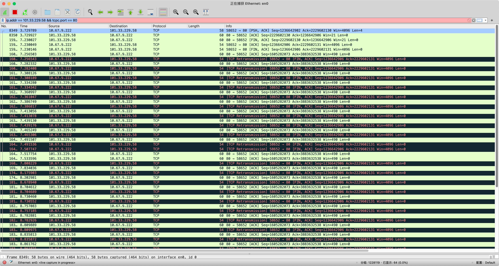
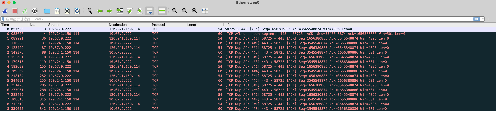
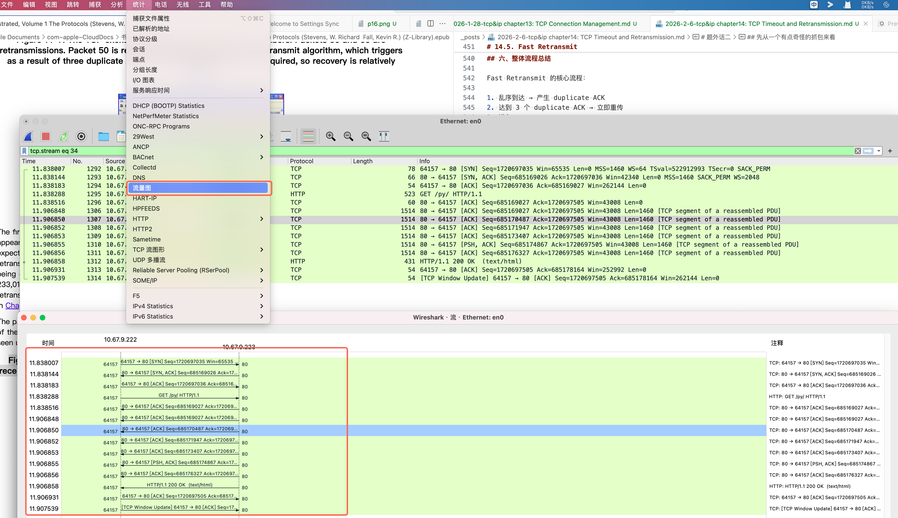
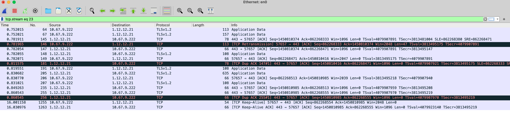
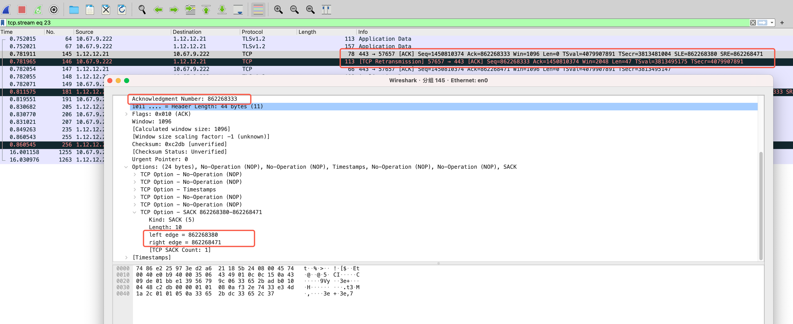

# 14.1. Introduction

本章围绕 TCP 的超时与重传机制展开，重点介绍 TCP 如何在不可靠的 IP 网络之上通过重传来保证可靠传输。TCP 主要依靠两种方式判断丢包：基于重传超时（RTO）的定时器重传，以及基于 ACK 结构（包括重复 ACK 与 SACK 信息）的快速重传，其中快速重传通常比超时重传更高效。章节进一步说明了 RTO 如何基于 RTT 动态计算，以及乱序、重复和分片等网络现象对 TCP 丢包判断与重传行为的影响，同时指出这些机制会与后续章节中的拥塞控制协同工作，以在可靠性与性能之间取得平衡。


# 题外话一


```shell
//server
nc -l -p 80

// client
telnet xx 80
```

**ctl + c 关闭server后， ack 震荡**



```shell
# 客户端完整报文
  8349  3.729789     10.67.9.222        101.33.229.58    TCP   58   58652 → 80 [PSH, ACK] Seq=1236642902 Ack=2229602130 Win=4096 Len=4
  8350  3.729927     101.33.229.58      10.67.9.222      TCP   60   80 → 58652 [ACK] Seq=2229602130 Ack=1236642906 Win=21 Len=0
  159... 7.230027     101.33.229.58      10.67.9.222      TCP   60   80 → 58652 [FIN, ACK] Seq=2229602130 Ack=1236642906 Win=21 Len=0
  159... 7.230049     10.67.9.222        101.33.229.58    TCP   54   58652 → 80 [ACK] Seq=1236642906 Ack=2229602131 Win=4096 Len=0
  159... 7.230146     10.67.9.222        101.33.229.58    TCP   54   58652 → 80 [FIN, ACK] Seq=1236642906 Ack=2229602131 Win=4096 Len=0
  160... 7.256503     101.33.229.58      10.67.9.222      TCP   60   80 → 58652 [ACK] Seq=1605282073 Ack=3883632538 Win=490 Len=0
  160... 7.256543     10.67.9.222        101.33.229.58    TCP   54   [TCP Retransmission] 58652 → 80 [FIN, ACK] Seq=1236642906 Ack=2229602131 Win=4096 Len=0
  160... 7.282332     101.33.229.58      10.67.9.222      TCP   60   80 → 58652 [ACK] Seq=1605282073 Ack=3883632538 Win=490 Len=0
  160... 7.282408     10.67.9.222        101.33.229.58    TCP   54   [TCP Retransmission] 58652 → 80 [FIN, ACK] Seq=1236642906 Ack=2229602131 Win=4096 Len=0
  161... 7.308126     101.33.229.58      10.67.9.222      TCP   60   80 → 58652 [ACK] Seq=1605282073 Ack=3883632538 Win=490 Len=0
  161... 7.308189     10.67.9.222        101.33.229.58    TCP   54   [TCP Retransmission] 58652 → 80 [FIN, ACK] Seq=1236642906 Ack=2229602131 Win=4096 Len=0
  161... 7.334280     101.33.229.58      10.67.9.222      TCP   60   80 → 58652 [ACK] Seq=1605282073 Ack=3883632538 Win=490 Len=0
  161... 7.334342     10.67.9.222        101.33.229.58    TCP   54   [TCP Retransmission] 58652 → 80 [FIN, ACK] Seq=1236642906 Ack=2229602131 Win=4096 Len=0
  162... 7.360997     101.33.229.58      10.67.9.222      TCP   60   80 → 58652 [ACK] Seq=1605282073 Ack=3883632538 Win=490 Len=0
  162... 7.361047     10.67.9.222        101.33.229.58    TCP   54   [TCP Retransmission] 58652 → 80 [FIN, ACK] Seq=1236642906 Ack=2229602131 Win=4096 Len=0
  162... 7.386749     101.33.229.58      10.67.9.222      TCP   60   80 → 58652 [ACK] Seq=1605282073 Ack=3883632538 Win=490 Len=0

# 问题报文
15954	7.230146	10.67.9.222	101.33.229.58	TCP	54	58652 → 80 [FIN, ACK] Seq=1236642906 Ack=2229602131 Win=4096 Len=0
16015	7.256503	101.33.229.58	10.67.9.222	TCP	60	80 → 58652 [ACK] Seq=1605282073 Ack=3883632538 Win=490 Len=0
16016	7.256543	10.67.9.222	101.33.229.58	TCP	54	[TCP Retransmission] 58652 → 80 [FIN, ACK] Seq=1236642906 Ack=2229602131 Win=4096 Len=0
...
```


```shell
# 服务器端完整报文
# 10.1.0.9 服务器ip  && 111.46.19.194 客户端nat ip
15:00:49.044710  10.1.0.9:80  → 111.46.19.194:64898  [F.]
15:00:49.074307  111.46.19.194 → 10.1.0.9           [F.]
15:00:49.074323  10.1.0.9 → 111.46.19.194           [ACK]
---------------------------------------------------------
15:00:49.074442  111.46.19.194 → 10.1.0.9           [F.]  seq=4022133815
15:00:49.074459  10.1.0.9 → 111.46.19.194           [ACK]
```

### 问题根源

- 👉 中间设备已经把“前一个后端连接”释放掉
- 👉 又用同一个四元组承载了另一个前端连接的 FIN
- 👉 直接透传到了后端
- 👉 后端此时已经在 TIME_WAIT

### 之前错误的结论

**这是个错误结论，应用层没这么大威力**

* **Ctrl+C 杀掉 nc**，用户态进程直接退出
* **nc 默认没有优雅关闭 socket**，没有调用 `shutdown(sock, SHUT_WR)` 或等待对端 FIN
* **内核 TCP 控制块（TCB）仍在处理残留数据**，但上下文不完整
* 内核为了尽力回应客户端 FIN，生成了 **Seq/Ack 错乱的 ACK / Dup ACK**

> 本质上，这是内核在“收尾”残留连接的行为，不是 TCP 协议或应用 bug。

### 优雅关闭

```c
// 1. 正常通信
write(fd, buf, len);

// 2. 我写完了，不再发送数据
shutdown(fd, SHUT_WR);   // 发送 FIN

// 3. 继续读取对方数据
while (1) {
    n = read(fd, buf, sizeof(buf));

    if (n > 0) {
        process(buf, n);
    }
    else if (n == 0) {
        // 对方也发了 FIN
        break;
    }
    else {
        // 错误
        perror("read");
        break;
    }
}

// 4. 完全关闭 socket
close(fd);
```

**状态变化**

调用 shutdown(SHUT_WR) 后：
```shell
ESTABLISHED
    ↓
FIN_WAIT_1
```

read() 读到 0：
```shell
对端 FIN 到达
    ↓
TIME_WAIT（如果你是主动关闭方）
```
最后 close() 只是释放 fd，不再触发 FIN。

# 14.2. Simple Timeout and Retransmission Example

这一章讲的是 TCP 最基础、最核心的可靠性机制：

> 当收不到 ACK 时，TCP 依靠“超时 + 重传”保证数据最终送达。

它不依赖快速重传，也不依赖拥塞控制。真正的兜底机制只有一个：

> 等时间到，再发一次。

---

## 一、最简单的丢包场景

假设：

1. 发送方发送一个 TCP 段
2. 接收方成功收到
3. 接收方发送 ACK
4. ACK 在网络中丢失

发送方看到的现象是：

> 数据发出去了，但一直没有收到确认。

它无法判断：

* 是数据丢了？
* 是 ACK 丢了？
* 还是对端宕机？

TCP 的处理方式非常朴素：

> 启动重传定时器（RTO），等待超时。

---

## 二、RTO 的基本工作机制

每发送一个未确认段，TCP 都会：

1. 启动一个 RTO 定时器
2. 超时前收到 ACK → 取消定时器
3. 超时仍未收到 ACK → 重传该段

核心逻辑：

> 如果等了这么久还没确认，就当它丢了。

---

## 三、两种丢包情况都能被兜住

### 情况 1：ACK 丢失

* 数据其实已经到达
* 只是 ACK 丢了
* RTO 到期
* 发送方重传相同段
* 接收方发现序号相同 → 判定为重复数据
* 丢弃数据
* 再次发送 ACK

不会重复交付数据，只是浪费了一次带宽。

### 情况 2：数据真的丢失

* 接收方未收到数据
* 不会发送 ACK
* RTO 到期
* 发送方重传
* 接收方正常接收并确认

RTO 成功兜底。

---

## 四、指数退避：不会疯狂重传

如果重传后仍然没有 ACK，TCP 不会固定频率重发。

它采用指数退避：

```
1s → 2s → 4s → 8s → 16s → ...
```

目的：

* 避免加重拥塞
* 给网络恢复时间
* 保持保守

这体现了 TCP 的“克制”。

---

## 五、SYN 重传 vs 数据重传

TCP 在不同阶段，坚持程度不同。

### 1️⃣ 建连阶段（SYN）

由参数控制：

```
net.ipv4.tcp_syn_retries = 5
```

| 类型  | 参数              | 默认值 | 放弃时间    |
| --- | --------------- | --- | ------- |
| SYN | tcp_syn_retries | 5   | ≈ 180 秒 |

特点：

* 指数退避
* 几分钟内放弃

因为：

> 还没建立关系，不值得长期等待。

### 2️⃣ 已建立连接（数据阶段）

由参数控制：

```
net.ipv4.tcp_retries2 = 15
```

| 类型 | 参数           | 默认值 | 放弃时间       |
| -- | ------------ | --- | ---------- |
| 数据 | tcp_retries2 | 15  | ≈ 15~30 分钟 |

特点：

* 重传次数很多
* 可能卡十几分钟

因为：

> 连接已经建立，不能轻易放弃。

---

## 六、R1 与 R2：坚持的两个阶段

Linux 中还有两个关键阈值。

### R1 —— tcp_retries1

```
net.ipv4.tcp_retries1 = 3
```

达到该次数后：

* 内核怀疑路径异常
* 通知 IP 层
* 触发：

  * 路由重查
  * 邻居重新解析（ARP）
  * PMTU 重新探测

⚠️ 不会断连接。

可以理解为：

> 网络可能出问题，换条路再试。

### R2 —— tcp_retries2

```
net.ipv4.tcp_retries2 = 15
```

达到该次数后：

* 认为连接不可达
* 停止重传
* 关闭连接

可以理解为：

> 试了很久都不通，放弃。

---

## 七、FIN 也走同样的机制

很多人以为关闭连接会很快结束，其实不是。

如果发送 FIN 后收不到 ACK：

* 会重传 FIN
* 同样指数退避
* 同样受 tcp_retries2 控制

所以你会看到：

* FIN 一直重发
* Send-Q 不清
* 连接卡很久

因为 FIN 也是可靠传输的一部分。

---

## 八、RST 是唯一立即终止的方式

区别非常关键：

| 报文  | 行为           |
| --- | ------------ |
| FIN | 需要 ACK，走重传机制 |
| RST | 立即终止，不重传     |

RST 不保证对方收到，它只是：

> 直接放弃连接。

---

## 九、为什么 TCP 不轻易断连接？

设计原则：

```
可靠性优先
宁可等，不轻易断
```

TCP 无法区分：

* 网络暂时拥塞
* 链路切换
* 路由变化
* 对端真正宕机

如果过早断开连接，会破坏可靠性。

因此它只能通过：

> 持续重传 + 时间验证

来确认连接是否真的死亡。

---

## 十、本章真正的核心

这一章的本质只有一句话：

> TCP 的可靠性来自：序号 + ACK + 超时。

* 序号保证数据不重复
* ACK 提供确认
* RTO 负责兜底
* R1 / R2 决定坚持多久
* SYN 比数据更容易放弃
* FIN 也是可靠传输
* 只有 RST 是暴力终止

所有复杂机制，最终都建立在这一套最朴素的逻辑之上。


# 14.3. Setting the Retransmission Timeout (RTO)

各种rto算法 ~ 略

现代 TCP RTO = 平滑平均 RTT + 4 倍波动裕量 + 指数退避机制

Linux 让 RTO 更“保守”，避免 spurious retransmission，而不是追求理论最优。

# 14.4. Timer-Based Retransmission

## 一、核心思想  

TCP 在每个连接上始终只维护 **一个重传定时器**。当发送一个被计时的数据段时，启动 RTO 定时器；如果在超时时间内收到能够推进发送窗口的 ACK，则取消定时器；若未收到，则触发超时重传。在网络正常情况下，这个定时器会不断被“设置—取消”，几乎不会真正到期。

TCP 每个连接只有 一个 RTO 定时器，它始终绑定在“当前最早未确认的数据段”（SND.UNA）上，而不是为每个包单独计时。只有当收到新的 ACK、使发送窗口前移时，才会取消旧定时器并为新的最早未确认数据重新启动定时器；如果超时重传后仍未收到 ACK，定时器不会为后续数据更新，而是按指数退避继续等待。因此，定时器的更新取决于窗口是否推进，而不是每发送或重传一个包就刷新。

---

## 二、什么时候触发 Timer-Based Retransmission  

当发送方在 RTO 时间内没有收到推进窗口的 ACK，就会认为该数据段可能丢失，从而触发一次基于超时的重传。这是一种“被动检测”机制，依赖时间推断丢包，而不是通过 ACK 模式直接判断。

---

## 三、为什么说这是“重大事件”  

RTO 超时通常意味着网络出现拥塞或严重异常，因此 TCP 会将其视为强烈的负面信号。一旦发生超时，发送方会显著降低发送速率，通过拥塞控制机制收缩拥塞窗口，必要时重新进入慢启动阶段，以避免进一步加重网络负担。

---

## 四、RTO 指数退避（Exponential Backoff）  

如果同一数据段多次超时仍未成功确认，TCP 会对 RTO 进行指数级放大：  

> RTO = γ × RTO  

其中 γ 按 1、2、4、8… 递增。这种退避机制可以防止在严重拥塞时频繁重传。系统通常会设置一个 RTO 上限（如 Linux 的 `TCP_RTO_MAX`），避免无限增长；一旦收到有效 ACK，γ 会被重置为 1。

---

## 五、Karn 算法的作用  

在发生重传之后，TCP 不会使用该段对应的 ACK 来更新 RTT 估计，因为无法区分 ACK 是针对原始报文还是重传报文。这是 Karn 算法的核心思想。只有当收到真正推进发送窗口的 ACK 时，才会更新 `srtt`、`rttvar` 和 RTO。

---

## 六、机制定位：最后保障  

基于定时器的重传是一种“最后保障机制”。由于 RTO 通常大于正常 RTT（往往约为其两倍），等待超时会降低链路利用率。因此在实际网络中，TCP 更希望通过更高效的机制（如快速重传）提前发现丢包。一个运行良好的 TCP 连接，几乎不会频繁依赖 RTO 超时来恢复数据。

# 14.5. Fast Retransmit


在传统 TCP 中，丢包通常依赖重传定时器（RTO）触发重传。但 RTO 必须等待超时，因此恢复速度较慢。  
Fast Retransmit 的核心思想是：**通过接收端的反馈提前推断丢包，而不必等待超时。**

**Fast Retransmit 只适用于已建立连接后的数据段，不适用于 SYN 或 FIN。**

---

## 一、触发原理：Duplicate ACK

当接收端收到乱序段时（例如期望 `seq=23801`，却收到更大的序号），说明中间存在“空洞（hole）”。此时接收端会：

- 立即发送 `ACK=23801`
- 不进行延迟确认

这种 ACK 被称为 **duplicate ACK**。

由于网络中可能存在重排序现象，TCP 不会因为 1~2 个 duplicate ACK 就认定丢包，而是设置阈值：

`dupthresh = 3`


当发送端连续收到 3 个 duplicate ACK 时，才认为丢包概率足够高，从而立即重传缺失段。

当接收端顺序收到数据时，可以启用延迟确认（Delayed ACK），短暂等待是否还有后续数据或是否可以捎带 ACK 一起发送，以减少纯 ACK 数量；但如果收到的是乱序段（说明中间出现了丢包“空洞”），接收端必须立即发送重复 ACK（Duplicate ACK），明确告诉发送端“我还在等某个序号的数据”。此时不能延迟确认，因为 Duplicate ACK 的作用是尽快触发发送端的快速重传机制，丢包恢复优先于 ACK 优化。

**延迟确认（Delayed ACK）**是 TCP 的一种优化机制：当接收端顺序收到数据时，不会立即发送 ACK，而是短暂等待（通常几十毫秒），看看是否还有后续数据到达，或是否可以将 ACK 捎带在即将发送的数据中一起发出，从而减少纯 ACK 报文数量、提高效率；但如果发生乱序（出现丢包迹象），则会立即发送重复 ACK，不再延迟，因为丢包恢复优先于 ACK 优化。

**Wireshark 标记的 `TCP Dup ACK` 与 TCP 协议理论中的 Duplicate ACK 并不完全等价。**  
在 TCP 协议中，Duplicate ACK 指的是接收端因为检测到乱序数据（出现 hole）而重复发送相同 ACK，用于提示发送端可能发生丢包并触发 Fast Retransmit。而 Wireshark 的 `Dup ACK` 只是基于抓包序列的启发式判断：当连续看到 ACK 号未前进、序号和窗口基本不变的 ACK 报文时，就会标记为 `Dup ACK`。因此它可能只是 ACK 重复、ACK 重排、抓包点重复、NIC offload 或镜像口复制导致的重复报文，并不一定表示真实的乱序或丢包事件。

---

## 二、Fast Retransmit 的动作

当收到第 3 个 duplicate ACK：

1. 立即重传推测丢失的段
2. 记录当前已发送的最高序号，作为 `recovery point`
3. 进入拥塞恢复阶段（Fast Recovery）

此过程无需等待 RTO，因此恢复速度显著提高。

---

## 三、Recovery 机制（NewReno）

在 NewReno 算法中，恢复过程引入了一个重要概念：**partial ACK**。

如果收到的 ACK：

- 大于之前的 ACK（说明有数据被确认）
- 但小于 `recovery point`

则称为 **partial ACK**。

在这种情况下：

- 发送端不会退出 recovery
- 会继续重传下一个缺失段
- 直到 `ACK >= recovery point` 才真正恢复正常发送状态

这使得 NewReno 能够在无 SACK 的情况下逐个修复多个丢失段。

---

## 四、无 SACK 的局限

当未启用 SACK 时，发送端只能通过 ACK number 的推进来判断是否填补了最低的空洞。

因此：

- 每个 RTT 最多修复一个 hole
- 多个丢包场景恢复效率较低

---

## 五、启用 SACK 后的改进

SACK 允许 ACK 中携带“已成功接收的数据块范围”。

这意味着发送端可以：

- 同时得知多个 hole 的位置
- 在一个 RTT 内重传多个缺失段

恢复效率显著提升。

---

## 六、整体流程总结

Fast Retransmit 的核心流程：

1. 乱序到达 → 产生 duplicate ACK
2. 达到 3 个 duplicate ACK → 立即重传
3. 进入 recovery
4. 根据 partial ACK 或 SACK 信息持续修复
5. 达到 recovery point → 退出恢复

---

## 一句话总结

> Fast Retransmit 通过 3 个 duplicate ACK 推断丢包并立即重传；  
> 无 SACK 时每 RTT 只能修一个洞；  
> NewReno 通过 partial ACK 支持多洞恢复。

# 题外话二

## 先从一个有点奇怪的抓包来看



```shell
1.089921
10.67.9.222 → 120.241.150.114
[TCP Dup ACK 3#1]
58725 → 443
Seq=1656380885 Ack=3545548874
Win=4096 Len=0
```

`[TCP Dup ACK 3#1]` :这是一个“重复确认（Duplicate ACK）”, 3 表示它是在重复确认“第 3 号相关数据包”, #1 表示这是第 1 次重复.

这段抓包里 114 的 Ack=1656380886 表示它在等 222 发送下一个字节 1656380886，而 222 发出的都是 Len=0 的纯 ACK 包，所以自己的 Seq=1656380885 一直不变是正常的；由于 114 迟迟收不到期望的数据字节，它只能不断重复发送相同的 ACK，这种现象叫 Duplicate ACK，本质上不是在“重传数据”，而是在持续声明“我缺这一个字节”。


## 生成流量图

看的比较清晰一点 ~ 哪里有重传 哪里有丢包



**Wireshark 还有很多实用的高级技巧，例如通过“分析 → 专家信息”快速定位异常 TCP 行为，利用“统计 → TCP 流图”绘制时序关系观察丢包、重传与窗口变化，添加自定义字段列来直观看到序列号、确认号、窗口大小及重传标记，使用“追踪流 → TCP 流”还原完整通信过程，以及在协议首选项中关闭乱序重组以观察真实网络行为等，这些方法可以帮助工程排查网络延迟、丢包、ACK 震荡等复杂问题。**

# 14.6. Retransmission with Selective Acknowledgments

# 14.6 Selective Acknowledgment（SACK）机制

## 一、SACK 的核心作用

Selective Acknowledgment（SACK）是 TCP 为了提高丢包恢复效率而引入的机制。

传统 TCP 只能通过累计 ACK（Cumulative ACK）来确认数据，即：

> 只确认连续收到的最大序列号。

而 SACK 允许接收端同时告诉发送端哪些**非连续区间**的数据已经收到。

换句话说：

* ACK 表示“我收到到这里为止”
* SACK 表示“这些乱序区间我也收到了”

---

## 二、Hole（空洞）概念

当接收端收到乱序数据时，会在缓存中形成所谓的 hole（数据空洞）。

例如：

接收端期望：

```
seq = 23801
```

但先收到：

```
25201~26601
```

说明：

```
23801~25200
```

这一段数据缺失。

---

## 三、SACK Option 的结构限制

TCP 选项空间有限，通常最多约 40 字节。

一个 SACK block 需要 8 字节。

因此：

* 一次 ACK 最多携带 3~4 个 SACK block（通常实现为 3 个）。

---

## 四、SACK Receiver 行为

当接收端检测到乱序数据时，会生成 SACK。

一般规则：

1. 记录最近收到的连续数据区间
2. 优先报告最新的 out-of-sequence block
3. 可能重复携带历史 SACK 信息以防 ACK 丢失

注意：

> SACK 是建议性信息（advisory），不是最终确认。

接收端可能存在 reneging（撤回 SACK 状态），但非常少见。

---

## 五、SACK Sender 行为（最核心部分）

发送端通常维护：

* 累计 ACK 信息
* SACK 区间信息

典型策略是 Selective Repeat：

1. 优先填补 receiver hole
2. 再发送新数据

流程：

* 收到 SACK 或重复 ACK
* 判断丢失段
* 选择性重传缺失数据

---

## 六、SACK 与快速重传

传统 TCP：

* Fast Retransmit 通常需要 3 个重复 ACK。

SACK TCP：

* 可以根据 SACK block 更早判断丢包。

因此：

> SACK 可以提前触发重传。

---

## 七、SACK 与拥塞控制

即使检测到多个丢失区间：

* 发送端仍必须遵守拥塞控制规则。
* 可能一次只重传一段数据。

不能一次性无限重传。

---

## 八、性能特点

SACK 在以下场景优势明显：

* RTT 较大
* 丢包率较高
* 网络波动较大

核心优势：

> 可以在一个 RTT 内修复多个丢失区间。

---

## 九、重要注意点

* SACK 是辅助机制。
* 最终可靠性仍依赖累计 ACK。
* SACK 信息可能丢失。
* 发送端不能仅依据 SACK 释放缓存，必须等待累计 ACK 越过最高序号。

---

## 十、核心总结

SACK 的本质是：

> 让发送端知道接收端已经收到的非连续数据区间，从而实现更高效的选择性重传，减少不必要的数据重复发送，提高丢包恢复速度。

# 题外话三

## SACK、Fast Retransmit 与 RTO 的决策优先级

TCP 的重传机制遵循“信息优先于时间”的原则。发送端首先尝试利用 SACK（Selective Acknowledgment）提供的精确丢包区间信息进行选择性重传；如果 SACK 不可用或无法确定丢包位置，则通过重复 ACK（通常 ≥3 个 Duplicate ACK）触发 Fast Retransmit；当网络完全没有反馈或丢包严重时，才依赖 RTO 超时重传作为最后的恢复手段。本质上，TCP 尽量基于网络行为推断丢包，而不是单纯依赖定时器。

---

## SACK 优先：精确丢包定位

当连接支持 SACK 时，接收端可以在 ACK 中携带已收到的非连续数据区间，发送端据此识别 receiver buffer 中的 hole 并进行选择性重传。SACK 的核心优势是能够在一个 RTT 内修复多个丢失段，避免传统 TCP 的批量重传问题，特别适合高延迟或高丢包率网络环境。

---

## Fast Retransmit：基于乱序信号的丢包预测

Fast Retransmit 通常在收到三个重复 ACK 时触发，说明接收端已经收到丢失段之后的数据，丢包概率较高。该机制不需要等待超时即可重传数据，但它依赖后续数据的正常到达，无法精确处理多个丢包区间，因此在复杂网络环境中需要 SACK 辅助。

---

## RTO 重传：最保守的恢复机制

当没有足够的 ACK 信息用于丢包判断时，TCP 会依赖 RTO 超时重传。RTO 基于 RTT 估计计算，通常具有较大的时间容忍窗口，因此延迟较高但可靠性最强。RTO 重传主要用于网络阻塞、ACK 丢失或路径异常等情况，是 TCP 的最后恢复手段。

---

# 14.7. Spurious Timeouts and Retransmissions

## 14.7 Spurious Timeouts 与 Spurious Retransmission

这一节主要讨论 TCP 如何识别和处理“虚假重传（Spurious Retransmission）”问题。虚假重传指的是 TCP 因为超时或网络抖动误判丢包，导致重传了实际上已经成功传输的数据。其本质目标是避免将正常的 RTT 波动误判为丢包，从而减少不必要的重传和性能退化。在 :contentReference[oaicite:0]{index=0} 和 :contentReference[oaicite:1]{index=1} 中都提到，TCP 应尽量基于网络行为而非单纯定时器判断丢包。

---

### 一、Spurious Retransmission（虚假重传）

虚假重传通常发生在 RTT 突然增大超过当前 RTO 估计值时，导致 TCP 提前触发超时重传。常见原因包括 ACK 路径延迟尖峰、数据乱序、ACK 丢失以及网络瞬时抖动，在无线网络或高波动链路中更容易出现。

---

### 二、DSACK：重复数据检测机制

DSACK（Duplicate SACK）用于判断重传是否真正必要。当接收端收到重复数据段时，会在 SACK block 中报告重复序列号。发送端可以根据 DSACK 判断是否发生误重传、网络乱序、数据复制或 ACK 丢失。

DSACK 与普通 SACK 兼容，不需要额外协商，但 DSACK 信息只在单个 ACK 中发送，不会像普通 SACK 那样跨多个 ACK 重复。

---

### 三、Eifel Detection：早期虚假重传检测

F-RTO：RTO 超时重传检测 & Eifel Response：虚假重传恢复机制 等， 略。

# 题外话四：sack & dup ack 重传问题

Selective Acknowledgment (SACK) 本身不是重传触发信号，它只是用于向发送端反馈已成功接收的数据区间；TCP 是否重传取决于发送端的恢复策略。当满足快速重传条件（通常是重复 ACK 数量达到 dupthresh，如 3）或者重传超时 Linux kernel networking stack 中的 RTO 机制触发时，才可能发生重传。SACK 的主要作用是让发送端在判定丢包后能够只重传真正缺失的段，避免乱序或重复传输导致的无效重传。

在 Linux kernel networking stack 的 TCP 实现中，即使 Selective Acknowledgment (SACK) 报告存在数据缺口，也不一定立即触发重传，只有当发送端通过重复 ACK 数量达到快速重传阈值（如 dupthresh，通常为 3）、或者重传超时（RTO）到达、或者 loss recovery 算法判定缺口更可能是丢包而非乱序时，才会真正重传缺失段；如果缺口可能只是网络乱序、链路层重传或暂时延迟到达的数据，TCP 通常会继续等待以避免 spurious retransmission。

**1. sack 触发重传**




# 14.8. Packet Reordering and Duplication

在讨论 TCP 可靠传输机制时，人们通常关注 **数据包丢失（packet loss）**。TCP 的超时重传、快速重传以及拥塞控制等机制，主要都是为了解决网络中的丢包问题。

然而，在真实网络环境中，除了丢包之外，还可能出现另外两种传输异常：

* **Packet Reordering（数据包乱序）**
* **Packet Duplication（数据包重复）**

虽然这两种情况在互联网中并不像丢包那样常见，但它们同样会影响 TCP 的行为。更重要的是，从 TCP 的角度来看，这些问题产生的表象往往与丢包非常相似。

TCP 需要尝试判断：

* 数据段是否真的丢失
* 数据段是否只是被乱序传输
* 数据段是否被网络复制

如果 TCP 判断错误，就可能触发 **不必要的重传（spurious retransmission，伪重传）**，从而降低网络效率。

---

## 14.8.1 Packet Reordering（数据包乱序）

### 乱序产生的原因

IP 协议本身 **并不保证数据包的到达顺序与发送顺序一致**。在数据包经过网络转发的过程中，不同的数据包可能经历不同的路径、不同的排队时间或不同的处理延迟，因此可能导致乱序。

常见的乱序原因包括：

* **多路径转发（ECMP）**：不同数据包可能被分配到不同路径
* **路由器内部并行处理**：高性能路由器内部通常存在多个处理流水线
* **链路延迟差异**：不同链路的延迟不同
* **动态路由变化**：后发送的数据包可能走更快的路径

因此，接收端看到的数据包顺序可能与发送端不同。

---

### 乱序可能发生的方向

在 TCP 连接中，乱序既可能发生在 **数据传输方向（forward path）**，也可能发生在 **ACK 返回方向（reverse path）**。

#### 数据方向乱序

当乱序发生在发送端到接收端的数据路径上时，接收端会观察到 **序号出现空洞（sequence hole）**。

例如：

发送顺序：

```
1 2 3 4 5
```

接收顺序：

```
1 2 4 3 5
```

当接收端收到序号 4 时，由于序号 3 尚未到达，TCP 会持续发送 **duplicate ACK** 来提示发送端当前仍然期望收到序号 3。

---

#### ACK 方向乱序

乱序也可能发生在 ACK 返回路径上。由于互联网中经常存在 **非对称路由**，数据和 ACK 可能经过完全不同的网络路径。

例如发送端可能依次收到：

```
ACK 100
ACK 200
ACK 150
```

其中 ACK150 是一个较旧的 ACK。发送端通常会丢弃这些旧 ACK，但 ACK 的乱序可能导致发送端在短时间内突然发送大量数据，从而形成 **突发发送（burstiness）**，影响 TCP 对带宽的利用效率。

---

### 乱序与 TCP 丢包判断

TCP 使用 **Fast Retransmit（快速重传）** 机制来快速恢复丢失的数据包。其基本思想是：当发送端连续收到多个 **duplicate ACK** 时，认为某个数据段已经丢失，并立即进行重传。

为了避免轻微乱序导致误判，TCP 设置了一个阈值：

```
dupthresh = 3
```

也就是说：

只有在发送端连续收到 **3 个 duplicate ACK** 时，才会触发快速重传。

---

## 轻度乱序

如果只是轻微乱序，例如两个相邻数据包交换顺序，那么接收端只会产生 **少量 duplicate ACK**。

由于 duplicate ACK 的数量没有达到 dupthresh 阈值，发送端不会触发快速重传。随着缺失的数据段到达，连接会自动恢复正常顺序。

因此 TCP 可以较好地容忍轻度乱序。

---

## 严重乱序

如果乱序程度较大，例如一个数据段被延迟到多个数据段之后才到达，就可能产生足够数量的 duplicate ACK，从而触发快速重传。

例如：

发送顺序：

```
1 2 3 4 5 6
```

接收顺序：

```
1 2 5 6 3 4
```

由于数据段 3 长时间未到达，接收端会持续发送 ACK3。当发送端连续收到 3 个 duplicate ACK 后，就会认为数据段 3 已经丢失，并触发快速重传。

但实际上该数据段只是 **被延迟而不是丢失**，因此这次重传属于 **伪重传（spurious retransmission）**。

---

## 乱序问题的处理

区分真实丢包和乱序并不容易。TCP 通常采用以下策略来减少误判：

* 使用 **duplicate ACK 阈值（dupthresh）** 来容忍少量乱序
* 在某些实现中 **动态调整 dupthresh**
* 利用 **SACK 信息** 辅助判断哪些数据段已经到达

研究表明，在互联网中 **严重乱序相对少见**，因此默认的 dupthresh=3 在大多数情况下是有效的。

---

# 14.8.2 Packet Duplication（数据包重复）

除了乱序之外，IP 网络偶尔还可能产生 **重复数据包**。虽然这种情况比较罕见，但在某些网络环境中仍然可能出现。

重复包产生的原因可能包括：

* 链路层协议进行重传
* 网络设备错误复制数据包
* 某些网络设备的实现缺陷

当数据包被复制时，TCP 可能会接收到多个具有相同序号的数据段。

---

### 重复包对 TCP 的影响

假设数据段 3 在网络中被复制多次，则网络中实际传输的数据序列可能变为：

```
1 2 3 3 3 3 4 5 6
```

当接收端收到这些重复数据段时，会持续发送相同的 ACK，例如：

```
ACK3
ACK3
ACK3
ACK3
```

当发送端收到这些 ACK 时，可能误认为后续数据段已经到达，而某个数据段发生了丢失，从而触发 **快速重传**。

但实际上并没有丢包，只是网络产生了重复数据包，因此这同样会导致 **伪重传（spurious retransmission）**。

---

### SACK 与 DSACK 的作用

为了解决这一问题，TCP 引入了 **SACK（Selective Acknowledgment）** 机制。

SACK 可以让接收端明确告诉发送端：

* 哪些数据段已经收到
* 哪些数据段仍然缺失

在 SACK 的基础上，又进一步引入 **DSACK（Duplicate SACK）**。

DSACK 可以通知发送端：

某个数据段 **已经被接收过一次，现在收到的是重复副本**。

如果发送端在 ACK 中发现：

* 某个数据段已经被确认
* 同时出现重复段的信息

就可以推断网络中发生的是 **数据包复制** 而不是丢包，从而避免不必要的重传。

---

# 14.9 Destination Metrics（目的地路径度量）

TCP 在通信过程中会逐渐学习网络路径的特性，例如 **RTT（srtt）、RTT 方差（rttvar）、拥塞窗口（cwnd）以及可能存在的数据包乱序程度**。传统 TCP 在连接关闭后会丢失这些学习到的信息，因此每次新建连接时都需要重新测量和学习网络状况。为了解决这一问题，一些较新的 TCP 实现会将这些路径统计信息缓存到系统级数据结构（如路由缓存）中，即 **Destination Metrics**。当新的 TCP 连接建立时，可以利用这些历史数据作为初始值，从而更快地收敛到合适的网络参数，提高连接初期的性能。在 Linux 中，可以使用 `ip route show cache` 查看这些缓存的路径统计信息，例如 RTT、RTT 方差、路径 MTU 和拥塞窗口等。


# 14.10 Repacketization（重新分段）

当 TCP 发生超时重传时，并不一定需要重新发送与原来完全相同的 TCP 段。TCP 可以对未确认的数据重新打包，形成一个 **更大的数据段进行重传**，这种行为称为 **Repacketization**。之所以允许这样做，是因为 TCP 使用 **字节序号（byte sequence number）** 来标识和确认数据，而不是依赖具体的数据段编号，因此只要字节序列正确即可。重新分段可以减少数据段数量，提高传输效率，并在某些情况下帮助检测 **伪超时（spurious timeout）**。抓包时可以观察到这种现象：原本多个较小的数据段在重传时可能被合并为一个更大的数据段发送，这个新数据段甚至可能包含已经通过 SACK 确认过的数据范围。