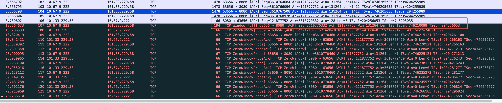

# 15.1 Introduction

TCP 不仅要支持大规模数据传输（bulk data transfer），还需要支持交互式通信（interactive communication）。这两类通信在网络行为上差异很大，因此 TCP 在设计上需要在 **延迟（latency）** 与 **网络效率（efficiency）** 之间进行权衡。

从网络流量统计来看，绝大多数 TCP 流量属于大规模数据传输，例如 Web、文件传输、邮件或备份等，这类数据通常以较大的分段发送，数据包接近 MTU（约 1500 bytes）。相对而言，交互式通信的数据量很小，但对实时性要求很高，例如远程登录、在线游戏或协作工具。

交互式通信存在一个天然的矛盾：如果每次用户输入都立即发送数据，可以获得最低延迟，但会产生大量非常小的数据包，导致 TCP/IP 头部开销过大；如果等待更多数据再发送，则能够提高网络效率，但会增加用户感知的延迟。为了解决这个问题，TCP 引入了一些机制，例如 **Delayed ACK**、**Nagle Algorithm** 和 **Flow Control** 等。

---

# 15.2 Interactive Communication

交互式通信最典型的例子是远程终端应用，例如 ssh。客户端捕获用户在键盘上的输入，并通过 TCP 连接发送到服务器；服务器端运行 shell（命令解释器），解释用户输入并将结果返回给客户端。

许多初学者会认为远程终端是在按下 Enter 之后才发送数据，但实际上大多数终端程序会 **逐字符发送用户输入**。这意味着用户每按一次键，客户端就会通过 TCP 发送一个小的数据包到服务器。

这种设计的原因在于远程终端通常工作在 **字符模式（raw mode）**。在这种模式下，输入不会在本地缓存成一整行，而是立即传递给应用程序。这样服务器上的程序（例如 shell、vim、top 等）就能够实时响应用户按键，例如移动光标、自动补全或刷新界面。

当用户在 ssh 连接中输入一个字符时，TCP 连接中可能会产生如下数据交换过程：

1. 客户端向服务器发送一个包含字符的数据段。
2. 服务器确认该数据段（ACK）。
3. 服务器将该字符回显（echo）给客户端。
4. 客户端再对回显数据进行确认。

理论上，这一过程可能产生四个 TCP segment。然而在实际实现中，TCP 通常会将 **ACK 与数据合并发送**，这种技术称为 **piggybacking**。因此服务器往往会在同一个数据包中同时发送 ACK 和 echo，从而减少数据包数量。

在抓包工具中（例如 Wireshark），如果用户逐字符输入命令 `date`，通常会看到每个字符对应一组 TCP 数据交换。例如字符 `d`、`a`、`t`、`e` 以及最后的回车键都会触发相似的网络行为。如果用户输入速度较慢，还可以观察到相邻数据包之间明显的人为输入间隔。

在 ssh 抓包中还可以观察到一个现象：数据段的长度通常为固定大小（例如 48 bytes 或 64 bytes）。这是因为 ssh 在发送数据前会对数据进行加密，而加密算法通常按固定大小的数据块进行处理，因此会产生一定的填充。

此外，一个 TCP 连接实际上包含 **两个独立的字节流**：

* 客户端 → 服务器
* 服务器 → 客户端

这两个方向分别维护自己的序列号（sequence number）。ACK 字段始终确认的是 **对方方向的数据流**。

在交互式通信中，还经常可以看到 TCP 报文中的 **PSH（Push）标志位**被置位。该标志表示发送方在发送该数据段时已经清空了发送缓冲区，希望接收方尽快将数据交付给应用程序，而不是继续等待更多数据。

---

# 15.3 Delayed Acknowledgments

TCP 在很多情况下不会为每一个收到的数据段立即发送 ACK。这是因为 TCP 使用 **累计确认（cumulative acknowledgment）** 机制：ACK 字段表示某个序列号之前的所有数据都已经成功接收。因此接收方不需要对每个数据段分别确认。

基于这一特性，TCP 可以有意识地 **延迟发送 ACK**。接收方在收到数据后会等待一小段时间，希望在这段时间内本地主机正好有数据需要发送到对端。这样就可以把 ACK 与数据一起发送，从而减少网络中的报文数量。这种将确认信息附带在数据中的方式称为 **piggybacking**，在大规模数据传输（bulk transfer）中尤其常见。

当然，ACK 不能被无限期延迟。如果等待时间过长，发送方可能误以为数据已经丢失，从而触发不必要的重传。因此 TCP 实现通常会设置一个最大等待时间。

根据 RFC1122 的建议，TCP 应实现 delayed ACK，但延迟时间必须小于 **500ms**。在实际操作系统实现中，大多数系统采用的最大延迟时间约为 **200ms**。

通过延迟 ACK，可以明显减少网络中的 ACK 报文数量。在典型的大规模数据传输场景中，经常会出现 **两个数据段对应一个 ACK** 的情况，从而降低网络开销。

不同操作系统对于 delayed ACK 的实现方式有所不同。例如 Linux 会根据连接状态在不同模式之间动态调整：在某些情况下会对每个数据段立即确认（quickack 模式），而在普通情况下使用延迟确认策略。macOS 通过系统变量 `net.inet.tcp.delayed_ack` 控制延迟 ACK 的行为；Windows 则通过注册表参数（如 `TcpAckFrequency` 和 `TcpDelAckTicks`）控制 ACK 的频率以及延迟确认的定时器。

总体来说，TCP 在默认情况下会适度延迟 ACK，以减少网络流量，同时又不会延迟过久以避免触发误判的重传。在后续章节中，当讨论拥塞控制和大规模数据传输时，可以看到 delayed ACK 被广泛使用。不过在小包交互场景中（例如远程终端或 RPC 通信），如果与某些算法组合使用不当，延迟 ACK 也可能导致额外的通信延迟。

# 15.4 Nagle Algorithm

在交互式应用（如 ssh）中，客户端往往一次只发送极少量数据，例如一次按键可能只有 1 字节，但最终发送的 TCP/IP 包却可能达到几十字节甚至接近百字节。这类**数据很少但头部占比很高的小包**被称为 *tinygram*。在局域网中这种现象通常问题不大，但在广域网中，大量 tinygram 会导致带宽利用率下降并可能加剧网络拥塞。为了解决这个问题，John Nagle 在 RFC 896 中提出了 **Nagle Algorithm**，其目标是减少小包数量，提高网络利用效率。

Nagle 算法的核心思想是：**如果 TCP 连接中存在尚未被确认的数据，则新的小数据段（小于 SMSS）不能立即发送，而必须等待之前的数据被 ACK 确认之后再发送**。在这段等待时间里，TCP 会暂时缓存应用产生的小数据，并在 ACK 到达后合并发送。由于发送新的数据必须等待 ACK 返回，这种机制会使 TCP 在某些情况下表现出类似 **stop-and-wait** 的行为。Nagle 算法还具有一种 *self-clocking* 特性：ACK 返回越快，新的数据发送也越快，因此 RTT 实际上在一定程度上控制了发送节奏。

书中通过 ssh 连接实验展示了 Nagle 算法的效果。在 RTT 约 190ms 的网络环境中，如果关闭 Nagle（ssh 默认行为），请求与响应会交错发送，连接中存在大量小包，整个交互过程使用约 19 个数据包，总耗时约 0.58 秒。而当启用 Nagle 时，发送方必须等待 ACK 才能继续发送新的小数据段，因此请求与响应呈现出明显的 RTT 间隔（约 190ms），总包数减少到 11 个，但整体耗时增加到约 0.80 秒。由此可以看出 Nagle 算法的典型 **trade-off**：通过减少数据包数量来提高网络效率，但代价是增加交互延迟。

## 15.4.1 Delayed ACK 与 Nagle 的相互作用

当 **Delayed ACK** 与 **Nagle Algorithm** 同时使用时，可能会产生一种不理想的情况。假设客户端采用 delayed ACK 策略，在收到服务器发送的几个小包后不会立即发送 ACK，而是暂时等待是否有数据可以 piggyback 回服务器；与此同时服务器端启用了 Nagle 算法，在尚未收到 ACK 的情况下又不能发送新的小数据段。这样就会出现客户端等待更多数据、服务器等待 ACK 的局面，从而形成一种**临时性的等待状态（类似死锁）**。

这种状态不会永久持续，因为 delayed ACK 定时器最终会触发（通常约 200ms 左右），客户端会被迫发送 ACK，从而打破等待并继续传输。但在这段时间内连接会处于空闲状态，因此会引入额外延迟。这种现象在实际系统中非常常见，通常被称为 **Nagle + Delayed ACK problem**。

## 15.4.2 关闭 Nagle Algorithm

在某些应用场景中，延迟比带宽利用率更加重要，因此会选择关闭 Nagle 算法。例如远程终端（ssh、telnet）、远程桌面以及多人在线游戏等应用，都要求用户输入或操作能够尽可能快速地反馈到远端系统。如果启用 Nagle，每次发送小数据都可能需要等待 ACK，从而增加 RTT 级别的延迟，严重影响交互体验。

因此这些应用通常会通过 socket 选项 **TCP_NODELAY** 来关闭 Nagle，使小数据包可以立即发送。根据 RFC 1122，TCP 实现必须允许应用程序禁用 Nagle 算法。此外，在某些系统（例如 Windows）中，也可以通过系统级配置关闭该算法。

---

**总结**

Nagle Algorithm 的核心目标是减少 tinygram、提高网络利用率，其基本策略是：当存在未确认数据时，新的小数据段需要等待 ACK 才能发送。该机制能够显著减少小包数量，但会增加交互延迟，并且在与 delayed ACK 同时使用时可能产生额外约 200ms 的停顿。因此，在对延迟敏感的交互式应用中，通常会通过 TCP_NODELAY 关闭 Nagle 算法。

## 一个题外话：Nagle、TCP_CORK 与透明代理中的 ACK 数量差异

**Nagle Algorithm** 用于减少 TCP 中的 tinygram（小数据包）。其规则是：当连接中仍有未被 ACK 确认的数据时，不允许发送新的小数据段，而是等待 ACK 返回后再发送，从而把多个小写入合并为较少的 TCP segment。这样可以提高网络效率，但可能增加交互延迟，因此像 ssh 这类实时交互程序通常会通过 `TCP_NODELAY` 关闭 Nagle。

**TCP_CORK** 是 Linux 提供的一种应用层控制机制，用于显式地延迟 TCP 发送。启用 TCP_CORK 后，内核会尽量缓存应用写入的数据，直到缓冲达到 MSS 或应用关闭 cork 才发送，从而把多个 write 合并成一个 TCP segment。与 Nagle 不同的是，Nagle 是 TCP 自动策略，而 TCP_CORK 是应用主动控制发送时机。在 Linux 中，TCP_CORK 的优先级高于 Nagle。

在 **透明代理或 L7 设备** 中，TCP 连接通常被拆分为两段（client–proxy 和 proxy–server）。代理在接收数据后会重新发送，因此可能对 TCP segment 进行合并或拆分。例如客户端发送多个 tinygram，而代理在转发时通过缓存或 TCP_CORK 将其合并成一个 segment，导致服务器侧只产生一个 ACK，而客户端侧产生多个 ACK。

因此在抓包时，经常会看到 **LAN 与 WAN 两侧 ACK 数量不一致**。这通常不是丢包或异常，而是由于 TCP 的字节流语义以及 Nagle、TCP_CORK、Delayed ACK 等机制导致的数据段重组。只要字节序列保持一致，TCP 连接在协议层面仍然是完全正常的。

# 15.5 Flow Control and Window Management（TCP 流量控制与窗口管理）

TCP 通过滑动窗口机制实现流量控制，其核心目标是确保发送方发送数据的速度不会超过接收方处理数据的能力。TCP 连接是全双工的，也就是说数据可以在客户端到服务器以及服务器到客户端两个方向同时传输。在每个 TCP 报文段中，不仅可以携带用户数据，还会包含确认信息（ACK）和窗口大小（Window Size）。因此，当一方发送数据时，对端通常会在反方向的 TCP 报文段中返回确认号以及当前的窗口通告，从而形成持续的数据传输与确认反馈过程。

TCP 报文头中有三个与数据流控制密切相关的重要字段：Sequence Number、Acknowledgment Number 和 Window Size。序列号用于标识当前数据在字节流中的位置，确认号表示已经成功接收的数据范围，而窗口大小则表示接收方当前还能接收多少字节的数据。发送方必须根据接收方通告的窗口大小来限制自己的发送量，否则就可能导致接收方缓冲区溢出。可以认为 Window Size 实际上反映的是接收端 TCP 接收缓冲区中剩余的可用空间。

在大多数正常的 TCP 连接中，抓包时常常可以看到窗口大小长时间保持不变。这通常是因为应用程序能够及时从 TCP 接收缓冲区中读取数据。当 TCP 收到数据后，会将数据放入接收缓冲区，随后应用程序通过 read 等系统调用将数据取走，从而释放缓冲区空间。由于数据不断被消费，缓冲区始终保持较充足的可用空间，因此窗口大小不会明显变化。

如果应用程序读取数据的速度变慢，例如系统负载较高或应用线程被阻塞，TCP 接收缓冲区中的数据就会逐渐积累。当缓冲区占用增加时，可用空间减少，TCP 在报文中通告的窗口大小也会随之减小。发送方看到窗口变小后，会自动减少可发送的数据量，从而降低数据进入接收端的速度。这个过程体现了 TCP 流量控制的本质：由接收方通过窗口大小动态控制发送方的发送速率。

当应用程序长时间不读取数据时，接收缓冲区最终可能被完全占满，此时 TCP 会向发送方发送 Window Size 为 0 的报文，这种情况被称为 Zero Window。零窗口表示接收方暂时没有任何空间接收新数据，因此发送方必须暂停发送。不过连接不会被关闭，发送方会等待窗口恢复。由于窗口更新报文可能在网络中丢失，TCP 还设计了 Zero Window Probe 机制：发送方会周期性发送很小的数据探测报文，以确认接收方窗口是否已经重新打开，一旦收到非零窗口的确认，数据传输即可继续进行。

需要注意的是，TCP 头部中的 Window Size 字段只有 16 位，其最大值为 65535 字节。在高速网络中，这个窗口大小往往不足以充分利用链路带宽，因此 TCP 引入了 Window Scale 选项，通过在连接建立阶段协商窗口扩大因子，使实际接收窗口可以扩展到更大的范围。发送方允许发送的数据范围实际上由确认号和窗口大小共同决定，即发送序列号必须落在 ACK Number 到 ACK Number 加 Window Size 的范围内。

在实际网络中，如果发送方或接收方频繁地以非常小的数据量进行通信，还可能出现一种效率问题，称为 Silly Window Syndrome。此时网络中会产生大量小数据包，严重降低传输效率。为避免这种情况，TCP 实现中通常结合接收方的 Clark 解决方案以及发送方的 Nagle 算法，通过延迟发送小数据或延迟通告小窗口来提高整体传输效率。

总体而言，TCP 的流量控制机制是通过接收窗口动态通告接收能力来限制发送速率的。当接收应用处理能力下降时，窗口会逐渐减小甚至变为零，从而暂停数据发送；当缓冲区恢复可用空间后，窗口重新打开，通信即可继续进行。这种基于窗口通告的控制方式使 TCP 能够在不同性能的主机和网络环境中保持稳定可靠的数据传输。

## 15.5.1 Sliding Windows（TCP 滑动窗口）

在 TCP 连接中，每个端点既可以发送数据，也可以接收数据，因此 TCP 在每个连接上都会维护两套窗口结构：**发送窗口（Send Window）** 和 **接收窗口（Receive Window）**。这些窗口结构用于跟踪连接中数据传输的状态，例如哪些数据已经被确认、哪些数据已经发送但尚未确认、以及哪些数据还可以继续发送。与一些按报文或数据段管理窗口的协议不同，TCP 的窗口是 **以字节为单位** 进行管理的，因此窗口中的位置对应的是字节序列号，而不是数据包编号。

发送端的滑动窗口结构主要用于控制发送行为。发送端需要记录哪些字节已经被对端确认，哪些字节已经发送但仍在网络中等待确认，以及哪些字节还可以发送。接收端在每个 ACK 报文中都会携带一个 **Window Size（窗口大小）** 字段，用于通告当前还能接收多少字节的数据，这个窗口也被称为 **offered window（接收方提供的窗口）**。例如，如果接收方已经确认了序列号 1～3 的数据，并在 ACK 中通告窗口大小为 6，那么发送方允许发送的数据范围就是序列号 4～9。发送端在本地根据这个信息计算出自己当前可以立即发送的数据量，即所谓的 **usable window（可用窗口）**。

TCP 发送窗口通常由几个关键变量来描述。`SND.UNA` 表示最早未被确认的序列号，它定义了发送窗口的左边界；`SND.NXT` 表示下一个将要发送的数据序列号；`SND.WND` 表示接收方通告的窗口大小。发送端能够继续发送的数据量等于窗口右边界减去当前已经发送但未确认的数据量，其计算公式为：

usable window = SND.UNA + SND.WND − SND.NXT

随着数据不断被确认，发送窗口会逐渐向右移动，这也是“滑动窗口”这一名称的来源。当接收方发送新的 ACK 确认数据时，窗口的左边界（SND.UNA）会向右移动；如果接收方应用程序读取了更多数据并释放了接收缓冲区空间，那么接收方通告的窗口大小会增加，窗口的右边界也会向右移动，从而允许发送方发送更多数据。通过这种方式，TCP 能够在保持可靠性的同时动态调节发送速率。

在窗口移动过程中通常会出现三种情况。第一种是 **窗口关闭（window closes）**，即左边界向右移动，这是因为已发送的数据被确认，同时接收方通告的窗口可能变小。第二种是 **窗口打开（window opens）**，即右边界向右移动，这通常发生在接收端应用程序读取数据后释放了接收缓冲区空间。第三种是 **窗口收缩（window shrinks）**，即右边界向左移动，也就是接收方通告的窗口突然变小。RFC1122 并不鼓励窗口收缩，因为它会增加发送端实现的复杂度，但 TCP 协议仍然必须能够正确处理这种情况。

由于每个 TCP 报文段同时包含 **ACK 号和窗口通告**，发送端在收到任何来自对端的报文段时都会根据这两个信息更新自己的发送窗口结构。窗口的左边界由 ACK 号决定，而 ACK 是累积确认机制的一部分，因此它不会向后退。最常见的情况是 ACK 向前推进而窗口大小保持不变，这时整个发送窗口会整体向右滑动。如果 ACK 向前推进但窗口大小变小，那么左边界会逐渐接近右边界。当两者重合时，窗口大小就变为零，这意味着发送端不能再发送新的数据。此时发送端会进入一种等待状态，并通过周期性的 **Zero Window Probe** 探测对端窗口是否重新打开。

接收端同样维护一套窗口结构，不过其结构比发送端简单。接收窗口主要用于记录哪些数据已经被接收、下一步期望接收哪个序列号，以及当前还能接收多少数据。接收窗口的左边界由变量 `RCV.NXT` 表示，它表示接收端期望收到的下一个序列号；窗口大小由 `RCV.WND` 表示，定义了接收端允许接收的数据范围。因此，接收端能够接受的数据序列号范围是从 `RCV.NXT` 到 `RCV.NXT + RCV.WND`。

接收端在收到数据时会根据序列号判断数据是否在接收窗口范围内。如果收到的序列号小于 `RCV.NXT`，说明这些数据已经被接收并确认过，它们会被视为重复数据并被丢弃；如果收到的序列号超过接收窗口的右边界，则说明数据超出了当前可接收范围，也会被丢弃；只有当序列号落在接收窗口范围内时，这些数据才会被接收并缓存。

由于 TCP 使用 **累积确认（Cumulative ACK）机制**，接收端生成的 ACK 号只能在窗口左边界连续数据被填满时才能前进。例如，如果接收端已经收到了序列号 1、2、3 和 5，但序列号 4 丢失，那么 ACK 号仍然只能停留在 4，因为只有当序列号 4 到达后，接收端才能确认从 1 到 5 的所有数据。如果启用了 **SACK（Selective Acknowledgment）** 选项，接收端可以通过 SACK 信息告诉发送端哪些非连续的数据段已经到达，但 ACK 号本身仍然只会在左边界连续数据到达时向前推进。

总体而言，TCP 的滑动窗口机制通过发送窗口和接收窗口两套结构协同工作，实现了对数据发送范围的精确控制。发送端根据接收方通告的窗口大小决定可以发送多少数据，而接收端通过维护自己的接收窗口来保证数据按序接收并避免重复或越界的数据。随着 ACK 的到达和窗口通告的变化，窗口不断向前滑动，从而形成 TCP 持续、可靠且可控的数据传输过程。

ss 命令看到的 Recv-Q 和 Send-Q 分别对应 TCP 内核的 接收缓冲区中还没被应用读的数据 和 已发送但尚未被对端确认的数据，它们和 TCP 的内部窗口变量（SND.UNA / SND.NXT / SND.WND / RCV.NXT / RCV.WND）相关，但不是直接显示；通过抓包和队列大小可以间接推算出这些窗口状态，从而分析数据流、拥塞和零窗口等问题。

**Recv-Q（接收队列）**：Recv-Q 显示的是接收缓冲区中 **已接收但应用程序尚未读取的数据**。如果这个队列一直有数据，说明应用处理慢或未及时读数据，接收缓冲区可能被占满，导致 TCP 内核的接收窗口（RCV.WND）逐渐减小，最终可能变为零窗口（Zero Window），此时发送端会暂停发送新数据，但接收端仍会 ACK 已收到的数据。  ACK的同时更新wind。

**Send-Q（发送队列）**：Send-Q 显示的是发送缓冲区中 **已发送但尚未被对端确认的数据**。队列中数据的数量对应 TCP 内核的 `SND.NXT - SND.UNA`，即“飞行中的数据量”。如果发送端看到 Send-Q 持续增大，通常说明对端 ACK 慢、网络拥塞或对端窗口小，发送端只会等待窗口恢复或收到 ACK，并不会无限重传已确认的数据，直到可以继续发送未确认的数据为止。

## 15.5.2 Zero Window 与 TCP Persist Timer

### 1. Zero Window 问题

TCP 通过接收端通告窗口（Advertised Window）实现流量控制，接收端会在 ACK 中携带 `Window Size` 字段，用于告诉发送端当前还能接收多少数据。当接收端的接收缓冲区被填满时，TCP 会通告 `Window = 0`，表示暂时无法继续接收数据，此时发送端必须停止发送数据，直到接收端再次通告一个非零窗口。当接收应用程序开始读取数据并释放缓冲区时，接收端会发送一个 **Window Update** 来通知发送端可以继续发送。

然而，Window Update 通常只是一个 **纯 ACK（不携带数据）**，而 TCP 对纯 ACK 不提供可靠传输。如果这个更新窗口的 ACK 在网络中丢失，就可能导致发送端一直认为窗口仍然为 0，从而停止发送数据。

---

### 2. TCP 死锁问题

如果窗口更新的 ACK 丢失，就可能出现一种双方互相等待的情况。接收端已经释放了缓冲区并发送了 Window Update，因此它会等待新的数据到来；而发送端由于没有收到窗口更新，仍然认为接收窗口为 0，因此不会发送任何数据。这样一来，双方都会一直等待对方行动，从而形成一种 **通信死锁（deadlock）** 的状态。为了避免这种情况，TCP 必须提供一种机制来主动检测接收端窗口是否已经重新打开。

---

### 3. Persist Timer 机制

为了解决 Zero Window 可能导致的死锁问题，TCP 引入了 **Persist Timer（持续计时器）**。当发送端收到接收端通告的 Zero Window 时，会启动 Persist Timer。当该计时器到期时，发送端会主动发送一个 **Window Probe**，用于询问接收端当前窗口是否已经重新打开。接收端收到这个探测报文后会返回一个 ACK，其中包含当前的窗口大小，从而让发送端获知是否可以恢复数据发送。

---

### 4. Window Probe 的特点

Window Probe 是一种专门用于检测窗口状态的小型 TCP 报文段。通常它只携带 **1 个字节的数据**，这样做的目的是让该报文段成为一个需要确认的数据段，从而保证 TCP 会对其进行可靠传输（如果丢失会重传）。接收端收到 Window Probe 后必须返回 ACK，而 ACK 中必然包含当前的窗口大小信息，因此发送端可以据此判断接收窗口是否已经恢复。

---

### 5. Persist Timer 的重试策略

Persist Timer 的触发策略通常遵循 RFC1122 的建议。第一次发送 Window Probe 的时间通常为 **1 个 RTO（重传超时时间）** 之后，如果仍然没有收到窗口更新，则后续的探测间隔会采用 **指数退避（exponential backoff）** 的方式逐渐增加，例如 1RTO、2RTO、4RTO、8RTO 等。这种方式与 TCP 在重传定时器中的退避策略类似，可以避免过于频繁地发送探测报文。

---

### 6. Persist Timer 与重传定时器的区别

Persist Timer 与 TCP 的重传定时器虽然都使用超时机制，但两者的目的不同。重传定时器用于在检测到数据可能丢失时重新发送数据，并且在某些实现中如果多次失败可能会最终放弃连接。而 Persist Timer 的作用是检测接收窗口是否重新打开，因此 **TCP 不会停止发送 Window Probe**。只要连接仍然存在并且窗口仍为 0，发送端就会持续进行探测。这种特性虽然保证了连接不会因丢失窗口更新而永久停滞，但也可能在极端情况下导致资源长期占用。

---

### 7. 实验示例一：接收端暂停读取数据

`ss` 中看到的 **Recv-Q=105220** 表示内核 socket 接收缓冲区中已经积累了约 105KB 的数据，但应用程序尚未调用 `recv()` 读取这些数据。而 `/proc/sys/net/core/rmem_default=212992` 只是 **新建 socket 时的默认接收缓冲区大小（约 208KB）**，并不代表 TCP 实际可使用的最大缓冲区。Linux TCP 具有 **接收缓冲区自动调优（auto-tuning）机制**，会根据网络状况动态扩大接收缓冲区（由 `net.ipv4.tcp_rmem` 参数控制），因此实际的 TCP buffer 往往会增长到几百 KB 甚至数 MB。正因为如此，即使 Recv-Q 已经达到 100KB，也不一定会触发 `Zero Window`；只有当 **接收缓冲区接近当前实际 rcvbuf 上限** 时，TCP 才会逐步缩小通告窗口并最终变为 0。

一个比较反直觉但很重要的事实是：**应用层不读取数据并不会影响 TCP 发送 ACK**。ACK 的发送是在 **内核 TCP 协议栈层完成的**，只要数据成功到达并被放入 **socket 接收缓冲区（receive buffer）**，内核就会按照 TCP 协议规则发送 ACK 给对端。也就是说，TCP 的确认机制只要求数据被 **内核接收并进入缓冲区**，并不要求应用程序已经调用 `recv()` 把数据读走。因此即使应用层长时间不读数据，只要接收缓冲区还有空间，TCP 仍然会持续确认数据并通告新的窗口；只有当接收缓冲区逐渐被填满时，TCP 才会通过 **缩小 Advertised Window** 来限制发送端速率，最终可能出现 `Zero Window`。

应用层不读取socket数据 ~ 会触发zero window 探测， 如下：

```py
import socket
import time

s = socket.socket()
s.bind(("0.0.0.0", 8080))
s.listen(1)

print("listening...")

conn, addr = s.accept()
print("connected:", addr)

# 故意 20 秒不读取数据
print("sleep 20s...")
time.sleep(2000)

# 之后再开始读
while True:
    data = conn.recv(4096)
    if not data:
        break
```


```shell
 dd if=/dev/zero bs=1048576000 | nc 101.33.xx.xx 8080
```



### 8. 实验示例二：接收端缓慢读取数据

```shell
import socket
import time

s = socket.socket()
s.bind(("0.0.0.0", 8080))
s.listen(1)

print("listening...")

conn, addr = s.accept()
print("connected:", addr)

# 故意 20 秒不读取数据
print("sleep 20s...")
time.sleep(20)

# 之后再开始读
while True:
    data = conn.recv(2)
    time.sleep(2)
    print("get message")
    if not data:
        break
```

在实验中即使应用层调用 `recv(2)` 读取了 2 个字节，抓包里也未必会立刻看到 TCP 的 Window Update。这是因为 TCP 的窗口更新并不是“应用读了多少就立即通告多少”，而是由内核根据一定策略决定何时发送窗口更新。

Linux TCP 通常采用一种称为 **silly window avoidance（SWA，愚蠢窗口避免）** 的策略。如果应用层只释放了非常小的空间（例如只读了 2 字节），内核通常不会马上发送 Window Update，因为这样会导致发送端频繁发送极小的数据段，从而严重降低网络效率。相反，TCP 会等待接收缓冲区释放到一定阈值（例如达到 MSS 的一部分，或者达到接收缓冲区的一定比例）时，才会一次性发送窗口更新。

因此在你的实验中：
1. `recv(2)` 只释放了 2 字节的接收缓冲区空间。
2. 这个空间远小于 TCP 触发窗口更新的阈值。
3. 内核会继续保持 `Window=0` 或保持原窗口，而不会立即发送 Window Update。
4. 当应用程序读取的数据达到一定规模时，TCP 才会发送新的窗口通告。

这也是 TCP 为了避免产生大量 **tiny segments（极小报文段）** 和频繁窗口更新而设计的优化机制。

## 15.5.3. Silly Window Syndrome (SWS)

（这章其实就很好的解释了上一章节的实验）

Silly Window Syndrome（愚蠢窗口综合征）是 TCP 可能出现的一种效率问题：连接双方不断交换非常小的数据段（tiny segment），导致 TCP/IP 头部开销远大于有效数据，从而降低网络效率。SWS 可能由发送端或接收端引起，因此 TCP 在两端都实现了避免机制。

### 1. 接收端避免 SWS

接收端不会频繁通告小窗口。根据 RFC1122，只有当可用窗口增加达到以下条件之一时才发送 Window Update：

- 至少 **1 个 MSS**
- 或 **接收缓冲区的一半**

取两者中的较小值。如果应用只读取了很少数据（例如几十或几百字节），TCP 可能仍然保持原窗口甚至继续通告 `window=0`，以避免发送端产生大量小包。

### 2. 发送端避免 SWS

发送端避免发送小段数据。TCP 只有在满足以下条件之一时才会发送数据：

- 可以发送 **一个完整 MSS**
- 可以发送 **至少一半的最大通告窗口**
- 可以一次性发送所有数据，并且没有未确认数据（或关闭了 Nagle）

其中核心思想是：**如果有未确认数据，不要继续发送小包**（Nagle 算法）。

### 3. Zero Window 与 Persist Timer

当接收端窗口变为 0 时，发送端不能继续发送数据。为了避免窗口更新丢失导致连接永久阻塞，TCP 会启动 **Persist Timer**，周期性发送 **Window Probe**（通常为 1 字节），探测接收端窗口是否恢复。探测间隔采用指数退避，例如：`2s → 4s → 8s → 16s`

### 4. Window Shrinkage 优先级

TCP 有一个重要原则：`避免 Window Shrinkage > 避免 SWS`如果按照 SWS 规则会导致窗口右边界向左移动（窗口缩小），TCP 会优先保证窗口不收缩，即使这意味着通告一个较小的窗口。

## 15.5.4 Large Buffers and Auto-Tuning

### 1. 小缓冲区会严重限制 TCP 吞吐量

TCP 的发送速度不仅受网络带宽影响，还会受到 **接收窗口（advertised window / rwnd）** 的限制，而接收窗口本质上来源于接收端的 **socket receive buffer**。如果应用程序为 socket 设置的接收缓冲区过小，即使网络带宽很高，发送方也只能维持很少的未确认数据，从而导致吞吐量大幅下降。在高带宽、高 RTT 的网络中，这种限制尤为明显，因为 TCP 想要跑满带宽，窗口大小必须至少达到 **带宽延迟积（BDP）**。

---

### 2. 传统 TCP 的问题：应用程序决定 Buffer 大小

早期 TCP 实现通常允许应用程序通过 `SO_RCVBUF` 或 `SO_SNDBUF` 自行设置 socket buffer 大小。由于很多应用程序设置的缓冲区较小，TCP 的接收窗口也会随之变小，从而限制了连接吞吐量。随着高速网络的普及，这个问题越来越明显。因此现代 TCP 实现逐渐改变策略：**操作系统不再完全依赖应用设置的 buffer，而是由内核动态管理和调整缓冲区大小。**

---

### 3. Auto-Tuning 的基本思想

为了解决 buffer 过小的问题，现代操作系统引入了 **TCP Auto-Tuning** 机制。Auto-Tuning 的核心思想是：内核根据连接的实际运行情况，动态估计该连接需要的缓冲区大小，并自动调整接收窗口，使其始终足以支撑当前连接的吞吐需求。系统会持续估计连接的 **带宽延迟积（BDP）**，并尽量保证 advertised window 不小于该值。这样 TCP 就可以在不预先分配巨大缓冲区的情况下，逐渐扩展窗口，从而充分利用可用网络带宽。

---

### 4. Windows 中的 Auto-Tuning

在较新的 Windows 版本（如 Vista、Windows 7）中，接收缓冲区默认由操作系统自动调整。用户可以通过 `netsh` 命令修改 auto-tuning 的行为，例如：

```
netsh interface tcp set global autotuninglevel=X
```

其中 `X` 可以设置为不同等级，例如 `disabled`、`restricted`、`normal` 或 `experimental`。这些模式控制接收窗口增长的速度。默认情况下系统会使用较为平衡的策略，而 `experimental` 模式允许窗口增长更激进，但由于一些旧设备或防火墙对 TCP Window Scale 支持不完善，因此一般不推荐在生产环境使用。

---

### 5. Linux 中的 Auto-Tuning 机制

Linux 从较早版本开始就支持 TCP 缓冲区自动调整。Linux 2.4 版本开始支持发送端 auto-tuning，而在 Linux 2.6.7 之后，发送端和接收端都可以进行自动调节。Linux 内核会根据连接的 RTT、数据发送速率以及应用程序读取数据的速度，动态扩大或调整 TCP 缓冲区大小，使接收窗口能够适应连接的实际带宽需求。

---

### 6. Linux Buffer 参数与 Auto-Tuning 范围

Linux 中 TCP 缓冲区自动调整受到多个内核参数控制。`net.core.rmem_max` 和 `net.core.wmem_max` 定义了系统允许的 socket buffer 最大值，而 `net.core.rmem_default` 和 `net.core.wmem_default` 则定义 socket 创建时的默认缓冲区大小。此外，`net.ipv4.tcp_rmem` 和 `net.ipv4.tcp_wmem` 为 auto-tuning 指定了 **最小值、默认值和最大值**，内核会在这个范围内动态调整每个 TCP 连接的缓冲区大小。这种设计既允许 TCP 根据网络条件动态扩展窗口，又能防止单个连接占用过多系统内存。

---

### 7. Auto-Tuning 的实际行为示例

在实验示例中，一个 Linux 接收端启用了 auto-tuning，而应用程序在连接建立后的 20 秒内没有读取 socket 数据。随着发送方不断发送数据，接收端缓冲区逐渐扩大，TCP advertised window 也随之增长。然而由于应用没有及时读取数据，接收缓冲区最终被填满，窗口开始减小并最终变为 **zero window**。当应用程序开始读取数据后，缓冲区重新释放空间，接收端再次发送 window update，并继续扩大窗口。这一过程说明 **auto-tuning 的效果依赖于应用读取数据的速度，如果应用读取过慢，窗口增长也会受到限制。**

---

### 8. Auto-Tuning 对 TCP 性能的意义

随着互联网带宽的不断提高，TCP 连接需要更大的窗口才能充分利用链路能力。例如在 1Gbps、RTT 为 100ms 的网络中，如果 TCP 窗口只有 64KB，则最大吞吐量仅约为 640KB/s，远低于链路可提供的带宽。Auto-Tuning 通过动态调整 TCP 缓冲区，使窗口能够随着网络条件增长，从而显著提升 TCP 吞吐性能。在实际环境中，从固定小 buffer 的 TCP 实现迁移到支持自动调优的 TCP 实现，吞吐量提升数十倍甚至上百倍并不罕见。


# TCP 15.6 Urgent Mechanism 

TCP 在协议头中提供了一种 **Urgent Mechanism（紧急数据机制）**，通过 `URG` 标志位和 `Urgent Pointer` 字段实现。该机制允许发送方在数据流中标记一段“紧急数据”，从而提醒接收端应用尽快处理。然而，这一机制在现代网络中几乎已经不再使用，其设计和实现也常常引发误解，尤其是与所谓的“带外数据（Out-of-Band Data）”概念有关。本节对 TCP Urgent 机制的原理、行为以及现实意义进行总结。

---

## 一、TCP Urgent 机制的基本原理

TCP 通过两个字段实现紧急机制：`URG` 标志位和 `Urgent Pointer`。当应用在发送数据时指定紧急数据（例如通过 socket API 的 `MSG_OOB` 参数），发送端 TCP 会进入 **urgent mode**，并在随后的 TCP 报文段中设置 `URG` 标志，同时填写 `Urgent Pointer`。该指针表示紧急数据结束的位置，即指向 **紧急数据之后的第一个字节序号**。接收端 TCP 在收到 `URG` 标志后会进入对应的紧急模式，并通知应用当前数据流中存在一个紧急位置。

---

## 二、所谓“带外数据”的真实含义

在 Berkeley sockets API 中，紧急数据通常被称为 **Out-of-Band (OOB) data**，但这一名称具有一定误导性。真正意义上的带外数据通常指通过 **独立通道** 传输的数据，可以绕过正常的数据队列直接被应用处理。而 TCP 并没有这种能力。TCP 的紧急数据 **仍然存在于正常的数据流中**，只是通过 `URG` 标志和 `Urgent Pointer` 标记一个特殊位置。因此，TCP 的 OOB 实际上只是 **数据流中的一个标记点**，而不是独立的数据通道。

---

## 三、Urgent Pointer 的语义与历史争议

早期 RFC 对 `Urgent Pointer` 的含义存在一定歧义。一些文档认为该指针指向 **最后一个紧急字节**，而另一些实现则认为它指向 **紧急数据之后的第一个字节**。在实际实现中，绝大多数 TCP 实现都采用第二种语义。后来 RFC6093 对这一现实情况进行了统一说明，并明确规定 `Urgent Pointer` 表示紧急数据之后的第一个字节位置。这意味着 TCP 实际维护的是一个 **urgent exit point**，当接收端确认到该位置时，连接即可退出 urgent mode。

---

## 四、接收端应用如何处理紧急数据

当接收端 TCP 收到带 `URG` 标志的报文段时，会通知应用存在紧急数据。应用可以通过两种方式获取该数据。一种方式是使用 `recv(MSG_OOB)` 读取紧急字节；另一种方式是通过 `SO_OOBINLINE` 选项，使紧急字节保留在正常数据流中，由应用按普通方式读取。现代系统通常推荐第二种方式，因为它避免了额外的数据处理逻辑，也更加符合 TCP 实际的 inline 数据传输方式。

---

## 五、TCP 只维护一个 urgent pointer

在一个 TCP 连接中，只能维护 **一个 urgent pointer**。如果在新的报文段中再次出现有效的 `Urgent Pointer`，则之前的紧急位置会被覆盖。这意味着 TCP 实际上只能标记 **一个紧急位置**，而不是维护多个紧急事件。这一设计进一步限制了该机制的使用场景，也降低了其实用价值。

---

## 六、与 TCP PSH 标志的区别

TCP 头部中的 `PSH`（Push）标志与 `URG` 机制完全不同。`PSH` 的作用只是提示接收端 TCP **尽快将当前缓冲区的数据交付给应用层**，避免继续等待更多数据进行合并处理。它不会改变数据流结构，也不会标记特殊字节。相比之下，`URG` 是对数据流中特定位置的标记。需要注意的是，在现代 TCP 实现中，`PSH` 标志往往由协议栈自动设置，几乎每次应用调用 `write()` 时都会出现，因此在协议语义上意义不大。

---

## 七、现实网络中 URG 几乎不可见

尽管 TCP 规范中定义了 Urgent 机制，但在现实网络环境中几乎看不到 `URG` 标志的使用。只有极少数早期协议（例如 Telnet）曾依赖该机制来传递控制信号，例如用户按下 `Ctrl+C` 终止远程进程。随着协议设计的发展，大多数应用已经改用 **应用层控制消息** 或 **独立连接** 来实现类似功能，因此 TCP Urgent 机制逐渐被弃用。

---

## 八、如果需要真正的带外通信

如果应用确实需要在数据传输过程中发送独立的控制信息，现代系统通常采用两种方式：一是在协议内部定义 **控制帧或控制消息**，例如许多现代应用协议都使用这种方式；二是建立 **独立的 TCP 连接**，分别用于控制和数据传输。这两种方式都比 TCP Urgent 机制更加清晰和可靠。

---

## 九、小结

TCP Urgent Mechanism 是 TCP 早期设计中的一个特殊功能，用于在数据流中标记紧急数据位置。其实现依赖 `URG` 标志和 `Urgent Pointer` 字段，但所谓的“带外数据”实际上仍然存在于正常的数据流中，并没有真正的独立通道。由于语义复杂、实现差异以及实际需求减少，这一机制在现代网络中几乎已经不再使用，而 `PSH` 标志也更多只是协议栈实现中的辅助标志。理解该机制更多是为了理解 TCP 协议的历史设计，而不是为了在实际系统中使用它。