## 概览

① TLS握手流程
② 证书体系
③ Wireshark抓包
④ OpenSSL API
⑤ HTTP over TLS

- 必须看的 TLS关键RFC
- 必须理解的 10个TLS包
- OpenSSL 最重要的10个API
- 抓包时 必须观察的字段

## 1. TLS协议

### 1.1 概览

#### TLS 是干嘛的

TLS 解决 **三个问题**：

```text
1 确认服务器身份
2 协商加密密钥
3 加密通信
```

所以：

```text
HTTPS = HTTP + TLS
```

更准确是：

```text
HTTP over TLS
```

---

#### TLS 做的三件事

##### 1 确认服务器是谁（证书）

服务器发送一个 **证书**，类似身份证。

里面有：

```text
域名
服务器公钥
CA签名
有效期
```

浏览器检查：

```text
是不是可信CA
域名是否匹配
证书是否过期
```

如果通过：

```text
确认服务器身份
```

---

##### 2 协商一个密钥

客户端和服务器通过数学算法：

```text
密钥交换
```

计算出一个双方都知道的：

```text
session key
```

中间人无法算出来。

---

##### 3 用密钥加密通信

之后所有数据都会：

```text
HTTP数据
↓
TLS加密
↓
TCP发送
```

抓包看到的是：

```text
乱码
```

服务器收到后再解密。

---

#### TLS 握手其实就三步

客户端：

```text
ClientHello
我支持这些加密方式
```

服务器：

```text
ServerHello
我们用这个加密方式
这是我的证书
```

双方：

```text
计算出共享密钥
```

握手完成。

## 2 证书体系

### 2.1 证书链

##### 一、证书链一句话理解

证书链其实就是：

```text
一条“信任传递链”
```

结构：

```text
Server Certificate
        ↑
Intermediate CA
        ↑
Root CA
```

意思是：

```text
Root CA 信 Intermediate CA
Intermediate CA 信 Server
所以 Root CA 信 Server
```

而浏览器只需要信：

```text
Root CA
```

---

##### 二、浏览器为什么要证书链

浏览器访问：

```text
https://example.com
```

服务器会发证书。

但浏览器不能直接相信服务器，所以必须验证：

```text
这个证书是谁签的
```

于是开始 **一层一层往上找**：

```text
example.com
  ↑
Intermediate CA
  ↑
Root CA
```

如果最终能找到 **浏览器信任的 Root CA**，就通过。

---

##### 三、TLS握手中证书链怎么传

在 TLS 握手里：

```text
ClientHello
ServerHello
Certificate
```

在 **Certificate** 这个消息里，服务器会发送：

```text
服务器证书
中级CA证书
```

注意：

```text
服务器不会发送 Root CA
```

因为浏览器本地已经有。

---

##### 四、真实服务器发送的证书链

服务器发送的顺序通常是：

```text
1 Server Certificate
2 Intermediate CA
```

浏览器会自己补：

```text
Root CA
```

最终形成完整链：

```text
Server → Intermediate → Root
```

---

##### 五、举一个真实例子

例如用
Let's Encrypt
签的证书。

真实链条：

```text
example.com
   ↑
R3 Intermediate
   ↑
ISRG Root X1
```

浏览器本地有：

```text
ISRG Root X1
```

服务器发送：

```text
example.com cert
R3 cert
```

浏览器拼起来：

```text
example.com → R3 → ISRG Root X1
```

验证成功。

---

##### 六、为什么服务器必须发中级证书

浏览器信任列表只包含：

```text
Root CA
```

不包含：

```text
Intermediate CA
```

如果服务器只发：

```text
Server Certificate
```

浏览器就不知道：

```text
这个证书是谁签的
```

就会报错：

```text
certificate chain incomplete
```

##### 七、工程里的证书链文件

```shell
├── ccc.org.cn.key   // 服务器私钥
└── ccc.org.cn.pem   // 证书链：服务器证书 + 中级CA证书（下章详解）

```

#### 八：证书链的拆分

```shell
csplit -f cert- ccc.org.cn.pem "/-----BEGIN CERTIFICATE-----/" "{*}"

cert-00  cert-01  cert-02  cert-03   // 证书链中的每个证书，对应服务器证书、中级CA证书、Root CA证书（每个证书格式为 PEM， 相同）
```

### 2.2 中级CA

    以apple证书为例：

浏览器可以看到详细证书信息如下：

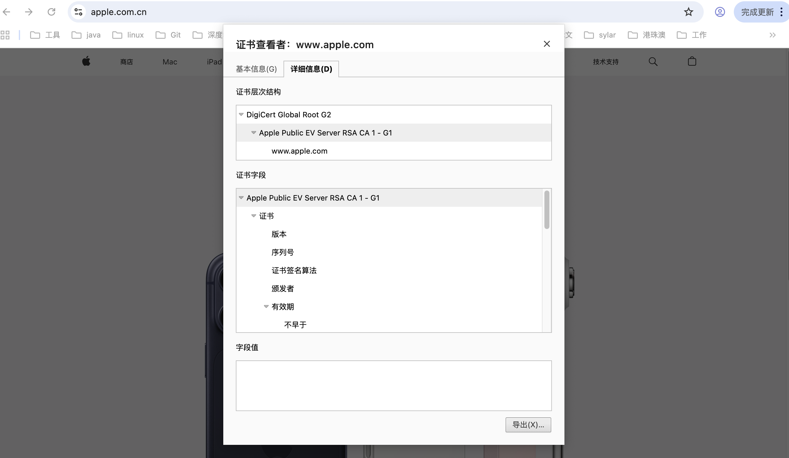

这是网站证书链中的三个层级，它们各自代表了证书颁发过程中的不同角色和作用：

1. DigiCert Global Root G2 (根证书)
    - 身份：根证书颁发机构（Root CA）。

    - 意义：这是信任链的顶端，拥有最高级别的信任。它通常是操作系统、浏览器或设备预装的一组受信任证书。由于它位于最顶层，其安全性直接决定了整个信任链是否可靠。

2. Apple Public EV Server RSA CA 1 - G1 (中间证书)
    身份：中间证书颁发机构（Intermediate CA）。

    - 意义：根证书不会直接给网站颁发证书，而是先颁发给中间证书机构。它的作用是作为根证书和终端实体证书（网站证书）之间的桥梁，负责签发具体的服务器证书。

3. www.apple.com (服务器/终端实体证书)
    - 身份：终端实体证书（End-entity Certificate），也就是实际网站使用的证书。

    - 意义：这是最终提供给访问者验证的证书，证明 www.apple.com 的身份和合法性。它包含了网站的公钥、域名、有效期等信息，并由上一层的 Apple Public EV Server RSA CA 1 - G1 进行签名。


```shell
(base) xmdeiMac:apple xm$ openssl x509 -in "Apple Public EV Server RSA CA 1 - G1.pem" -text -noout
Certificate:
    Data:
        Version: 3 (0x2)
        # X509证书版本号
        # 当前互联网基本都是 V3 证书
        # V3 才支持扩展字段 (Extensions)

        Serial Number:
            04:f2:2e:cc:21:fc:b4:38:2a:c2:8b:8f:2d:64:1f:c0
        # 证书序列号
        # 由 CA 生成，用于唯一标识这张证书
        # 证书吊销 (CRL / OCSP) 时也会用到这个序列号

        Signature Algorithm: sha256WithRSAEncryption
        # 证书签名算法
        # 表示 CA 使用 SHA256 + RSA 对证书进行签名
        # 用来保证证书内容没有被篡改

        Issuer: C=US, O=DigiCert Inc, OU=www.digicert.com, CN=DigiCert Global Root G2
        # 证书签发者
        # 说明这张证书是由 DigiCert Global Root G2 签发的
        # 这说明它是 Root CA 下级证书（中级CA）

        Validity
            Not Before: Apr 29 12:55:34 2020 GMT
            # 证书生效时间

            Not After : Apr 10 23:59:59 2030 GMT
            # 证书过期时间
            # 这个中级证书有效期约10年

        Subject: C=US, O=Apple Inc., CN=Apple Public EV Server RSA CA 1 - G1
        # 证书主体
        # 表示证书属于 Apple 的中级 CA
        # 以后 Apple 网站证书可能就是由这个 CA 签发

        Subject Public Key Info:
            Public Key Algorithm: rsaEncryption
            # 公钥算法类型

                Public-Key: (2048 bit)
                # 公钥长度
                # 2048bit RSA

                Modulus:
                    ...
                # RSA公钥的模数
                # 是公钥的主要数学参数

                Exponent: 65537 (0x10001)
                # RSA公钥指数
                # 65537 是互联网最常见的公钥指数

        X509v3 extensions:
        # 以下为 V3 证书扩展字段
        # TLS / PKI 的很多规则都在这里定义

            X509v3 Subject Key Identifier:
                D3:BD:C1:3C:A0:CF:35:B9:34:C5:D4:DB:DA:10:0E:4C:DE:6A:FE:58
            # 当前证书的唯一标识
            # 用于证书链构建

            X509v3 Authority Key Identifier:
                4E:22:54:20:18:95:E6:E3:6E:E6:0F:FA:FA:B9:12:ED:06:17:8F:39
            # 签发者证书的 Key ID
            # 这里对应 DigiCert Root CA

            X509v3 Key Usage: critical
                Digital Signature, Certificate Sign, CRL Sign
            # 证书用途
            #
            # Digital Signature
            # 用于数字签名
            #
            # Certificate Sign
            # 可以签发其他证书（CA功能）
            #
            # CRL Sign
            # 可以签发证书吊销列表
            #
            # 因为包含 Certificate Sign
            # 所以这是 CA 证书

            X509v3 Extended Key Usage:
                TLS Web Server Authentication, TLS Web Client Authentication
            # 扩展用途
            # 可以用于 TLS 服务器认证
            # 也可以用于 TLS 客户端认证

            X509v3 Basic Constraints: critical
                CA:TRUE, pathlen:0
            # 是否为 CA 证书
            #
            # CA:TRUE
            # 说明这是 CA 证书
            #
            # pathlen:0
            # 表示它不能再签发新的中级 CA
            # 只能签发最终服务器证书

            Authority Information Access:
                OCSP - URI:http://ocsp.digicert.com
            # OCSP 地址
            # 浏览器可以通过 OCSP 查询证书是否被吊销

            X509v3 CRL Distribution Points:
                Full Name:
                  URI:http://crl3.digicert.com/DigiCertGlobalRootG2.crl
            # CRL 吊销列表地址
            # 浏览器可以下载 CRL 查看证书是否被吊销

            X509v3 Certificate Policies:
                Policy: 2.16.840.1.114412.2.1
                  CPS: https://www.digicert.com/CPS
            # CA证书策略
            # CPS = Certification Practice Statement
            # 说明 DigiCert 的证书签发规范

                Policy: 2.23.140.1.1
            # EV证书策略 OID
            # 说明这个 CA 可以签发 EV 证书

    Signature Algorithm: sha256WithRSAEncryption
    # CA 对整个证书数据进行签名使用的算法

    Signature Value:
        ...
    # 证书签名
    # 由 DigiCert Root CA 的私钥生成
    # 浏览器可以使用 Root CA 公钥验证该签名
```

### 2.3 服务器证书

```shell
(base) xmdeiMac:apple xm$ openssl x509 -in "www.apple.com.pem" -text -noout
Certificate:
    Data:
        Version: 3 (0x2)
        # X509证书版本
        # TLS基本都是V3，因为支持扩展字段

        Serial Number:
            0a:22:ac:e4:2f:c7:1f:46:3f:95:3e:f0:b5:a8:3f:0c
        # 证书序列号
        # 由签发CA生成
        # 在证书吊销 (CRL / OCSP) 时用于唯一定位证书

        Signature Algorithm: sha256WithRSAEncryption
        # CA对证书签名使用的算法
        # SHA256哈希 + RSA签名

        Issuer: C=US, O=Apple Inc., CN=Apple Public EV Server RSA CA 1 - G1
        # 证书签发者
        # 表示这张证书是由 Apple 的中级CA签发

        Validity
            Not Before: Feb 11 17:44:10 2026 GMT
            # 证书生效时间

            Not After : Aug 18 17:30:10 2026 GMT
            # 证书过期时间
            # 服务器证书通常只有几个月有效期

        Subject:
            businessCategory=Private Organization,
            jurisdictionC=US,
            jurisdictionST=California,
            serialNumber=C0806592,
            C=US,
            ST=California,
            L=Cupertino,
            O=Apple Inc.,
            CN=www.apple.com
        # 证书主体（证书属于谁）
        #
        # O=Apple Inc.
        # 公司名称
        #
        # CN=www.apple.com
        # 证书绑定的域名
        #
        # L/ST/C
        # 公司地理信息
        #
        # 这些字段说明这是EV证书

        Subject Public Key Info:
            Public Key Algorithm: rsaEncryption
            # 公钥算法

                Public-Key: (2048 bit)
                # 公钥长度

                Modulus:
                    ...
                # RSA公钥模数

                Exponent: 65537 (0x10001)
                # RSA公钥指数

        X509v3 extensions:
        # V3扩展字段

            X509v3 Basic Constraints: critical
                CA:FALSE
            # 关键字段
            # CA:FALSE 表示
            # 这是服务器证书
            # 不能签发其他证书

            X509v3 Authority Key Identifier:
                D3:BD:C1:3C:A0:CF:35:B9:34:C5:D4:DB:DA:10:0E:4C:DE:6A:FE:58
            # 上级CA的Key ID
            # 用来匹配中级CA证书

            Authority Information Access:
                CA Issuers - URI:http://certs.apple.com/apevsrsa1g1.der
                OCSP - URI:http://ocsp.apple.com/ocsp03-apevsrsa1g101
            # CA信息访问地址
            #
            # CA Issuers
            # 下载中级CA证书
            #
            # OCSP
            # 在线查询证书是否吊销

            X509v3 Subject Alternative Name:
                DNS:images.apple.com
                DNS:www.apple.com
                DNS:www.apple.com.cn
            # SAN字段（现代TLS最重要字段）
            #
            # 表示该证书可以用于多个域名
            #
            # 浏览器主要校验这个字段
            # 而不是 CN

            X509v3 Certificate Policies:
                Policy: 2.23.140.1.1
            # EV证书策略OID

            X509v3 Extended Key Usage:
                TLS Web Server Authentication
            # 证书用途
            # 表示该证书可以用于TLS服务器认证

            X509v3 CRL Distribution Points:
                URI:http://crl.apple.com/apevsrsa1g1.crl
            # CRL吊销列表地址

            X509v3 Subject Key Identifier:
                B1:8B:E5:4B:5D:0C:A8:A2:D8:05:AC:45:A8:C9:53:AE:C5:0F:B9:B0
            # 当前证书的唯一Key ID

            X509v3 Key Usage: critical
                Digital Signature, Key Encipherment
            # 证书允许的用途
            #
            # Digital Signature
            # TLS握手签名
            #
            # Key Encipherment
            # 用于加密密钥交换

            1.2.840.113635.100.6.86:
            # Apple自定义OID
            # Apple证书策略

            CT Precertificate SCTs:
            # Certificate Transparency
            # 证书透明度日志
            #
            # 浏览器要求证书必须公开记录在CT日志
            # 用于防止CA偷偷签发证书

                Signed Certificate Timestamp:
                    Log ID ...
                    Timestamp : Feb 11 17:54:11.160 2026 GMT
            # 记录该证书已经被公开记录到CT日志

    Signature Algorithm: sha256WithRSAEncryption
    # CA使用的签名算法

    Signature Value:
        ...
    # 中级CA用自己的私钥对该证书进行签名
```

## 3. tls 版本问题

### 3.1 版本问题梳理


#### 1️⃣ TLS协议由谁实现

TLS协议是由 **TLS库实现的**，例如：

* **OpenSSL**
* **BoringSSL**
* **GnuTLS**
* **LibreSSL**

这些库的源码里实现了：

```
TLS1.0
TLS1.1
TLS1.2
TLS1.3
```

---

#### 2️⃣ 应用程序只负责配置

比如：

* nginx
* curl
* 浏览器

它们只是调用 TLS 库的 API：

```
SSL_CTX_set_min_proto_version()
SSL_CTX_set_max_proto_version()
```

来决定：

```
允许哪些TLS版本
```

例如 nginx：

```
ssl_protocols TLSv1.2 TLSv1.3;
```

---

#### 3️⃣ 实际使用哪个版本

真正使用哪个版本，是 **握手时协商出来的**。

流程：

```
客户端 → ClientHello
        支持 TLS1.2 TLS1.3

服务器 → 从中选一个
        一般选最高版本
```

例如：

```
客户端支持：
TLS1.3 TLS1.2

服务器支持：
TLS1.2

最终结果：
TLS1.2
```

---

#### 4️⃣ 证书不决定 TLS 版本

证书只负责：

```
身份认证
```

与 TLS 版本 **没有直接关系**。

证书只包含：

```
公钥
签名
域名
CA
```

不会写：

```
TLS1.2
TLS1.3
```

#### 5️⃣ 证书 与 tls

证书里确实包含了**公钥算法和签名算法**，比如：

* RSA、ECDSA、Ed25519（公钥算法）
* SHA256withRSA、ECDSAwithSHA384（签名算法）

作用：

1. **身份认证**：保证服务器的公钥是可信的 CA 签发的
2. **握手加密**：TLS 握手里会用证书里的公钥做密钥交换（RSA 或 ECDH）**(这个很重要， 后面握手是展开说明)**

但是：

* **TLS版本不是由证书决定的**
* TLS版本决定了握手流程、支持的加密套件和密钥长度
* 证书只提供算法供 TLS 选择和验证

举例：

```text
证书：RSA 2048位, SHA256
TLS版本：1.2
协商套件：TLS_ECDHE_RSA_WITH_AES_128_GCM_SHA256
```

* TLS1.2可以用证书里的RSA公钥做ECDHE密钥交换
* TLS1.3握手流程改了，但还是用证书里的公钥做签名验证

证书里的算法是**TLS握手的原料**，但**TLS版本由库和协商决定**。


#### 一句话总结

```
TLS版本
= TLS库实现（OpenSSL等）
+ 应用程序配置
+ 握手协商
```

证书 **只负责身份认证，不决定TLS版本**。

### 3.2 tls 版本问题再梳理

| TLS版本   | Cipher Suite                                  | 密钥交换    | 身份认证  | 对称加密     | Hash   | 类型  |
| ------- | --------------------------------------------- | ------- | ----- | -------- | ------ | --- |
| TLS 1.0 | TLS_RSA_WITH_AES_128_CBC_SHA                  | RSA     | RSA   | AES-CBC  | SHA1   | 旧   |
| TLS 1.0 | TLS_RSA_WITH_AES_256_CBC_SHA                  | RSA     | RSA   | AES-CBC  | SHA1   | 旧   |
| TLS 1.0 | TLS_DHE_RSA_WITH_AES_128_CBC_SHA              | DHE     | RSA   | AES-CBC  | SHA1   | 旧   |
| TLS 1.0 | TLS_DHE_RSA_WITH_AES_256_CBC_SHA              | DHE     | RSA   | AES-CBC  | SHA1   | 旧   |
| TLS 1.0 | TLS_ECDHE_RSA_WITH_AES_128_CBC_SHA            | ECDHE   | RSA   | AES-CBC  | SHA1   | 旧   |
| TLS 1.0 | TLS_ECDHE_ECDSA_WITH_AES_128_CBC_SHA          | ECDHE   | ECDSA | AES-CBC  | SHA1   | 旧   |
| TLS 1.0 | TLS_RSA_WITH_CAMELLIA_128_CBC_SHA             | RSA     | RSA   | Camellia | SHA1   | 旧   |
| TLS 1.0 | TLS_RSA_WITH_SEED_CBC_SHA                     | RSA     | RSA   | SEED     | SHA1   | 旧   |
| TLS 1.0 | TLS_ECDHE_RSA_WITH_RC4_128_SHA                | ECDHE   | RSA   | RC4      | SHA1   | ❌废弃 |
| TLS 1.2 | TLS_RSA_WITH_AES_128_SHA256                   | RSA     | RSA   | AES-CBC  | SHA256 | 旧   |
| TLS 1.2 | TLS_RSA_WITH_AES_256_SHA256                   | RSA     | RSA   | AES-CBC  | SHA256 | 旧   |
| TLS 1.2 | TLS_DHE_RSA_WITH_AES_128_GCM_SHA256           | DHE     | RSA   | AES-GCM  | SHA256 | 旧   |
| TLS 1.2 | TLS_ECDHE_RSA_WITH_AES_128_GCM_SHA256         | ECDHE   | RSA   | AES-GCM  | SHA256 | 主流  |
| TLS 1.2 | TLS_ECDHE_ECDSA_WITH_AES_128_GCM_SHA256       | ECDHE   | ECDSA | AES-GCM  | SHA256 | 主流  |
| TLS 1.2 | TLS_ECDHE_RSA_WITH_CHACHA20_POLY1305_SHA256   | ECDHE   | RSA   | ChaCha20 | SHA256 | 主流  |
| TLS 1.2 | TLS_ECDHE_ECDSA_WITH_CHACHA20_POLY1305_SHA256 | ECDHE   | ECDSA | ChaCha20 | SHA256 | 主流  |
| TLS 1.2 | TLS_ECDH_RSA_WITH_AES_128_GCM_SHA256          | ECDH    | RSA   | AES-GCM  | SHA256 | 较少  |
| TLS 1.2 | TLS_ECDH_ECDSA_WITH_AES_128_GCM_SHA256        | ECDH    | ECDSA | AES-GCM  | SHA256 | 较少  |
| TLS 1.3 | TLS_AES_128_GCM_SHA256                        | 内置ECDHE | 证书独立  | AES-GCM  | SHA256 | 推荐  |
| TLS 1.3 | TLS_AES_256_GCM_SHA384                        | 内置ECDHE | 证书独立  | AES-GCM  | SHA384 | 推荐  |
| TLS 1.3 | TLS_CHACHA20_POLY1305_SHA256                  | 内置ECDHE | 证书独立  | ChaCha20 | SHA256 | 推荐  |
| TLS 1.3 | TLS_AES_128_CCM_SHA256                        | 内置ECDHE | 证书独立  | AES-CCM  | SHA256 | 特殊  |
| TLS 1.3 | TLS_AES_128_CCM_8_SHA256                      | 内置ECDHE | 证书独立  | AES-CCM8 | SHA256 | 特殊  |

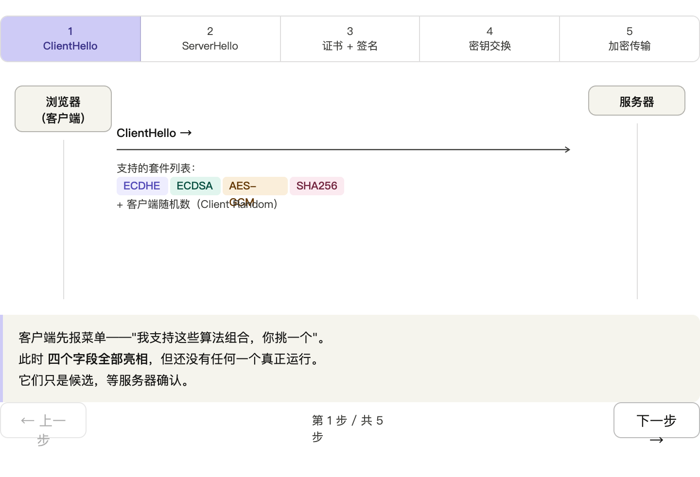
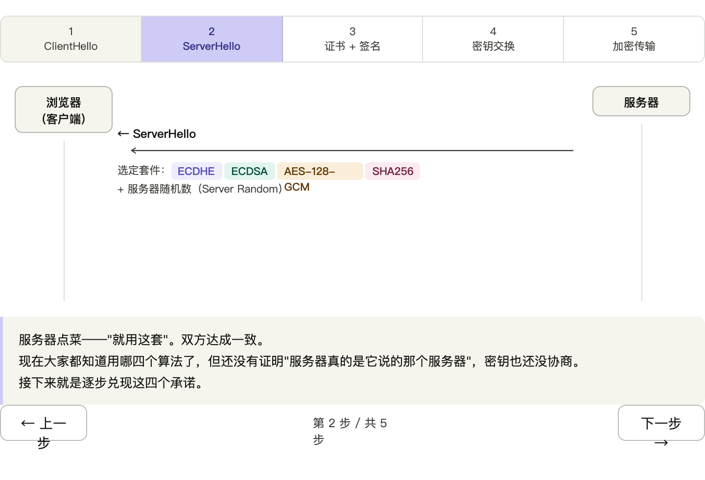
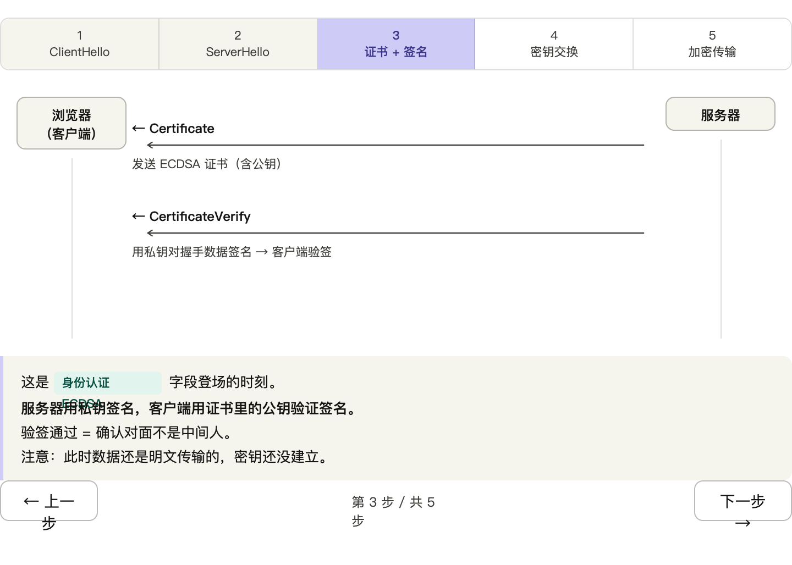
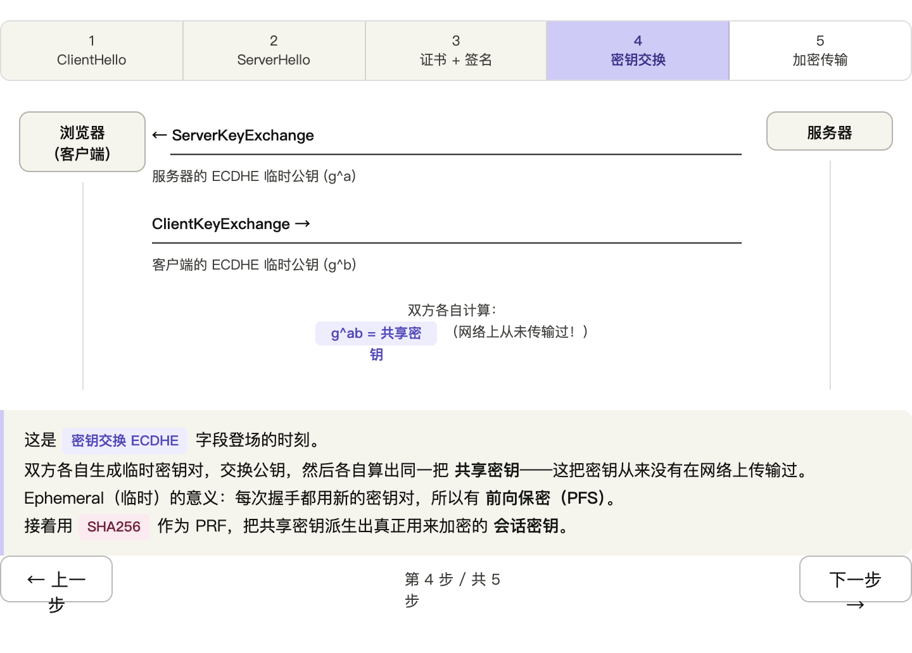
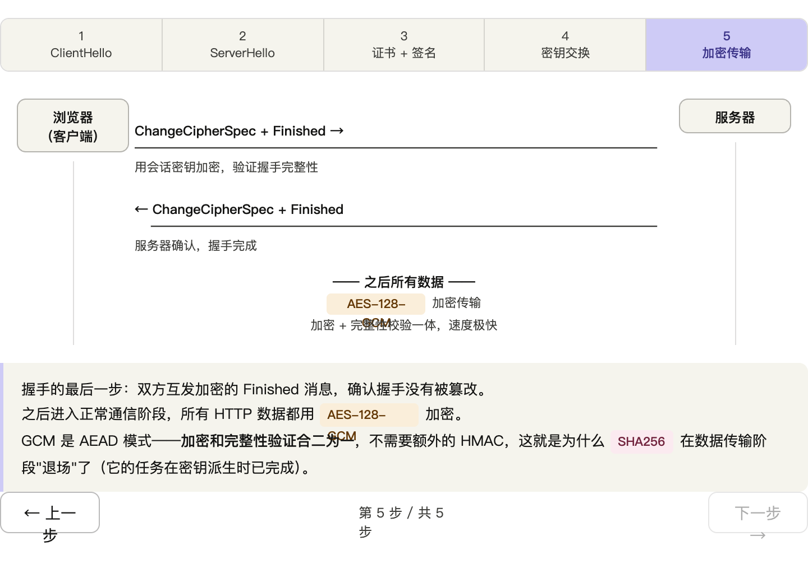


#### 小结逻辑

`TLS_[密钥交换]_[身份认证]_WITH_[加密算法]_[哈希]`

1. **TLS版本**决定握手流程和允许的算法组合
2. **加密套件**决定本次会话使用的具体算法，包括：

   * **密钥交换**：生成对称密钥
   * **认证/签名**：证书验证
   * **对称加密**：保护数据
   * **MAC/AEAD**：保证完整性

3. **证书里的公钥算法**只是加密套件中的**认证部分**，不直接限制TLS版本，但会影响支持哪些套件（比如RSA证书就不能用Ed25519签名套件）

### 3.3 再聊证书与tls版本关系

严格来说，**TLS 加密套件和证书不是一一绑定的**，但它们有一定的“约束关系”，所以不能完全说“没有关系”。

---

#### 🔹 1️⃣ TLS 套件里包含的东西

一个 TLS 加密套件（Cipher Suite）通常包含三类算法：

1. **密钥交换算法**（Key Exchange）

   * 决定双方如何生成共享对称密钥
   * 例：RSA、ECDHE、DHE、PSK 等

2. **对称加密算法**（Bulk Encryption）

   * 用来加密通信内容
   * 例：AES-GCM、ChaCha20

3. **消息认证算法 / 哈希算法**（MAC/Hash）

   * 用来校验消息完整性
   * 例：SHA256、SHA384

---

#### 🔹 2️⃣ 证书的作用

证书主要提供两件事：

1. **身份认证**：保证你连接的服务端是真正的 Apple / Google 等

   * 通过证书签名算法 + CA 验证
2. **密钥用途**：证书里公钥能用于密钥交换或签名验证

> 所以证书本身不决定你选 AES 还是 ChaCha20，但它限制了你能用哪种密钥交换算法。

---

#### 🔹 3️⃣ 关键点：套件和证书的关系

* 如果证书是 **RSA** 公钥：

  * 可以做 **RSA 密钥交换**
  * 可以做 **RSA 签名验证**（ECDHE-RSA）
* 如果证书是 **ECDSA** 公钥：

  * 不能做 RSA 密钥交换
  * 只能做 **ECDHE-ECDSA** 或 ECDSA 签名验证

换句话说：

| 证书类型  | 支持的密钥交换        | 举例套件                                                                   |
| ----- | -------------- | ---------------------------------------------------------------------- |
| RSA   | RSA, ECDHE-RSA | TLS_RSA_WITH_AES_256_GCM_SHA384, TLS_ECDHE_RSA_WITH_AES_128_GCM_SHA256 |
| ECDSA | ECDHE-ECDSA    | TLS_ECDHE_ECDSA_WITH_AES_128_GCM_SHA256                                |

> 所以**套件选择先由客户端发起，协商可用套件，证书类型决定哪些套件可用**。

总结一句话：

> “证书不决定加密算法，但会限制密钥交换算法，所以间接影响可用的 TLS 套件。”


## 3. tls 握手

### TLS 握手概览

TLS 握手是客户端和服务器在正式传输数据前建立安全连接的过程，核心目的有三：**身份认证、协商加密算法、交换密钥**。

---

#### TLS 1.2 握手（2-RTT）

经典的四步握手：---


#### 四个阶段详解

**① ClientHello**：客户端发出"打招呼"，带上自己支持的 TLS 版本（如 1.2/1.3）、密码套件列表（如 `TLS_ECDHE_RSA_WITH_AES_256_GCM_SHA384`）和一个随机数 `client_random`。

**② ServerHello + Certificate**：服务器从中选定一套算法，回送自己的随机数 `server_random`，并附上 X.509 证书（含公钥）。客户端此时验证证书链是否可信（CA 签名 → 根证书）。

**③ ClientKeyExchange + ChangeCipherSpec**：客户端生成"预主密钥"（Pre-Master Secret），用服务器公钥加密后发送。双方各自用 `client_random + server_random + pre_master_secret` 推导出**会话密钥**，然后发 `ChangeCipherSpec` 宣告"切换加密"。

**④ Finished**：双方互发 `Finished` 消息（用会话密钥加密的握手摘要），互相验证密钥协商正确性。之后所有数据用对称加密（通常 AES-GCM）传输。

---

#### TLS 1.3 的改进

TLS 1.3 把这套流程压缩到 **1-RTT**（甚至 0-RTT 复用），主要变化：

- **强制 ECDHE**：去掉了 RSA 密钥交换，Key Share 在 ClientHello 里就带上，服务器一轮回复即完成密钥协商
- **加密前移**：Certificate 和 Finished 也被加密，更早保护握手本身
- **裁剪密码套件**：删掉所有不支持前向保密的算法
- **0-RTT**：复用之前 session 的 PSK，可以在第一个包里就带上应用数据（但有重放风险）

---

#### 密钥派生的核心逻辑

握手中用 `client_random + server_random + pre_master_secret` 经 PRF（伪随机函数）派生出多条密钥：

- `client_write_key` / `server_write_key`：对称加密密钥
- `client_write_IV` / `server_write_IV`：初始化向量

两边随机数保证了即使 Pre-Master Secret 被截获，没有随机数也无法还原会话密钥，这就是为什么需要两个随机数。


### 举例

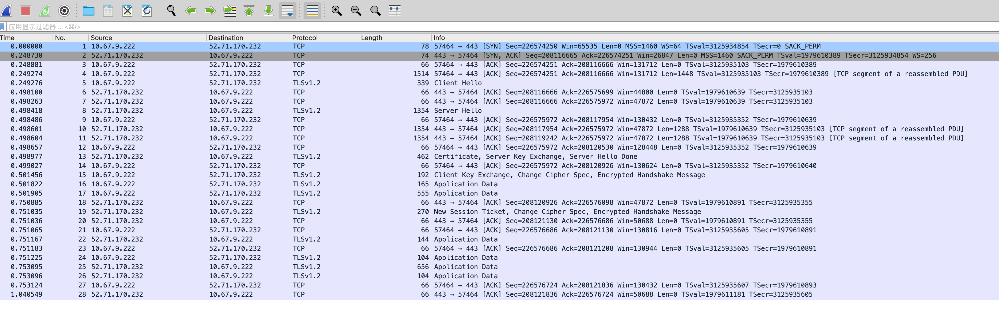


#### 基本信息

| 字段 | 值 |
|---|---|
| 协议版本 | TLS 1.2（协商结果） |
| 客户端 | 10.67.9.222:57464 |
| 服务器 | 52.71.170.232:443 |
| 目标域名（SNI） | `httpbin.org` |
| 协商协议（ALPN） | h2（HTTP/2） |

---

#### 握手各步详情

**ClientHello（pkt#186+187，分两个 TCP 段传输）**
客户端提供了 16 个密码套件，包含 TLS 1.3 的套件（`0x1301/1302/1303`）和 TLS 1.2 兼容套件。还有一个 `0xfafa` 的 GREASE 值（用于探测服务器对未知值的容忍度）。Session ID 非零，说明客户端尝试复用之前的 session，但最终走了全握手。

**ServerHello（pkt#208）**
服务器选定 `TLS_ECDHE_RSA_WITH_AES_128_GCM_SHA256`，没有选 TLS 1.3 套件，说明此服务器只支持到 TLS 1.2。服务器也回了一个新的 Session ID，并在扩展里确认了 ALPN=h2。

**Certificate（pkt#208，随 ServerHello 同帧）**
发送了 3 张证书，总大小 3779 bytes：
- Cert #1：1483 bytes（终端实体证书，httpbin.org）
- Cert #2：1122 bytes（中间 CA）
- Cert #3：1174 bytes（根或中间 CA）

**ServerKeyExchange（pkt#210+211）**
由于选择的是 ECDHE（而非静态 RSA），服务器必须额外发送临时 ECDH 公钥：
- 曲线：`secp256r1 (P-256)`
- 临时公钥：65 bytes（非压缩点格式）
- 签名算法：`rsa_pkcs1_sha256`，签名长度 256 bytes（RSA-2048）

这一步确保了**前向保密（Forward Secrecy）**——即使服务器私钥日后泄露，过去的会话也无法被解密。

**ClientKeyExchange（pkt#215）**
客户端也生成了一个临时 ECDH 密钥对，发送公钥（65 bytes）。双方各持对方公钥，通过 ECDH 算法独立推导出相同的 `PreMasterSecret`，再用两个 `random` 推导出会话密钥。

**NewSessionTicket（pkt#220）**
服务器颁发了 138 bytes 的 session ticket，有效期 16 小时，下次连接可用它跳过全握手（1-RTT 恢复）。

---

#### 密钥派生路径

```
client_random ──┐
server_random ──┤──▶ PRF ──▶ MasterSecret ──▶ client_write_key / server_write_key
ECDH共享密钥 ──┘                                (AES-128-GCM)
```

---

#### 握手结束后的应用数据

共 6 个 AppData 记录，全部用 AES-128-GCM 加密，内容不可见，应该是 HTTP/2 的 SETTINGS 帧和实际请求/响应。

### client hello 说明

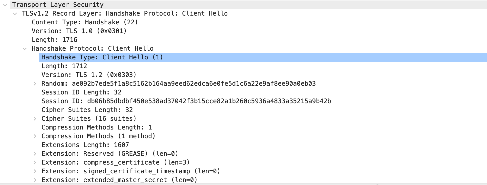


完整解析出来了！这个 Client Hello 非常典型，信息量很丰富。我来帮你系统地讲解：非常好，我来给你详细讲解这个 Client Hello 包！好，你这个包抓得非常典型，是一个 **Chrome 浏览器发出的 TLS 1.3 Client Hello**，连接目标是 `httpbin.org:443`。下面我来讲几个重点：

---

#### 🔑 最重要的概念：Client Hello 是"自我介绍"

Client Hello 是 TLS 握手的第一条消息，客户端用它告诉服务端："我支持这些能力，我们来挑一个都支持的来用"。协商的核心有三件事：**协议版本、加密套件、密钥交换方式**。

---

#### 重点 1：版本字段是个"历史遗留骗局"

你会看到 Client Hello 里写着 `version = 0x0303`（TLS 1.2），但这个包实际上是在协商 TLS 1.3。为什么？因为 TLS 1.3 设计时发现，很多旧的中间设备（防火墙、代理）看到不认识的版本号就会直接丢包。所以 TLS 1.3 规定：**握手消息里的版本号永远填 TLS 1.2**，真实版本通过 `supported_versions` 扩展来传递。这种设计叫做 middlebox compatibility mode。

---

#### 重点 2：SNI 是明文的！

`server_name` 扩展里有 `"httpbin.org"` 这个域名，任何人抓包都能看到你在访问哪个域名，即使 HTTPS 加密了内容本身。这就是为什么有 ESNI / ECH（Encrypted Client Hello）这个新技术的原因——它把整个 Client Hello 都加密了。

---

#### 重点 3：GREASE 说明这是 Chrome

包里有 `0xAAAA`、`0xFAFA`、`0xBABA` 这些奇怪的值，这是 Google 专门设计的机制叫 **GREASE**（Generate Random Extensions And Sustain Extensibility）。目的是故意塞入随机的"假"值，逼迫服务端和中间设备正确处理它们不认识的值，防止 TLS 生态系统僵化（有些实现看到不认识的就报错）。

---

#### 重点 4：key_share 是 TLS 1.3 的核心优化

这个包里有 1263 字节的 `key_share`，客户端直接在 Client Hello 里就把 x25519 的公钥发出去了。这样服务端收到后可以立刻计算出共享密钥，握手只需要 **1 个 RTT**（TLS 1.2 需要 2 个 RTT）。如果有会话恢复，还能实现 0-RTT。

---

#### 重点 5：TCP 分片

你的包 Client Hello 数据有 1721 字节，但第 4 个包只有 1448 字节，剩下的在第 5 个包里。这是正常的 **TCP MSS 分片**，TLS 不感知这些，它只管拼完整再处理。

#### 重点 6：session_ticket

`Extension: session_ticket (len=0)` 表示在 TLS ClientHello 中，客户端告诉服务器它支持 **Session Ticket 会话恢复机制**。这个机制允许客户端在后续连接中使用服务器发放的“票据”来跳过完整握手，从而加快 TLS 建立速度。`len=0` 表明客户端目前 **没有已有票据**，只是声明支持这种机制，服务器收到后可以选择返回一个新的 session ticket 以便下次快速恢复会话。

### server hello 说明

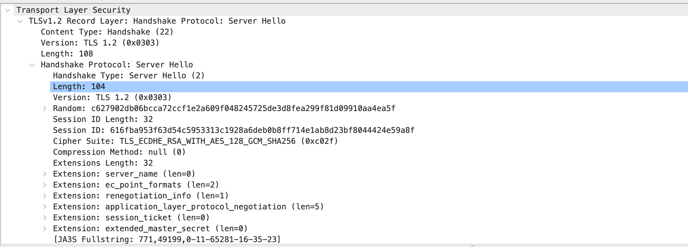

| 字段 / 扩展                                           | 值 / 长度                                         | 含义 / 作用                              |
| ------------------------------------------------- | ---------------------------------------------- | ------------------------------------ |
| **Content Type**                                  | 22 (Handshake)                                 | TLS 记录层类型，表示这是握手消息                   |
| **Version**                                       | TLS 1.2 (0x0303)                               | 协议版本                                 |
| **Record Length**                                 | 108                                            | TLS Record 层长度                       |
| **Handshake Type**                                | Server Hello (2)                               | 握手消息类型                               |
| **Handshake Length**                              | 104                                            | Server Hello 消息长度                    |
| **Random**                                        | c627902db06b... (32 bytes)                     | 随机数，用于生成对称密钥                         |
| **Session ID Length**                             | 32                                             | Session ID 长度                        |
| **Session ID**                                    | 616fba953f63...                                | 用于会话恢复（服务器状态模式）                      |
| **Cipher Suite**                                  | TLS_ECDHE_RSA_WITH_AES_128_GCM_SHA256 (0xc02f) | 选择的加密套件                              |
| **Compression Method**                            | null (0)                                       | 压缩方式，0表示无压缩                          |
| **Extensions Length**                             | 32                                             | 扩展总长度                                |
| **server_name**                                   | len=0                                          | 响应客户端 SNI，匹配域名                       |
| **ec_point_formats**                              | len=2                                          | 椭圆曲线点格式（如 uncompressed）              |
| **renegotiation_info**                            | len=1                                          | 安全重协商信息                              |
| **application_layer_protocol_negotiation (ALPN)** | len=5                                          | 服务器选定的应用协议（HTTP/2、HTTP/1.1）          |
| **session_ticket**                                | len=0                                          | 声明支持 Session Ticket，会话恢复机制           |
| **extended_master_secret**                        | len=0                                          | 增强主密钥安全性，防止中间人攻击                     |
| **JA3 Fullstring**                                | 771,49199,0-11-65281-16-35-23                  | 所有 cipher suites、extensions 等组合，用于指纹 |
| **JA3 Hash**                                      | bfc90d56141386ee83b56cda231cccfc               | JA3 指纹值                              |

### Certificate, Server Key Exchange, Server Hello Done 说明

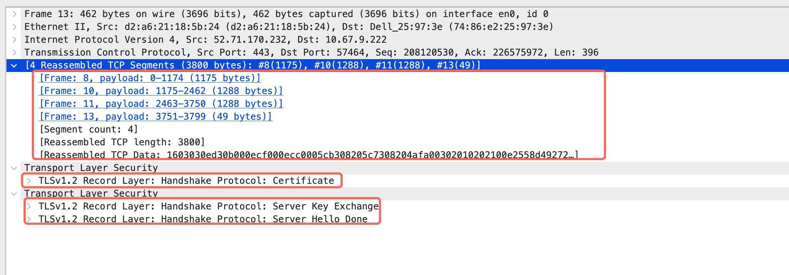


我帮你把你的回答整理成条理清晰的版本，保持原意，但更容易理解：

---

#### TLS 握手消息与帧的关系说明

在抓包中看到：

```
TLSv1.2 Record Layer: Handshake Protocol: Server Hello
TLSv1.2 Record Layer: Handshake Protocol: Certificate
TLSv1.2 Record Layer: Handshake Protocol: Server Key Exchange
TLSv1.2 Record Layer: Handshake Protocol: Server Hello Done
```

这些消息的关系和帧号的关联可以这样理解：

#### 1. 协议顺序（Server → Client）

1. **Server Hello**

   * 服务端确认协商结果（TLS版本、加密套件、ALPN等）。

2. **Certificate**

   * 服务端发送证书链，证明身份。
   * 体积通常很大。

3. **Server Key Exchange**

   * 发送密钥交换参数（如 ECDHE 参数 + RSA 签名）。

4. **Server Hello Done**

   * 表示服务端的握手参数已全部发送，轮到客户端响应。

#### 2. 为什么会和帧 8 关联

* **帧 8 不仅包含 Server Hello**

  * TCP 分段可能把 Certificate 消息的开头也“顺带”装在帧 8 里。
* **Certificate 跨帧**

  * 因为证书体积大，可能跨越帧 8、10、11、13 才完整。
* **Wireshark 解析**

  * 在解析帧 13 的 Certificate 时，会回溯到帧 8 进行重组。

#### 3. 核心总结

> 这是 4 条 TLS 握手消息的标准顺序；“扯上帧 8”只是 TCP 分段导致的重组现象，不影响协议逻辑。


**协议逻辑上**

TLS 握手的 **Server 阶段顺序**就是这四条消息：

1. **Server Hello** → 确认 TLS 版本、加密套件等
2. **Certificate** → 发送证书链
3. **Server Key Exchange** → 发送密钥交换参数（如果需要，如 ECDHE）
4. **Server Hello Done** → 表示服务端握手信息发送完成

逻辑上客户端需要按这个顺序接收和处理消息。

---

**TCP 层行为**

* TCP 是**流式协议**，没有消息边界。
* 服务器通常会“尽量快地写入”这四条消息到套接字，但操作系统和网络会根据 **MTU、拥塞控制、缓冲区** 自动分段。
* 因此，在抓包里，这四条消息可能：

  * **全都在一帧**（小数据、缓冲区未满）
  * **跨多帧**（尤其是 Certificate 很大时）
* Wireshark 会看到像你之前说的，Certificate 跨了好几帧，但这只是 TCP 分段，不影响 TLS 逻辑。

### Certificate 说明

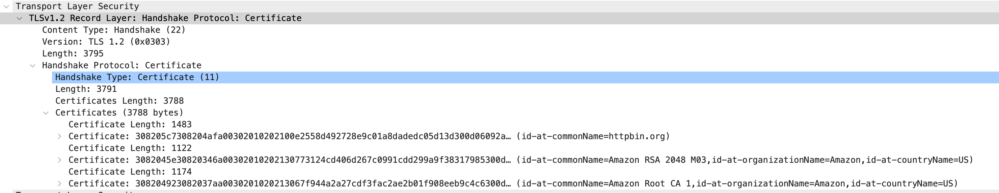


看了你的抓包截图，这是 **TLSv1.2 的 Certificate 消息**，我帮你分析一下关键点：

---

#### 1️⃣ Certificate 消息结构

* **Handshake Type:** `Certificate (11)` → 表示这是证书消息
* **Length:** 3791 bytes → 这条 TLS 消息整体长度
* **Certificates Length:** 3788 bytes → 所有证书总长度

> 注意：TLS Record Layer 的长度比 Handshake Protocol 的长度略大（记录头占 4 字节左右）。

---

#### 2️⃣ 证书链（Certificates）

服务器一般不发送根证书，客户端需要从其他来源获取。有些服务器/证书提供商会把根证书也打包到链里，确保某些旧客户端也能验证。

截图里显示了 3 个证书，每个证书的长度和信息：

1. **服务器证书**

   * Length: 1483
   * Common Name (CN): `httpbin.org`

2. **中间证书**

   * Length: 1122
   * CN: `Amazon RSA 2048 M03`
   * Organization: `Amazon`
   * Country: `US`

3. **根证书**

   * Length: 1174
   * CN: `Amazon Root CA 1`
   * Organization: `Amazon`
   * Country: `US`

> 证书链顺序是 **服务器证书 → 中间证书 → 根证书**，客户端验证时会沿着这个顺序构建信任链。

---

#### 3️⃣ 为什么 Certificate 会跨多帧

* 证书总长度 3788 bytes，超过典型的 **TCP MSS (约 1460 字节)**
* 所以抓包里 Wireshark 会显示 **Certificate 分布在多帧（例如帧 8、10、11、13）**
* Wireshark 会自动 **TCP 重组**，显示为一条完整的 Certificate 消息

### Server Key Exchange 说明

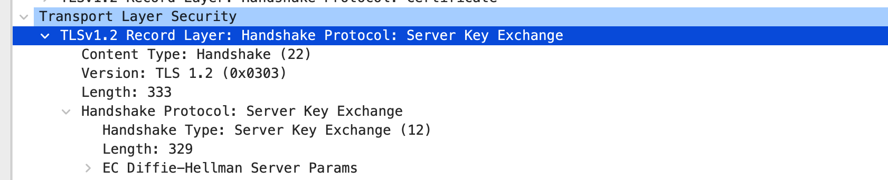

| 公钥类型                  | 出现位置                                      | 传输消息            | 主要用途      |
| --------------------- | ----------------------------------------- | --------------- | --------- |
| **证书公钥（RSA / ECDSA）** | Certificate                               | Server → Client | 身份认证、验证签名 |
| **临时密钥交换公钥（ECDHE）**   | Server Key Exchange / Client Key Exchange | 双方交换            | 生成会话密钥    |

在 **Transport Layer Security 1.2** 的握手过程中，**Server Key Exchange** 是服务器发送的一条握手消息，用来提供 **密钥交换所需的参数和服务器的临时公钥**。这些信息用于后续和客户端一起计算会话密钥，从而建立安全通信。

需要注意的是，**Server Key Exchange 并不是所有 TLS 握手都会出现**。只有在所选的密钥交换算法需要额外参数时才会发送。例如使用 **ECDHE 或 DHE** 时，服务器需要发送临时密钥交换参数，因此会出现 `Server Key Exchange`。而如果使用 **RSA 密钥交换**，客户端可以直接使用证书中的公钥完成密钥交换，这个阶段就不会出现。

在使用 **ECDHE** 的情况下，`Server Key Exchange` 通常包含两部分内容：一是服务器生成的 **临时 ECDHE 公钥及相关参数**，用于参与会话密钥计算；二是服务器对这些参数进行的 **数字签名**。这个签名使用服务器证书对应的私钥生成，客户端收到后会用证书中的公钥进行验证，从而确认这些密钥交换参数确实来自服务器，而不是被中间人伪造或篡改。

### Server Hello Done 说明

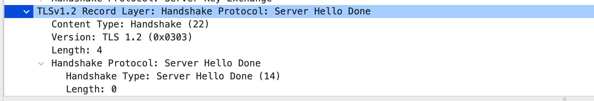


在 TLS 1.2 中，服务器通常会连续发送几条握手消息，例如 `Server Hello`、`Certificate`、`Server Key Exchange`（如果需要）、`Certificate Request`（可选）等。当这些服务器端需要发送的消息全部发送完成后，就会发送 **Server Hello Done** 作为一个 **结束标志**。收到这个消息后，客户端就知道服务器阶段结束，可以开始发送自己的消息，例如 `Client Key Exchange`、`Change Cipher Spec` 和 `Finished`。

从结构上看，`Server Hello Done` 非常简单，它 **没有任何实际数据内容**。抓包里可以看到 `Length: 0`，说明这个握手消息只是一个信号或标记，用来表示服务器端握手阶段结束，因此整个 TLS Record 的长度也只有很少的几个字节。

简单理解的话，可以把它看成握手过程中的一句话：

> **“服务器这边的信息已经发完了，现在轮到客户端继续。”**

### Client Key Exchange, Change Cipher Spec, Encrypted Handshake Message

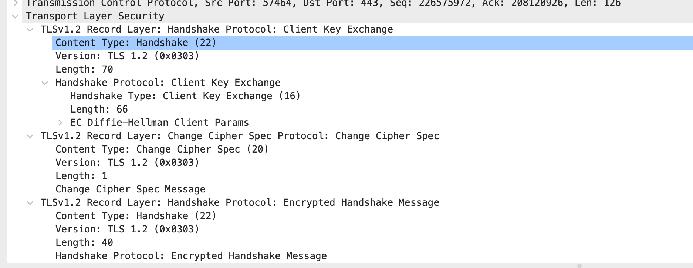

这一帧其实是客户端在 **Transport Layer Security 1.2** 握手后半段一次性发送的三条关键消息。可以理解为：**客户端完成密钥交换，并开始启用加密通信。**

首先是 **Client Key Exchange**。在你这个抓包中使用的是 **ECDHE 密钥交换**，因此客户端会发送自己的 **临时 ECDHE 公钥（EC Diffie-Hellman Client Params）**。服务器之前已经在 `Server Key Exchange` 中发送了自己的临时公钥，客户端现在把自己的临时公钥发给服务器。这样双方就拥有了对方的公钥和自己的私钥，可以通过 ECDHE 算法计算出同一个 **共享密钥（pre-master secret）**，随后再派生出真正的会话密钥。

接下来是 **Change Cipher Spec**。这条消息非常短（只有 1 字节），它的作用是告诉服务器：**从下一条消息开始，我将使用刚刚协商好的会话密钥进行加密通信。** 也就是说，TLS 从这一刻开始正式进入加密状态。

最后一条是 **Encrypted Handshake Message**。这实际上是客户端的 **Finished** 消息，但因为此时已经启用了加密，所以在抓包中只能看到“Encrypted Handshake Message”。这个消息包含对之前所有握手数据的校验值（verify_data），服务器解密并验证成功后，就能确认整个握手过程没有被篡改。

简单理解这一帧的含义就是：

* **Client Key Exchange**：客户端发送自己的临时公钥
* **Change Cipher Spec**：通知服务器开始使用加密
* **Finished（加密）**：验证整个握手过程正确

因此这一帧其实标志着 **客户端侧握手基本完成，连接即将进入正式的加密通信阶段**。


### New Session Ticket, Change Cipher Spec, Encrypted Handshake Message

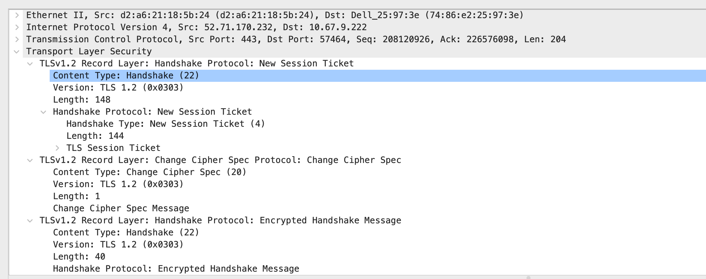

这一帧是服务器在 **Transport Layer Security 1.2** 握手最后阶段发送的消息，说明服务器完成握手并准备进入加密通信。里面主要包含三部分内容。

首先是 **New Session Ticket**。这是服务器发送给客户端的一种 **会话恢复机制**。服务器会生成一个 **Session Ticket** 并发给客户端，客户端可以把它保存下来。以后再次连接同一服务器时，客户端可以带上这个 Ticket，这样双方就可以跳过大部分握手步骤，直接恢复之前的会话密钥或快速生成新的会话，从而减少握手延迟。

接下来是 **Change Cipher Spec**。这条消息表示服务器也将开始使用刚刚协商好的会话密钥进行加密通信。从这一刻开始，服务器发出的后续 TLS 消息都会被加密。

最后是 **Encrypted Handshake Message**。这实际上是服务器的 **Finished** 消息，只不过因为已经启用了加密，所以在抓包中只能看到“Encrypted”。这个消息包含对整个握手过程的校验值，客户端解密并验证成功后，就说明双方对握手数据的理解一致，TLS 握手正式完成。

简单来说，这一帧代表三个步骤：

* **New Session Ticket**：给客户端一个会话恢复凭据
* **Change Cipher Spec**：服务器开始启用加密
* **Finished（加密）**：验证握手并结束 TLS 握手流程

当客户端验证完服务器的 `Finished` 后，TLS 连接就建立完成，之后的 **HTTP 数据都会在 TLS Record 中加密传输**。

重点步骤：

1️⃣ **Client Key Exchange**：客户端发送自己的临时公钥，用来和服务器一起计算会话密钥。

2️⃣ **Change Cipher Spec**：通知对方，从下一条消息开始将使用协商好的会话密钥进行加密通信。

3️⃣ **Finished（Encrypted Handshake Message）**：验证整个握手过程是否一致，如果验证成功，TLS 握手完成。

4️⃣ **New Session Ticket**：服务器提供一个会话恢复凭据，方便客户端下次连接时快速恢复 TLS 会话。


## 4. 举例说明一下 ECDHE 密钥交换（椭圆曲线）

### 概览

用 TLS 1.2 + ECDHE-RSA-AES128-GCM-SHA256 这个最典型的套件，把每一步的**具体数据和算法**都拆开看。

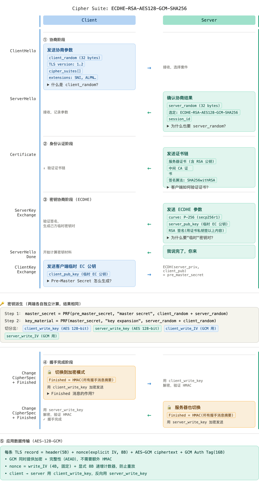


---

**为什么握手要 2-RTT？**

- 第一个 RTT：ClientHello → ServerHello + Certificate + ServerKeyExchange + Done
- 第二个 RTT：ClientKeyExchange + ChangeCipherSpec + Finished → Server Finished

数据传输在第二个 RTT 完成之后才开始，这也是 TLS 1.3 优化的核心目标（压到 1-RTT）。

---

**RSA 在这套 Cipher Suite 里干了什么？**

很多人误以为 ECDHE-RSA 里 RSA 负责加密密钥，其实不是。RSA 在这里只负责**签名**：服务器用证书里的 RSA 私钥，对 ServerKeyExchange 消息（包含 ECDHE 参数）签名，客户端用证书公钥验签。密钥协商全程由 ECDHE 完成，RSA 只是用来证明"这个 ECDHE 公钥是真服务器发的"。

---

**Pre-Master Secret 是怎么变成四把密钥的？**

PRF（伪随机函数，底层是 HMAC-SHA256）被调用两次：

1. `pre_master_secret` + 两个 random → `master_secret`（48 字节）
2. `master_secret` + 两个 random（顺序对调！）→ `key_material`（切出 4 段）

切出来的四段：client_write_key / server_write_key / client_write_IV / server_write_IV，两个方向各用各的密钥，所以抓包也看不出任何对称性。

---

### 共享秘钥问题

你看到的这个公式：

**共享密钥 S = a·B = b·A**

其实是在描述 **Diffie–Hellman Key Exchange** 的核心原理。我们一步一步拆开看，就很好理解了。

---

#### 1 参与者

假设有两个人：

* Alice
* Bob

他们要在不安全网络上协商一个 **共同的密钥 S**。

---

#### 2 公共参数

双方先约定一个公共参数：

* 椭圆曲线上的 **基点 G**

（在 **Elliptic Curve Diffie–Hellman** 里就是曲线上的点）

---

#### 3 各自生成私钥

双方各自生成一个 **私钥**：

Alice 生成：

```
a
```

Bob 生成：

```
b
```

这两个 **绝对不会发送出去**。

---

#### 4 计算各自的公钥

然后各自计算 **公钥**：

Alice：

```
A = a·G
```

Bob：

```
B = b·G
```

这里的 `·` 不是普通乘法，而是 **椭圆曲线点乘**。

---

#### 5 交换公钥

网络上传输的是：

```
Alice → Bob : A
Bob   → Alice : B
```

攻击者也能看到 A 和 B。

---

#### 6 计算共享密钥

Alice 计算：

```
S = a·B
```

Bob 计算：

```
S = b·A
```

---

#### 7 为什么两边会相等？

因为：

```
B = b·G
```

代入：

```
a·B = a·(b·G)
```

而椭圆曲线乘法满足：

```
a·(b·G) = (a·b)·G
```

同理：

```
b·A = b·(a·G)
     = (b·a)·G
```

而：

```
a·b = b·a
```

所以

```
a·B = b·A
```

最终得到同一个点：

```
S = (ab)·G
```

---

#### 8 攻击者为什么算不出来？

攻击者只知道：

```
G
A = a·G
B = b·G
```

但要算出 `a` 或 `b`，需要解决：

**Elliptic Curve Discrete Logarithm Problem**

这是目前计算上不可行的问题。

---

#### 9 用一句话理解

**双方交换公钥，但各自用自己的私钥再算一次，所以得到同一个共享密钥。**


### 再看Server Key Exchange

```shell

Transport Layer Security

 ▸ TLSv1.2 Record Layer: Handshake Protocol: Server Key Exchange  
  Content Type: Handshake (22)  
  Version: TLS 1.2 (0x0303)  
  Length: 333  

 ▸ Handshake Protocol: Server Key Exchange  
  Handshake Type: Server Key Exchange (12)  
  Length: 329  

  ▸ EC Diffie-Hellman Server Params  
   Curve Type: named_curve (0x03)  
   Named Curve: secp256r1 (0x0017)  
   Pubkey Length: 65  
   Pubkey: 042cb0d5b785cdfe05b3bf5e6cc05d255ad2a3f8ac1f1bdd20b8d105553fc6dc19ad237d...  
   Signature Algorithm: rsa_pkcs1_sha256 (0x0401)  
   Signature Length: 256  
   Signature: 37756a91c34ad455f10e6ed7990cb5e50c36ea010408473326865999b333133712fce33...
```

| 抓包字段                | 示例值                      | 含义            | 在 ECDHE 中的作用            |
| ------------------- | ------------------------ | ------------- | ----------------------- |
| Content Type        | Handshake (22)           | TLS Record 类型 | 表示这是 TLS 握手数据           |
| Version             | TLS 1.2 (0x0303)         | TLS 协议版本      | 当前握手使用 TLS1.2           |
| Length              | 333                      | Record 长度     | 整个 TLS record 的长度       |
| Handshake Type      | Server Key Exchange (12) | 握手消息类型        | 服务器发送密钥协商参数             |
| Length              | 329                      | Handshake 长度  | ServerKeyExchange 消息体大小 |
| Curve Type          | named_curve (0x03)       | 曲线类型          | 使用标准命名曲线                |
| Named Curve         | secp256r1 (0x0017)       | 椭圆曲线          | ECDHE 使用的曲线（P-256）      |
| Pubkey Length       | 65                       | 公钥长度          | EC 公钥长度                 |
| Pubkey              | 04 2c b0 d5…             | 服务器临时 EC 公钥   | **B = b·G**             |
| Signature Algorithm | rsa_pkcs1_sha256         | 签名算法          | 服务器用证书 RSA 私钥签名         |
| Signature Length    | 256                      | 签名长度          | RSA-2048 签名大小           |
| Signature           | 37 75 6a 91…             | 数字签名          | 客户端用证书公钥验证              |


| 步骤                | 抓包体现              |
| ----------------- | ----------------- |
| 服务器生成临时私钥 `b`     | 抓包看不到             |
| 计算临时公钥 `B = b·G`  | `Pubkey`          |
| 告诉客户端曲线参数         | `Named Curve`     |
| 用证书 RSA 私钥签名      | `Signature`       |
| 客户端验证签名           | 本地验证              |
| 客户端生成 `a` 并发送 `A` | ClientKeyExchange |
| 双方计算共享密钥          | `S = a·B = b·A`   |

| 内容             | 对应字段        |
| -------------- | ----------- |
| 告诉客户端用哪条椭圆曲线   | Named Curve |
| 发送服务器临时公钥 B    | Pubkey      |
| 用证书私钥证明这是服务器发的 | Signature   |

**在 ECDHE 中，G 不是临时生成的，而是椭圆曲线（如 secp256r1）的标准固定参数；当选定某条曲线后，其对应的 G 就已经确定，在 Server Key Exchange 中作为曲线参数被引用，用来配合服务器生成的临时公钥完成密钥交换。**

### 再看Client Key Exchange

```shell
Transport Layer Security  

• TLSv1.2 Record Layer: Handshake Protocol: Client Key Exchange  

  • Content Type: Handshake (22)  

  • Version: TLS 1.2 (0x0303)  

  • Length: 70  

• Handshake Protocol: Client Key Exchange  

  • Handshake Type: Client Key Exchange (16)  

  • Length: 66  

  • EC Diffie-Hellman Client Params  

    ◦ Pubkey Length: 65  

    ◦ Pubkey: 04a8666b50eadfb8650b35dd1bf55e86a7d46fa49af3f0e98ab809f4b8060a08bf4b2d5...  

```

| 层级                              | 字段                                       | 含义              | 数学对应（ECDHE模型） | 是否秘密 |
| ------------------------------- | ---------------------------------------- | --------------- | ------------- | ---- |
| TLS Record Layer                | Content Type: Handshake (22)             | 表示这是握手消息        | -             | -    |
| TLS Record Layer                | Version: TLS 1.2 (0x0303)                | TLS协议版本         | -             | -    |
| TLS Record Layer                | Length: 70                               | 整个记录长度          | -             | -    |
| Handshake Protocol              | Handshake Type: Client Key Exchange (16) | 客户端密钥交换消息       | -             | -    |
| Handshake Protocol              | Length: 66                               | 握手消息长度          | -             | -    |
| EC Diffie-Hellman Client Params | Pubkey Length: 65                        | 客户端公钥长度（未压缩点）   | A = a·G 的长度   | -    |
| EC Diffie-Hellman Client Params | Pubkey: 04a8666b...                      | 客户端椭圆曲线公钥点（x,y） | **A = a·G**   | ❌ 公开 |


在 ECDHE 中，客户端和服务器分别选择随机私钥 a 和 b，并通过椭圆曲线基点 G 计算出各自的公钥：客户端生成 A = a·G，服务器生成 B = b·G。这两个值是公开的，会在 TLS 握手中相互发送。

双方各自收到对方的公钥后，可以通过自己的私钥计算共享秘密：客户端计算 S = a·B = ab·G，服务器计算 S = b·A = ab·G，因此双方得到相同的共享密钥 S。

由于椭圆曲线离散对数问题的困难性，攻击者即使截获 A 和 B，也无法推导出 a 或 b，因此无法计算出共享秘密 S，这保证了被动窃听是无效的。

但是，如果攻击者在中间篡改服务器发送的 B，将其替换为 B' = x·G，那么客户端会基于错误的公钥计算出错误的共享密钥，从而可能被中间人攻击。

因此，服务器必须对 B 进行数字签名，证明该公钥确实由持有证书私钥的服务器生成，客户端通过证书公钥验证签名，从而确保 B 未被篡改，保证密钥交换过程的完整性与身份真实性。

### 协商逻辑

#### 1. 四个核心名词的精确定义

* **server_priv**（服务器临时私钥）

  * 含义：服务器在 **ServerKeyExchange**（通常是第14帧左右）时，**自己生成**的一串随机数字（只存在于服务器内存里）。
  * 特点：**临时（ephemeral）**，只用于本次 TLS 握手，用完就丢弃。永远不会发到网络上。
  * 谁拥有：只有服务器知道。

* **server_pub**（服务器临时公钥）

  * 含义：由 **server_priv** 通过椭圆曲线数学计算得出的公钥点（就是 ServerKeyExchange 里那个以 **0x04** 开头的 65 字节 ECPoint：0x04 + X坐标 + Y坐标）。
  * 特点：可以安全地明文发给任何人（网络上谁都能看到）。
  * 谁拥有：客户端在收到 ServerKeyExchange 后就拿到了。

* **client_priv**（客户端临时私钥）

  * 含义：客户端在准备发送 **第15帧 Client Key Exchange** 时，**自己生成**的一串随机数字（只存在于客户端内存里）。
  * 特点：同样是**临时**的，用完就丢弃，永远不发出去。
  * 谁拥有：只有客户端知道。

* **client_pub**（客户端临时公钥）

  * 含义：由 **client_priv** 计算得出的公钥点（就是你在第15帧 Client Key Exchange 里看到的那个 ECPoint，格式完全一样：0x04 + 32字节X + 32字节Y）。
  * 特点：明文发送给服务器（第15帧的核心内容）。
  * 谁拥有：服务器收到第15帧后就拿到了。

#### 2. 这些名词在 ECDH 计算中的关系（最关键的部分）

椭圆曲线有个数学性质：
**A的私钥 × B的公钥 = B的私钥 × A的公钥**（结果是同一个共享点）

* **客户端视角**（第15帧发送前就已经在算了）：
  **ECDH(client_priv, server_pub)** = 共享点 → **PreMasterSecret**（取共享点的 X 坐标，32字节）

* **服务器视角**（收到第15帧后才算）：
  **ECDH(server_priv, client_pub)** = 同一个共享点 → **PreMasterSecret**（完全相同的结果）

这就是为什么公式有时写成 **ECDH(server_priv, client_pub)**，有时写成 **ECDH(client_priv, server_pub)** ——结果一模一样，但双方计算时用的“自己的私钥 + 对方的公钥”。

**客观来看**，这个设计非常巧妙：

* 公钥（server_pub 和 client_pub）可以在网络上随便传。
* 私钥（server_priv 和 client_priv）永远只留在自己机器里，从不离开。

#### 3. 结合第15帧的实际流程（帮你串起来）

**PreMasterSecret → MasterSecret → key_block 的密钥推导过程**（基于 **TLS_ECDHE_RSA_WITH_AES128_GCM_SHA256** 和第15帧 Client Key Exchange 之后）

顺着你说的“完全不理解”，我用最简单、最结构化的方式重新拆解。把每个步骤当成“黑箱子”来解释：**输入什么 → 做什么 → 输出什么**，避免数学细节，只讲“发生了什么”和“为什么这么做”。

##### 1. 第15帧（Client Key Exchange）完成后，双方手里已经有了什么？

* **双方各自独立算出了完全相同的 PreMasterSecret**（32 字节）。
  这个值就像一把“临时原材料”，从来没在网络上传输过。
* 双方还都有两个公开的随机数：

  * ClientHello.random（32 字节）
  * ServerHello.random（32 字节）

接下来双方要做的事，就是**用这些原材料本地计算出真正能用来加密的密钥**，不需要再互相发任何东西。

##### 2. 第一步：PreMasterSecret 变成 MasterSecret（最核心的“升级”步骤）

**输入**：

* PreMasterSecret（32 字节）
* 固定字符串："master secret"
* ClientHello.random + ServerHello.random（总共 64 字节）

**做什么**：

* 用一种叫 **PRF** 的函数（在你的 cipher suite 里就是基于 HMAC-SHA256 的算法）把上面这些东西“搅拌”在一起。
* 搅拌完后只取前 **48 字节**。

**输出**：

* **MasterSecret**（48 字节）

**为什么需要这一步？**
PreMasterSecret 虽然安全，但长度和随机性还不够“完美”。MasterSecret 就像把原材料提炼成更稳定、更长的“母密钥”，后面所有密钥都从它衍生出来。

##### 3. 第二步：MasterSecret 扩展成 key_block（真正产生加密密钥）

**输入**：

* MasterSecret（48 字节）
* 固定字符串："key expansion"
* ServerHello.random + ClientHello.random（注意顺序和上一步相反，总共 64 字节）

**做什么**：

* 再次用 **PRF** 函数继续“搅拌”（还是基于 HMAC-SHA256）。
* 一直搅拌，直到得到足够长的字节串（不需要固定长度，搅拌到够用就停）。

**输出**：

* **key_block**（一段连续的字节串）

这个 key_block 会按顺序切成几小块，具体包含：

* **client_write_key**：16 字节 → 客户端用来加密发给服务器的数据（AES-128 密钥）
* **server_write_key**：16 字节 → 服务器用来加密发给客户端的数据（AES-128 密钥）
* **client_write_IV**：4 字节 → GCM 模式需要的初始化向量（客户端用）
* **server_write_IV**：4 字节 → GCM 模式需要的初始化向量（服务器用）

**注意**：因为用的是 AES-GCM 模式，它本身就能同时做加密和完整性检查，所以 **不需要** 额外的 MAC 密钥（不像老的 CBC 模式需要单独的 MAC 密钥）。

##### 4. 第15帧之后，实际发生了什么（时间线）

1. 第15帧发送完 Client Key Exchange 后，客户端立刻：

   * 计算出 MasterSecret
   * 计算出 key_block
   * 发送 **Change Cipher Spec**（告诉服务器：从下一条消息开始，我要用新密钥了）
   * 发送 **Encrypted Handshake Message**（就是 Finished 消息，用 client_write_key + IV 加密，里面包含对整个握手过程的校验值）

2. 服务器收到第15帧后：

   * 同样计算出完全相同的 MasterSecret 和 key_block
   * 用 server_write_key 解密并验证客户端的 Finished 消息（检查握手有没有被改过）

3. 服务器回复：

   * Change Cipher Spec
   * 自己的 Encrypted Finished 消息

4. 双方都验证通过后 → 握手彻底完成。
   之后所有 HTTP 数据（比如你访问 httpbin.org 的请求和响应）都用 **client_write_key / server_write_key + IV** 通过 AES-128-GCM 加密传输。

##### 5. 最直白的总结（一句话版 + 比喻版）

* **一句话**：Client Key Exchange 只是把“公钥”发过去让双方算出 PreMasterSecret，之后的所有密钥（MasterSecret、key_block、AES 密钥、IV）都是双方**各自在本地用 PRF 搅拌**算出来的，不需要再网络上传任何密钥材料。
* **比喻**：PreMasterSecret 像一袋面粉，MasterSecret 是揉好的面团，key_block 是切好的各种面条（client 用的面条、server 用的面条、调味的 IV 等）。搅拌（PRF）过程双方用同样的配方，所以最终面条一模一样。

**客观来看**，整个过程设计得非常安全：公钥可以随便看，私钥和最终密钥永远不离开各自机器，也不用额外交换。


## 5. openssl api

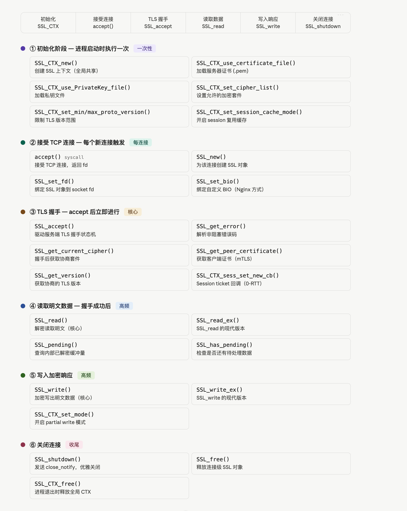

### SSL_read 内部到底发生了什么

这是 WAF 引擎最关心的调用，调用链是这样的：

```
SSL_read(ssl, buf, n)
  └─ ssl3_read_bytes()          ← TLS record 层读取器
       └─ ssl3_get_record()      ← 从 socket read() 原始字节
            └─ tls1_enc()        ← 解密：AES-GCM decrypt + AEAD tag 校验
                 └─ 明文写入 buf  ← 返回给调用方
```

关键点：一次 `SSL_read` 最多消费一个 TLS record（最大 16384 字节）。如果 HTTP 请求体比较大，需要循环调用直到 `SSL_pending() == 0` 且 `SSL_has_pending()` 返回 false。

---

### Nginx 的非阻塞处理方式

Nginx 不用阻塞模式，它把 OpenSSL 的 BIO 替换成了自己的事件驱动 BIO：

```c
// Nginx 的做法（ngx_ssl.c 简化版）
SSL_set_bio(ssl, rbio, wbio);   // 用自定义 BIO 替代直接 fd

// SSL_accept 返回 WANT_READ 时：
if (SSL_get_error(ssl, ret) == SSL_ERROR_WANT_READ) {
    ngx_add_event(c->read, NGX_READ_EVENT, 0);  // 挂回 epoll，等数据来再回调
    return NGX_AGAIN;
}
```

WAF 引擎（如 ModSecurity、lua-resty-waf）嵌在 Nginx 里时，在 `SSL_read` 返回明文后、数据交给 upstream 前这个窗口做检测，所以它看到的永远是解密后的明文，跟 OpenSSL 的内部实现无关。

---

### 一个完整的最小示例骨架

```c
// ① 初始化（进程启动）
SSL_CTX *ctx = SSL_CTX_new(TLS_server_method());
SSL_CTX_use_certificate_file(ctx, "cert.pem", SSL_FILETYPE_PEM);
SSL_CTX_use_PrivateKey_file(ctx,  "key.pem",  SSL_FILETYPE_PEM);
SSL_CTX_set_cipher_list(ctx, "ECDHE-ECDSA-AES128-GCM-SHA256");
SSL_CTX_set_min_proto_version(ctx, TLS1_2_VERSION);

// ② 每个新连接
int fd = accept(listen_fd, &addr, &addrlen);
SSL *ssl = SSL_new(ctx);
SSL_set_fd(ssl, fd);

// ③ 握手
if (SSL_accept(ssl) <= 0) {
    int err = SSL_get_error(ssl, -1);  // 判断 WANT_READ 还是真错误
}

// ④ 读取明文 HTTP 请求
char buf[16384];
int n = SSL_read(ssl, buf, sizeof(buf));
// buf 里现在是明文 "GET / HTTP/1.1\r\n..."

// ⑤ 写回加密响应
SSL_write(ssl, response, response_len);

// ⑥ 关闭
SSL_shutdown(ssl);
SSL_free(ssl);
close(fd);

// 进程退出时
SSL_CTX_free(ctx);
```

这就是从 `accept()` 到拿到明文 HTTP 数据的全链路。WAF 引擎介入的位置就在 `SSL_read` 之后、业务处理之前。

## 6. https 明文解析

SSL_CTX_set_keylog_callback
